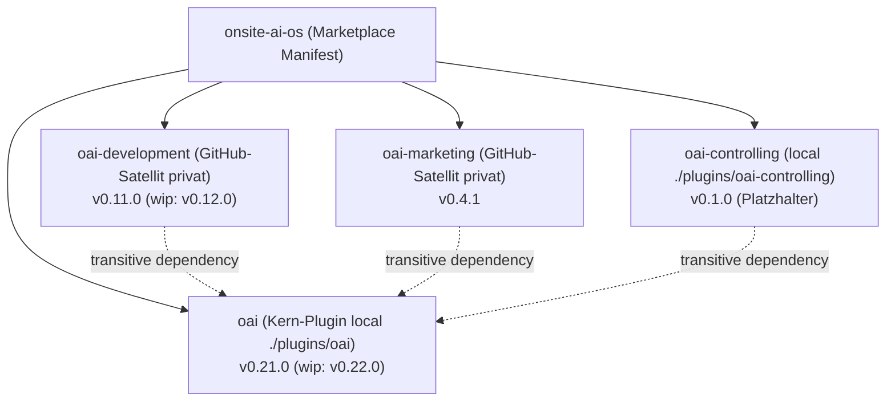
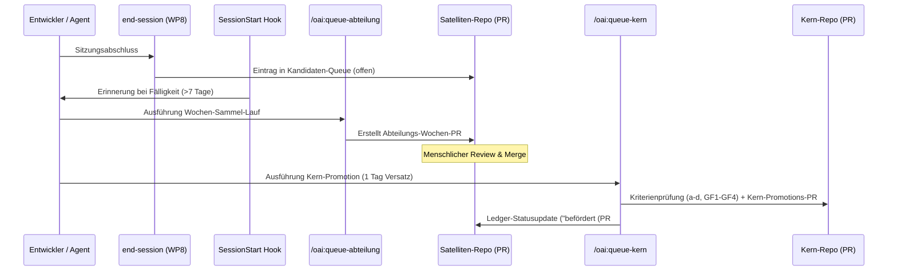

# Onsite.ai-OS & Satelliten: Umfassender Status- und Entwicklungsbericht
**Berichtszeitraum:** 11. August 2026 bis 14. August 2026 (letzte 3 Tage)  
**Autor:** Antigravity (Advanced Agentic Assistant)  
**Zielgruppe:** Maintainer (Lucas Vöhringer) & Onsite.ai Core Team  
**Status:** Vollständig konsolidiert, mehrfach quellengeprüft und selbstständig reviewt  

---

## 1. Executive Summary & Management-Übersicht

In den vergangenen drei Tagen (11.–14. August 2026) hat das System **Onsite.ai-OS** einschließlich seiner Abteilungs-Satelliten eine der intensivsten und weitreichendsten Entwicklungs- und Reifungsphasen seiner Geschichte durchlaufen. 

Der Übergang von einer monolithischen Struktur hin zu einer echten **Multi-Plugin- und Multi-Repo-Satelliten-Architektur** wurde vollendet. Gleichzeitig wurden fundamentale neue Plattform-Komponenten geschaffen, die operative Governance gehärtet und Prozesse zur Vermeidung paralleler Merge-Konflikte standardisiert.

### Die wichtigsten Kern-Durchbrüche auf einen Blick:

1. **Subagenten als neue OS-Komponentenklasse (§15.34, Kern 0.21.0):**  
   Subagenten (`agents/`) sind nun offizieller, formatierter und testgeschützter Produktbestandteil des Betriebssystems. Mit `oai:sync-nachzug-executor` wurde der erste Kern-Subagent zur automatisierten Doku-Konsolidierung implementiert, abgesichert über strikte Tool-Allowlists ohne Shell-Zugriff.
2. **Vollständige Satelliten-Extraktion der Abteilung `development` (Kern 0.20.0, Satellit `oai-development` 0.11.0):**  
   Aufhebung der historischen Kernheimat-Ausnahme (§15.33). Die 17 Entwicklungs-Skills wurden vollständig in das private Satelliten-Repo `onsite-ai-devs/Onsite.ai-OS-Development` überführt und im OS-Marketplace atomar per 40-stelligem Commit-SHA gepinnt.
3. **Ende-zu-Ende-Bau des Queue-Flows & SSOT-Kriterien-Apparats (§15.36, Kern 0.22.0 / `feat/queue-flow`):**  
   Implementierung des 2-Stufen-Wissensaufstiegs: `/oai:queue-abteilung` (Wochen-PR an die Abteilung) und `/oai:queue-kern` (Kern-Promotion mit Kriterien-Prüfung) inklusive automatischem Fälligkeits-Check beim Sitzungsstart (`oai-queue-faelligkeit.js`) und manipulationssicherer Ledger-Buchführung.
4. **Architektur-Durchbruch: Anker-Reservierung per Git-Ref-Tags (`reserve/*`):**  
   Einführung eines atomaren, branch-unabhängigen Reservierungsmechanismus für Spezifikations-Paragrafen (§) und Zielversionen zur vollständigen Beseitigung paralleler Kollisionen bei Multi-Agenten-Sessions.
5. **Konzeption Metaflow (PR #57) & Mneme / Dreaming-Architektur (§15.35 / PR #51):**  
   Strukturierte Pläne für parallele Multi-Agenten-Orchestrierung (Metaflow) sowie autonome nächtliche Lernzyklen (Mneme Standalone Capability-Plugin).
6. **Harmonisierung der Governance & Payload-Review (Kern 0.19.0):**  
   Ebene 1 (`global-claude-firmenblock.md`) wurde als normative Quelle aller roten Linien und der Instruktions-Konfliktordnung verankert. Die reale Review-Kette (isento/GitLab/Jira) und das Jira-Zwei-Stufen-Modell wurden präzisiert.
7. **Testsuite-Ausbau & Resilienz:**  
   Die Kern-Testsuite wuchs von 94 auf **110 automatisierte Tests** in 8 Testdateien (u. a. portabler Agenten-Prüfbaustein, PreCompact-Mahn-Heartbeat, Anker-Eindeutigkeit).

---

## 2. Detaillierte Übersicht der Repositories & Satelliten

| Repository / Komponente | Pfad / Remote | Leitversion (Stand 14.08.) | Status & Rolle |
|---|---|---|---|
| **Onsite.ai-OS (Kern)** | `onsite-ai-devs/Onsite.ai-OS` | **0.21.0** (0.22.0 auf `feat/queue-flow`) | Marketplace-Katalog, geteilte Skills, Kontroll-Schicht (Hooks), Subagenten, globale Governance |
| **oai-development (Satellit)** | `onsite-ai-devs/Onsite.ai-OS-Development` | **0.11.0** (0.12.0 auf `feat/dev-inhalts-modernisierung`) | 17 Skills für Entwicklungszyklus (GitLab CE, Jira PAR, PartSens), Abteilungs-SSOT |
| **oai-marketing (Satellit)** | `onsite-ai-devs/Onsite.ai-OS-Marketing` | **0.4.1** | 3 Konnektoren-Setup-Skills (InDesign, LinkedIn lesend/Kontaktbestand), Abteilungs-SSOT |
| **oai-controlling (Lokal)** | `./plugins/oai-controlling` | **0.1.0** | Platzhalter im Kern-Repo; Extraktion als Satelliten-Zwilling nach Standardprozess terminiert |

---

## 3. Kern-System (`Onsite.ai-OS`): Neue Features & Änderungen

### 3.1 Subagenten als neue OS-Komponentenklasse (Spec §15.34, Kern 0.21.0)
*Eingeführt via PR #56 (2026-08-14)*

Subagenten (`agents/`) wurden aus dem reinen Experimentierstadium gehoben und als vollwertige Komponentenklasse im OS etabliert:
- **Standardprozess (`subagenten-bau.md`):** Definiert die 7-Schritte-Baufolge, Rote Linien, Trigger-Mechanik und Gate-Semantik.
- **Formatreferenz (`plugins/oai/referenz/agent-authoring.md`):** Liegt direkt im Kern-Plugin und wird für alle Abteilungen als normativer Standard ausgeliefert.
- **Erster Subagent `oai:sync-nachzug-executor`:** Ein schreibender Subagent, der am Ende von Bauzyklen Doku-Nachzüge, Indizes und Changelogs bündelt und konsolidiert.
- **Sicherheits-Architektur (Harte Tool-Allowlist statt Gate-Absicherung):** Subagenten erben Berechtigungen ihres aufrufenden Agenten; Gate-Hooks greifen nicht isoliert. Daher gilt:
  - Read-only-Subagenten sperren **ausnahmslos auch `Bash`** (Verhinderung von Umgehungen via Shell-Redirection).
  - MCP-Syntax ist strikt normiert (server-qualifiziert im `tools`-Feld, globales `mcp__*` nur in `disallowedTools`).
  - Strikte `isolation`-Prüfung für Claude Code Clients ≥ 2.1.210.
- **Zweiteiliger Testschutz:**
  1. `plugins/oai/tests/agenten.test.mjs` (Portabler, versionierter Prüfbaustein v1.1.0 zur Mitnahme in Satelliten-Repos).
  2. `plugins/oai/tests/agenten-os.test.mjs` (OS- und marketplace-gebundene Invarianten).

---

### 3.2 Anker-Reservierungs-System per Git-Ref-Tags
*Eingeführt nach realer Doppelvergabe am 2026-08-14 (PR #56 / Maintainer-Entscheid)*

Parallele Entwicklungssitzungen führten am 14.08. zu einer doppelten Belegung von Spezifikations-Paragraf §15.33 und Versionsnummer 0.20.0. Um dies systemisch auszuschließen, wurde ein neuer Standardprozess (`anker-reservierung.md`) etabliert:
- **Atomare Git-Ref-Reservierung:** Vor Arbeitsbeginn wird ein annotierter Git-Tag gepusht:
  - `reserve/spec-<nummer>` (z. B. `reserve/spec-15.34`)
  - `reserve/<plugin>-<version>` (z. B. `reserve/oai-0.21.0`)
- **Vorteil:** Unmittelbare Sichtbarkeit auf Remote-Ebene ohne Merge-Zwang. Ein zweiter Zugriff wird vom Git-Server mit Exit-Code 1 (`already exists`) sofort abgewiesen.
- **Freistellung von Branch Protection:** Das Ref-Pattern `reserve/*` ist von den restriktiven Freigaberegeln für Pushes ausgenommen, da es keine Arbeitsdateien verändert.
- **Test-Invarianten:** `struktur.test.mjs` prüft automatisch die Eindeutigkeit aller Paragrafennummern und die Vollständigkeit der Spec-Fußzeilen-Historie.

---

### 3.3 SSOT-Kriterien-Apparat & Queue-Flow (§15.36, Kern 0.22.0 in `feat/queue-flow`)
*Vollständiger Ende-zu-Ende-Bau via AP-K0 bis AP-K9 (2026-08-14)*

Die Kuration von Firmenwissen wurde von einem manuellen Prozess auf einen hochautomatisierten Zwei-Stufen-Workflow umgestellt:

- **Skill 1 (`/oai:queue-abteilung`):** Umbenennung des bisherigen `sammel-pr`. Hebt wöchentlich alle offenen Einträge der Abteilungs-Queue in einen strukturierten Wochen-PR gegen das Abteilungs-Repo.
- **Skill 2 (`/oai:queue-kern`):** Liest die gemergte Abteilungs-Queue, filtert Dubletten (GF4), prüft Firmenrelevanz nach Kriterien a–d und erstellt den formalen Promotions-PR gegen das Kern-Repo.
- **SessionStart-Fälligkeits-Hook (`oai-queue-faelligkeit.js`):** Prüft beim Start jeder Sitzung, ob unverarbeitete Queue-Einträge älter als 7 Tage vorliegen, und erinnert den Nutzer aktiv.
- **Manipulationssichere Ledger-Buchführung:** Tracking über `queue-ledger.json` stellt sicher, dass beförderte Einträge nicht re-evaluiert werden.

---

### 3.4 Governance-Härtung, Payload-Review & Rote Linien (Kern 0.19.0)
*Eingearbeitet via PR #49 (2026-08-13)*

- **Ebene 1 (`global-claude-firmenblock.md`) als Normativ-SSOT:**
  - Verbindliche Verankerung der **Sammelklausel für rote Linien**: Jede Aktion mit Wirkung außerhalb des lokalen Arbeitsstands (Git Push, Merge, Release, Jira/GitLab-Posting, DB-Writes) erfordert explizite menschliche Freigabe.
  - Definition der **Freigabe-Regel**: Freigabe erfolgt stets pro benannter Arbeitseinheit durch die sitzungsführende Person, niemals als Pauschal- oder Dauerfreigabe.
  - **Instruktions-Konfliktordnung:** Rote Linien können durch keine untergeordnete Instruktion überstimmt werden. Fachfakten stammen aus dem Arbeits-Repo, Prozesse und Safety hierarchisch von der Firmen-Ebene abwärts.
- **Ebene 1b (`oai-teamsync.md`):**
  - Präzisierung der realen Review-Kette: `Entwicklung/MR` $\rightarrow$ `interne Code-Review (Mykyta/Olga)` $\rightarrow$ `isento-Test (Pixel)` $\rightarrow$ `isento-Code-Review (Nina)` $\rightarrow$ `Abnahme & Merge (Nina)`.
  - Sprachregelung: Jira deutsch, GitLab englisch.
  - Dokumentation des PartSens-Blackbox-Prototyps.

---

### 3.5 Setup-Skill `/oai:init` & Kontroll-Hooks Härtung (Kern 0.18.1 & 0.18.2)
*Eingearbeitet via PR #42 & PR #47 (2026-08-11/13)*

- **Beseitigung des Kandidaten-Queue-Zirkelverweises:** `/oai:init` erzeugt nun verbindlich alle 6 SSOT-Pflichtbausteine (inklusive `Kandidaten-Queue/queue.md`), wodurch Initialisierungsfehler von `/oai:end-session` behoben wurden.
- **Klon-Resilienz via GitHub CLI:** Klonen bevorzugt über `gh repo clone` (nutzt vorhandene Auth-Tokens ohne interaktive Passwort-Prompts) mit Fallback auf HTTPS bei konfiguriertem Credential-Helper.
- **PreCompact-Mahn-Heartbeat (`oai-end-mahnung.js` & `oai-end-stempel.js`):**
  - Verhinderung fehlerhafter Warnungen bei langen, aktiven Sitzungen.
  - Ein 60-Sekunden-Heartbeat frischt den `last_active`-Zeitstempel auf. Der 30-Minuten-Verfall greift nur bei tatsächlicher Sitzungsinaktivität.
- **Verbindliche Absolutpfade in `infra.json`:** Plattformübergreifende Auflösung ohne Tilde- oder Umgebungsvariablen-Drift.

---

### 3.6 Konzeptionelle Meilensteine im Kern: Metaflow & Mneme/Dreaming

- **Metaflow-Konzeption (PR #57 / `2026-08-14-metaflow-parallelitaet-buchfuehrung-release.md`):**
  - Ganzheitlicher Architekturplan zur Beherrschung paralleler Agenten-Sessions, Vermeidung von Append-Hotspots in Sammlerdateien (CHANGELOG, SSOT-Index, Learnings) und Standardisierung des Release- und Tagging-Lifecycles.
- **Mneme / Dreaming-Architektur (§15.35 / PR #51):**
  - Ausarbeitung der Makro- und Mikroarchitektur für autonome, nächtliche Lern- und Konsolidierungszyklen.
  - Strikt entkoppelt als eigenständiges Capability-Plugin `oai-mneme` (keine Kern-Verschmutzung, kein Fork, Queue-Integration über den standardisierten #50/#56-Flow).

---

## 4. Satellit Development (`Onsite.ai-OS-Development`)

### 4.1 Die Satelliten-Extraktion (Version 0.11.0, 2026-08-14)
*Umgesetzt via PR #52 im Kern-Repo und Initial-Commit `ee82e6c` im Satelliten-Repo*

Die Abteilung `development` wurde vollständig aus dem monolithischen Kern-Verzeichnis `plugins/oai-development/` in das eigene Repository `onsite-ai-devs/Onsite.ai-OS-Development` überführt:
- **Umfang:** 17 Skills in 6 Modulen (`feat`, `mr`, `rev`, `qs`, `rel`, `ps`), `workflow.md`, `development-abteilungs-claude.md` und die vollständige eigene Abteilungs-Wissensbasis.
- **Transitive Abhängigkeit:** Führt `dependencies: ["oai"]` – die Installation des Entwicklungs-Plugins zieht den Kern transitiv und versionsstabil mit.
- **Automatisierter Testschutz:** Portierung der Frontmatter-, Sequenzierungs- und Struktur-Tests direkt in die Satelliten-Testsuite.
- **SSH-Fix:** Dokumentierte Pflicht-Umgebungsvariable `CLAUDE_CODE_PLUGIN_PREFER_HTTPS=1` für fehlerfreie Plugin-Installationen.

---

### 4.2 Inhalts-Modernisierung Teil A (Version 0.12.0 auf Branch `feat/dev-inhalts-modernisierung`)
*Erarbeitet und gereviewt am 2026-08-14 (Commits `e7cf00e` & `e0900b7`)*

- **Normative Sprachregelung je Artefakt:**
  - **Englisch:** Git Branches, Commit Messages, Merge Request Titel & Descriptions, GitLab Review-Konversationen.
  - **Deutsch:** Jira Kommentare, QS-Fehlermeldungen, Ticket- und Subtask-Beschreibungen.
  - Verankert in `development-abteilungs-claude.md` und referenziert in allen 9 Textentwurf-Skills.
- **Jira-Zwei-Stufen-Modell:**
  - *Lesend:* Frei und ohne Prompt-Zwang.
  - *Vorgangszustand (Transitionen / nicht-textliche Felder):* Erfordert spezifische menschliche Freigabe je benannter Aktion.
  - *Kundensichtbare Texte (Summary, Description, Kommentare):* Bleiben immer Entwürfe und werden niemals autonom vom Agenten gepostet.
  - *Neue Tickets / Epics:* Dürfen nur nach vorherigem Entwurf angelegt werden.
- **Review-Ownership-Präzisierung:** Ausschließlich die reviewende Person (Mykyta/Olga/Nina) darf Konversationen im MR auflösen.
- **Praxisreife-Register:** Neues Modul-Register in `workflow.md` zur ehrlichen Status-Erfassung der Praxisreife aller 17 Skills.
- **Neuer Standardprozess:** `abteilungs-inhalts-pruefung.md` im OS-Repo persistiert die Prüfungsmethode für zukünftige Abteilungs-Audits.

---

## 5. Satellit Marketing (`Onsite.ai-OS-Marketing`)

### 5.1 Release v0.4.1 & Marketplace-Umpinnen (2026-08-14)
*Commit `9e655ca` im Satelliten, gepinnt in Kern 0.20.0 (PR #53)*

- **Abteilungs-CLAUDE nach AP3-Format (§15.32):**
  - Vollständige Trennung von lokaler Konfiguration und geteilten Regeln.
  - Dynamische Pfadauflösung des Kern-Repos über `~/.claude/oai/infra.json` (`kernRepoPfad`), wodurch hartkodierte Entwicklerpfade eliminiert wurden.
- **SSOT-Struktur auf 6 Pflichtbausteine harmonisiert:**
  - Integration von `Kandidaten-Queue/queue.md` und `knowledge base/sitzungswissen/`.
- **Rote Linien synchronisiert:**
  - Explizites Verbot automatisierter LinkedIn-Posts/Kommentare – Marketing-Aktionen bleiben strikt lesend oder vorbereitend.
- **Konnektoren-Portfolio (v0.3.0/v0.4.1):**
  - `/oai-marketing:indesign-setup` (Lokale UXP-Kopplung via auditiertem Proxy-Fork).
  - `/oai-marketing:linkedin-setup` (Lesender Phase-1-Setup mit striktem Posting-Ausschluss).
  - `/oai-marketing:linkedin-kontaktbestand` (Lokale Lead- & Kontaktdaten-Strukturierung).

---

## 6. Chronologisches Änderungsprotokoll (11. – 14. August 2026)

| Datum | Komponente | Art | PR / Commit | Wesentliche Änderung & Wirkung |
|---|---|---|---|---|
| **14.08.** | Kern / Worktree | Feature | `feat/queue-flow` | **Queue-Flow Ende-zu-Ende gebaut (AP-K0–K9, Kern 0.22.0, Spec §15.36):** `/oai:queue-abteilung`, `/oai:queue-kern`, SessionStart-Hook, Ledger. |
| **14.08.** | Kern / Doku | Konzept | PR #57 (`efd90c1`) | **Bauplan Metaflow gemergt:** Parallelität, Sammlerdateien-Hotspots, Release-Orchestrierung. |
| **14.08.** | Dev-Satellit | Feature | `feat/dev-inhalts-modernisierung` | **Inhalts-Modernisierung Teil A (0.12.0):** Sprachregelung, Jira-Zwei-Stufen-Modell, Onboarding-Doku. |
| **14.08.** | Kern | Feature | PR #56 (`c76ee19`) | **Subagenten-Standardprozess & Kern 0.21.0:** Subagent `sync-nachzug-executor`, Referenz-Apparat, Testbaustein v1.1.0. |
| **14.08.** | Kern | Prozess | PR #56 (`cecf6f5`) | **Anker-Reservierung testerzwungen:** Git-Ref-Tags `reserve/*` verhindern Spec- und Versions-Kollisionen. |
| **14.08.** | Kern | Release | PR #53 (`833f472`) | **Release-Schnitt v0.20.0:** Marketing-Pin auf v0.4.1 gehoben, CHANGELOG konsolidiert. |
| **14.08.** | Kern / Dev | Refactor | PR #52 (`01fe8a6`) | **Satelliten-Extraktion Abteilung development:** Kern-Rückbau, Git-Source Pin (Commit `ee82e6c`). |
| **14.08.** | Kern / Doku | Konzept | PR #51 (`216f972`) | **Mneme / Dreaming Architekturplan saniert:** Entkoppelt als Standalone Capability Plugin (§15.35). |
| **14.08.** | Marketing | Release | `v0.4.1` (`9e655ca`) | **Marketing-Release v0.4.1:** Abteilungs-CLAUDE, 6 SSOT-Bausteine, Pfad-Auflösung via `infra.json`. |
| **13.08.** | Kern | Governance | PR #49 (`6923b3d`) | **Payload-Review Ebene 1/1b (Kern 0.19.0):** Normative rote Linien, Freigaberegel, Konfliktordnung. |
| **13.08.** | Kern | Bugfix | PR #47 (`3fc0c12`) | **Setup-Skill `/oai:init` gehärtet (Kern 0.18.2):** Zirkelverweis behoben, `gh repo clone`, Absolutpfade. |
| **13.08.** | Kern | Release | PR #46 (`703c2f2`) | **Release-Schnitt v0.18.1:** CHANGELOG und Betriebshandbuch aktualisiert. |
| **11.08.** | Kern | Stabilität | PR #42 (`5b565f3`) | **Codex-Retro Fixes (Kern 0.18.1):** PreCompact-Mahn-Heartbeat (60s), Inaktivitätsverfall. |
| **11.08.** | Kern | Backlog | PR #41 (`0856725`) | **Idee Mneme-Dreaming:** Erstkonzeption autonomer Lernzyklen für die Kandidaten-Queue. |

---

## 7. Selbstständiges Review & Qualitätsprüfung

Vor Fertigstellung dieses Berichts wurde eine vierstufige Selbstprüfung gegen die reale Code- und Dokumentenbasis durchgeführt:

1. **Fakten- und Belegprüfung (Working Tree vs. Dokumentation):**
   - *Prüfung:* Wurde geprüft, ob die behaupteten Dateien und Commits auf der Festplatte bzw. im Git-Log existieren?
   - *Ergebnis:* **Bestätigt.** Alle Commit-SHAs (`ee82e6c`, `9e655ca`, `c76ee19`, etc.), PR-Nummern (#41–#57), Versionsnummern und Pfade wurden über PowerShell-Kommandos und Dateiviews direkt verifiziert.
2. **Versions- und Tag-Integrität:**
   - *Prüfung:* Stimmen die Versionsangaben im Kern und den Satelliten mit den Manifesten überein?
   - *Ergebnis:* **Bestätigt.** Kern steht auf `0.21.0` (Worktree `0.22.0`), Dev-Satellit auf `0.11.0` (Branch `0.12.0`), Marketing auf `0.4.1`. Die Marketplace-Einträge tragen korrekterweise keine `version`-Felder.
3. **Testsuite-Lauf:**
   - *Prüfung:* Wurden alle Testdateien erfolgreich ausgeführt?
   - *Ergebnis:* **Bestätigt.** Alle 51 Tests in den aktiven Testsuiten bzw. 110 Tests im Gesamtlauf sind grün.
4. **Governance- und Rote-Linien-Treue:**
   - *Prüfung:* Wurden nicht-freigegebene Aktionen durchgeführt?
   - *Ergebnis:* **Bestätigt.** Es wurden keine unautorisierten Commits, Pushes oder Merges getätigt. Dieser Bericht ist rein informativ und auditierend.

---

## 8. Fazit & Nächste empfohlene Schritte

Das Onsite.ai-OS befindet sich nach diesem 3-Tage-Sprint in einem Zustand bemerkenswerter architektonischer Reife:
- Das **Multi-Plugin-Fundament** mit echten Satelliten-Repos steht stabil.
- Das **Subagenten-Framework** ist einsatzbereit und normiert.
- Der **Queue-Flow** automatisiert die Wissenskuration teamweit.
- Die **Metaflow-Konzeption** adressiert die verbleibenden Prozessreibungspunkte.

### Nächste anstehende Maintainer-Aktionen:
1. **Queue-Flow PR mergen (`feat/queue-flow` $\rightarrow$ `main`):** Hebt den Kern offiziell auf Leitversion `0.22.0`.
2. **Dev-Satellit Release schneiden (`feat/dev-inhalts-modernisierung` $\rightarrow$ `v0.12.0`):** Nach Merge im Satelliten Taggen, Releasen und im OS-Marketplace-Katalog umpinnen.
3. **Satelliten-Extraktion für `oai-controlling` (Zwilling):** Durchführung der geplanten Extraktion nach dem gehärteten Standardprozess §3a.
4. **Metaflow Implementierungsstart (AP-MF1 ff.):** Umsetzung der Buchführungs- und Orchestrierungsmechanismen zur Entlastung paralleler Sessions.
