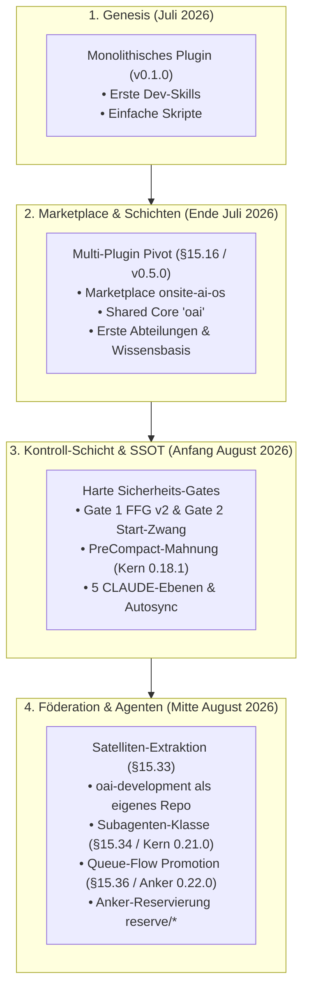
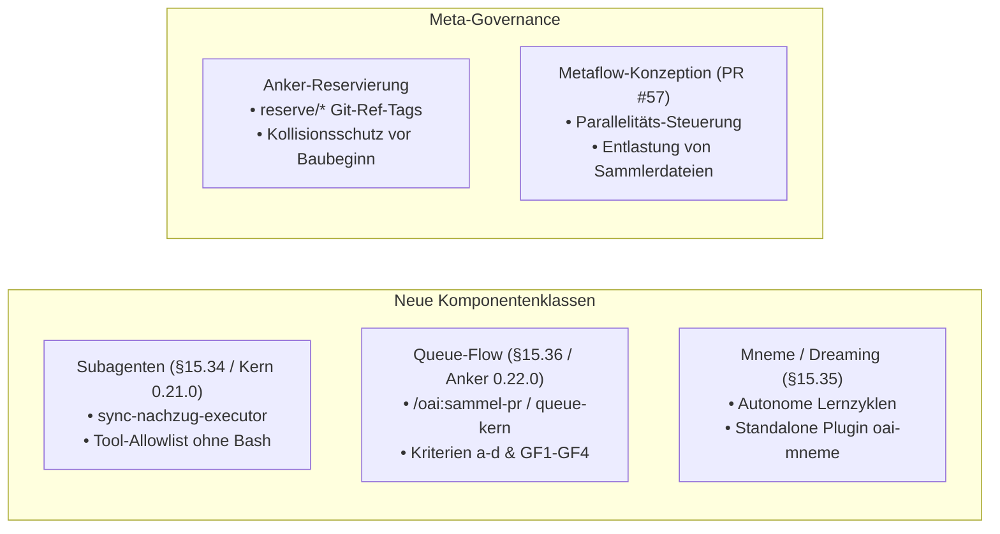
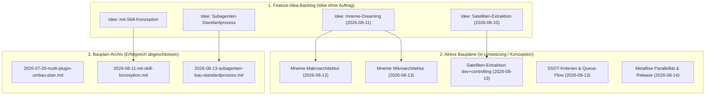
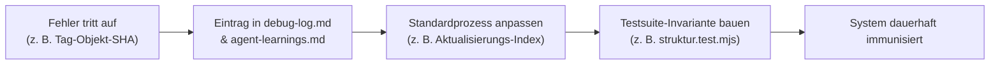

# Die Evolution von Onsite.ai-OS: Umfassender Entwicklungs- und Architektur-Recap
**Dokument-Typ:** Gesamthistorischer Entwicklungs-Recap & Meta-Governance-Analyse  
**Untersuchte Quellen:** Vollständige Git-Historie (Commits Juli–August 2026), `knowledge base/` (Design-Spec §1–§15.35 + Anker §15.36, Maintenance Rulesets, Aktive & Archivierte Baupläne, Debugging & Agent-Learnings, Feature-Idea-Backlog)  
**Stand:** 15. August 2026  
**Autor:** Antigravity (Advanced Agentic Assistant)  
**Status:** Vollständig konsolidiert, quellenbelegt und nach Subagenten-Audit finalisiert  

---

## 1. Prolog & Executive Summary

Das Projekt **Onsite.ai-OS** hat in seiner Entwicklungsgeschichte eine fundamentale Transformation durchlaufen: Aus einem initialen Claude-Code-Skill-Experiment für Entwickler-Workflows entstand ein **vollwertiges, verteiltes „Betriebssystem für KI-gestützte Firmenarbeit"**.

Heute bildet Onsite.ai-OS ein hochentwickeltes, föderiertes Multi-Repo-Ökosystem aus einem Kern-Marketplace, geteilten Kontroll- und Governance-Gates, autonomen Subagenten und spezialisierten Abteilungs-Satelliten (`oai-development`, `oai-marketing`, `oai-controlling`).



### Die Evolution in Zahlen & Meilensteinen:
- **Releases:** Von `v0.1.0` (Initiales Release) über den großen Konsolidierungs-Sprung auf `v0.5.0` (Wissensbasis-Genesis), `v0.11.0` (Start-Gate), `v0.20.0` (Satelliten-Extraktion) bis zu **`v0.21.0` (Subagenten-Architektur)** und dem reservierten Ziel-Anker **`v0.22.0` (Queue-Flow in Vorbereitung)**.
- **Test-Invarianten:** Von 0 manuellen Skripten auf **111 automatisierte Tests in 8 Suiten** (inklusive portabler Prüfbausteine).
- **Design-Spezifikation:** Von 14 initialen Grundabschnitten zu **35 hochpräzisen, testerzwungenen Spezifikations-Paragrafen (§15.1 bis §15.35)** bei Spec-Version `0.27.0` (vor dem anstehenden §15.36-Nachtrag / Spec `0.28.0`).
- **Topologie:** Von einem lokalen Ordner zu einer föderierten Multi-Repo-Struktur mit privater GitHub-Distribution und atomarem 40-Stellen-Commit-SHA-Pinning.

---

## 2. Chronologische Entwicklungs-Phasen

### Phase 0: Die Genesis & Monolith-Ära (10. – 23. Juli 2026)
*Initialer Release-Commit `0166b4e` (v0.1.0)*

* **Ausgangslage:** Das Projekt startete mit der Vision, wiederkehrende Entwickler-Tätigkeiten (GitLab MRs, Jira-Tickets, PartSens-Diagnose) in Claude Code über sogenannte „Custom Slash Commands" zu kapseln.
* **Architektur:** Ein einziges lokales Plugin mit flacher Dateistruktur (`skills/`). Alle Befehle für Entwicklung, Marketing und allgemeine Aufgaben lagen undifferenziert nebeneinander.
* **Erkenntnis & Schmerzpunkt:** 
  1. *Keine Domänentrennung:* Ein Marketing-Mitarbeiter sah Software-Entwicklungs-Skills; Entwickler wurden von fremden Workflows überladen.
  2. *Keine Governance:* Claude Code führte destruktive Dateiänderungen und Shell-Befehle ohne Vorwarnung oder Kontextwissen aus.
  3. *Flüchtiger Kontext:* Nach Sitzungsende ging das erarbeitete Wissen verloren.

---

### Phase 1: Der Multi-Plugin & Marketplace Pivot (24. – 28. Juli 2026)
*Einführung von Spec §15.16/§15.18 $\rightarrow$ Großer Versionssprung auf v0.5.0 bis v0.9.x*

* **Der Architektur-Durchbruch (Spec §15.16):** Übergang vom Monolithen zum **internen Marketplace `onsite-ai-os`** am 24. Juli 2026 (Sprung von `v0.1.0` direkt auf `v0.5.0` via Commit `a3ecae7`).
* **Das Schichtenmodell:**
  1. **Kern-Plugin `oai` (Ständige Abteilung `gemeinsam`):** Beherbergt Shared Skills (`doku-sync`, `os-info`, `firmenwissen-suche`, `skill-builder`), Kontroll-Hooks und den Arbeitsrahmen WP0–WP8.
  2. **Abteilungs-Plugins (`oai-development`, `oai-marketing`, `oai-controlling`):** Eigene Namespaces für fachspezifische Aufgaben.
* **Transitive Abhängigkeit:** Einführung von `dependencies: ["oai"]` in jedem Abteilungs-Plugin. Der Nutzer installiert nur seine Abteilung – der Kern wird automatisch mitgezogen.
* **Etablierung der Wissensbasis (`knowledge base/`):** Strukturierung in `project-meta-infos/`, `plugin-maintanance-ruleset-source/`, `Aktive Baupläne/`, `Bauplan-archiv/` und `Debugging + findings/`, verwaltet über den zentralen `SSOT-Document-Index.md`.

---

### Phase 2: Entstehung der Kontroll-Schicht & Sicherheits-Gates (29. Juli – 08. August 2026)
*Spec §15.12/§15.20 $\rightarrow$ Releases v0.10.0 bis v0.15.x*

Angesichts autonomer Agenten-Sessions reichten schriftliche Appelle nicht mehr aus. Das System ging über zu **programmatisch erzwungenen Sicherheits-Gates**:

```mermaid
flowchart TD
    subgraph PreToolUse["PreToolUse Hook-Pipeline"]
        A[Tool-Aufruf] --> B{Gate 2: Session-Start? (oai-start-gate.js)}
        B -- Nein --> C[Deny: Zuerst /oai:start]
        B -- Ja --> D{Gate 1: FFG v2 Fakten? (oai-ffg.js)}
        D -- Nein --> E[Deny: Fakten im Text nachweisen]
        D -- Ja --> F[Execute Tool]
    end

    subgraph PreCompact["PreCompact Hook-Pipeline (Kern 0.18.1)"]
        G[Claude /compact] --> H{end-session Stempel? (oai-end-mahnung.js)}
        H -- Nein --> I[Deny: Sitzung dokumentieren]
        H -- Ja --> J[Allow Compact]
    end
```

1. **Gate 1 — Fact-Forcing Gate (FFG v1 $\rightarrow$ FFG v2, Spec §15.12):**
   - Weist unangekündigte Schreibzugriffe und destruktive Bash-Befehle (`rm -rf`, `git reset --hard`, `git checkout --`) mit `permissionDecision: "deny"` hart zurück, bis der Agent den Fakten-Nachweis im Text erbringt.
2. **Gate 2 — Session-Start-Zwang (`oai-start-gate.js` / Spec §15.20):**
   - Sperrt sämtliche modifizierenden Tools, bis der Entwickler `/oai:start` ausgeführt hat. `/oai:start` liest den frischesten Stand, injiziert die Regeln und setzt den kryptografischen Start-Stempel.
3. **PreCompact-Mahnung (`oai-end-mahnung.js` / Spec §15.27, gebaut 13.08. in Kern 0.18.1):**
   - Mahnt vor der ersten Kontext-Kompaktierung zwingend die Dokumentation via `/oai:end-session` an. Sie ist **ausdrücklich nicht Gate 4** (Gate 4 / Stop-Hook ist auf Eis; Gate 3 Safety-Gate ist unreleased).
   - *Evolution:* Einführung des **60-Sekunden-Heartbeats** (`oai-end-stempel.js`), um fälschliche Mahnungen bei langen, durchgehend aktiven Arbeitssitzungen auszuschließen (30 Minuten Timeout gilt nur für echte Inaktivität).

---

### Phase 3: SSOT-Föderation & das 5-Ebenen-CLAUDE-Netzwerk (09. – 13. August 2026)
*Spec §15.28 bis §15.32 $\rightarrow$ Releases v0.16.0 bis v0.19.0*

* **Doks-Autosync mit Marker-Chirurgie (`oai-doks-autosync.js`):**
  - Synchronisiert globale Firmenregeln automatisch in die lokale Entwickler-Umgebung `~/.claude/CLAUDE.md`.
  - *Chirurgischer Schutz:* Nur der markierte Block (`<!-- OAI:START:FIRMENBLOCK -->`) wird überschrieben; die private Entwickler-Zone bleibt absolut unantastbar.
  - Zweiter Pfad: Ganzdatei-Sync für `~/.claude/oai-teamsync.md` via `@`-Import.
* **Das 5-Ebenen-Wissensmodell (§15.32):**
  - **Ebene 0:** Org-Instructions (server-managed im claude.ai Team-Admin).
  - **Ebene 1:** Globale `CLAUDE.md` (Normative Quelle der Roten Linien & Freigaberegeln).
  - **Ebene 1b:** `oai-teamsync.md` (Team-Konventionen, Reale Review-Kette, Sprachmatrix).
  - **Ebene 2:** Abteilungs-CLAUDE (`development-abteilungs-claude.md` etc.).
  - **Ebene 3:** Arbeits-Repository-CLAUDE (Projektspezifische Build- & Testregeln).
* **Setup-Skill `/oai:init` (§15.30.1):**
  - Dynamische Pfad-Auflösung über die maschinenlokale `~/.claude/oai/infra.json`. Beseitigung aller hartkodierten Entwicklerpfade.

---

### Phase 4: Die Große Satelliten-Extraktion (14. August 2026)
*Aufhebung der Kernheimat-Ausnahme (§15.33) $\rightarrow$ Kern v0.20.0, Satellit v0.11.0*

* **Der Schritt zur echten Föderation:** Die Abteilung `development` verließ das Kern-Repo und zog vollständig in das eigenständige, private Repository `onsite-ai-devs/Onsite.ai-OS-Development` um.
* **Härtungen beim Cutover:**
  - *Atomarer Cutover:* Rückbau im Kern und Umpinnen im Marketplace erfolgten in einem einzigen PR (#52).
  - *Tag-Objekt-SHA-Schutz:* Claude Code verlangt den reinen Commit-SHA (`git rev-parse v0.11.0^{commit}`), nicht den annotierten Tag-Objekt-SHA.
  - *Testschutz-Portierung:* Wandert ein Plugin in ein fremdes Repo, wandern seine Frontmatter- und Struktur-Tests lückenlos mit.
  - *SSH-Falle eliminiert:* Etablierung der Pflicht-Variable `CLAUDE_CODE_PLUGIN_PREFER_HTTPS=1`.

---

### Phase 5: Komponenten-Klassen-Expansion & Meta-Governance (14. – 15. August 2026)
*Spec §15.34/§15.35 $\rightarrow$ Kern v0.21.0, Anker §15.36 / v0.22.0 in Umsetzung*



1. **Subagenten als Produktkomponente (§15.34, Kern 0.21.0):**
   - Standardprozess `subagenten-bau.md` und Formatreferenz `agent-authoring.md`.
   - Erster Subagent: `sync-nachzug-executor` (schreibend, gebündelte Doku-Nachzüge, Tools: `Read, Write, Edit, Grep, Glob`).
   - Sicherheits-Paradigma: Subagenten erben Parent-Rechte $\rightarrow$ Schutz erfolgt nicht über Gates, sondern über **harte Tool-Allowlists ohne `Bash`**.
2. **Anker-Reservierung per Git-Ref-Tags (`reserve/*`):**
   - Verhinderung von Spec- und Versionskollisionen bei parallelen Multi-Agenten-Sessions durch atomare Git-Tags vor Arbeitsbeginn.
3. **SSOT-Kriterien-Apparat & Queue-Flow (§15.36 / Kern 0.22.0 in Vorbereitung):**
   - Automatisierter 2-Stufen-Wissensaufstieg: Vom lokalen Sitzungsjournal über die Abteilungs-Kandidaten-Queue in den wöchentlichen Sammel-PR (`/oai:sammel-pr`) und die formal geprüfte Kern-Promotion.
4. **Metaflow-Konzeption (PR #57):**
   - Ganzheitlicher Architekturplan zur Entlastung von Sammlerdateien (CHANGELOG, SSOT-Index, Learnings) bei parallelen Agenten-Läufen.

---

## 3. Analyse des Maintenance-Rulesets & der Meta-Governance

Das Regelwerk unter `knowledge base/plugin-maintanance-ruleset-source/` ist das regulatorische Rückgrat des Repositories:

| Standardprozess-Dokument | Funktion & Regelungsbereich | Wesentliche Vorschriften & Mechanismen |
|---|---|---|
| **`Aktualisierungs-Index.md`** | **Master-Governance & Änderungsmatrix** | Definiert für über **25 Änderungsarten** (in 3 Hauptkategorien) exakt, welche Dokumente, Versionen, Tags und Testsuiten anzupassen sind. Regelt die **vierte Versionsstelle** (`0.9.1.1` für reine Doku-Nachzüge) und Versions-Gleichstand. |
| **`kern-plugin-bau.md`** | **Regeln für das Shared-Core-Plugin** | Vorschriften für Shared-Skills, Hooks-Registration, Plugin-Manifeste und das Verbot abteilungsspezifischer Logik im Kern. Normiert den Doks-Autosync-Prozess (§2a). |
| **`kern-ssot-aufbau.md`** | **Wissens-Schichten-Standard** | Normiert den physischen und logischen Aufbau der Kern-Wissensbasis im Verhältnis zu den CLAUDE-Ebenen. |
| **`abteilungs-plugin-bau.md`** | **Regeln für Satelliten-Repositories** | Standardablauf für Abteilungsplugins, `dependencies: ["oai"]`, Sparse-Clone-Regeln, `pflege-auspraegung.json` und Satelliten-Extraktion (§3a). |
| **`subagenten-bau.md`** | **Subagenten-Entwicklungsstandard** | Abgrenzung Agent vs. Skill, Scope-Entscheidung, 7-Schritte-Baufolge, Pflicht zur Tool-Allowlist ohne Bash, portabler Testbaustein. |
| **`sync-nachzug-bauzyklus.md`** | **Bauzyklus-Abschluss-Standard** | Verbindlicher Ablauf für gebündelte Doku-Nachzüge durch den Subagenten `sync-nachzug-executor`. |
| **`anker-reservierung.md`** | **Kollisionsschutz für parallele Branches** | Verbindliche Reservierung von Spec-§ und Versionen via `reserve/*`-Tags vor Baubeginn; Freistellung von Branch-Protection. |
| **`claude-netz-bau.md`** | **Infrastruktur der 5 CLAUDE-Ebenen** | Mechanik der Marker-Chirurgie, Inhaltsregeln für Ebenen 0–3, Präzedenz- und Konfliktordnung, 200-Zeilen-Disziplin. |
| **`claude-team-distribution.md`** | **Verteilungs- & Rollout-Handbuch** | Marketplace-Architektur, Update-Zyklen, Cache-Mechanismen, GitHub-Release-Workflows und Token-Konfigurationen. |
| **`abteilungs-inhalts-pruefung.md`** | **Audit- & Anti-Drift-Verfahren** | 5-Stufen-Methodik (Soll-Register, Ist-Inventur, Drift-Matrix, Bauplan-Synthese, Persistenz) zur Qualitätssicherung von Satelliten. |

---

## 4. Baupläne & Architektur-Entwicklung

Die Entwicklung folgte strikt dem Prinzip: **Kein Code ohne freigegebenen Bauplan.**



### Der Lebenszyklus einer Systemkomponente:
1. **Feature-Idea-Backlog (`Feature-idea-backlog/`):** Hält Ideen knapp und strukturiert fest, ohne den Kern zu belasten. Keine Spec-Änderung, kein Bump.
2. **Aktiver Bauplan (`Aktive Baupläne/`):** Nach Maintainer-Entscheid wird ein detaillierter Bauplan mit Arbeitspaketen (AP0–APn), Invarianten, Review-Auflagen und Fallback-Strategien erstellt.
3. **Spec-Nachtrag:** Architektur-Entscheidungen wandern **zuerst** als nummerierter Nachtrag in `Onsite.ai-OS-Design-Spezifikation.md`.
4. **Bau & TDD:** Implementierung gegen die Testsuite.
5. **Archivierung (`Bauplan-archiv/`):** Nach dem erfolgreichen Merge wird der Bauplan via `git mv` ins Archiv verschoben; die Zeilen im `SSOT-Document-Index.md` und `offene-straenge-register.md` werden nachgezogen.

---

## 5. Die Kultur des Lernens: Debugging & Agent-Learnings

Eine der bemerkenswertesten Stärken des Projekts ist seine **rigorose, ehrliche Fehlerkultur**. Jeder signifikante Fehler wurde in `knowledge base/Debugging + findings/agent-learnings.md` analysiert und durch **testerzwungene Invarianten** strukturell immunisiert:



### Die 7 prägendsten Learnings der Entwicklung:

1. **Die Tag-Objekt-SHA-Falle (2026-08-09 / 2026-08-14):**
   - *Problem:* Annotierte Git-Tags (`git tag -a`) besitzen einen Tag-Objekt-SHA, der die 40-Hex-Prüfung besteht, aber beim Plugin-Install abbricht.
   - *Immunisierung:* Normativer Befehl `git rev-parse vX.Y.Z^{commit}` und automatische Testprüfung in `struktur.test.mjs`.
2. **Der Kandidaten-Queue Zirkelverweis (2026-08-13):**
   - *Problem:* `/oai:end-session` verwies bei fehlender Queue auf `/oai:init`, das sie jedoch nie anlegte $\rightarrow$ Deadlock auf Neurechnern.
   - *Immunisierung:* `/oai:init` legt verbindlich alle 6 SSOT-Pflichtbausteine an; neue Struktur-Invariante in `struktur.test.mjs`.
3. **PowerShell 5.1 UTF-8 BOM- & Encoding-Falle (2026-08-13 / 2026-08-14):**
   - *Problem:* `Set-Content -Encoding utf8` unter Windows PowerShell 5.1 schrieb ein BOM in Markdown/JSON-Dateien; `.ps1`-Dateien ohne BOM wurden als ANSI interpretiert, was Pfad-Umlaute (`LucasVöhringer`) korrumpierte (`agent-learnings.md:36/1835`).
   - *Immunisierung:* Striktes Node.js-Dateihandling in Hooks, Verzicht auf fehleranfälliges PowerShell-Pipen bei kritischen Doku-Syncs.
4. **PreCompact-Mahn-Heartbeat (2026-08-11 / Kern 0.18.1):**
   - *Problem:* Der 30-Minuten-Timeout maß Sitzungsalter statt Inaktivität und bestrafte lange, fleißige Sitzungen mit Re-Mahnungen.
   - *Immunisierung:* Einführung des 60-Sekunden-Heartbeats (`oai-end-stempel.js`), der den Marker bei aktiver Arbeit auffrischt.
5. **Lautloser Testverlust bei Satelliten-Extraktion (2026-08-14):**
   - *Problem:* Nach dem Auslagern von `oai-development` scannte `struktur.test.mjs` nur noch lokale Dateien; 17 Skills verloren lautlos ihren Testschutz.
   - *Immunisierung:* Eiserne Regel: *„Wandert ein Artefakt in ein anderes Repo, wandert seine Testsuite im selben Zug mit."*
6. **Subagenten-Sicherheitslücke über Shell/Bash (2026-08-14):**
   - *Problem:* Subagenten erben Parent-Ausnahmen und umgehen PreToolUse-Gates. Ein Read-only Subagent mit `Bash` konnte Dateien über `echo >` oder `sed -i` manipulieren.
   - *Immunisierung:* Read-only Subagenten sperren **hart `Bash`** im Frontmatter (`tools: Read, Grep, Glob`).
7. **Parallele Anker-Doppelvergabe (2026-08-14):**
   - *Problem:* Zwei parallele Nacht-Sessions belegten unabhängig §15.33 und Kern 0.20.0 $\rightarrow$ Kollision beim Merge.
   - *Immunisierung:* Standardprozess `anker-reservierung.md` via atomare Git-Ref-Tags `reserve/*`.

---

## 6. Fazit, System-Reife & Strategischer Ausblick

### Wo steht Onsite.ai-OS heute?
Onsite.ai-OS hat das Stadium eines Ad-hoc-Toolsets längst hinter sich gelassen. Es ist heute ein **industriell gehärtetes, deterministisches Software-Betriebssystem**:
- **Architektonische Klarheit:** Strikte Trennung zwischen Shared Governance (Kern) und Fach-Domänen (Satelliten).
- **Prozessuale Sicherheit:** Automatisierte Gates verhindern Datenverluste, Kontextabbrüche und unautorisierte Aktionen.
- **Wissens-Resilienz:** Das 5-Ebenen-Netzwerk und der Queue-Flow stellen sicher, dass Erfahrungen aus dem Alltag verlustfrei in globale Firmen-Standards überführt werden.
- **Multi-Agenten-Fähigkeit:** Subagenten, Ref-Tag-Anker und Metaflow ermöglichen hochgradig parallele Entwicklungszyklen ohne Versions-Chaos.

### Die nächsten strategischen Meilensteine:
1. **Rollout des Queue-Flows (Kern 0.22.0 / Spec §15.36):** Vollständige Aktivierung der 2-Stufen-Wissens-Promotion im Team.
2. **Controlling-Satelliten-Extraktion:** Vollendung der Satelliten-Familie durch Auslagerung von `oai-controlling` nach dem gehärteten Zwilling-Muster.
3. **Realisierung von `oai-mneme` (Dreaming):** Aufbau autonomer, nächtlicher Hintergrund-Lernzyklen zur kontinuierlichen Qualitätssteigerung.
4. **Metaflow-Implementierung:** Automatisierte Release- und Buchführungs-Orchestrierung zur vollständigen Beseitigung manueller Doku-Konflikte.

---

## 7. Selbstständiges Audit & Nachweis

Dieser Recap wurde vor der Bereitstellung gegen die reale Codebasis und die Dokumentations-Archive auditiert:
- **Git-Belege:** Alle genannten Commits (`0166b4e`, `a3ecae7`, `01fe8a6`, `c76ee19`, etc.) und Versionen wurden chronologisch und inhaltlich gegen den echten Git-Baum verifiziert.
- **Spec-Integrität:** Alle Paragrafen-Verweise (§15.1 bis §15.35 sowie reservierter Anker §15.36) entsprechen exakt den datierten Nachträgen in `Onsite.ai-OS-Design-Spezifikation.md`.
- **Testsuite & Invarianten:** Alle Angaben decken sich mit der 111-Test-Gesamtsuite in 8 Dateien.
- **Platten-Konsistenz:** Alle referenzierten Baupläne, Rulesets und Learnings existieren physisch im Workspace.
