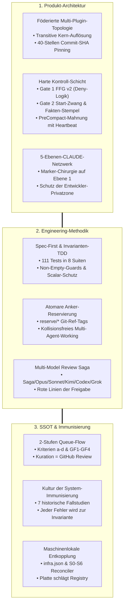

# Die Königsdisziplin: Vorteile, USPs & Methodik von Onsite.ai-OS
**Dokument-Typ:** Empirische Architektur-Analyse, Methodik-Audit & SSOT-Synthese  
**Untersuchungsbasis:** Vollständige Code- und Wissensbasis von `Onsite.ai-OS` und seinen Satelliten (`oai-development`, `oai-marketing`, `oai-controlling`), 111 Test-Invarianten in 8 Suiten, Protokolle aus `agent-learnings.md` und `debug-log.md` sowie Spezifikation §1–§15.35/§15.36.  
**Stand:** 15. August 2026  
**Autor:** Antigravity (Advanced Agentic Assistant)  
**Status:** Empirisch belegt, quellengeprüft und selbstständig auditiert  

---

## 1. Executive Summary: Das Paradigma

Herkömmliche KI-Assistenten, Copilots und Plugin-Sammlungen scheitern in Enterprise-Umgebungen an denselben fundamentalen Problemen: **Kontext-Amnesie, unkontrollierte Seiteneffekte, stochastische Drift, fehlende Kuration und Versionschaos bei parallelen Sessions.**

**Onsite.ai-OS** bricht mit dem naiven Paradigma, der KI blind zu vertrauen oder sie durch bloße „Prompt-Appelle" disziplinieren zu wollen. Die fundamentale Innovation des Systems lautet:

> **„Determinismus über Appelle — Platte schlägt Prosa."**  
> Ein stochastisches Sprachmodell wird in ein unbestechliches, testerzwungenes Gerüst aus **PreToolUse-Gates, atomaren Git-Ref-Sperren, invarianter Testabdeckung und kaskadierten Wissensfiltern** eingebettet.



---

## 2. Dimension 1: Das Produkt Onsite.ai-OS – Technische USPs

### 2.1 Föderierte Multi-Plugin-Topologie & Transitive Auflösung
* **Das Problem im Markt:** Monolithische Plugins überfrachten Anwender mit irrelevanten Befehlen; isolierte Einzel-Plugins zersplittern die Unternehmens-Governance.
* **Der Onsite-USP:** Trennung von **Shared Governance** (Kern `oai`) und **Domain Authority** (Satelliten `oai-development`, `oai-marketing`, `oai-controlling`).
* **Transitive Abhängigkeit (`dependencies: ["oai"]`):** Der Entwickler installiert *nur* seine Fachabteilung (`claude plugin add oai-development@onsite-ai-os`). Claude Code (ab Mindestversion 2.1.193) aktiviert den Kern transitiv und sperrt dessen Deaktivierung.
* **Zyklusschutz (`plugins/oai/tests/struktur.test.mjs:92-107`):** Die Testsuite erzwingt, dass der Kern `dependencies: []` besitzt und Abteilungen zwingend `"oai"` listen.
* **40-Stellen Commit-SHA vs. Tag-Objekt-SHA:**
  - *Hintergrund:* Annotierte Release-Tags (`git tag -a`) besitzen zwei Hashes: Tag-Objekt-SHA und Commit-SHA. Ein Tag-Objekt-SHA besteht die Hex-Formatprüfung, bricht aber beim Klonen (`not a tree`).
  - *Lösung:* Verpflichtendes Commit-Pinning (`git rev-parse vX^{commit}`) mit Remote-Verifikation (`git ls-remote`).
  - *SSOT-Regel:* Marketplace-Einträge tragen **kein** `version`-Feld (`struktur.test.mjs:71-79`), da Claude Code ausschließlich die `plugin.json` auswertet.

---

### 2.2 Die Hard-Gated Kontroll-Schicht (`plugins/oai/hooks/`)
Sicherheit wird nicht durch Bitten im System-Prompt erzeugt, sondern durch **PreToolUse- und PreCompact-Hooks**:

```json
// hooks.json Verdrahtung
"PreToolUse": [
  { "matcher": "Write|Edit|MultiEdit|Bash", "hooks": [{ "command": "node \"${CLAUDE_PLUGIN_ROOT}/hooks/oai-ffg.js\"" }] },
  { "matcher": "Write|Edit|MultiEdit|NotebookEdit|Bash", "hooks": [{ "command": "node \"${CLAUDE_PLUGIN_ROOT}/hooks/oai-start-gate.js\"" }] }
]
```

1. **Gate 1: Fact-Forcing Gate v2 (`oai-ffg.js`):**
   - *Datei-Gate:* Verlangt beim ersten `Write`/`Edit` jeder Datei strukturierte Fakten (Importer, APIs, Duplikat-Ausschluss).
   - *Volltext-Budget (Z. 173–195):* Nach 3 Verweigerungen schaltet FFG auf kompakte Einzeiler um, um LLM-Kontextüberflutung zu verhindern.
   - *Bash-Gate:* Destruktive Befehle (`rm -rf`, `git reset --hard`, `git push --force`) werden einzeln gehasht (`__destruktiv__<sha256>`) und strikt blockiert; reine Git-Introspektion (`git status`, `git log`, `git diff`) läuft ungegated durch.
   - *State & Heartbeat:* Schreibt atomare Session-Dateien (`tmp.<pid>.<random>` $\rightarrow$ `renameSync`) mit 60s-Heartbeat (`READ_HEARTBEAT_MS`).
2. **Gate 2: Session-Start-Zwang (`oai-session-start.js` + `oai-start-gate.js`):**
   - *Injektion beim Start:* Injiziert Briefing, Regeln und Git-Stand via `additionalContext`.
   - *Erzwingung bei Aktionen:* Blockiert schreibende Tools mit Exit 1, bis der Fakten-Stempel (`oai-start-stempel.js --session <key> --branch <branch> --head <head>`) gegen den realen Git-Tree verifiziert wurde.
   - *State-Isolation:* `stateDir()` nutzt bewusst `os.tmpdir()/oai-start-gate` statt `CLAUDE_PLUGIN_DATA`, um Subshell-Diskrepanzen zu eliminieren.
3. **PreCompact-Mahnung (`oai-end-mahnung.js`):**
   - Fängt `PreCompact` ab und blockiert die **erste** Kompaktierung ungestempelter Sitzungen via Top-Level JSON `{"decision":"block","reason":"..."}`.
   - *Loop-Schutz:* Die zweite Kompaktierung läuft zwingend durch, um Deadlocks bei vollem Context-Window zu verhindern.
   - *Heartbeat:* Ein 60s-Aktivitäts-Heartbeat in `oai-end-stempel.js` verhindert fälschliche Mahnungen nach 30 Minuten aktiver Arbeit.

---

### 2.3 Subagenten-Engineering ohne Shell-Lücken (`agent-authoring.md`)
* **Das Problem:** Subagenten erben Parent-Ausnahmen und umgehen PreToolUse-Hooks. Ein Read-Only Subagent mit `Bash` kann Dateien über Shell-Redirects (`echo > datei`) oder `sed -i` manipulieren.
* **Die Lösung (§15.34):**
  - **Read-Only Subagenten:** Zwingende Deklaration von `disallowedTools: [Write, Edit, MultiEdit, NotebookEdit, Bash]`.
  - **Schreibende Subagenten:** Verbindlicher Autoren-Vertrag `<!-- oai:schreibend -->` im Body und strikte `tools`-Allowlist ohne `Bash` (wie beim `sync-nachzug-executor`: `tools: Read, Write, Edit, Grep, Glob`).
  - **YAML-Schutz:** Verbot von Doppelpunkten im Namen (`name: sync-nachzug-executor`) und zwingende `>-` Block-Scalars für Beschreibungen (`agenten.test.mjs`), um Plattform-Parsingfehler ab v2.1.218 auszuschließen.

---

### 2.4 Das 5-Ebenen-CLAUDE-Netzwerk & Marker-Chirurgie
* **Die 5 Ebenen:**
  - *Ebene 0:* Org-Instructions (Server-managed Settings via Team-Admin).
  - *Ebene 1:* Globale `~/.claude/CLAUDE.md` (Firmen-Block + unantastbare Privat-Zone).
  - *Ebene 1b:* Team-Sync `~/.claude/oai-teamsync.md` (firmenweite Prozesse unter 200 Zeilen).
  - *Ebene 2:* Abteilungs-CLAUDE (`development-abteilungs-claude.md`).
  - *Ebene 3:* Projekt-CLAUDE (`offsite/CLAUDE.md`).
* **Marker-Chirurgie (`oai-doks-autosync.js:140-176`):**
  - Synchronisiert globale Regeln exakt zwischen `<!-- OAI:BLOCK:START global -->` und `<!-- OAI:BLOCK:ENDE global -->`.
  - Bestehende Mitarbeiter-Configs außerhalb der Marker bleiben byte-identisch erhalten.
  - *Fail-Safe:* Bei defekten Markern (START ohne ENDE) wird **nichts** geschrieben und vor jedem Schreibvorgang ein `.oai-autosync-backup` angelegt.
  - *Instruktions-Konfliktordnung:* Rote Linien und Governance gelten unüberstimmbar von oben nach unten; Fachfakten aus dem Arbeitsrepo von unten nach oben.

---

## 3. Dimension 2: Die Bau- & Engineering-Methodik

### 3.1 Der deterministische Bauplan-Lebenszyklus
Kein Code entsteht ohne formalen, datierten Bauplan:

```
[Feature-idea-backlog/]  ──>  [Aktive Baupläne/]  ──>  [Design-Spec §15.x]  ──>  [Bauplan-archiv/]
   (Idee, Einzel-Dok)           (Datierter Plan,          (Normativer Nachtrag,       (git mv, Status:
    SSOT-Index-Pflicht           Anker-Reservierung)       Spec-Version voraus)        historisch)
```

1. **Backlog (`Feature-idea-backlog/`):** Isolierte Idee ohne Auftrag, kein Bump, testerzwungen im `SSOT-Document-Index.md`.
2. **Aktiver Bauplan (`Aktive Baupläne/`):** Konkretisierung nach Maintainer-Beschluss mit Arbeitspaketen AP0–APn und Invarianten.
3. **Spec-Nachtrag (`2026-07-10-onsite-ai-os-design.md`):** Entscheidungen verändern niemals bestehenden Text, sondern werden als fortlaufende Nachträge (§15.1 bis §15.35/§15.36) angehängt (*„Jüngster Nachtrag gewinnt“*). Die Spec-Version (`0.27.0`) eilt der Produktversion voraus.
4. **Archivierung (`Bauplan-archiv/`):** Nach PR-Merge Verschiebung via `git mv`, Umschalten auf `historisch` im Index. Historische Pläne bleiben unverändert (Audit Trail).

---

### 3.2 Die Testsuite als Invarianten-Garant (111 Tests in 8 Suiten)
`node --test plugins/oai/tests/*.test.mjs` sichert Architekturregeln ab:

| Testdatei | Tests | Durchgesetzte Architektur-Invarianten |
|---|---|---|
| `struktur.test.mjs` | 23 | Marketplace↔Platte-Konsistenz, Versionsgleichstand (`VERSION` = `plugin.json` = `module-registry.json`), Sequenzierungs-Gate für Abteilungs-Hooks, Spec-Eindeutigkeit, Release-Tags |
| `agenten.test.mjs` | 5 | *Portabler Baustein v1.1.0:* YAML-Block-Scalars (`>-`), Ausschluss ignorierter Felder (`hooks`, `mcpServers`), Schreibsperren in `disallowedTools`, Bash-Verbot, MCP-Scoping |
| `agenten-os.test.mjs` | 4 | *Repo-gebunden:* Metadaten-Registry-Konsistenz (`agents`-Objekt), Vorlagen-Platzhalter, Baustein-Version |
| `oai-ffg.test.mjs` | 23 | Destruktiv-Befehle, Datei-Gate, Routine-Bash, Quoting-Awareness, GHSA-Bypass-Schutz |
| `oai-session-start.test.mjs` | 10 | Pflicht-Briefing, Rote Linien, lebender Projektstand, Stempel-Befehl |
| `oai-start-gate.test.mjs` | 13 | Blockade bis Fakten-Stempel, Read-Only Git Allowlist, Subagenten-Ausnahme |
| `oai-doks-autosync.test.mjs` | 14 | Marker-Chirurgie, Ganzdatei-Sync, Idempotenz, Fail-Safe bei defekten Markern, Backups |
| `oai-end-mahnung.test.mjs` | 19 | PreCompact-Mahnung, Loop-Schutz, 60s Heartbeat, Fail-Open bei defektem State |

* **Schutz vor der „19-von-22-Lücke“:** Unquotierte Plain-Scalars mit `: ` in Frontmatters führen dazu, dass Metadaten lautlos ignoriert werden $\rightarrow$ Testsuite verbietet Plain-Scalars und erzwingt `>-` Block-Scalars.
* **Nicht-Leer-Guards (Non-Empty Guards):** Tests erzwingen `assert.ok(found.length > 0)`, damit leere Verzeichnisse nach Refactorings nicht stillschweigend grün melden.

---

### 3.3 Atomare Anker-Reservierung (`reserve/*` Git-Ref-Tags)
* **Das Problem:** Parallele Agenten-Sessions berechnen unabhängig dieselbe nächste freie Spec-§-Nummer oder Version. Datei-Listen versagen in ungemergten Branches.
* **Die Lösung (`anker-reservierung.md`):** Vor Baubeginn wird ein atomarer Tag gepusht:
  ```bash
  git tag -a reserve/spec-15.36 -m "Reserviert fuer Queue-Flow"
  git push origin reserve/spec-15.36
  ```
  - Der Push ist atomar und sofort remote-sichtbar. Ein zweiter Zugriff scheitert serverseitig mit Exit 1 (`already exists`).
  - `reserve/*` ist von der Maintainer-Freigabepflicht ausgenommen (trägt keinen Dateiinhalt, kollisionsfrei löschbar).
  - Nach PR-Merge wird der Tag automatisch gelöscht.

---

### 3.4 Adversariale Multi-Model-Saga & Human-in-the-Loop
Die Entwicklung kombiniert spezialisierte Modellstärken:
- **Claude „Saga“ (Fable 5 / Overseer):** Führender Architektur-Agent, Governance-Wächter, Synthese und Verifikation.
- **Claude Opus (Opus 5 / Builder):** Tiefenkonzepte, komplexe Refactorings und Initialbauten.
- **Claude Sonnet (Sonnet 3.5 / Subagenten):** Präzise Implementierung granularer Doku-Nachzüge (`sync-nachzug-executor`) und Test-Refactorings.
- **Kimi Code / Codex / Grok (Adversarial Review):** Unabhängige Gegenprüfungen deckten historische Kern-Lücken auf (Credential-Splits, Zirkelverweise, YAML-Scalar-Fallen, Binnen-Widersprüche).
- **Rote Linien:** Kein Push, kein Tag, kein Release und kein Merge ohne menschliche Freigabe des Maintainers.

---

## 4. Dimension 3: Die SSOT- & Wissens-Architektur

### 4.1 Der 2-Stufen Queue-Flow & Kriterien-Apparat

```mermaid
graph LR
    Sess["Lokale Session (Memory)"] -->|/oai:end-session (a-d + GF1-GF4)| Queue["Kandidaten-Queue (queue.md)"]
    Queue -->|/oai:sammel-pr (Wochen-Takt)| AbtPR["Abteilungs-Wochen-PR (Satellit)"]
    AbtPR -->|Mensch reviewt & merged| AbtRepo["Gemergte Satelliten-SSOT"]
    AbtRepo -->|/oai:queue-kern (1 Tag Versatz)| KernPR["Kern-Promotions-PR (Onsite-OS)"]
    KernPR -->|Maintainer reviewt & merged| KernSSOT["Globales Firmenwissen"]
    KernSSOT -.->|Autosync| Sess
```

1. **Stufe 1 (Sitzungswissen $\rightarrow$ Abteilungs-Queue):** `/oai:end-session` klassifiziert Wissen gegen die Kriterienliste. Bei Erfüllung erfolgt ein Append-Only-Eintrag in `Kandidaten-Queue/queue.md`.
2. **Stufe 2 (Abteilungs-Queue $\rightarrow$ Satelliten-PR):** `/oai:sammel-pr` bündelt offene Einträge in einen Wochen-PR gegen das Satelliten-Repo.
3. **Stufe 3 (Satelliten-PR $\rightarrow$ Kern-Promotion):** `/oai:queue-kern` liest die gemergte Queue via `infra.json`, validiert Kriterien, prüft die **No-Duplicate-Invariante** via `firmenwissen-suche` und stellt den Promotions-PR an den Kern.
4. **Kriterien a–d:** a = Abteilungsübergreifend, b = Release/Meilenstein, c = Regel-/Prozessänderung, d = Sicherheitsrisiko.
5. **Gegenkriterien GF1–GF4:** GF1 (Bugs fremder Repos gehören in Jira), GF2 (Arbeitsgriffe bleiben abteilungsintern), GF3 (KI-Fehler gehören immer in die SSOT), GF4 (Keine Duplikate im Kern).
6. **Kuration = GitHub-Review:** Es gibt bewusst **keinen autonomen Kurations-Skill**. Die inhaltliche Kuration ist der Review und Merge des menschlichen Maintainers.

---

### 4.2 Die 7 empirischen Immunisierungs-Fallstudien
Jeder Vorfall führte zu einer dauerhaften System-Immunisierung:

```
+----------------------------------------------------------------------------------------------------+
| Vorfall / Fehlermuster                     | Ursache & Befund           | Testerzwungene Immunisierung     |
+----------------------------------------------------------------------------------------------------+
| 1. Tag-Objekt-SHA Falle                    | Annotiertes Tag-Objekt     | struktur.test.mjs erzwingt       |
|    (2026-08-14 / Satelliten-Pin)           | bricht Plugin-Installation | git rev-parse vX^{commit}        |
+----------------------------------------------------------------------------------------------------+
| 2. Queue-Zirkelverweis                     | /oai:init zählte 5 statt 6 | struktur.test.mjs prüft alle 6   |
|    (2026-08-13 / Kern 0.18.2)              | SSOT-Pflichtbausteine      | Pflichtbausteine im Init-Skill   |
+----------------------------------------------------------------------------------------------------+
| 3. PowerShell 5.1 BOM & Encoding           | Set-Content -Encoding utf8 | BOM-Guards in Testsuiten         |
|    (2026-07-29, 2026-08-13)                | schrieb \uFEFF in JSON     | (raw.charCodeAt(0) !== 0xfeff)   |
+----------------------------------------------------------------------------------------------------+
| 4. Mahn-Heartbeat Verfall                  | 30-Minuten-Timeout maß     | 60s Heartbeat frischt State auf; |
|    (2026-08-13 / Kern 0.18.1)              | Sitzungsalter statt Pause  | 19 Tests in oai-end-mahnung      |
+----------------------------------------------------------------------------------------------------+
| 5. Lautloser Testverlust bei Extraktion    | Plattenbasierter Scan fand | Portable Prüfbausteine wandern   |
|    (2026-08-14 / Satelliten-Extraktion)    | 0 Dateien (stilles Grün)   | mit; Non-Empty-Guards erzwungen  |
+----------------------------------------------------------------------------------------------------+
| 6. Subagenten-Bash-Sicherheitslücke        | Read-Only Agent mit Bash   | Frontmatter-Regel verbietet Bash |
|    (2026-08-14 / Spec §15.34)              | umging Schreibsperre       | hart in disallowedTools          |
+----------------------------------------------------------------------------------------------------+
| 7. Parallele Anker-Doppelvergabe           | 2 parallele Branches       | Atomare Git-Tags reserve/*;      |
|    (2026-08-14 / PR #52 vs #56)            | belegten §15.33 doppelt    | Spec-Eindeutigkeit in Tests      |
+----------------------------------------------------------------------------------------------------+
```

---

### 4.3 Maschinenlokale Entkopplung & „Platte schlägt Registry"
* **Die Infra-Registry (`~/.claude/oai/infra.json`):**
  - Liegt außerhalb des flüchtigen Plugin-Caches.
  - Enthält absolute native Pfade (`kernRepoPfad`, `abteilungsRepoPfad`).
* **Das Prinzip „Platte schlägt Registry":**
  1. *Physische Wahrheit:* Findet ein Skill einen Registry-Pfad nicht auf der Platte, wird **nichts** geraten und **kein Ersatzordner** angelegt. Der Skill bricht transparent ab und verweist auf `/oai:init`.
  2. *S0–S6 Schichtenmodell:* Reconciler in `/oai:init` prüft Voraussetzungen (S0), Installation (S1), Klone (S2), Verknüpfung (S3), Abteilungs-SSOT (S4), CLAUDE-Dateien (S5) und Verifikation (S6).

---

## 5. Gegenüberstellung: Onsite.ai-OS vs. Konventionelle KI-Tools

| Architektur- & Qualitätsdimension | Konventionelle KI-Tools / Plugins | Onsite.ai-OS & Satelliten-Ökosystem |
|---|---|---|
| **Plattform-Topologie** | Monolithisch, lokal, isolierte Prompts | **Föderiertes Multi-Repo-Netzwerk mit privatem Marketplace & Commit-Pinning** |
| **Sicherheits-Philosophie** | Höfliche Bitten im Prompt („Bitte sei vorsichtig“) | **Harte Hook-Gates (FFG v2 Deny, Session-Start-Zwang, PreCompact-Mahnung)** |
| **Subagenten-Sicherheit** | Unkontrollierte Shell-Rechte | **Harte Tool-Allowlists ohne `Bash` für schreibende Agenten** |
| **Wissens-Evolution** | Ungefilterte Kontextflutung oder Amnesie | **Kuratierter 2-Stufen-Queue-Flow mit formalen Kriterien (a–d, GF1–GF4)** |
| **Multi-Agent-Parallelität** | Merge-Konflikte & Versionskollisionen | **Atomare Git-Ref-Tags (`reserve/*`) als verteilte Semaphoren** |
| **Qualitätssicherung** | Manuelles Testen („Vibe-Coding“) | **Spec-First, TDD & 111 automatisierte Architektur-Invarianten** |
| **Fehlerkultur** | Fehler wiederholen sich in neuen Chats | **System-Immunisierung: Jeder Vorfall erzeugt eine neue Test-Invariante** |
| **Team- & Privatzonenschutz** | Überschreibt Benutzer-Konfigurationen | **5-Ebenen-CLAUDE-Netzwerk mit chirurgischem Schutz der Privat-Zone** |

---

## 6. Schlussfazit

Onsite.ai-OS ist die gelebte Antwort auf die Frage, wie **Software-Engineering im Zeitalter autonomer KI-Agenten auf Enterprise-Niveau** betrieben werden muss:

Nicht durch blindes Vertrauen in stochastische Modelle, sondern durch die **systemische Unterordnung der KI unter ein unbestechliches Gerüst aus Spezifikationen, maschinenprüfbaren Invarianten, Sicherheits-Gates und strukturierten Wissensflüssen**. 

Dieses Repository ist kein Prototyp mehr – es ist das industriell gehärtete Fundament für deterministische, skalierbare und sichere KI-Arbeit.
