# Onsite.ai-OS — Featurekarte

> **Was das ist:** Eine visuelle Landkarte des Produkts. Sie zeigt, *welche Features existieren*, *wie sie intern gebaut sind* und *wie Kern, Satelliten, Gates, Wissen und Fremdsysteme ineinandergreifen*.
>
> **Stand (gegen die Platte, 2026-08-15):** Kern `oai` **0.21.0** · Satellit `oai-development` **0.11.0** · Satellit `oai-marketing` **0.4.1** (Marketplace-Pin) · `oai-controlling` **0.1.0** (Platzhalter im Kern-Repo) · Spec **0.27.0**
>
> **Normative Quellen bleiben maßgeblich:** Betriebshandbuch, Design-Spec, `workflow.md` der Abteilung, `wp-rahmen.md` des Kerns. Diese Datei erklärt und verdichtet — sie ersetzt keine davon.

---

## Inhaltsverzeichnis

1. [Ein Satz, dann das Bild](#1-ein-satz-dann-das-bild)
2. [Repo-Familie: Kern und Satelliten](#2-repo-familie-kern-und-satelliten)
3. [Verteilung: Marketplace, Plugins, Dependency](#3-verteilung-marketplace-plugins-dependency)
4. [Die sechs Produktschichten](#4-die-sechs-produktschichten)
5. [Feature-Inventar auf einen Blick](#5-feature-inventar-auf-einen-blick)
6. [Sitzungszyklus: von `/oai:start` bis `/oai:end-session`](#6-sitzungszyklus-von-oaistart-bis-oaiend-session)
7. [Kontroll-Schicht: Gates, Hooks, Stempel](#7-kontroll-schicht-gates-hooks-stempel)
8. [CLAUDE-Ebenen: Instruktions-Netz](#8-claude-ebenen-instruktions-netz)
9. [WP0–WP8: der Pflicht-Zyklus](#9-wp0wp8-der-pflicht-zyklus)
10. [Kern-Features im Detail](#10-kern-features-im-detail)
11. [Satellit Development](#11-satellit-development)
12. [Satellit Marketing](#12-satellit-marketing)
13. [Platzhalter Controlling](#13-platzhalter-controlling)
14. [Wissen: SSOT, Queue, Promotion](#14-wissen-ssot-queue-promotion)
15. [Fremdsysteme und Konnektoren](#15-fremdsysteme-und-konnektoren)
16. [Geplant, auf Eis, abgelehnt](#16-geplant-auf-eis-abgelehnt)
17. [Gesamtverdrahtung](#17-gesamtverdrahtung)

---

## 1. Ein Satz, dann das Bild

Onsite.ai-OS ist das **Team-Betriebssystem für KI-Arbeit**: ein Marketplace mit mehreren Plugins, der dieselbe Methode — Pflicht-Workflow, deterministische Gates, geteiltes Wissen — an jede Maschine im Team verteilt, statt dass jede Person ihr privates Setup pflegt.

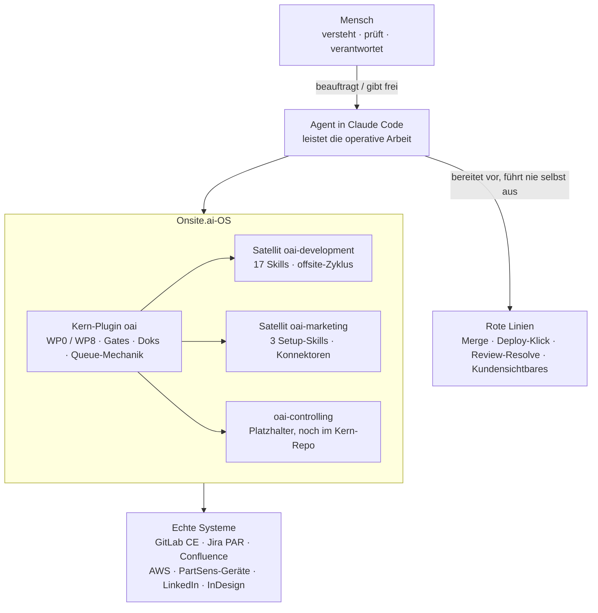
```mermaid
flowchart TB
    Mensch["Mensch<br/>versteht · prüft · verantwortet"]
    Agent["Agent in Claude Code<br/>leistet die operative Arbeit"]

    Mensch -->|beauftragt / gibt frei| Agent
    Agent -->|bereitet vor, führt nie selbst aus| RoteLinien["Rote Linien<br/>Merge · Deploy-Klick · Review-Resolve · Kundensichtbares"]

    subgraph OS["Onsite.ai-OS"]
        Kern["Kern-Plugin oai<br/>WP0 / WP8 · Gates · Doks · Queue-Mechanik"]
        Dev["Satellit oai-development<br/>17 Skills · offsite-Zyklus"]
        Mkt["Satellit oai-marketing<br/>3 Setup-Skills · Konnektoren"]
        Ctrl["oai-controlling<br/>Platzhalter, noch im Kern-Repo"]
        Kern --> Dev
        Kern --> Mkt
        Kern --> Ctrl
    end

    Agent --> OS
    OS --> Systeme["Echte Systeme<br/>GitLab CE · Jira PAR · Confluence<br/>AWS · PartSens-Geräte · LinkedIn · InDesign"]
```

**Produkt-Einzeiler:** Der Kern erzwingt Aktualität und Sicherheit. Das Wissen ist geteilt und versioniert. Die Module spezialisieren pro Abteilung. Die Sandbox lässt jeden erweitern. Die Integrationen docken die echten Systeme kontrolliert an.

---

## 2. Repo-Familie: Kern und Satelliten

Die Plugin-Grenze **ist** die Abteilungsgrenze. Nicht-Kern-Abteilungen leben in eigenen privaten Repos. Der Marketplace im Kern-Repo pinnt sie per GitHub-Source mit vollem Commit-SHA.

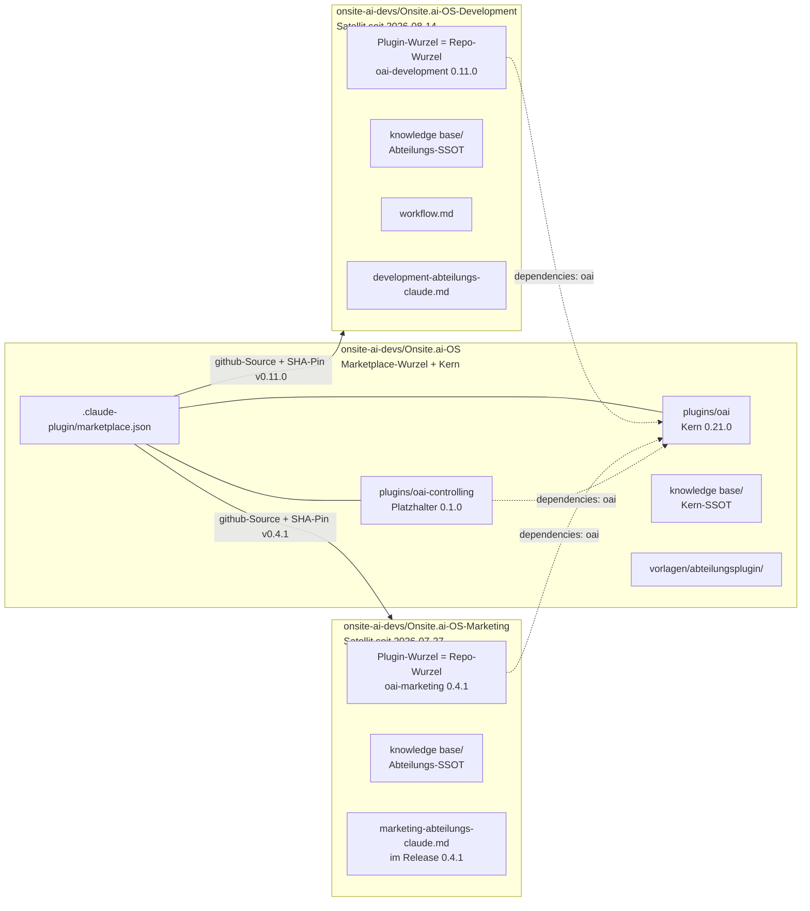
```mermaid
flowchart LR
    subgraph KernRepo["onsite-ai-devs/Onsite.ai-OS<br/>Marketplace-Wurzel + Kern"]
        MP[".claude-plugin/marketplace.json"]
        P_OAI["plugins/oai<br/>Kern 0.21.0"]
        P_CTRL["plugins/oai-controlling<br/>Platzhalter 0.1.0"]
        KB["knowledge base/<br/>Kern-SSOT"]
        VOR["vorlagen/abteilungsplugin/"]
        MP --- P_OAI
        MP --- P_CTRL
    end

    subgraph DevRepo["onsite-ai-devs/Onsite.ai-OS-Development<br/>Satellit seit 2026-08-14"]
        P_DEV["Plugin-Wurzel = Repo-Wurzel<br/>oai-development 0.11.0"]
        KB_DEV["knowledge base/<br/>Abteilungs-SSOT"]
        WF["workflow.md"]
        ACL_D["development-abteilungs-claude.md"]
    end

    subgraph MktRepo["onsite-ai-devs/Onsite.ai-OS-Marketing<br/>Satellit seit 2026-07-27"]
        P_MKT["Plugin-Wurzel = Repo-Wurzel<br/>oai-marketing 0.4.1"]
        KB_MKT["knowledge base/<br/>Abteilungs-SSOT"]
        ACL_M["marketing-abteilungs-claude.md<br/>im Release 0.4.1"]
    end

    MP -->|"github-Source + SHA-Pin v0.11.0"| DevRepo
    MP -->|"github-Source + SHA-Pin v0.4.1"| MktRepo
    P_DEV -.->|"dependencies: oai"| P_OAI
    P_MKT -.->|"dependencies: oai"| P_OAI
    P_CTRL -.->|"dependencies: oai"| P_OAI
```

| Repo | Rolle | Version | Wohnort der Dateien |
|---|---|---|---|
| `Onsite.ai-OS` | Produktkern + Marketplace-Katalog + Kern-SSOT | Leitversion **0.21.0** | `plugins/oai/`, `knowledge base/`, `.claude-plugin/marketplace.json` |
| `Onsite.ai-OS-Development` | Fach-Plugin development | **0.11.0** | Skills, `workflow.md`, Abteilungs-CLAUDE, eigene KB |
| `Onsite.ai-OS-Marketing` | Fach-Plugin marketing | **0.4.1** | 3 Setup-Skills, eigene KB, Pflege-Ausprägung |
| *noch keines* | controlling | **0.1.0** im Kern-Repo | Extraktion terminiert; SSOT dort neu anlegen |

**Warum Satelliten:** Kern-Governance (Gates, WP-Rahmen, Skill-Format) bleibt zentral. Fachinhalte, Fach-SSOT und Release-Takt der Abteilung leben unabhängig — ein Dev-Bump zieht nicht den Kern mit und umgekehrt.

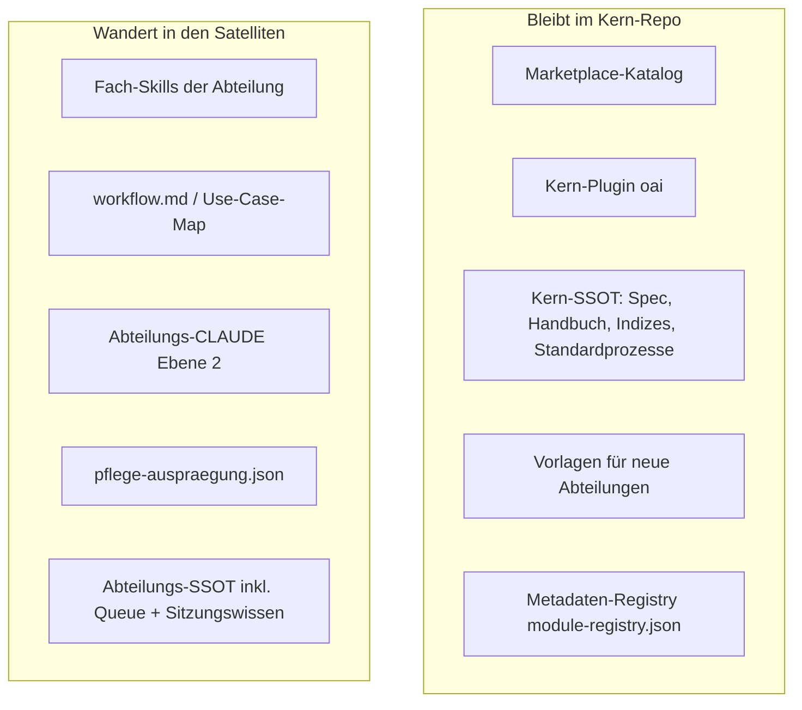
```mermaid
flowchart TB
    subgraph BleibtImKern["Bleibt im Kern-Repo"]
        A1["Marketplace-Katalog"]
        A2["Kern-Plugin oai"]
        A3["Kern-SSOT: Spec, Handbuch, Indizes, Standardprozesse"]
        A4["Vorlagen für neue Abteilungen"]
        A5["Metadaten-Registry module-registry.json"]
    end

    subgraph WandertInSatellit["Wandert in den Satelliten"]
        B1["Fach-Skills der Abteilung"]
        B2["workflow.md / Use-Case-Map"]
        B3["Abteilungs-CLAUDE Ebene 2"]
        B4["pflege-auspraegung.json"]
        B5["Abteilungs-SSOT inkl. Queue + Sitzungswissen"]
    end
```

---

## 3. Verteilung: Marketplace, Plugins, Dependency

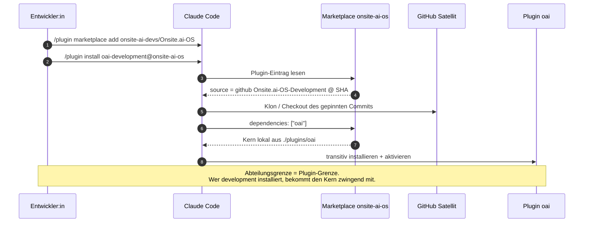
```mermaid
sequenceDiagram
    autonumber
    participant Dev as Entwickler:in
    participant CC as Claude Code
    participant MP as Marketplace onsite-ai-os
    participant GH as GitHub Satellit
    participant Kern as Plugin oai

    Dev->>CC: /plugin marketplace add onsite-ai-devs/Onsite.ai-OS
    Dev->>CC: /plugin install oai-development@onsite-ai-os
    CC->>MP: Plugin-Eintrag lesen
    MP-->>CC: source = github Onsite.ai-OS-Development @ SHA
    CC->>GH: Klon / Checkout des gepinnten Commits
    CC->>MP: dependencies: ["oai"]
    MP-->>CC: Kern lokal aus ./plugins/oai
    CC->>Kern: transitiv installieren + aktivieren
    Note over Dev,Kern: Abteilungsgrenze = Plugin-Grenze.<br/>Wer development installiert, bekommt den Kern zwingend mit.
```

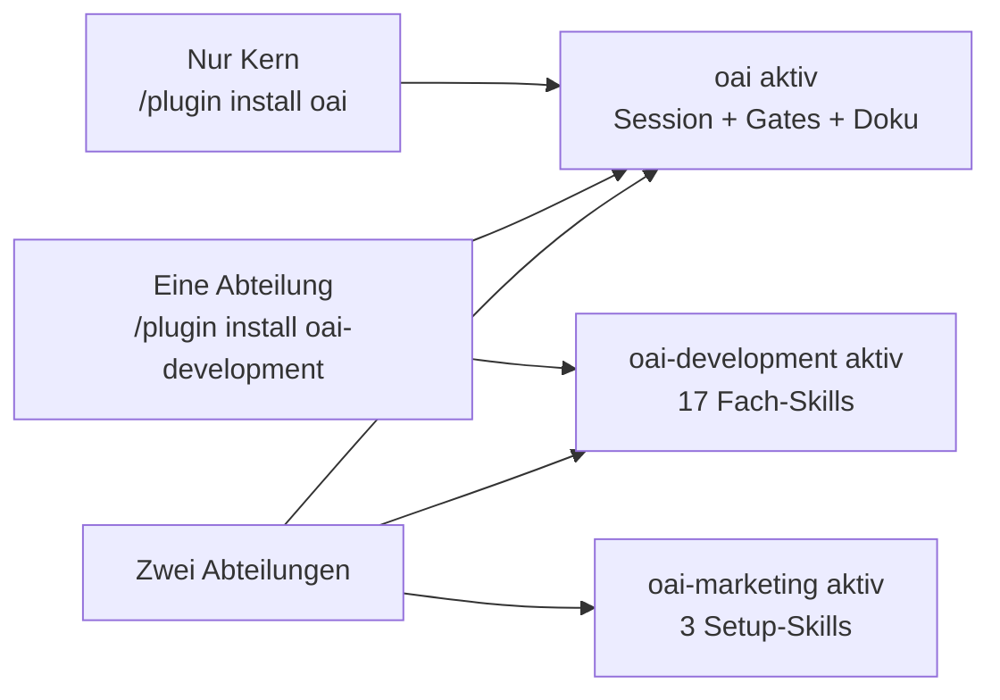
```mermaid
flowchart LR
    I1["Nur Kern<br/>/plugin install oai"] --> K["oai aktiv<br/>Session + Gates + Doku"]
    I2["Eine Abteilung<br/>/plugin install oai-development"] --> K
    I2 --> D["oai-development aktiv<br/>17 Fach-Skills"]
    I3["Zwei Abteilungen"] --> K
    I3 --> D
    I3 --> M["oai-marketing aktiv<br/>3 Setup-Skills"]
```

**Install-Minimum:** Claude Code ≥ **2.1.193** (deckt `dependencies`, `defaultEnabled`, `renames`).

**Aufruf-Konvention:**

| Wer | Namespace | Beispiel |
|---|---|---|
| Kern, ständige Abteilung `gemeinsam` | `/oai:` | `/oai:start` |
| Development | `/oai-development:` | `/oai-development:feat-start` |
| Marketing | `/oai-marketing:` | `/oai-marketing:indesign-setup` |
| Controlling | `/oai-controlling:` | reserviert, noch leer |

Es gibt **keine** eigene CLI. Verteilung und Updates laufen über Plugin/Marketplace. Auto-Update folgt dem Version-Bump in `plugin.json`.

---

## 4. Die sechs Produktschichten

```mermaid
block-beta
    columns 1
    block:s1["1  VERTEILUNG — Marketplace + versionierte Plugins"]
    end
    block:s2["2  WISSEN — CLAUDE-Ebenen + SSOT + Sitzungsgedächtnis"]
    end
    block:s3["3  PFLICHT-WORKFLOW — /oai:start → Arbeit → /oai:end-session"]
    end
    block:s4["4  ABTEILUNGEN — ein Plugin je Fachbereich, Opt-in"]
    end
    block:s5["5  KONTROLLE — Gates/Hooks, die KI hat kein Veto"]
    end
    block:s6["6  SANDBOX — jeder baut Skills nach Namensregeln"]
    end
    s1 --> s2
    s2 --> s3
    s3 --> s4
    s4 --> s5
    s5 --> s6
```

| Schicht | Gebauter Bestandteil heute |
|---|---|
| Verteilung | Marketplace `onsite-ai-os`, Kern + 2 Satelliten + 1 Platzhalter |
| Wissen | Kern-SSOT + Abteilungs-SSOTs, Autosync der Ebenen 1/1b, Residenzpflicht `sitzungswissen/` |
| Pflicht-Workflow | WP0–WP8; WP0/WP8 im Kern gebaut, WP1–WP7 in `workflow.md` der Abteilung |
| Abteilungen | `gemeinsam` ständig · `development` voll · `marketing` Setup · `controlling` leer |
| Kontrolle | Gate 1 + Gate 2 + Autosync + PreCompact-Mahnung gebaut; Gate 3 geplant; Gate 4 auf Eis |
| Sandbox | `/oai:skill-builder` + Formatregeln `referenz/skill-authoring.md` |

Darunter sitzen die **Integrationen** — eigenständige Bausteine, vom OS orchestriert, nicht im Plugin-Paket gebündelt: GitLab-MCP (read-only), Atlassian-Team-Connector, SSH zu Geräten, skill-geführte Marketing-MCPs.

---

## 5. Feature-Inventar auf einen Blick

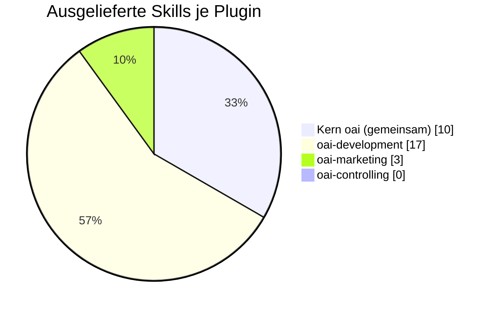
```mermaid
pie showData
    title Ausgelieferte Skills je Plugin
    "Kern oai (gemeinsam)" : 10
    "oai-development" : 17
    "oai-marketing" : 3
    "oai-controlling" : 0
```

**30 Skills ausgeliefert** + 1 Platzhalter (`grill-me`) + 1 Kern-Subagent (`sync-nachzug-executor`).

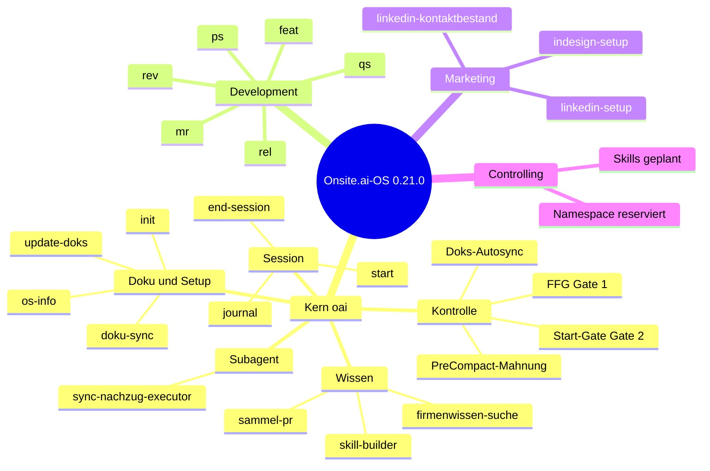
```mermaid
mindmap
  root((Onsite.ai-OS 0.21.0))
    Kern oai
      Session
        start
        end-session
        journal
      Doku und Setup
        doku-sync
        update-doks
        init
        os-info
      Wissen
        firmenwissen-suche
        sammel-pr
        skill-builder
      Kontrolle
        FFG Gate 1
        Start-Gate Gate 2
        Doks-Autosync
        PreCompact-Mahnung
      Subagent
        sync-nachzug-executor
    Development
      feat
      mr
      rev
      qs
      rel
      ps
    Marketing
      indesign-setup
      linkedin-setup
      linkedin-kontaktbestand
    Controlling
      Namespace reserviert
      Skills geplant
```

---

## 6. Sitzungszyklus: von `/oai:start` bis `/oai:end-session`

Das ist der Herzschlag. Jede inhaltliche Sitzung läuft durch dieselbe Zange.

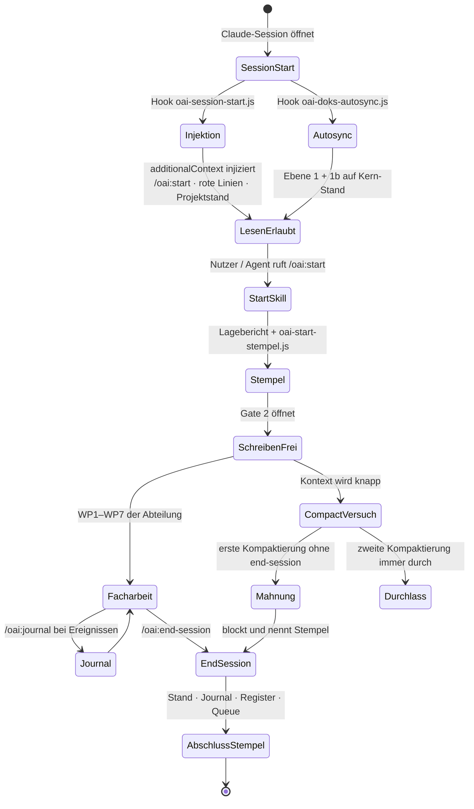
```mermaid
stateDiagram-v2
    [*] --> SessionStart: Claude-Session öffnet
    SessionStart --> Injektion: Hook oai-session-start.js
    SessionStart --> Autosync: Hook oai-doks-autosync.js
    Injektion --> LesenErlaubt: additionalContext injiziert<br/>/oai:start · rote Linien · Projektstand
    Autosync --> LesenErlaubt: Ebene 1 + 1b auf Kern-Stand
    LesenErlaubt --> StartSkill: Nutzer / Agent ruft /oai:start
    StartSkill --> Stempel: Lagebericht + oai-start-stempel.js
    Stempel --> SchreibenFrei: Gate 2 öffnet
    SchreibenFrei --> Facharbeit: WP1–WP7 der Abteilung
    Facharbeit --> Journal: /oai:journal bei Ereignissen
    Journal --> Facharbeit
    Facharbeit --> EndSession: /oai:end-session
    EndSession --> AbschlussStempel: Stand · Journal · Register · Queue
    AbschlussStempel --> [*]
    SchreibenFrei --> CompactVersuch: Kontext wird knapp
    CompactVersuch --> Mahnung: erste Kompaktierung ohne end-session
    Mahnung --> EndSession: blockt und nennt Stempel
    CompactVersuch --> Durchlass: zweite Kompaktierung immer durch
```

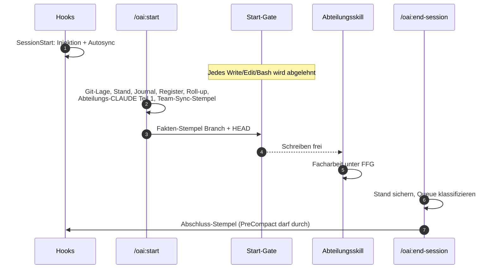
```mermaid
sequenceDiagram
    autonumber
    participant H as Hooks
    participant S as /oai:start
    participant G2 as Start-Gate
    participant A as Abteilungsskill
    participant E as /oai:end-session

    H->>H: SessionStart: Injektion + Autosync
    Note over G2: Jedes Write/Edit/Bash wird abgelehnt
    S->>S: Git-Lage, Stand, Journal, Register, Roll-up,<br/>Abteilungs-CLAUDE Teil 1, Team-Sync-Stempel
    S->>G2: Fakten-Stempel Branch + HEAD
    G2-->>A: Schreiben frei
    A->>A: Facharbeit unter FFG
    E->>E: Stand sichern, Queue klassifizieren
    E->>H: Abschluss-Stempel (PreCompact darf durch)
```

**Zwei Memory-Wohnorte** (Residenzpflicht, Spec §15.29):

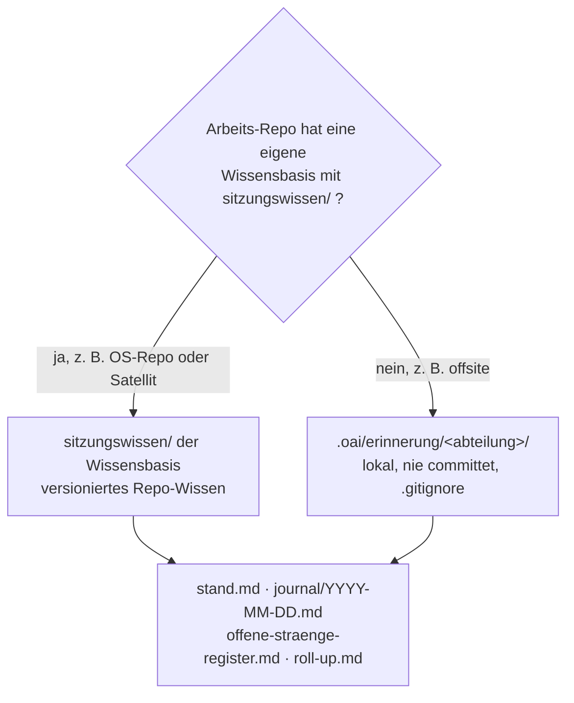
```mermaid
flowchart TD
    Q{"Arbeits-Repo hat eine eigene<br/>Wissensbasis mit sitzungswissen/ ?"}
    Q -->|ja, z. B. OS-Repo oder Satellit| WB["sitzungswissen/ der Wissensbasis<br/>versioniertes Repo-Wissen"]
    Q -->|nein, z. B. offsite| LOK[".oai/erinnerung/&lt;abteilung&gt;/<br/>lokal, nie committet, .gitignore"]
    WB --> Dateien["stand.md · journal/YYYY-MM-DD.md<br/>offene-straenge-register.md · roll-up.md"]
    LOK --> Dateien
```

---

## 7. Kontroll-Schicht: Gates, Hooks, Stempel

Gates sind **deterministisch** (die KI hat kein Veto), **fail-open** bei internen Fehlern und **ohne Marker** aktiv, sobald der Kern installiert ist. Opt-out nur per Env, je Gate.

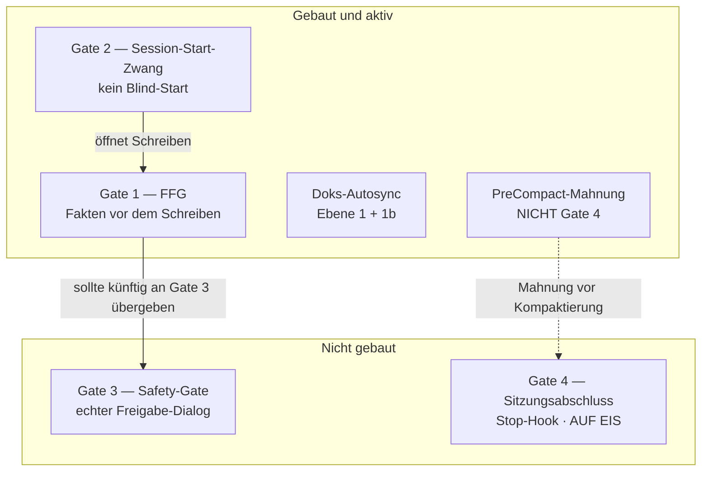
```mermaid
flowchart TB
    subgraph Gebaut["Gebaut und aktiv"]
        G1["Gate 1 — FFG<br/>Fakten vor dem Schreiben"]
        G2["Gate 2 — Session-Start-Zwang<br/>kein Blind-Start"]
        AS["Doks-Autosync<br/>Ebene 1 + 1b"]
        PC["PreCompact-Mahnung<br/>NICHT Gate 4"]
    end

    subgraph Offen["Nicht gebaut"]
        G3["Gate 3 — Safety-Gate<br/>echter Freigabe-Dialog"]
        G4["Gate 4 — Sitzungsabschluss<br/>Stop-Hook · AUF EIS"]
    end

    G2 -->|öffnet Schreiben| G1
    G1 -->|sollte künftig an Gate 3 übergeben| G3
    PC -.->|Mahnung vor Kompaktierung| G4
```

### 7.1 Wer greift wann

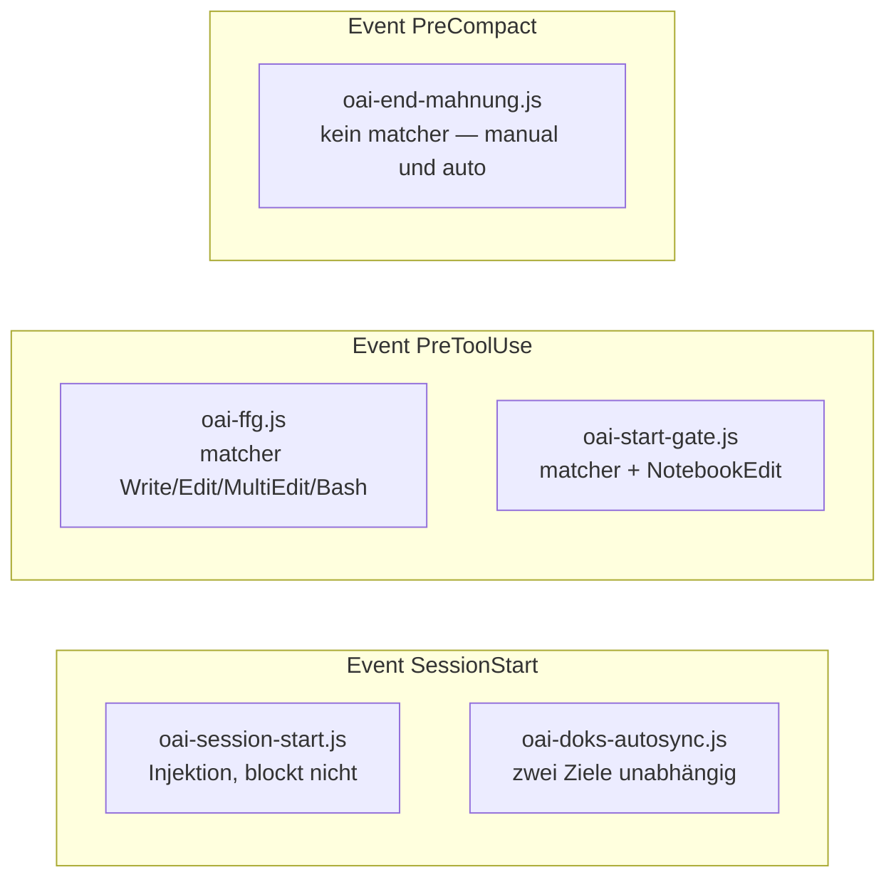
```mermaid
flowchart LR
    subgraph SessionStart["Event SessionStart"]
        HS["oai-session-start.js<br/>Injektion, blockt nicht"]
        HA["oai-doks-autosync.js<br/>zwei Ziele unabhängig"]
    end

    subgraph PreToolUse["Event PreToolUse"]
        HF["oai-ffg.js<br/>matcher Write/Edit/MultiEdit/Bash"]
        HG["oai-start-gate.js<br/>matcher + NotebookEdit"]
    end

    subgraph PreCompact["Event PreCompact"]
        HM["oai-end-mahnung.js<br/>kein matcher — manual und auto"]
    end
```

| Gate / Hook | Erzwingt | Mensch-Dialog? | Opt-out |
|---|---|---|---|
| **Gate 1 FFG** | Fakten vor Edit/Write und vor destruktivem Bash; Routine-Bash einmal/Session | Nie | `OAI_FFG=off` |
| **Gate 2 Start** | Kein Schreiben, bis `/oai:start` den Stempel gesetzt hat | Nein | `OAI_START_GATE=off` |
| **Autosync** | Firmen-Block und Team-Sync auf Kern-Stand | Nein | `OAI_AUTOSYNC=off` |
| **PreCompact** | Erste Kompaktierung ohne `/oai:end-session` wird geblockt | Nein | `OAI_PRECOMPACT=off` |
| **Gate 3** | Freigabe vor Außenwirkung / kundensichtbarem Schreiben | **Ja — genau dafür** | geplant |
| **Gate 4** | Wissensverlust am Sessionende | Nein | auf Eis |

### 7.2 FFG in drei Prüfungen

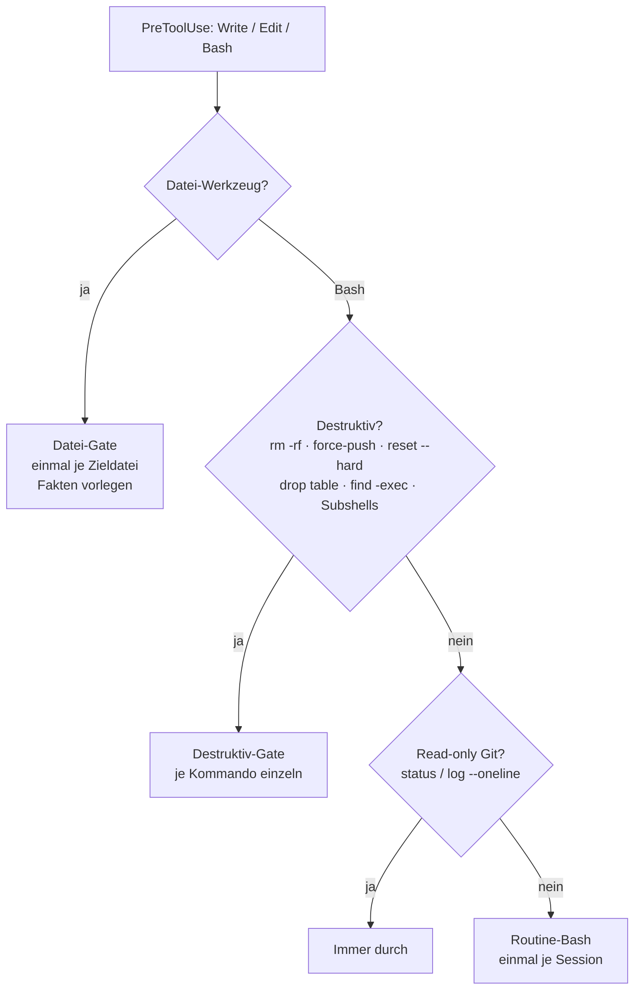
```mermaid
flowchart TD
    Tool["PreToolUse: Write / Edit / Bash"] --> Datei{"Datei-Werkzeug?"}
    Datei -->|ja| DG["Datei-Gate<br/>einmal je Zieldatei<br/>Fakten vorlegen"]
    Datei -->|Bash| Dest{"Destruktiv?<br/>rm -rf · force-push · reset --hard<br/>drop table · find -exec · Subshells"}
    Dest -->|ja| DESTG["Destruktiv-Gate<br/>je Kommando einzeln"]
    Dest -->|nein| Git{"Read-only Git?<br/>status / log --oneline"}
    Git -->|ja| Frei["Immer durch"]
    Git -->|nein| Rout["Routine-Bash<br/>einmal je Session"]
```

Zusatzschrauben: `OAI_FFG_EXEMPT_GLOBS`, `OAI_FFG_FULL_DENIALS`, `OAI_FFG_EXTRA_DESTRUCTIVE` (Regex für Firmenmuster).

### 7.3 Abgrenzung, die Verwechslungen verhindert

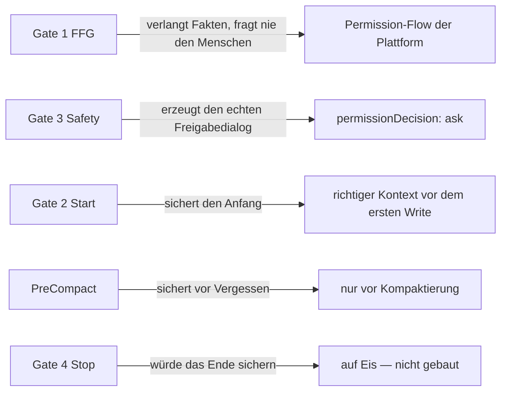
```mermaid
flowchart LR
    A["Gate 1 FFG"] -->|verlangt Fakten, fragt nie den Menschen| B["Permission-Flow der Plattform"]
    C["Gate 3 Safety"] -->|erzeugt den echten Freigabedialog| D["permissionDecision: ask"]
    E["Gate 2 Start"] -->|sichert den Anfang| F["richtiger Kontext vor dem ersten Write"]
    G["PreCompact"] -->|sichert vor Vergessen| H["nur vor Kompaktierung"]
    I["Gate 4 Stop"] -->|würde das Ende sichern| J["auf Eis — nicht gebaut"]
```

**Prüfungs-Eigentum:** Der Kern trägt das **domänenfreie** Basis-Gate. Abteilungen dürfen später eigene Domänen-Gates bauen — aber keine Kern-Prüfung duplizieren oder abschwächen. Abteilungs-Hooks erst nach dem Meilenstein „Referenz-Apparat + Vorlage“.

---

## 8. CLAUDE-Ebenen: Instruktions-Netz

Jede CLAUDE **routet und bindet**. Die SSOT **dokumentiert**. Text wird nicht zwischen den Ebenen kopiert.

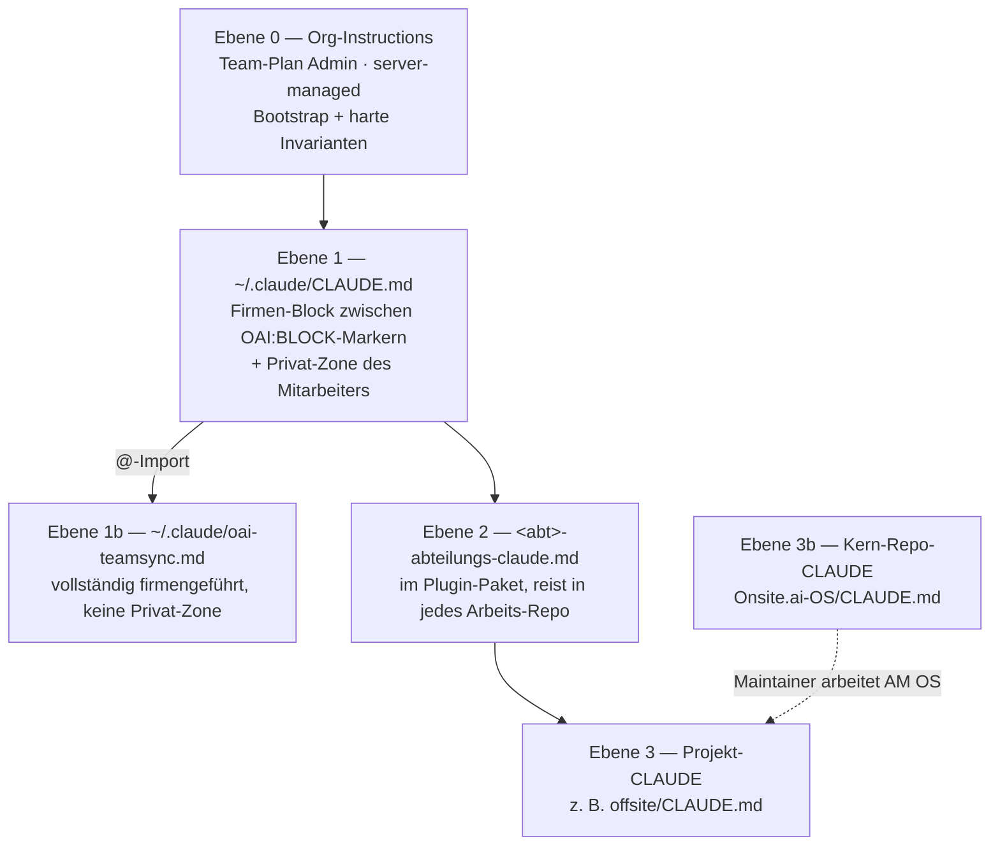
```mermaid
flowchart TB
    E0["Ebene 0 — Org-Instructions<br/>Team-Plan Admin · server-managed<br/>Bootstrap + harte Invarianten"]
    E1["Ebene 1 — ~/.claude/CLAUDE.md<br/>Firmen-Block zwischen OAI:BLOCK-Markern<br/>+ Privat-Zone des Mitarbeiters"]
    E1b["Ebene 1b — ~/.claude/oai-teamsync.md<br/>vollständig firmengeführt, keine Privat-Zone"]
    E2["Ebene 2 — &lt;abt&gt;-abteilungs-claude.md<br/>im Plugin-Paket, reist in jedes Arbeits-Repo"]
    E3["Ebene 3 — Projekt-CLAUDE<br/>z. B. offsite/CLAUDE.md"]
    E3b["Ebene 3b — Kern-Repo-CLAUDE<br/>Onsite.ai-OS/CLAUDE.md"]

    E0 --> E1
    E1 -->|"@-Import"| E1b
    E1 --> E2
    E2 --> E3
    E3b -.->|"Maintainer arbeitet AM OS"| E3
```

| Ebene | Update-Kanal | Owner | Status |
|---|---|---|---|
| 0 | Admin-UI, kein Git | Admin | aktiv, klein halten |
| 1 | Autosync, Marker-Chirurgie | Firma / Mitarbeiter | gebaut seit 0.12.0 |
| 1b | Autosync, Ganzdatei + Versions-Stempel | Firma ganz | gebaut seit 0.17.0 |
| 2 | Marketplace-Bump des Abteilungsplugins | Abteilung | Format seit 0.17.0; development ausgeliefert; marketing im Release 0.4.1 |
| 3 | Git des Arbeits-Repos | Repo-Team | aktiv |
| 3b | Git des OS-Repos | Kern-Maintainer | wirkt; Zweiteilung AP4 offen |

**Autosync-Mechanik der Ebenen 1 und 1b:**

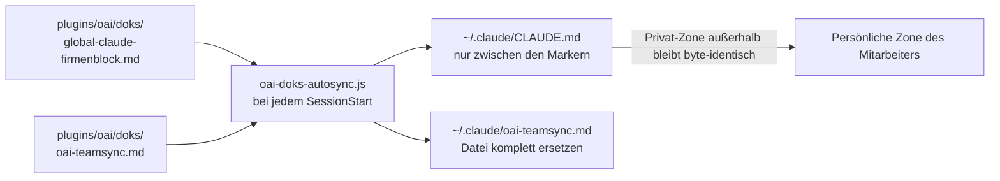
```mermaid
flowchart LR
    Payload1["plugins/oai/doks/<br/>global-claude-firmenblock.md"] --> Hook["oai-doks-autosync.js<br/>bei jedem SessionStart"]
    Payload1b["plugins/oai/doks/<br/>oai-teamsync.md"] --> Hook
    Hook --> Ziel1["~/.claude/CLAUDE.md<br/>nur zwischen den Markern"]
    Hook --> Ziel1b["~/.claude/oai-teamsync.md<br/>Datei komplett ersetzen"]
    Ziel1 -->|"Privat-Zone außerhalb bleibt byte-identisch"| Privat["Persönliche Zone des Mitarbeiters"]
```

`/oai:update-doks` ist der **manuelle** Reparatur-/Konsistenz-Befehl. Normalweg bleibt der Autosync.

---

## 9. WP0–WP8: der Pflicht-Zyklus

Der Rahmen liegt im Kern (`plugins/oai/wp-rahmen.md`) und gilt für **jede** Abteilung. WP1–WP7 übersetzt die Abteilung in ihrer `workflow.md`.

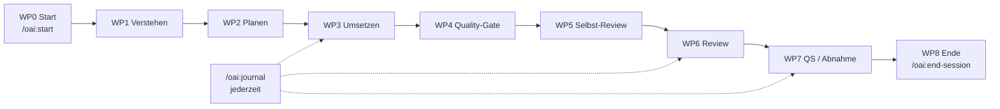
```mermaid
flowchart LR
    WP0["WP0 Start<br/>/oai:start"] --> WP1["WP1 Verstehen"]
    WP1 --> WP2["WP2 Planen"]
    WP2 --> WP3["WP3 Umsetzen"]
    WP3 --> WP4["WP4 Quality-Gate"]
    WP4 --> WP5["WP5 Selbst-Review"]
    WP5 --> WP6["WP6 Review"]
    WP6 --> WP7["WP7 QS / Abnahme"]
    WP7 --> WP8["WP8 Ende<br/>/oai:end-session"]
    J["/oai:journal<br/>jederzeit"] -.-> WP3
    J -.-> WP6
    J -.-> WP7
```

| WP | Träger | Development-Übersetzung |
|---|---|---|
| **WP0** | Kern `/oai:start` | Kontext laden |
| **WP1** | Abteilung | `feat-start` — Ticket, DoR, Branch |
| **WP2** | Abteilung | `feat-plan` — Slices, CI-Jobs, Subtasks |
| **WP3** | Abteilung | `feat-tdd` — Red-Green-Refactor |
| **WP4** | Abteilung | `mr-commit-prep` — Format/Lint/Secrets |
| **WP5** | Abteilung | `mr-selfreview` → `mr-create` |
| **WP6** | Abteilung | `rev-prep` → `rev-run` / `rev-fixup` |
| **WP7** | Abteilung | `qs-*` + `rel-*` + `ps-*` |
| **WP8** | Kern `/oai:end-session` | Stand, Register, Queue |

Marketing hat **keine** `workflow.md` — die drei Skills sind Setup, kein Fachzyklus. Controlling hat weder Skills noch Workflow.

---

## 10. Kern-Features im Detail

### 10.1 Skill-Landkarte `gemeinsam`

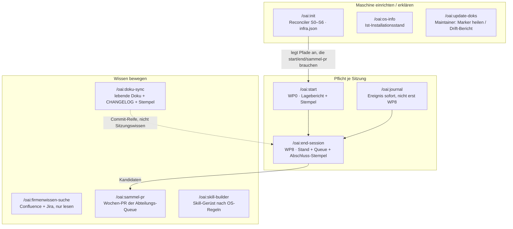
```mermaid
flowchart TB
    subgraph PflichtSitzung["Pflicht je Sitzung"]
        START["/oai:start<br/>WP0 · Lagebericht + Stempel"]
        ENDS["/oai:end-session<br/>WP8 · Stand + Queue + Abschluss-Stempel"]
        JOUR["/oai:journal<br/>Ereignis sofort, nicht erst WP8"]
    end

    subgraph Maschine["Maschine einrichten / erklären"]
        INIT["/oai:init<br/>Reconciler S0–S6 · infra.json"]
        INFO["/oai:os-info<br/>Ist-Installationsstand"]
        UPD["/oai:update-doks<br/>Maintainer: Marker heilen / Drift-Bericht"]
    end

    subgraph Wissen["Wissen bewegen"]
        FWS["/oai:firmenwissen-suche<br/>Confluence + Jira, nur lesen"]
        DOKU["/oai:doku-sync<br/>lebende Doku + CHANGELOG + Stempel"]
        SAM["/oai:sammel-pr<br/>Wochen-PR der Abteilungs-Queue"]
        BLD["/oai:skill-builder<br/>Skill-Gerüst nach OS-Regeln"]
    end

    START --> ENDS
    JOUR --> ENDS
    ENDS -->|"Kandidaten"| SAM
    INIT -->|"legt Pfade an, die start/end/sammel-pr brauchen"| START
    DOKU -.->|"Commit-Reife, nicht Sitzungswissen"| ENDS
```

| Skill | Liest | Schreibt | Koppelt an |
|---|---|---|---|
| `start` | Git, Stand, Journal, Register, Roll-up, Abteilungs-CLAUDE, Team-Sync-Stempel, Ticket-Datei, `infra.json` | Stempel; Erstlauf-Ordner erst danach | Gate 2, `init` wenn Registry fehlt |
| `end-session` | Git seit Sitzungsbeginn, `pflege-auspraegung.json`, Kriterienliste | Journal, `stand.md`, Roll-up, Register, `queue.md`, Abschluss-Stempel | PreCompact, `sammel-pr` |
| `journal` | Zielort-Regel wie `start` | Append Tagesjournal | benennt Queue-Kandidaten, schreibt sie nie selbst |
| `doku-sync` | Sync-Matrix, Aktualisierungs-Index, Versionsstellen | nachgezogene Doks, `[Unreleased]`, `.git/oai/doku-sync.stamp` | committet nie |
| `init` | git/Node/`gh`/CC-Version, Plugin-Stand, Klone | `~/.claude/oai/infra.json`, fehlende SSOT-Bausteine lokal | alle Skills, die Pfade auflösen |
| `update-doks` | Payloads, Indexe | F1 ruft Autosync / repariert Marker; F2 Bericht, Fixes nur nach Freigabe | Autosync bleibt Normalweg |
| `sammel-pr` | Satelliten-Klon aus Registry | Branch `queue/<Datum>`, ein PR, nie Merge | nur Satelliten, nur `knowledge base/` |
| `os-info` | echte Installation | nichts | unterscheidet Cache vs. Checkout |
| `firmenwissen-suche` | Atlassian-Connector | nichts | bricht sauber ab, wenn Connector fehlt |
| `skill-builder` | Formatregeln, Trigger-Matrix | `skills/<name>/SKILL.md` | Fork-back nur über Maintainer |
| `grill-me` | — | — | nur `PLATZHALTER.md`, kein Skill |

### 10.2 Infra-Registry — der Pfad-Kleber

Ohne `~/.claude/oai/infra.json` können Queue, Manuals und Satelliten-Klone nicht aufgelöst werden. `/oai:init` schreibt sie zuletzt.

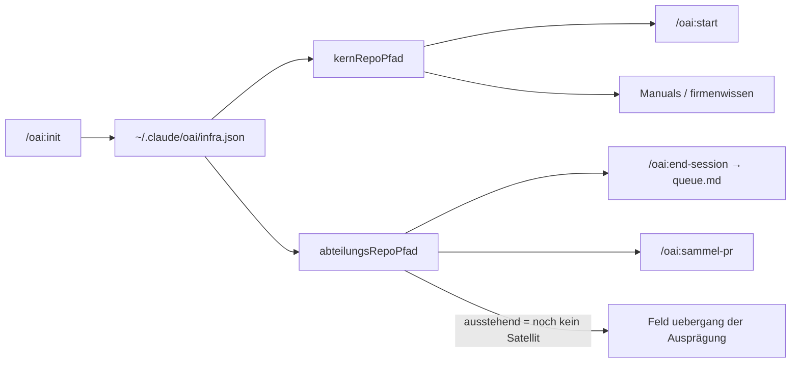
```mermaid
flowchart LR
    INIT["/oai:init"] --> REG["~/.claude/oai/infra.json"]
    REG --> KPFAD["kernRepoPfad"]
    REG --> APFAD["abteilungsRepoPfad"]
    KPFAD --> START["/oai:start"]
    KPFAD --> FWS2["Manuals / firmenwissen"]
    APFAD --> ENDS2["/oai:end-session → queue.md"]
    APFAD --> SAM2["/oai:sammel-pr"]
    APFAD -->|"ausstehend = noch kein Satellit"| UEB["Feld uebergang der Ausprägung"]
```

**Platte schlägt Registry:** Existiert der aufgelöste Pfad nicht, wird nichts geraten. Der Skill verweist auf `/oai:init`.

### 10.3 Subagent `sync-nachzug-executor`

Eigene Komponentenklasse neben Skills und Hooks (Spec §15.34, seit Kern 0.21.0). Flaches `agents/` an der Plugin-Wurzel.

```mermaid
flowchart LR
    Bau["Bauzyklus endet"] --> Skill["Standardprozess<br/>sync-nachzug-bauzyklus"]
    Skill --> Agent["sync-nachzug-executor"]
    Agent --> Doku["README · Betriebshandbuch<br/>Registry · Indizes · CHANGELOG"]
    Agent -.- xBash["tools-Allowlist<br/>Read Write Edit Grep Glob<br/>kein Bash · kein Commit"]
```

---

## 11. Satellit Development

Heimat: `onsite-ai-devs/Onsite.ai-OS-Development`. Das Repo **ist** das Plugin. 17 Skills in 6 Modulen, keine eigenen Hooks, keine eigenen Agents.

### 11.1 Der offsite-Zyklus

```mermaid
flowchart TB
    subgraph KernWP["Kommt aus dem Kern"]
        W0["WP0 /oai:start"]
        W8["WP8 /oai:end-session"]
    end

    subgraph Feat["Modul feat — WP1–WP3"]
        FS["feat-start<br/>PAR-Ticket · DoR · Branch"]
        FP["feat-plan<br/>Slices · CI-Jobs · Subtasks"]
        FT["feat-tdd<br/>Red-Green-Refactor"]
        FS --> FP --> FT
    end

    subgraph Mr["Modul mr — WP4–WP5"]
        MCP["mr-commit-prep<br/>Format Lint Secrets"]
        MSR["mr-selfreview<br/>eigener Diff"]
        MCR["mr-create<br/>MR-Entwurf, Mensch postet"]
        MCP --> MSR --> MCR
    end

    subgraph Rev["Modul rev — WP6"]
        RP["rev-prep<br/>Digest für Reviewer"]
        RR["rev-run<br/>onsite-Review, Entwurf"]
        RF["rev-fixup<br/>Findings einarbeiten"]
        RP --> RR
        RR --> RF
    end

    subgraph Qs["Modul qs — WP7"]
        QL["qs-loop<br/>Jira-QS-Zyklus"]
        QBR["qs-bug-repro"]
        QBF["qs-bug-fix"]
        QL --> QBR --> QBF
    end

    subgraph Rel["Modul rel — WP7 AWS"]
        RC["rel-check<br/>Pre-Deploy-Checkliste"]
        RPO["rel-prod-ops<br/>NUR manuell · Deploy-Klicks"]
        RV["rel-verify<br/>Post-Deploy Go/Rollback"]
        RC --> RPO --> RV
    end

    subgraph Ps["Modul ps — WP7 Gerät"]
        PH["ps-healthcheck<br/>C1–C6 Daten-Invarianten"]
        PD["ps-debug<br/>Ursache + Ticketentwurf"]
        PH --> PD
    end

    W0 --> FS
    FT --> MCP
    MCR --> RP
    RF --> QL
    QBF --> MCP
    QL --> RC
    PD --> FS
    RV --> W8
    QL --> W8
```

### 11.2 Zweistufiges Review + QS

```mermaid
flowchart LR
    Impl["Implementieren"] --> UT["Unit Tests"]
    UT --> Test["Test"]
    Test --> Onsite["Code review onsite<br/>rev-prep / rev-run"]
    Onsite --> Isento["Code review isento<br/>nur vorbereiten"]
    Onsite --> QS["QS · Tester-Feedback<br/>kommt als Jira-Kommentar"]
    Isento --> QS
    QS --> Fix["Fix → Commit → Push<br/>bestehende MR"]
    Fix --> Redeploy["rel-prod-ops<br/>Mensch klickt exec-*"]
    Redeploy --> QS
    QS --> Abn["Abnahme"]
    Abn --> Fertig["Fertig"]
```

Jira erzwingt die Sequenz **nicht**. `qs-loop` mahnt sie an. Isento-Review läuft real parallel zur QS.

### 11.3 Rote-Linien-Ownership

Der Kern definiert die Linien. Die Abteilung sagt, **welcher Skill das Verbot trägt**.

```mermaid
flowchart TB
    RL1["Merge ausführen"] --> S1["mr-create"]
    RL2["Deploy-Klick exec-*"] --> S2["rel-prod-ops · qs-loop"]
    RL3["Review resolven / approven"] --> S3["rev-run · rev-fixup"]
    RL4["MR-Text / Jira-Kommentar posten"] --> S4["mr-create · rev-fixup · qs-loop · qs-bug-repro"]
    RL5["Eingriff am produktiven Gerät"] --> S5["ps-healthcheck · ps-debug"]
```

`rel-prod-ops` hat `disable-model-invocation: true` — der Agent darf ihn nie von selbst vorschlagen.

### 11.4 Zwei Welten in WP7

```mermaid
flowchart LR
    subgraph AWS["offsite-AWS · Blue-Green"]
        REL["rel-check → rel-prod-ops → rel-verify"]
    end
    subgraph Geraet["PartSens-Jetson · Docker · Postgres"]
        PS["ps-healthcheck → ps-debug"]
    end
    REL -.->|"nicht dieselbe Prüfung"| PS
```

`rel-verify` schaut auf Platform-Slot, Smoke, CloudWatch. `ps-*` schaut auf Daten-Invarianten auf dem Gerät (Ausfälle liefen ohne ERROR-Log bei gesundem Container). Beide nur lesen; schreiben der Mensch.

### 11.5 Bewusst nicht gebaut

Modul **Wissenssicherung** (`wis-adr`, `wis-doc-sync`, `wis-handover`) — wertvoll, aber nicht kritisch für WP1–WP7. Folgt, sobald der Zyklus im Team validiert ist.

---

## 12. Satellit Marketing

Heimat: `onsite-ai-devs/Onsite.ai-OS-Marketing`. Drei Setup-Skills, keine Module, keine Hooks, keine Agents, keine `workflow.md`. Praxistest mit dem Fachbereich ist offen.

```mermaid
flowchart TB
    subgraph Setup["Gebaut — Konnektoren einrichten"]
        ID["indesign-setup<br/>Fork onsite-ai-devs/indesign-mcp<br/>Proxy 127.0.0.1:3001 · selbst gepacktes .ccx"]
        LI["linkedin-setup<br/>Einzelprofil-Lupe, Phase 1 lesend<br/>--no-auto-import"]
        KB["linkedin-kontaktbestand<br/>offizieller Datenexport Connections.csv<br/>kein Konnektor"]
    end

    KB -->|"liefert den Arbeitsbestand"| LI
    LI -->|"Recherche später, Skill nicht gebaut"| Such["geplant: get_person_profile + search_posts"]
    ID -->|" Copilot im offenen Dokument"| InD["Adobe InDesign ≥ 20.2"]

    Post["LinkedIn Phase 2 / offizielle Posts-API"] -.->|"ABGELEHNT 2026-08-09<br/>Posten bleibt Handarbeit"| X["nicht bauen"]
```

**Sicherheitsgrenzen:**

- InDesign: nur lokales Dokumenten-Scripting, Loopback-Proxy.
- LinkedIn-Setup: Schreib-Tools `send_message` / `connect_with_person` bestätigungspflichtig; Posten nicht gebaut.
- Kontaktbestand: lokale CSV-Transformation, Personenbezogene Daten nicht committen.

Marketplace pinnt **v0.4.1** (Abteilungs-CLAUDE + Wurzel-Zeiger). Ein älterer lokaler Checkout kann noch auf v0.4.0 stehen.

---

## 13. Platzhalter Controlling

```mermaid
flowchart LR
    C["oai-controlling 0.1.0<br/>liegt noch in plugins/oai-controlling"] --> Dep["dependencies: oai"]
    C --> NS["Namespace /oai-controlling: reserviert"]
    C --> Plan["unverbindliche Kandidaten"]
    Plan --> K1["status-bericht"]
    Plan --> K2["ki-nutzen-report"]
    Plan --> K3["entscheidungs-vorlage"]
    Plan --> K4["risiko-radar"]
    C -.->|"Wochenende, Bauplan 2026-08-13"| Sat["Satellit Onsite.ai-OS-Controlling<br/>SSOT neu anlegen, Start 0.2.0"]
```

Installierbar, damit die Abteilungsgrenze existiert und der Kern mitkommt. **Keine** `skills/`-Ordner, keine `pflege-auspraegung.json`, keine Hooks.

---

## 14. Wissen: SSOT, Queue, Promotion

### 14.1 Drei Wohnorte, eine Mechanik

```mermaid
flowchart TB
    subgraph KernSSOT["Kern-SSOT — Onsite.ai-OS/knowledge base"]
        IDX["SSOT-Document-Index.md<br/>Master-Index"]
        META["project-meta-infos/<br/>Spec · Handbuch · Definitionen"]
        PLAN["Aktive Baupläne / Archiv / Backlog"]
        PROC["plugin-maintanance-ruleset-source/<br/>Standardprozesse"]
        MAN["feature-manuals/<br/>Fremdsysteme"]
        SITZ["sitzungswissen/gemeinsam/"]
        IDX --> META
        IDX --> PLAN
        IDX --> PROC
        IDX --> MAN
        IDX --> SITZ
    end

    subgraph AbtSSOT["Abteilungs-SSOT — im Satelliten"]
        Q["Kandidaten-Queue/queue.md"]
        S2["sitzungswissen/&lt;abteilung&gt;/"]
        FB["Feature-idea-backlog/"]
        DBG["Debugging + findings/"]
    end

    subgraph Auspraegung["Brücke"]
        PA["pflege-auspraegung.json<br/>an der Plugin-Wurzel"]
    end

    PA -->|"queuePfad + Kriterien"| Q
    ENDS["/oai:end-session"] -->|"klassifiziert Einzeiler + Verweis"| Q
    SAM["/oai:sammel-pr"] -->|"ein PR / Woche"| Q
    SAM -->|"Mensch reviewed + merged"| KernSSOT
```

**V2-Schnitt:** Die Pflege-**Mechanik** bleibt im Kern. Die Abteilung deklariert nur ihre Ausprägung. Ein Abteilungs-Bump ändert Queue-Ort oder Domänen-Linien, ohne den Kern anzufassen.

### 14.2 Promotion-Pipeline

```mermaid
sequenceDiagram
    autonumber
    participant J as /oai:journal
    participant E as /oai:end-session
    participant Q as queue.md im Satelliten
    participant S as /oai:sammel-pr
    participant PR as GitHub-PR
    participant M as Maintainer

    J->>J: benennt Queue-Kandidat, schreibt ihn nicht
    E->>E: prüft Kriterien a–d der Ausprägung
    E->>Q: append Einzeiler + Verweis, nie Volltext
    Note over S: wöchentlich, heute manuell
    S->>Q: nur knowledge base/-Pfade
    S->>PR: Branch queue/YYYY-MM-DD, ein PR
    M->>PR: Review = Kuration
    M->>M: Merge nur der Mensch
    Note over M: Agent merged nie
```

Kriterien v1 sitzen in `plugins/oai/referenz/pflege-auspraegung.md`. Der geplante Folge-Schnitt (`queue-abteilung` / `queue-kern`, Bauplan 2026-08-13) ist konzipiert, noch nicht gebaut.

### 14.3 Wissensbasis-Karte des Kerns

```mermaid
flowchart TB
    Root["knowledge base/SSOT-Document-Index.md"]
    Root --> PMI["project-meta-infos/<br/>Was das Produkt IST"]
    Root --> AB["Aktive Baupläne/<br/>Was gerade gebaut wird"]
    Root --> BA["Bauplan-archiv/<br/>Was erarbeitet wurde"]
    Root --> FI["Feature-idea-backlog/<br/>Ideen ohne Priorität"]
    Root --> PMR["plugin-maintanance-ruleset-source/<br/>Wie man das OS pflegt"]
    Root --> FM["feature-manuals/<br/>Wie Fremdsysteme andocken"]
    Root --> DF["Debugging + findings/<br/>Was schiefging"]
    Root --> SW["sitzungswissen/<br/>Was in Sitzungen festgehalten wurde"]
```

Satelliten haben eine **kleinere** Kopie dieser Struktur (fünf Bausteine + Queue + Sitzungswissen). Spec, Handbuch, Standardprozesse und Feature-Manuals bleiben bewusst im Kern.

---

## 15. Fremdsysteme und Konnektoren

Nichts davon liegt im Plugin-Paket. Das OS orchestriert, der Mensch richtet ein, der Agent liest.

```mermaid
flowchart TB
    subgraph OS2["Onsite.ai-OS"]
        Kern2["Kern"]
        Dev2["development"]
        Mkt2["marketing"]
    end

    subgraph Firmen["Firmen-Systeme isento / Onsite"]
        Jira["Jira Cloud PAR<br/>Atlassian-Team-Connector"]
        Conf["Confluence<br/>gleicher Tenant"]
        GL["GitLab CE gitlab.isento.net<br/>MCP @zereight/mcp-gitlab read-only"]
        AWS["AWS ECS · Cognito · S3 · RDS<br/>Blue-Green über manuelle exec-*-Jobs"]
        PS2["PartSens-Geräte<br/>SSH über WSL-Bridge"]
        TRYB["TRYB<br/>Fachdetails in Confluence"]
    end

    subgraph MarketingSys["Marketing-Werkzeuge"]
        InD2["InDesign-MCP<br/>auditierter Fork"]
        LI2["LinkedIn-MCP<br/>Lupe, nicht Posten"]
        CSV["LinkedIn-Datenexport"]
    end

    Kern2 -->|"firmenwissen-suche"| Jira
    Kern2 --> Conf
    Dev2 --> Jira
    Dev2 --> Conf
    Dev2 --> GL
    Dev2 --> AWS
    Dev2 --> PS2
    Dev2 -.-> TRYB
    Mkt2 --> InD2
    Mkt2 --> LI2
    Mkt2 --> CSV
```

| System | Wer nutzt es | Richtung | Bemerkung |
|---|---|---|---|
| Jira PAR | Kern + development | lesen | Schreiben/Transitionen: Mensch |
| Confluence | Kern + development | lesen | Review-Policy, Smoke-Test, TRYB |
| GitLab CE | development | MCP read-only, sonst Web-UI | MR anlegen / mergen / `exec-*`: Mensch |
| AWS | `rel-*` | Evidence / Logs | Deploy-Klick ist rote Linie |
| PartSens SSH | `ps-*` | read-only | Manual `partsens-ssh-onboarding.md` |
| LinkedIn / InDesign | marketing | skill-geführt | Praxistest offen |
| `gh` | `init`, `sammel-pr` | Klone + PRs | ohne `gh` bleibt der PR-Schritt offen |

---

## 16. Geplant, auf Eis, abgelehnt

```mermaid
timeline
    title Bau-Horizont (kein Release-Plan)
    section Gebaut
        0.11–0.21 : Gates 1+2 : Autosync : PreCompact : init : Queue : Satelliten
    section Als Nächstes offen
        Gate 3 Safety-Gate : Controlling-Extraktion : dev-Inhalts-Modernisierung
        Queue-Flow queue-abteilung/queue-kern : Inhalts-Standards CLAUDE-Ebenen
    section Konzeption, Bau nicht frei
        oai-mneme Dreaming : Web-GUI als SDK-App
    section Auf Eis
        Gate 4 Stop-Hook
    section Abgelehnt / bewusst nicht
        LinkedIn-Posts-API : Upstream-InDesign-Binaries : Auto-Merge
```

| Vorhaben | Status |
|---|---|
| **Gate 3 Safety-Gate** | geplant; einziger Dialog-Gate; inkl. kundensichtbarer Schreibaktionen |
| **Gate 4 Sitzungsabschluss** | auf Eis; PreCompact ist der Ersatz-Auslöser für `end-session`, nicht das Gate |
| **`grill-me`** | Platzhalter |
| **`oai-mneme` / Dreaming** | Makro+Mikro konzipiert, Spec §15.35; Bau nicht freigegeben; würde nur in die Queue schreiben |
| **Web-GUI** | separates QOL-Projekt, SDK-App, kein Plugin-Feature |
| **Controlling-Satellit** | Extraktion terminiert |
| **Pre-Commit-Fangnetz** | prüft den `doku-sync`-Stempel; vor Team-Rollout |
| **LinkedIn Phase 2** | **abgelehnt** |

---

## 17. Gesamtverdrahtung

Das Schlussbild: was wen aufruft, was wen gatet, was wohin schreibt.

```mermaid
flowchart TB
    subgraph MenschWelt["Mensch"]
        U["Lucas / Team"]
    end

    subgraph Harness["Claude Code auf der Maschine"]
        SS["SessionStart-Hooks"]
        PT["PreToolUse-Hooks"]
        PC2["PreCompact-Hook"]
        SK["Skills /oai:* und /oai-&lt;abt&gt;:*"]
        AG["Subagent sync-nachzug-executor"]
    end

    subgraph Lokal["Lokaler Zustand"]
        CLAUDE["~/.claude/CLAUDE.md"]
        TEAM["~/.claude/oai-teamsync.md"]
        INF["~/.claude/oai/infra.json"]
        STAMP["Start-/End-Stempel"]
        MEM["sitzungswissen/ oder .oai/erinnerung/"]
    end

    subgraph Repos["Git-Repos"]
        OS["Onsite.ai-OS"]
        DEV["Onsite.ai-OS-Development"]
        MKT["Onsite.ai-OS-Marketing"]
        OFF["offsite-Monorepo"]
    end

    subgraph Extern["Externe Systeme"]
        J["Jira / Confluence"]
        G["GitLab CE"]
        W["AWS / PartSens"]
        MK["LinkedIn / InDesign"]
    end

    U --> SK
    SS --> CLAUDE
    SS --> TEAM
    SS --> SK
    PT --> STAMP
    SK --> STAMP
    SK --> INF
    SK --> MEM
    SK --> J
    SK --> G
    SK --> W
    SK --> MK
    SK --> OFF
    SK --> DEV
    SK --> MKT
    SK --> OS
    PC2 --> STAMP
    AG --> OS
    U -->|"rote Linien: klickt selbst"| G
    U -->|"rote Linien: klickt selbst"| J
```

### Lesereihenfolge, wenn etwas unklar ist

```mermaid
flowchart TD
    Frage["Frage taucht auf"] --> Art{"Was für eine Frage?"}
    Art -->|Welches Feature existiert?| BH["Betriebshandbuch<br/>Ist-Inventur"]
    Art -->|Wie hängt es zusammen?| Diese["Diese Featurekarte"]
    Art -->|Wie ist es spezifiziert?| SPEC["Design-Spec<br/>knowledge base/project-meta-infos/"]
    Art -->|Wie pflege ich es?| AI["Aktualisierungs-Index"]
    Art -->|Welches Dokument lese ich?| IDX2["SSOT-Document-Index"]
    Art -->|Was tut meine Abteilung konkret?| WF2["workflow.md + Abteilungs-CLAUDE"]
    Art -->|Was ist auf dieser Maschine wirklich an?| OI["/oai:os-info"]
```

---

## Anhang A — Dateizeiger

| Thema | Pfad |
|---|---|
| Produkt-README | `Onsite.ai-OS/README.md` |
| Betriebshandbuch | `knowledge base/project-meta-infos/Onsite.ai-OS-Betriebshandbuch.md` |
| Produktarchitektur | `knowledge base/project-meta-infos/Onsite.ai-OS-Produktarchitektur.md` |
| Gates | `knowledge base/project-meta-infos/Onsite.ai-OS-Gates-Definition.md` |
| CLAUDE-Ebenen | `knowledge base/project-meta-infos/Onsite.ai-OS-CLAUDE-Ebenen-Definition.md` |
| SSOT-Begriff | `knowledge base/project-meta-infos/Onsite.ai-OS-SSOT-Definition.md` |
| Master-Index | `knowledge base/SSOT-Document-Index.md` |
| WP-Rahmen | `plugins/oai/wp-rahmen.md` |
| Registry | `plugins/oai/module-registry.json` |
| Marketplace | `.claude-plugin/marketplace.json` |
| Hooks | `plugins/oai/hooks/hooks.json` |
| Pflege-Schema | `plugins/oai/referenz/pflege-auspraegung.md` |
| Dev-Workflow | `Onsite.ai-OS-Development/workflow.md` |
| Dev-CLAUDE Ebene 2 | `Onsite.ai-OS-Development/development-abteilungs-claude.md` |
| Marketing-README | `Onsite.ai-OS-Marketing/README.md` |

## Anhang B — Zählung, damit Drift auffällt

| Größe | Zahl | Quelle |
|---|---|---|
| Kern-Skills live | 10 | `module-registry.json` + `skills/*/SKILL.md` |
| Kern-Platzhalter | 1 | `grill-me` |
| Kern-Subagenten | 1 | `agents/sync-nachzug-executor.md` |
| Development-Skills | 17 | 6 Module |
| Marketing-Skills | 3 | Setup only |
| Controlling-Skills | 0 | Platzhalter |
| Gates gebaut | 2 von 4 | plus Autosync + PreCompact |
| Satelliten live | 2 | controlling folgt |
| CLAUDE-Ebenen | 0 / 1 / 1b / 2 / 3 / 3b | 1 und 1b autosynced |

---

*Onsite.ai-OS Featurekarte · erzeugt 2026-08-15 gegen Kern 0.21.0 / development 0.11.0 / marketing 0.4.1 · nicht normativ — bei Widerspruch gewinnen Spec, Betriebshandbuch und die Dateien auf der Platte.*
