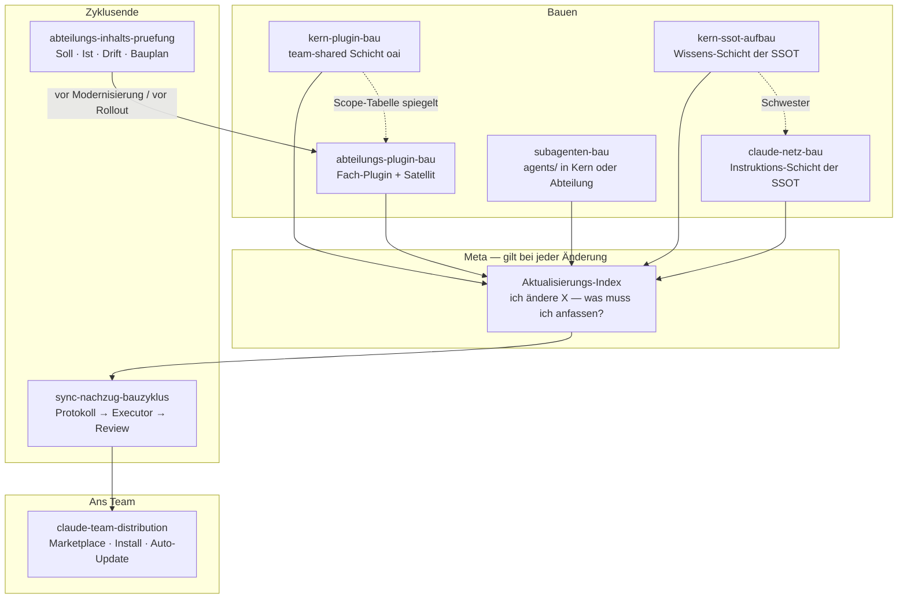
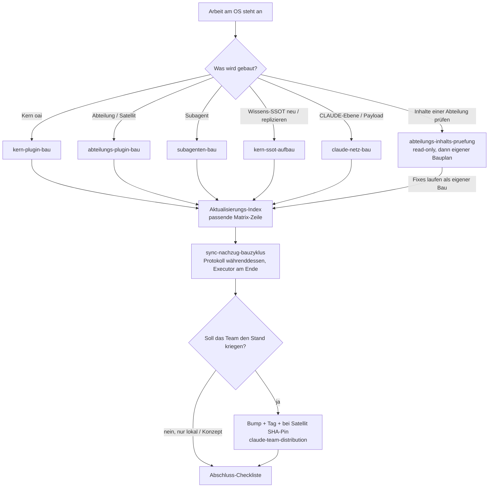
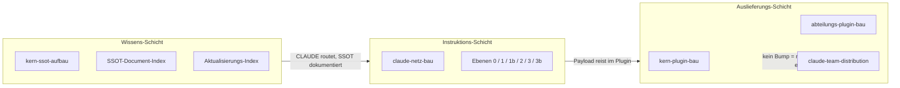
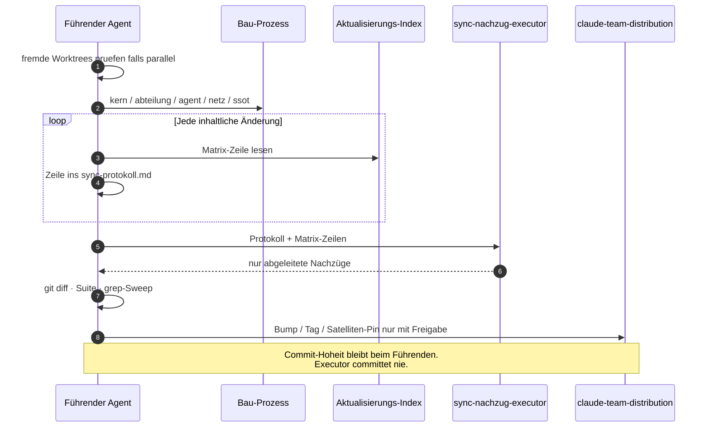
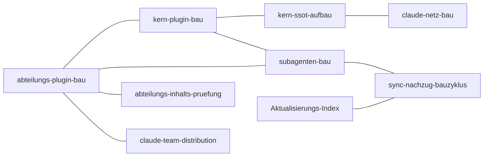

# Standardprozesse — Familienkarte

> **Was das ist:** Die Landkarte der zehn Dokumente in `plugin-maintanance-ruleset-source/`.
> Sie zeigt, *wann welcher Prozess greift* und *wie sie sich gegenseitig aufrufen*.
> **Quelle:** der Ordner selbst + der Master-Index (Teil 2, Kategorie `plugin-maintanance-ruleset-source/`).
> **Stand:** 2026-08-15 · Kern 0.21.0
> **Nicht normativ.** Die Einzelkarten in diesem Ordner erklären je ein Dokument.

Die Featurekarte (`Desktop/Onsite.ai-OS-Featurekarte.md`) erklärt das **Produkt**.
Diese Familie erklärt das **Handwerk, mit dem das Produkt gebaut und verteilt wird**.

---

## 1. Die zehn Dokumente

| Datei | Rolle in einem Satz | Einzelkarte |
|---|---|---|
| `Aktualisierungs-Index.md` | Nachschlageliste: vorher lesen / in derselben Änderung nachziehen / Version-Release-Tag | [01](01-aktualisierungs-index.md) |
| `abteilungs-plugin-bau.md` | Architektur + Ablauf für Fach-Plugins und Satelliten-Extraktion | [02](02-abteilungs-plugin-bau.md) |
| `kern-plugin-bau.md` | Scope und Bauablauf des Kerns `oai`, inkl. Autosync als Unterprozess | [03](03-kern-plugin-bau.md) |
| `kern-ssot-aufbau.md` | Generischer Aufbau der Wissens-SSOT inkl. Andockpunkte für Abteilungen | [04](04-kern-ssot-aufbau.md) |
| `claude-netz-bau.md` | Schwester: Instruktions-Ebenen 0/1/1b/2/3/3b bauen, nicht kopieren | [05](05-claude-netz-bau.md) |
| `claude-team-distribution.md` | Wie ein Stand die Maschinen erreicht (Marketplace, Pins, Auto-Update) | [06](06-claude-team-distribution.md) |
| `subagenten-bau.md` | Wann Agent statt Skill, 7 Bauschritte, Gates, portabler Testbaustein | [07](07-subagenten-bau.md) |
| `sync-nachzug-bauzyklus.md` | Abgeleitete Doku nicht nebenbei, sondern gebündelt per Executor | [08](08-sync-nachzug-bauzyklus.md) |
| `abteilungs-inhalts-pruefung.md` | Inhalts-Schwester der Struktur-Tests: Soll/Ist/Drift vor Modernisierung | [10](10-abteilungs-inhalts-pruefung.md) |

Zwei davon sind **generische NovaCore-Prozesse** (IP-Zeichnung im Kopf, Extraktion vor Live-Gang in eine Firmen-Org): `kern-ssot-aufbau.md` und `claude-netz-bau.md`. Onsite.ai-OS ist die erste Instanz, nicht die Pflichtform.

---

## 2. Wann welcher Prozess

**Lesereihenfolge vor dem ersten Schreiben** (steht so im Index §1): Git-Lage → CHANGELOG/VERSION → laufende Baupläne → SSOT-Document-Index → *existiert schon ein Prozess hier?* → agent-learnings → Arbeitsplan ablegen → fremde Worktrees prüfen.

---

## 3. Drei Schichten, die man nicht vermischen darf

- Die **Wissens-Schicht** sagt, wohin eine Datei gehört und was bei einer Änderung mitgeht.
- Die **Instruktions-Schicht** sagt, welche CLAUDE den Menschen und den Agenten bindet.
- Die **Auslieferungs-Schicht** sagt, wie das als Plugin auf die Maschine kommt.

Ein häufiger Fehler: Inhalt in die falsche Schicht legen. Dann ist er entweder ständig veraltet oder frisst in jeder Session Kontext. Die Kanal-Regel steht in `claude-netz-bau.md`.

---

## 4. Der Änderungs-Takt eines Bauzyklus

Was **nicht** ins Protokoll darf, weil es in derselben Änderung testerzwungen ist: CHANGELOG-Eintrag und Index-Zeile neuer Wissensdateien. Ins Protokoll gehören die *abgeleiteten* Nachzüge (READMEs, Betriebshandbuch, Karten, Verweis-Sweeps).

---

## 5. Wer wen als Schwester nennt

Diese Kanten stehen in den Quellen, sie sind keine Erfindung:

- `abteilungs-plugin-bau` ↔ `kern-plugin-bau` — Scope-Tabelle, wer welche Struktur trägt.
- `kern-plugin-bau` → `kern-ssot-aufbau` — Wissens-Seite des Kerns.
- `kern-ssot-aufbau` ↔ `claude-netz-bau` — Wissen vs. Instruktion, ausdrücklich Schwestern.
- `subagenten-bau` → beide Plugin-Prozesse — Agenten sitzen in einem der beiden Plugins.
- `sync-nachzug-bauzyklus` → Index-Matrix und `sync-nachzug-executor`.
- `abteilungs-inhalts-pruefung` → `abteilungs-plugin-bau` (Satelliten-Pflichten als Normquelle 10).
- `claude-team-distribution` → Marketplace-Fakten, die `abteilungs-plugin-bau` §2 wiederholt.

---

## 6. Was dieser Ordner nicht ist

- Kein Ersatz der zehn Quelldateien.
- Kein dritter Index neben SSOT-Document-Index und Aktualisierungs-Index.
- Kein Team-Rollout-Paket — das liegt separat unter `Desktop/Onsite-OS-Team-Rollout-Infrastruktur/`.
- Keine SSOT-Datei. Nichts hiervon gehört ohne eigenen Auftrag in `knowledge base/`.

---

*Familienkarte · 2026-08-15 · Einstieg in die zehn Prozesskarten.*
