# Aktualisierungs-Index — Prozesskarte

> **Was das ist:** Visuelle Landkarte des Standardprozesses „ich ändere X — was muss ich anfassen“. Sie verdichtet die Nachschlageliste gegen Vergessen: Pflichtlektüre vorher, Nachzüge in derselben Änderung, Version/Release/Tag, Protokolle und Abschluss.
> **Quelle (normativ):** `Onsite.ai-OS/knowledge base/plugin-maintanance-ruleset-source/Aktualisierungs-Index.md`
> **Stand der Karte:** 2026-08-15 · gegen die Quelldatei auf der Platte
> **Nicht normativ.** Bei Widerspruch gewinnt die Quelldatei.

Verwandte Karte: [00-FAMILIE-UND-VERDRAHTUNG.md](00-FAMILIE-UND-VERDRAHTUNG.md) (wann welcher Prozess greift). Anker-Details: `anker-reservierung.md` (Einzelkarte 09). Index §3 nennt zusätzlich die Register-Zeile.

---

## Inhaltsverzeichnis

1. [Ein Satz, dann das Bild](#1-ein-satz-dann-das-bild)
2. [Wann der Prozess greift](#2-wann-der-prozess-greift)
3. [§1 Immer zuerst — 8-Schritt-Flow](#3-1-immer-zuerst--8-schritt-flow)
4. [§2 Änderungs-Matrix in drei Familien](#4-2-änderungs-matrix-in-drei-familien)
5. [§3 Version, Release und Tag](#5-3-version-release-und-tag)
6. [§4 Protokolle und Indizes](#6-4-protokolle-und-indizes)
7. [§5 Prüf- und Abschlusszyklus](#7-5-prüf--und-abschlusszyklus)
8. [§6 Selbsttest](#8-6-selbsttest)
9. [Artefakte und Fallen](#9-artefakte-und-fallen)
10. [Anhang — Dateizeiger](#10-anhang--dateizeiger)

---

## 1. Ein Satz, dann das Bild

**Zweck:** Wer im OS etwas ändert, findet hier je Änderungsart (a) welche Dokumente **vorher eingelesen** werden und (b) was **in derselben Änderung** nachgezogen wird — einschließlich Version, Release, Tag, Protokolle, Indizes, Tests und Validierung.

**Abgrenzung zum SSOT-Document-Index:**

| Frage | Dokument |
|---|---|
| *„Welches Dokument existiert, wohin gehört es, wann brauche ich es?"* | `SSOT-Document-Index` |
| *„Ich ändere X — was muss ich alles anfassen?"* | **dieser** Aktualisierungs-Index |

Beide werden gebraucht: zuerst der SSOT-Index (Triage), dann dieser Index (Änderungsumfang).

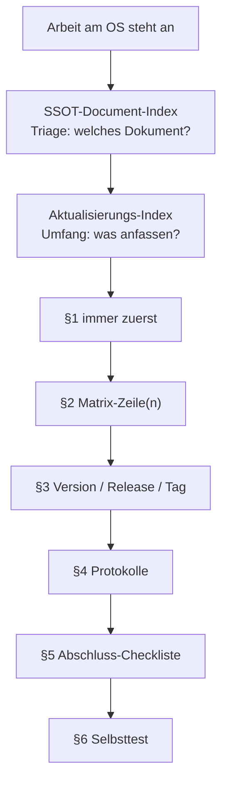

Der Index ist selbst **normativ**. Entsteht eine neue Änderungsart (neuer Hook-Typ, neues Manifestfeld, neuer Workflow), kommt sie hier als Zeile dazu — sonst beginnt die Drift von Neuem. Abschnitt 1 gilt immer. Danach in Abschnitt 2 die Zeile(n) zur eigenen Änderungsart suchen — mehrere Zeilen dürfen gleichzeitig zutreffen, dann gilt die **Vereinigung**. Abschnitte 3–5 gelten für jede Änderung, die das Team erreichen soll.

---

## 2. Wann der Prozess greift

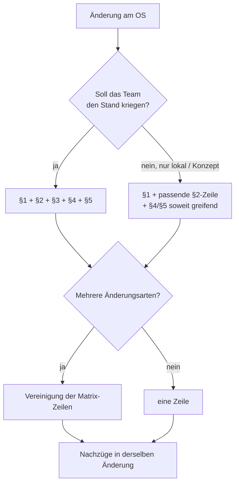

**Trigger:** Jede inhaltliche Änderung am OS — Plugin-Inhalt, Wissensbasis, Manifeste, CI, Versionen. Die Familienkarte (§2) verweist jeden Bau-Prozess (kern / abteilung / agent / netz / ssot) auf diesen Index.

**Nicht-Trigger allein:** Reine Lese-Recherche ohne Schreibabsicht. Sobald geschrieben wird, greift mindestens §1 und die passende §2-Zeile.

Bei Widersprüchen zwischen Doku-Ebenen: **Design-Spec (jüngster Nachtrag) → Feature-Manuals → Produktarchitektur**. Bei Widerspruch zwischen Doku und Platte gilt die Platte (Glob / `git status`), danach wird die Doku korrigiert.

---

## 3. §1 Immer zuerst — 8-Schritt-Flow

Unabhängig von der Änderungsart. Die Nummern entsprechen der Quelle 1:1.

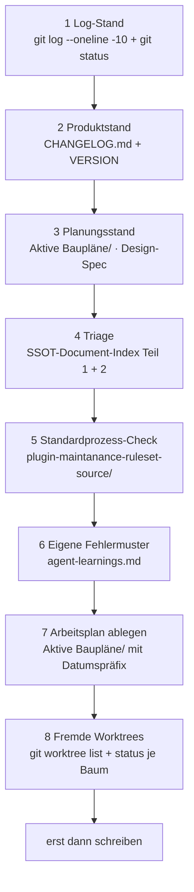

| # | Pflichtschritt | Quelle / Ort |
|---|---|---|
| 1 | **Log-Stand:** `git log --oneline -10` + `git status`. Der Working Tree ist die Wahrheit, nicht der letzte Commit und nicht die Doku (mehrere Sitzungen/Worktrees sind real) | — |
| 2 | **Produktstand:** `CHANGELOG.md` (autoritativ für gebaut/fehlend) + `VERSION` | Repo-Wurzel |
| 3 | **Planungsstand:** laufende Vorhaben in `Aktive Baupläne/`, verbindliche Grundlage ist die Design-Spec (jüngster Nachtrag gewinnt) | `knowledge base/` |
| 4 | **Triage:** SSOT-Document-Index — Teil 1 (wohin gehört ein Dokument), Teil 2 („Relevant wenn …") | `knowledge base/SSOT-Document-Index.md` |
| 5 | **Standardprozess-Check:** existiert für die Arbeit schon ein Prozess in `plugin-maintanance-ruleset-source/`? Falls ja: ihm folgen. Falls nein und die Tätigkeit ist wiederkehrend: hinterher dort dokumentieren | dieser Ordner, v. a. `abteilungs-plugin-bau.md` und `kern-plugin-bau.md` |
| 6 | **Eigene Fehlermuster prüfen:** `agent-learnings.md` — bekannte Fallen vor der Arbeit lesen | `Debugging + findings/` |
| 7 | **Arbeitsplan ablegen** (bei mehr als einem Trivialschritt): eigenes Dokument in `Aktive Baupläne/` mit Datumspräfix — **keine** Ad-hoc-Ablage | `Aktive Baupläne/` |
| 8 | **Fremde Worktrees prüfen** vor dem ersten Schreiben: `git worktree list`, in jedem Baum `git status`. Ein Struktur-Umbau, der einen parallelen Arbeitsstand übersieht, erzeugt Konflikte, die niemand mehr auflösen kann | bekannter Fehler in `abteilungs-plugin-bau.md` §4 |

Schritt 7 entfällt nur bei echten Trivialschritten. Schritt 8 ist kein Höflichkeitshinweis: parallele Worktrees sind auf diesem Gerät real. Ohne diesen Sweep werden Merges unlösbar.

---

## 4. §2 Änderungs-Matrix in drei Familien

Spalten der Quelle: **Vorher einlesen** · **In derselben Änderung nachziehen** · **Mechanik**. Abschnitt 1 gilt zusätzlich immer, Abschnitte 3–5 ebenso. Hier **keine** Vollabschrift aller Zeilen — pro Familie ein Diagramm und die typischen Änderungsarten mit Kern-Mechanik. Die vollständige Tabelle steht in der Quelldatei.

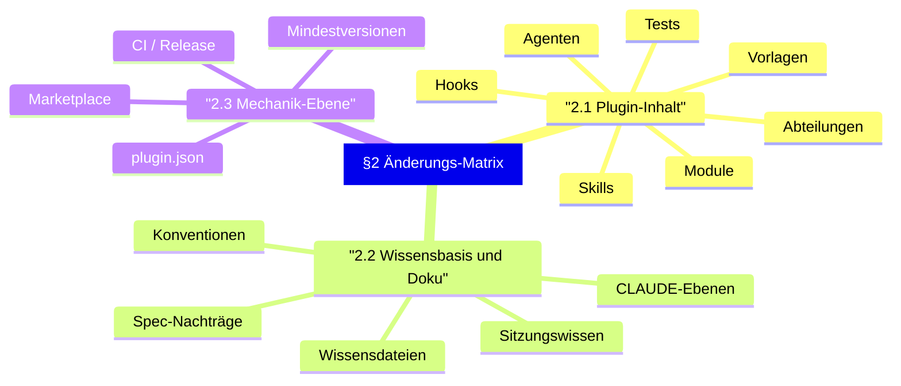

Die drei Familien trennen bewusst: was ausgeliefert wird (2.1), was nur im Repo-Wissen lebt (2.2), und was die Verteilungsmechanik steuert (2.3). Eine Änderung kann Zeilen aus mehreren Familien gleichzeitig treffen — dann gilt die Vereinigung.

### 4.1 Familie 2.1 — Plugin-Inhalt

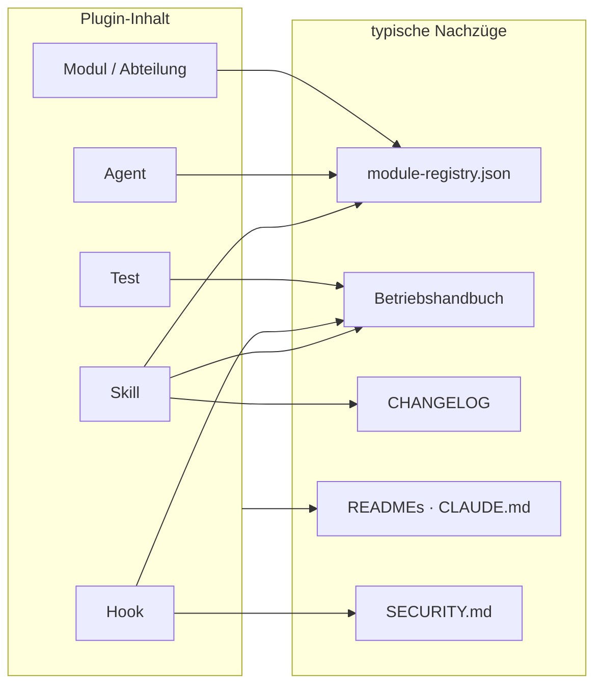

Skills, Hooks und Module landen in Registry, Handbuch und CHANGELOG. Hooks berühren zusätzlich die Garantie-Tabelle in `SECURITY.md`. Tests zählen nur an wenigen Orten (siehe Tabelle).

| Änderungsart | Kern-Mechanik (kurz) |
|---|---|
| **Skill neu** | Bump des betroffenen Plugins · Suite · Validierung beider Ebenen · Plugin-Grenze: in ausgelieferten `.md` keine `../`-Verweise; jede Nennung von `knowledge base/` braucht die Qualifizierung „OS-Repo" in unmittelbarer Nähe (testerzwungen). Skillzahl in `description` des `plugin.json`, Marketplace-Eintrag, Betriebshandbuch §3/§3.1/§3.2 und Plugin-`README.md` mitziehen. Vorher: `skill-authoring.md`, `abteilungs-plugin-bau.md`, `wp-rahmen.md`, `workflow.md` |
| **Skill inhaltlich / umbenannt** | Bump (Fix vs. Neuerung nach Schema §3) · Suite · `validate <plugin> --strict`. Umbenennung ist teamsichtbar: alter Slash-Befehl verschwindet → CHANGELOG explizit als Breaking. `grep` nach altem Namen über das ganze Repo |
| **Satellit-Extraktion / Satellit aktualisiert** | Release/Version zählt **im Satelliten-Repo**; hier nur der Pin. Marketplace-Eintrag **per `ref` + Full-SHA umpinnen** (Pin = Commit-SHA via `git rev-parse v<tag>^{commit}`, vor Merge per `git ls-remote` verifizieren). Registry: `repository` **und** `repoSkillsPath`. Ohne SHA-Umpinnen erreicht die Änderung das Team nicht. Install-Probe in isoliertem `CLAUDE_CONFIG_DIR`; bei SSH-Fehlern `CLAUDE_CODE_PLUGIN_PREFER_HTTPS=1`. Spec §15.19 + §15.33 · `abteilungs-plugin-bau.md` §3a |
| **Hook neu/geändert** | Kern-Hook → Kern-Bump + `VERSION` + Registry. Abteilungs-Hook: eigene Zeile, erst nach Meilenstein. **Prüfungs-Eigentum statt Matcher-Exklusivität** (Spec §15.22): jede Prüfung hat genau ein Heimat-Plugin. Opt-out-Env an **allen vier** Orten: Hook-Kopf, `hooks.json`, `SECURITY.md`, `README.md`. Tests + Negativprobe zwingend. CHANGELOG mit sicherheitsrelevanten Design-Entscheidungen |
| **Test neu/geändert** | Testzahl steht **nur** in `CLAUDE.md` (Produktstand) und Betriebshandbuch §7. `README.md` führt bewusst keine Testzahl. Befehl wortgleich: `node --test plugins/oai/tests/*.test.mjs` — Verzeichnis-Argument schlägt fehl. Kern-Bump nur bei Verhaltensänderung des Plugins |
| **Agent neu/geändert** | Bump · Suite: **beide** Agenten-Testdateien (`agenten.test.mjs` + `agenten-os.test.mjs`) · `validate plugins/<name> --strict`. `isolation` gesperrt bis Mindestversion ≥ 2.1.203. Portabler Baustein geändert → Baustein-Version hochzählen **und** Kopien in allen Satelliten mit `agents/` nachziehen (`subagenten-bau.md` §7) |
| **Neues Abteilungsplugin (im Repo)** | Startversion `0.1.0` · `dependencies: ["oai"]` · Marketplace-Eintrag **ohne** `version` · Install-Probe · `validate .` **und** `validate plugins/<neu> --strict` |
| **Skill-Formatregeln / Pflege-Ausprägung / WP-Rahmen** | **Kern-Bump** (+ `VERSION` + Registry), weil die Referenz mit dem Kern ausgeliefert wird. Formatregeln: einzige Ausnahme der Plugin-Grenzen-Invariante; CI-Positivkontrolle setzt `description: >-` voraus. Queue bleibt append-only |

Weitere Zeilen in der Quelle (nicht hier abgeschrieben): Neues Modul, Abteilungs-Hook/FFG, Vorlage geändert, Plugin/Abteilung entfernt, MCP-Server am Plugin, WP-Rahmen/`workflow.md`.

### 4.2 Familie 2.2 — Wissensbasis und Doku

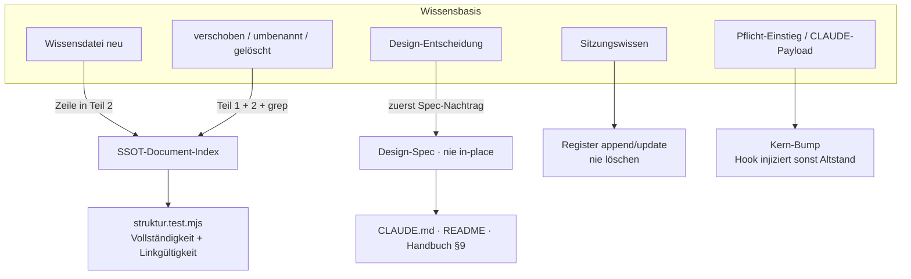

Wissensdateien brauchen keinen Plugin-Bump (Wissensbasis wird nicht ausgeliefert) — aber Index-Zeile und CHANGELOG. Design-Entscheidungen laufen **nur per Spec-Nachtrag**. Pflicht-Einstieg und CLAUDE-Payload reisen im Kern-Paket und erzwingen Kern-Bump.

| Änderungsart | Kern-Mechanik (kurz) |
|---|---|
| **Wissensdatei neu** | Zeile in `SSOT-Document-Index` Teil 2 (Link, Status `lebend`/`historisch`, „Relevant wenn …") · `CHANGELOG.md`. `struktur.test.mjs` erzwingt Vollständigkeit **und** Linkgültigkeit → ohne Eintrag ist die Suite rot. Kein Plugin-Bump |
| **Wissensdatei verschoben/umbenannt/gelöscht** | Index Teil 1 **und** 2 · `CLAUDE.md` / `AGENTS.md` / `README.md` / `CONTRIBUTING.md` / Betriebshandbuch §9 · **`grep` nach dem alten Pfad über das ganze Repo**. `git mv` statt löschen+neu. Historische Dokumente (CHANGELOG-Alteinträge, Spec, `Bauplan-archiv/`, append-only-Protokolle) werden **nicht** rückwirkend umgeschrieben |
| **Design-Entscheidung geändert** | **Zuerst Spec-Nachtrag** (nie in-place): neue §-Nummer fortschreiben **und** Spec-Version in der Fußzeile hochzählen · dieselbe Zahl spiegeln in `CLAUDE.md`, `README.md`, Betriebshandbuch §9. Spec-Version zählt **eigenständig** und läuft der Produktversion voraus. Die vier gespiegelten Stellen sind **nicht** testerzwungen — genau dort ist 2026-08-04 eine Drift aufgetreten (Spec 0.14.0, Doku noch 0.13.0) |
| **Sitzungswissen-Artefakt** (Register / Roll-up / `stand.md` / Tagesjournal, §15.29) | Register: Zeile **append/update, nie löschen** (Erledigt-Datum statt Entfernen). CHANGELOG **nur** bei struktureller Änderung — Tageseinträge sind changelog-frei. Kein Plugin-Bump. Schreiber `end-session`/`journal`, Leser `start` — ändert sich deren Pflichten-Schnitt, greift zusätzlich „Pflicht-Einstieg oder rote Linien" (Kern-Bump) |
| **Pflicht-Einstieg / rote Linien** | Text ist mehrfach gespiegelt und wird ausgeliefert: `oai-session-start.js`, `skills/start/SKILL.md`, `AGENTS.md`, `SECURITY.md`, Betriebshandbuch. **Kern-Bump** — wer nur `CLAUDE.md` ändert, lässt der Hook dem ganzen Team weiter die alte Pflicht injizieren |
| **Team-globale CLAUDE-Anteile** (Ebene 1 / 1b) | Payload im Kern-Plugin-Paket → **Kern-Bump**. Ebene 1: Marker-Konvention, Privat-Zone nie anfassen. Ebene 1b: Ganzdatei, kein Marker, Disziplin-Regel **unter 200 Zeilen** |
| **Bauplan abgeschlossen** | `git mv` nach `Bauplan-archiv/` · Index-Zeile Status `historisch` · CHANGELOG. Pflichtschritt, sonst verliert `Aktive Baupläne/` die Aussage „das läuft gerade" |
| **Abschluss-Checkliste / Prüfzyklus** | Skill `/oai:doku-sync` (Ablauf **und** Verifikation) · `CONTRIBUTING.md` · ggf. `ci.yml` · Betriebshandbuch · CHANGELOG · **Kern-Bump**. Eine Checklistenzeile ohne Gegenstück im Skill ist wirkungslos |

Weitere Zeilen in der Quelle: Neue Kategorie/Ordner, Idee ohne Auftrag, offsite-Fachwissen, Fremdsystem/Konnektor, Konvention/Prozess, Idee wird beauftragt, Abteilungs-CLAUDE, CLAUDE-Netz-Ebene, Org-Instructions (Ebene 0).

### 4.3 Familie 2.3 — Mechanik-Ebene

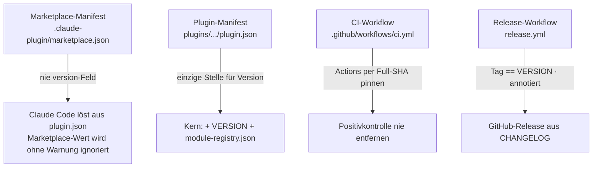

| Änderungsart | Kern-Mechanik (kurz) |
|---|---|
| **Marketplace-Manifest** | Beschreibungstexte müssen zum Ist-Stand passen — das Team liest sie im Installationsdialog. **Nie** ein `version`-Feld setzen: Claude Code löst aus `plugin.json` auf und ignoriert den Marketplace-Wert **ohne Warnung**. `claude plugin validate .` |
| **Plugin-Manifest** | **Einzige** Stelle für die Version. Beim Kern zusätzlich `VERSION` + `module-registry.json` spiegeln (Leitversion). Struktur-Test erzwingt Gleichstand Kern↔`VERSION`↔Registry |
| **CI-Workflow** | Actions **per Full-SHA** pinnen · lokaler Prüfzyklus und CI müssen dieselben Schritte fahren · Positivkontrolle (absichtlich defekter Skill **muss** rot werden) nie entfernen. Nachziehen: `CONTRIBUTING.md`, `CLAUDE.md`, `README.md`, `SECURITY.md`, CHANGELOG |
| **Release-Workflow** | Vorbedingungen, die absichtlich hart scheitern: **annotierter** Tag, Tag == `VERSION`, grüne Suite, vorhandener CHANGELOG-Abschnitt |
| **Mindestversion Claude Code / Node** | Teamweite Wirkung → im CHANGELOG als Anforderung benennen. CI: `node-version`-Matrix **und** gepinnter `@anthropic-ai/claude-code`-Stand des Validierungsjobs gemeinsam pflegen. Marketplace Top-Level-`description` nennt die Team-Mindestversion |

---

## 5. §3 Version, Release und Tag

**Grundregel:** Kein Bump = kein Auto-Update. Eine Änderung, die das Team erreichen soll, zählt die Version des **betroffenen** Plugins hoch.

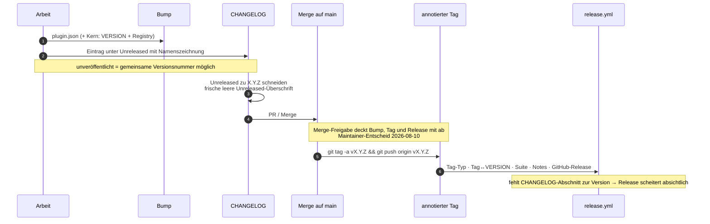

### 5.1 Bump-Schema

| Art der Änderung | Stelle | Beispiel |
|---|---|---|
| inhaltliche Neuerung | zweite Stelle | `0.1.0` → `0.2.0` |
| Fix | dritte Stelle | `0.1.0` → `0.1.1` |
| große Versionsexpansion | Major | — |
| **reiner Versionsnummern-Nachzug** | **vierte Stelle** | `0.9.1` → `0.9.1.1` (Spec §15.23) |

Die vierte Stelle gilt nur, wenn die Änderung **ausschließlich** eine geänderte Versionsangabe durch die lebenden Dokumente zieht und sonst nichts; sie entfällt wieder, sobald die dritte oder zweite Stelle bewegt wird. Vierstellig ist **kein** SemVer — die Plugin-Doku verlangt `MAJOR.MINOR.PATCH` —, `claude plugin validate` akzeptiert es aber (geprüft 2026-08-09) und das Auto-Update vergleicht die Version als String.

**Grenze:** Ein `dependencies`-Eintrag mit SemVer-Range (`{"name":"oai","version":"~0.9.0"}`) matcht auf eine vierstellige Version nicht; heute führen alle Abteilungsplugins `dependencies: ["oai"]` als Plain-String.

### 5.2 Ort der Version

- **Ausschließlich** `plugins/<name>/.claude-plugin/plugin.json`
- Beim **Kern** zusätzlich `VERSION` und `plugins/oai/module-registry.json` spiegeln (Leitversion)
- Im Marketplace-Eintrag steht **nie** eine Version
- Abteilungsplugins zählen eigenständig — Gleichstand über alle Plugins ist ausdrücklich **nicht** gefordert

### 5.3 Parallele Stränge und Anker

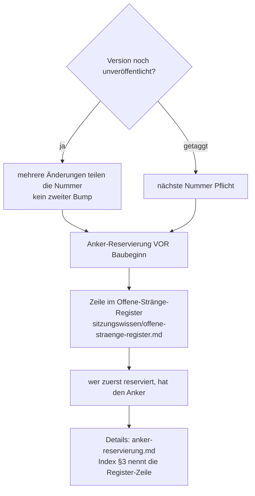

**Anker-Reservierung** (verbindlich, Maintainer-Entscheid 2026-08-14): Bei parallelen Bauzyklen werden **Spec-§-Nummer und Ziel-Version VOR Baubeginn** per Zeile im Offene-Stränge-Register reserviert. Anlass: Am 2026-08-14 belegten zwei Nachtschichten unabhängig **§15.33 und Kern 0.20.0** — Kollision erst beim Merge, Umnummerierung durch fünf Dokumente. Gilt für **jeden** knappen Anker: Spec-§, Version, Skill-Namen, Hook-Dateinamen, Matrix-Zeilen.

Die Reservierung hält die *Nummern* auseinander — den Konflikt in der **Spec-Fußzeile** verhindert sie nicht (beide Nachträge schreiben dieselbe Zeile neu). Auflösung laut `anker-reservierung.md` §6: beide Glieder behalten, höhere Version in den Kopf; zwei Testsuite-Invarianten fangen ein verlorenes Glied.

### 5.4 Kern-Release nach Merge (Schritte 6.1–6.6 der Quelle)

1. `[Unreleased]` zu `## [X.Y.Z] — YYYY-MM-DD` schneiden, **frische leere `[Unreleased]`-Überschrift** stehen lassen
2. Versionsgleichstand: `VERSION` = Kern-`plugin.json` = `module-registry.json`
3. Erst **nach dem Merge auf `main`** annotiert taggen und pushen. **Reichweite der Freigabe:** Die Merge-Freigabe deckt Bump, Tag und Release mit ab — erneutes Nachfragen entfällt. Diese Regel schließt die Lücke, an der 0.8.1 bis 0.10.0 hängen blieben
4. `release.yml` erledigt den Rest (Tag-Typ, Tag↔VERSION, Suite, Notes, GitHub-Release)
5. **Betriebshandbuch mitziehen:** Kopfzeile (`Stand:` + Kern-Version) und Fortschritts-Tracker (§10) bei **jedem** Release
6. **Deterministische Absicherung (seit 0.11.0):** `struktur.test.mjs` prüft, dass jede veröffentlichte CHANGELOG-Version **außer der jüngsten** einen Tag `vX.Y.Z` trägt. Die jüngste ist bewusst ausgenommen (im Release-PR existiert ihr Tag noch nicht). `ci.yml` holt Tags (`fetch-tags: true`). Checkliste: `CLAUDE.md` §5 „Release-Fälligkeit geprüft"

### 5.5 Satelliten

Satelliten-Releases laufen im jeweiligen Satelliten-Repo (`abteilungs-plugin-bau.md` §3a); **hier wird nur der Marketplace-Pin per Full-SHA nachgezogen.**

CHANGELOG-Eintrag unter `[Unreleased]` nach Keep-a-Changelog, **mit Namenszeichnung** (`*Beitrag: <Name>, <Datum>*`) — Pflicht für **jede** integrierte Änderung, auch kleine.

---

## 6. §4 Protokolle und Indizes

Wer wird wann fortgeschrieben — als Flow, nicht als stille Nebenarbeit.

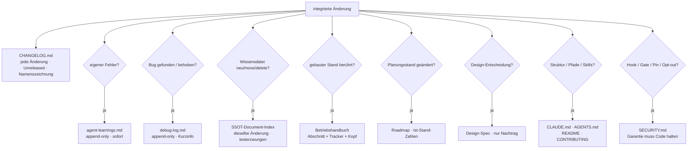

| Dokument | Art | Auslöser | Regel |
|---|---|---|---|
| `CHANGELOG.md` | Historie | **jede** integrierte Änderung | Eintrag unter `[Unreleased]`, Keep-a-Changelog, Namenszeichnung. Alteinträge nie umschreiben |
| `agent-learnings.md` | Fehlerprotokoll, append-only | **jeder einzelne eigene Fehler** | Sofort, ohne Ausnahme. Nicht sammeln, nicht beschönigen, nicht rückdatieren |
| `debug-log.md` | Debug-Log, append-only | Bug im Repo **gefunden** oder **behoben** | Kurzinfo was/wann/wie. Vor der Fehlersuche prüfen, ob das Symptom bekannt ist |
| `SSOT-Document-Index` | Master-Index | jede neue, verschobene, umbenannte oder gelöschte Wissensdatei; jede neue Kategorie | In **derselben** Änderung. Testerzwungen |
| Betriebshandbuch | Ist-Inventur | jede Änderung am **gebauten** Stand | Betroffener Abschnitt **plus** Fortschritts-Tracker; Kopfzeile `Stand:` + Kern-Version |
| Roadmap | Planung | Ist-Stand oder Reihenfolge ändert sich | Gebaute Punkte streichen, Ist-Stand-Zahlen korrigieren, Aktualisierung zeichnen |
| Design-Spec | Normativ, versioniert | Design-Entscheidung geändert | **Nur per Nachtrag**, nie in-place. Jüngster Nachtrag gewinnt |
| `CLAUDE.md` / `AGENTS.md` / `README.md` / `CONTRIBUTING.md` | abgeleitet, lebend | Struktur, Pfade, Skills, Module, Versionen, Prozesse | Gleicher Change, gleiche Pflege — nicht „später" |
| `SECURITY.md` | lebend, teamsichtbare Zusage | Hooks, Gate-Umfang, Opt-out-Envs, Satelliten-Pins, CI-Positivkontrolle, nur-manuelle Skills | Eine Garantie, die der Code nicht mehr hält, ist schlimmer als keine |

Was **nicht** ins Sync-Protokoll darf, weil es in derselben Änderung testerzwungen ist (Familienkarte §4): CHANGELOG-Eintrag und Index-Zeile neuer Wissensdateien. Ins Protokoll gehören die *abgeleiteten* Nachzüge.

---

## 7. §5 Prüf- und Abschlusszyklus

Vor **jedem** Commit-Vorschlag. Ausführender Skill: **`/oai:doku-sync`** (`plugins/oai/skills/doku-sync/SKILL.md`) — er setzt bei Erfolg den Stempel **`.git/oai/doku-sync.stamp`**. Der Zyklus ist auch ohne den Skill abzuarbeiten.

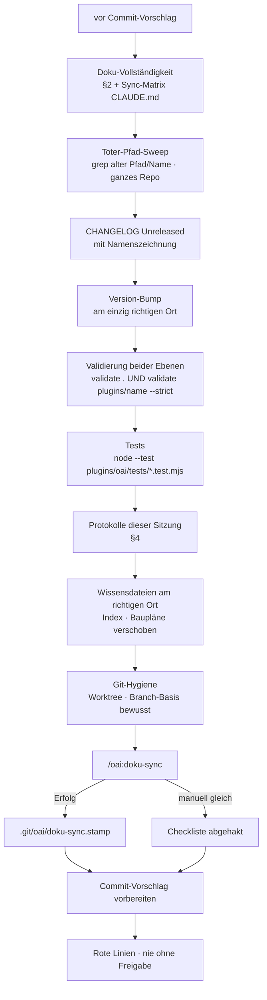

Checkliste (Quelle wortgleich im Inhalt):

- [ ] **Doku-Vollständigkeit** nach Abschnitt 2 + Sync-Matrix in `CLAUDE.md`
- [ ] **Toter-Pfad-Sweep:** `grep` nach jedem alten Pfad/Namen über das **ganze** Repo
- [ ] **`CHANGELOG.md`**-Eintrag unter `[Unreleased]` mit Namenszeichnung
- [ ] **Version-Bump** des betroffenen Plugins am einzig richtigen Ort (Kern: + `VERSION` + Registry)
- [ ] **Validierung beider Ebenen:** `claude plugin validate .` **und** `claude plugin validate plugins/<name> --strict` je berührtem Plugin — die Wurzel-Variante allein prüft **keine** Skills (genau diese Lücke ließ 19 von 22 Skills mit nicht parsender Frontmatter durch)
- [ ] **Tests:** `node --test plugins/oai/tests/*.test.mjs` — wortgleich, Glob statt Verzeichnis
- [ ] **Protokolle** dieser Sitzung geschrieben (Abschnitt 4: eigene Fehler, gefundene Bugs)
- [ ] **Wissensdateien am richtigen Ort**, `SSOT-Document-Index` nachgezogen, abgeschlossene Baupläne verschoben
- [ ] **Git-Hygiene:** bei Remote-Repos in einem eigenen Worktree gearbeitet; Branch-Basis bewusst gewählt (steht ein anderer PR kurz vor dem Merge, auf dessen Kopf aufsetzen statt auf `main`, um Kollisionen und Doppel-Bumps zu vermeiden)

### Rote Linien — nie ohne ausdrückliche Freigabe des Maintainers, nie automatisiert

Commit · Push · PR-Erstellung · Merge · Force-Push · Tag-Push/Release · destruktive Git-Operationen · alles Kundensichtbare (MR-Texte posten, Jira-Kommentare posten) · Review-Resolves/Approvals · Deploy-Klicks.

Team-Repos (z. B. `offsite`) werden nie direkt geändert. Keine Secrets/Tokens in Dateien, Logs oder Commits.

---

## 8. §6 Selbsttest

Sieben Fragen, die die typischen Auslassungen abdecken:

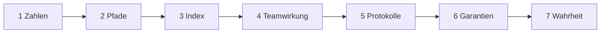

1. **Zahlen:** Habe ich irgendwo eine Zahl geändert (Skills, Module, Tests, Version)? Dann steht dieselbe Zahl auch in `CLAUDE.md`, `README.md`, Betriebshandbuch, Roadmap, `marketplace.json`-Beschreibung und ggf. `CONTRIBUTING.md`.
2. **Pfade:** Habe ich etwas verschoben oder umbenannt? Dann läuft ein `grep` nach dem alten Namen über das ganze Repo — inklusive Skills und Hooks.
3. **Index:** Ist eine Datei unter `knowledge base/` entstanden, gewandert oder verschwunden? Dann ist der `SSOT-Document-Index` in **derselben** Änderung dran (sonst rote Suite).
4. **Teamwirkung:** Soll die Änderung beim Team ankommen? Dann Bump am richtigen Ort **und** CHANGELOG — sonst passiert nichts.
5. **Protokolle:** Habe ich in dieser Sitzung einen eigenen Fehler gemacht oder einen Bug gefunden? Beides ist Pflichteintrag, nicht Ermessen.
6. **Garantien:** Berührt die Änderung einen Hook, ein Gate, einen Opt-out, einen Satelliten-Pin oder einen nur-manuellen Skill? Dann steht in `SECURITY.md` eine Zusage dazu, die mitzuziehen ist.
7. **Wahrheit:** Behaupte ich etwas („Suite grün", „Validierung bestanden"), ohne die Ausgabe gesehen zu haben? Dann erst ausführen, dann behaupten.

---

## 9. Artefakte und Fallen

### 9.1 Was gelesen, was geschrieben, was nie angefasst

| Richtung | Artefakte |
|---|---|
| **Immer lesen (§1)** | `git log`/`status`, `CHANGELOG.md`, `VERSION`, `Aktive Baupläne/`, Design-Spec, SSOT-Document-Index, ggf. Prozessdatei, `agent-learnings.md`, fremde Worktrees |
| **Schreiben je Matrix-Zeile** | siehe §2 — Registry, READMEs, Betriebshandbuch, SECURITY, Spec-Nachtrag, Index-Zeile, Bump-Orte |
| **Nie** | Marketplace-`version`-Feld setzen · Spec in-place umschreiben · Alteinträge im CHANGELOG umschreiben · Register-Zeilen löschen (Sitzungswissen) · Team-Repos (`offsite`) direkt ändern · Secrets committen · Rote-Linien-Aktionen ohne Freigabe |

### 9.2 Bekannte Fallen (aus der Quelle)

| Falle | Beleg |
|---|---|
| Marketplace-`version` wird still ignoriert | §2.3 Marketplace-Zeile |
| `validate .` allein prüft keine Skills | §5 — 19 von 22 Skills mit kaputter Frontmatter durchgerutscht |
| `node --test` mit Verzeichnis-Argument schlägt fehl | §2.1 Test-Zeile — Glob wortgleich |
| Spec-Version nicht in die vier Spiegelstellen gezogen | §2.2 Design-Entscheidung — Drift 2026-08-04 (0.14.0 vs. 0.13.0) |
| Pflicht-Einstieg nur in `CLAUDE.md` geändert | §2.2 — Hook injiziert weiter Altstand |
| Satellit ohne SHA-Umpinnen | §2.1 — Änderung erreicht das Team nicht |
| SSH-Fehler bei Install-Probe | `CLAUDE_CODE_PLUGIN_PREFER_HTTPS=1` (verifizierte Falle, §3a) |
| Doppelvergabe Spec-§ / Version | 2026-08-14: §15.33 und 0.20.0 — Anker-Reservierung |
| Tags hinter Merge hängen geblieben | 0.8.1–0.10.0 — Merge-Freigabe deckt Tag/Release mit ab |
| Kern-Plugin-`README.md` Kontroll-Schicht-Lücke | belegt im Debug-Log 2026-08-10 (Hook-Zeile) |
| Abteilungs-Hook vor Meilenstein | Suite absichtlich rot bis „Referenz-Apparat + Vorlage" |
| Opt-out-Env nicht an allen vier Orten | Hook-Kopf, `hooks.json`, `SECURITY.md`, `README.md` |

### 9.3 Kopplungen zu anderen Prozessen

Nur was die Quelle nennt bzw. was die Familienkarte als Kante aus dem Index ableitet:

| Prozess / Artefakt | Rolle |
|---|---|
| `SSOT-Document-Index` | Triage vor diesem Index |
| `abteilungs-plugin-bau.md` / `kern-plugin-bau.md` | Standardprozesse, die §1 Schritt 5 prüft |
| `anker-reservierung.md` | parallele Stränge, Anker-Details; Index §3 nennt die Register-Zeile |
| `claude-team-distribution.md` | wie der Stand die Maschinen erreicht (nach Bump/Tag/Pin) |
| `/oai:doku-sync` | führt die Abschluss-Checkliste aus, setzt Stempel |
| `struktur.test.mjs` | Index-Vollständigkeit, Versionsgleichstand, Tag-Absicherung |
| Sync-Nachzug-Zyklus | abgeleitete Nachzüge bündeln (Familienkarte) |

---

## 10. Anhang — Dateizeiger

Zurück in die Quelle und die von ihr genannten Orte.

| Zeiger | Pfad (relativ zum OS-Repo) |
|---|---|
| **Normquelle dieser Karte** | `knowledge base/plugin-maintanance-ruleset-source/Aktualisierungs-Index.md` |
| SSOT-Document-Index | `knowledge base/SSOT-Document-Index.md` |
| agent-learnings | `knowledge base/Debugging + findings/agent-learnings.md` |
| debug-log | `knowledge base/Debugging + findings/debug-log.md` |
| Betriebshandbuch | `knowledge base/project-meta-infos/Onsite.ai-OS-Betriebshandbuch.md` |
| Roadmap | `knowledge base/Aktive Baupläne/2026-07-24-roadmap.md` |
| Offene-Stränge-Register | `knowledge base/sitzungswissen/offene-straenge-register.md` |
| Anker-Reservierung (Prozess) | `knowledge base/plugin-maintanance-ruleset-source/anker-reservierung.md` |
| Anker-Definition | `knowledge base/project-meta-infos/Onsite.ai-OS-Anker-Reservierung-Definition.md` |
| Zielplan Kontroll-Schicht | `knowledge base/Aktive Baupläne/2026-07-30-zielplan-kontrollschicht.md` |
| skill-authoring | `plugins/oai/referenz/skill-authoring.md` |
| agent-authoring | `plugins/oai/referenz/agent-authoring.md` |
| pflege-auspraegung | `plugins/oai/referenz/pflege-auspraegung.md` |
| wp-rahmen | `plugins/oai/wp-rahmen.md` |
| doku-sync Skill | `plugins/oai/skills/doku-sync/SKILL.md` |
| Session-Start-Hook | `plugins/oai/hooks/oai-session-start.js` |
| hooks.json | `plugins/oai/hooks/hooks.json` |
| module-registry | `plugins/oai/module-registry.json` |
| Marketplace | `.claude-plugin/marketplace.json` |
| Kern plugin.json | `plugins/oai/.claude-plugin/plugin.json` |
| VERSION | `VERSION` (Repo-Wurzel) |
| CHANGELOG | `CHANGELOG.md` |
| CI / Release | `.github/workflows/ci.yml`, `release.yml` |
| Tests | `plugins/oai/tests/*.test.mjs` |
| doku-sync-Stempel | `.git/oai/doku-sync.stamp` |
| Vorlage Abteilungsplugin | `vorlagen/abteilungsplugin/` |
| CLAUDE-Ebenen-Definition | `Onsite.ai-OS-CLAUDE-Ebenen-Definition.md` (Pfad wie in Quelle/Definitionsdokument) |
| Familienkarte | `Desktop/Onsite.ai-OS-Prozesskarten/00-FAMILIE-UND-VERDRAHTUNG.md` |

---

*Prozesskarte · 2026-08-15 · nicht normativ · Quelle: Aktualisierungs-Index.md*
