# Abteilungs-Plugin-Bau — Prozesskarte

> **Was das ist:** Visuelle Landkarte des Standardprozesses für Anlegen, Füllen, Umbauen und Auslagern von **Abteilungsplugins** (lokal im OS-Repo oder als Satellit).
> **Quelle (normativ):** `Onsite.ai-OS/knowledge base/plugin-maintanance-ruleset-source/abteilungs-plugin-bau.md`
> **Stand der Karte:** 2026-08-15 · gegen die Quelldatei auf der Platte
> **Nicht normativ.** Bei Widerspruch gewinnt die Quelldatei.

**Schwester-Karte:** [00-FAMILIE-UND-VERDRAHTUNG.md](00-FAMILIE-UND-VERDRAHTUNG.md) — wann dieser Prozess greift und welche der zehn Dokumente ihn umgeben.

---

## 1. Zweck in einem Satz

Ein Plugin je Abteilung anlegen oder in einen Satelliten extrahieren — Marketplace, Manifest, Registry, Validierung und Dependency auf den Kern `oai` stimmen; nichts aus dem Kern-Sicherheitsnetz wird dupliziert oder abgeschwächt.

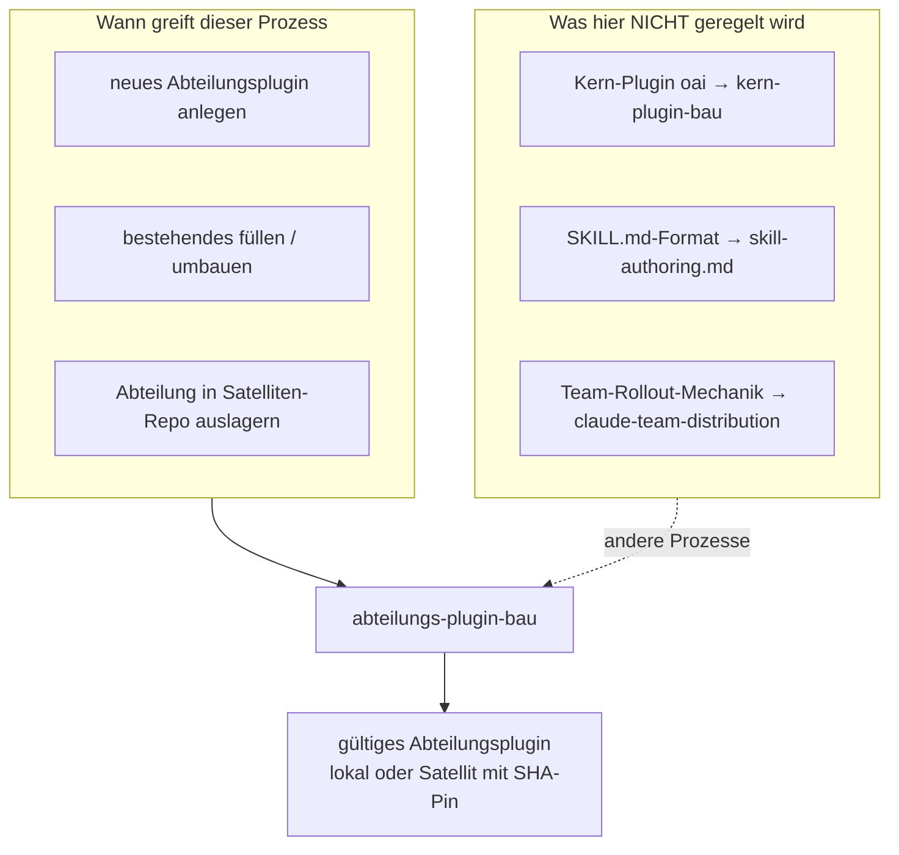

**Lesbar:** Der Prozess deckt die **Plugin- und Marketplace-Ebene** ab, nicht das SKILL-Format und nicht den Kern-Bau. Mechanik-Aussagen der Quelle sind gegen Claude-Code-Doku verifiziert (abgerufen 2026-07-26: `plugins-reference`, `plugin-marketplaces`, `plugin-dependencies`). Vor Format-Änderungen erneut abrufen — nie aus dem Gedächtnis. Bis 2026-08-09 hieß die Quelldatei `plugin-bau.md`.

---

## 2. Trigger und Nicht-Trigger

| Greift | Greift nicht |
|---|---|
| Anlegen eines Abteilungsplugins aus `vorlagen/abteilungsplugin/` | Bau/Pflege des Kern-Plugins `oai` → `kern-plugin-bau.md` |
| Füllen oder Umbauen einer Abteilung (Skills, Registry, Marketplace-Eintrag) | SKILL.md-Frontmatter und Skill-Inhalt → `skill-authoring.md` im Kern unter `plugins/oai/referenz/` |
| Extraktion in `onsite-ai-devs/Onsite.ai-OS-<Abteilung>` | Wer welche **Struktur** trägt (Sicherheitsnetz vs. Infrastruktur) wird hier erklärt, der Kern-Bau selbst nicht |
| Install-Probe, Validierung beider Ebenen, Doku-Sync + Version-Bump für die Abteilung | Auto-Update-/Client-Rollout-Details im Team → `claude-team-distribution.md` (diese Karte verweist nur die hier stehenden Fakten) |
| Vor Modernisierung: Inhalts-Prüfung → `abteilungs-inhalts-pruefung` ruft diesen Prozess für den Bau an | Subagenten in `agents/` → `subagenten-bau.md` (kann in Kern *oder* Abteilung sitzen) |

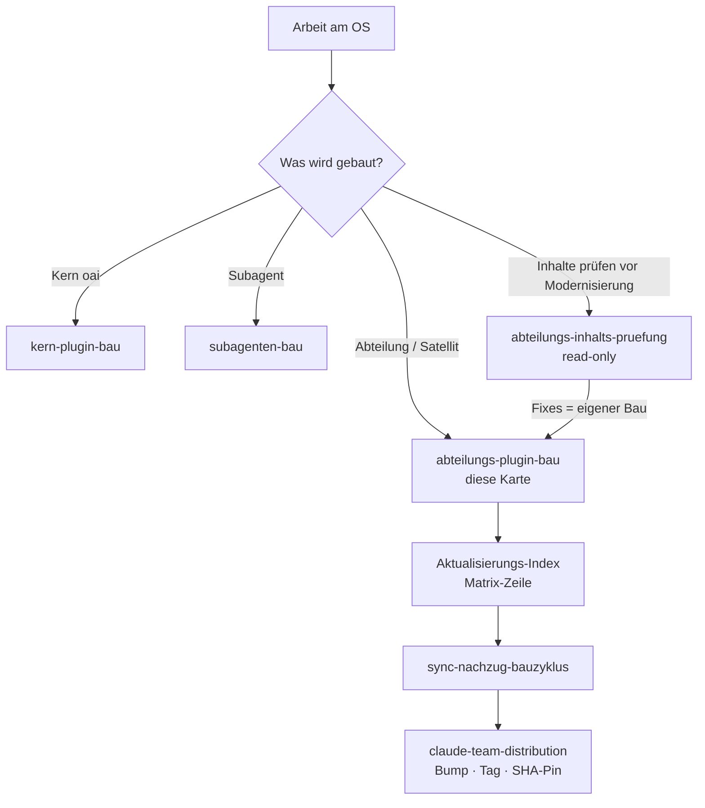

**Lesbar:** Die Familienkarte ordnet diesen Prozess unter „Bauen". Vor dem Schreiben: Anker reservieren falls parallel, danach Index-Zeile, Sync-Nachzug, bei Team-Auslieferung Distribution. Inhalts-Prüfung ist read-only und endet in einem eigenen Bauplan, der wieder hier landet.

---

## 3. Architektur — Marketplace-Wurzel, lokal, Satellit

### 3.1 Marketplace-Wurzel und zwei Plugin-Heimaten

Ein Marketplace (`onsite-ai-os`). Plugins kommen aus dem OS-Repo **plus** Satelliten-Repos (Entscheidung 2026-07-27, Spec §15.19).

```
<repo-wurzel>                        = Marketplace-Wurzel (enthält .claude-plugin/)
  .claude-plugin/marketplace.json    ein Eintrag je Plugin: source "./plugins/<name>" (lokal)
                                     oder github-Source mit sha-Pin (Satellit)
  plugins/oai/                       Kern: skills/ hooks/ tests/ wp-rahmen.md
                                     module-registry.json referenz/
  vorlagen/abteilungsplugin/         Vorlage für neue Abteilungen (kein Plugin)

onsite-ai-devs/Onsite.ai-OS-<Abteilung>   je ein PRIVATES Satelliten-Repo pro weiterer
  .claude-plugin/plugin.json              Abteilung — das Repo IST das Plugin (Manifest an
  README.md CHANGELOG.md test/            der Wurzel); Release-Tag + SHA-Pin im Marketplace
```

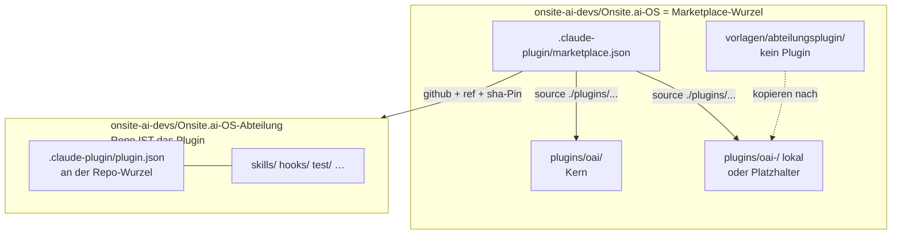

**Lesbar:** Die Marketplace-Wurzel ist das Verzeichnis mit `.claude-plugin/`. Lokale Plugins liegen unter `plugins/<name>`; Satelliten sind eigene private Repos, in denen das **Repo selbst das Plugin** ist (Manifest an der Wurzel). Die Vorlage ist **kein** Plugin — sie wird kopiert und umbenannt. Referenzen in der Quelle: `oai-marketing` → `Onsite.ai-OS-Marketing` (seit 2026-08-09 v0.3.x, Stand v0.4.1), `oai-development` → `Onsite.ai-OS-Development` (seit 2026-08-14, Start v0.11.0 — erste Extraktion mit SSOT-Umzug statt Neuanlage).

### 3.2 Harte Architektur-Regeln (nicht verletzen)

| Regel | Inhalt aus der Quelle |
|---|---|
| Ein Plugin je Abteilung | Plugin-Grenze **ist** die Abteilungsgrenze. Kein Per-Skill-Schalter (`skillOverrides` wirkt laut Doku nicht auf Plugin-Skills). Aktivierung nur je Plugin. Spec §15.16. |
| Dependency | Jedes Abteilungsplugin führt `dependencies: ["oai"]`. Install/Aktivierung zieht den Kern mit; Deaktivieren des Kerns ist blockiert, solange eine Abteilung aktiv ist. |
| Plugin-Namen | kebab-case, keine Großbuchstaben, keine Leerzeichen. |
| Namespace | **Nicht wählbar.** Er ist der Name des **Marketplace-Eintrags**. Kern: `/oai:<name>`, Abteilung: `/oai-<abteilung>:<name>`. |
| Verteilannahme | Kern + genau **ein** Abteilungsplugin je Mitarbeiter. |

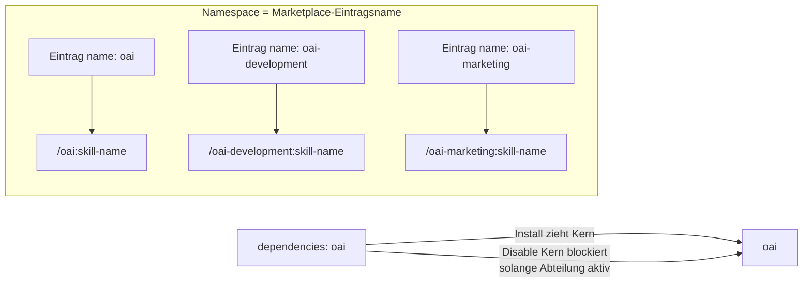

**Lesbar:** Wer den Marketplace-Eintragsnamen ändert, ändert den Namespace. Skills einer nicht installierten Abteilung bleiben unsichtbar — die Install-Probe in §3.9 der Quelle prüft genau das.

---

## 4. Scope-Tabelle — Kern vs. Abteilung

Zwei Governance-Schichten (Spec §15.22, neu gefasst 2026-08-09). Der Unterschied ist nicht *was*, sondern *für wen*.

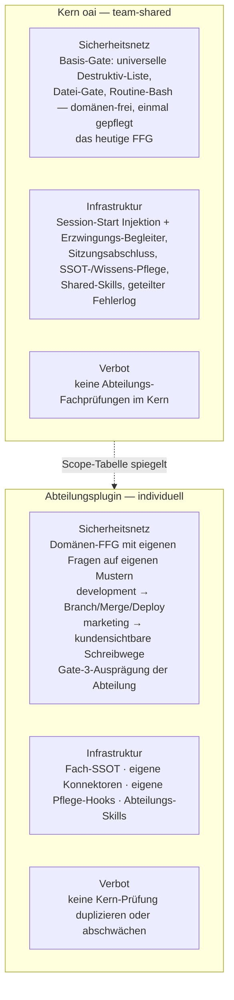

| | Kern `oai` (team-shared) | Abteilungsplugin (individuell) |
|---|---|---|
| **Sicherheitsnetz** | **Basis-Gate**: universelle Destruktiv-Liste, Datei-Gate, Routine-Bash — domänen-frei, einmal gepflegt (das heutige FFG) | **Domänen-FFG** mit eigenen Fragen auf eigenen Mustern (development → Branch-/Merge-/Deploy-Kommandos, marketing → kundensichtbare Schreibwege) · Gate-3-Ausprägung der Abteilung |
| **Infrastruktur** | Session-Start (Injektion + Erzwingungs-Begleiter), Sitzungsabschluss, SSOT-/Wissens-Pflege, Shared-Skills, geteilter Fehlerlog | Fach-SSOT · eigene Konnektoren · eigene Pflege-Hooks · Abteilungs-Skills |
| **Verbot** | keine Abteilungs-Fachprüfungen im Kern | **keine Kern-Prüfung duplizieren oder abschwächen** |

**Standalone-Abteilungen** bekommen ihre eigene FFG- und Hook-Architektur — ein Satellit kann Kern-Hookdateien ohnehin nicht erreichen.

**Lesbar:** Die Spiegelung zur `kern-plugin-bau`-Scope-Tabelle ist beabsichtigt (Familienkarte: „Scope-Tabelle spiegelt"). Wer Domänen-Logik in den Kern schiebt oder Kern-Gates in der Abteilung nachbaut, verletzt die Verbotszeile.

---

## 5. Prüfungs-Eigentum, Matcher-Eigentum, Sequenzierungs-Gate

### 5.1 Kollisionsregel (Spec §15.22)

**Prüfungs-Eigentum statt Matcher-Eigentum:** Jede Prüfung hat genau ein Heimat-Plugin. Matcher sind frei wählbar, auch `Edit` / `Write` / `MultiEdit` / `Bash` — Überlappung der Matcher ist zulässig, solange nicht **dieselbe Prüfung** doppelt existiert.

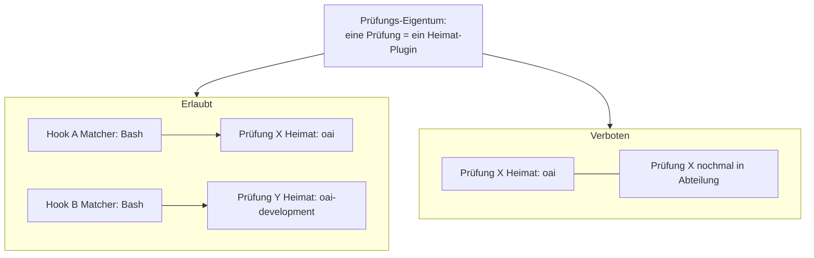

**Lesbar:** Zwei Hooks dürfen denselben Tool-Matcher haben, wenn sie **verschiedene** Prüfungen machen. Dieselbe Gate-Logik in Kern und Abteilung ist der bekannte Fehler „Kern-Prüfung im Abteilungs-Hook dupliziert".

### 5.2 Sequenzierungs-Gate

Bis zum Meilenstein **„Referenz-Apparat im Kern fertig (Gates 1–4) + Vorlage trägt den Hook-Bauweg"** bauen Abteilungen **keine** Hooks — `struktur.test.mjs` macht das rot. Den Weg ab dem Meilenstein nennt die Zeile **„Abteilungs-Hook/FFG bauen"** im `Aktualisierungs-Index`.

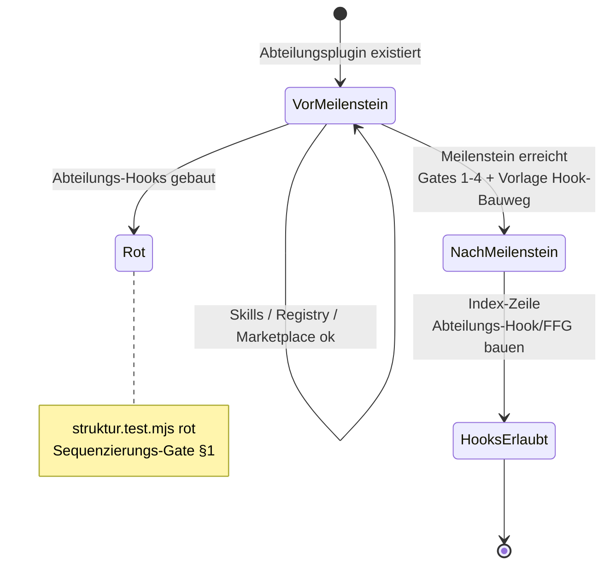

**Lesbar:** Eigene Hooks sind seit Spec §15.22 **erlaubt** (Satellit erreicht Kern-Hooks ohnehin nicht) — aber erst **nach** dem Meilenstein und unter Prüfungs-Eigentum. Die Quelle verweist den konkreten Bauweg an den Aktualisierungs-Index, nicht an diese Datei.

---

## 6. Abteilungs-CLAUDE und Sparse-Clone-Regel (Spec §15.28)

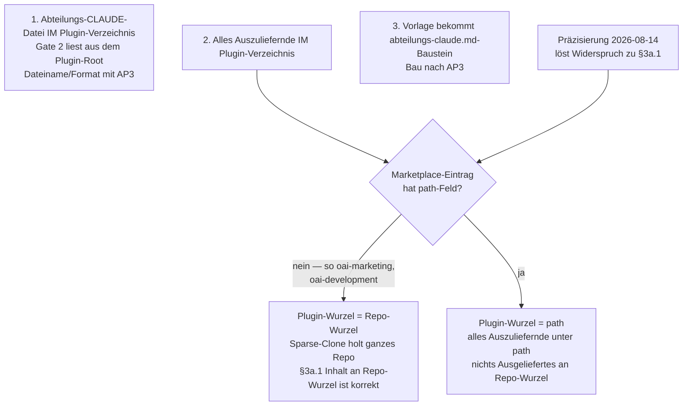

Drei Punkte aus der Quelle:

1. Jedes Abteilungsplugin führt künftig eine **Abteilungs-CLAUDE-Datei IM Plugin-Verzeichnis** (Gate 2 liest aus dem Plugin-Root; Dateiname/Format werden mit AP3 festgelegt).
2. **Verbindliche Regel:** Alles Auszuliefernde liegt IM **Plugin-Verzeichnis**. Grund: Bei ref/SHA-Pin macht Claude Code einen **sparse clone NUR des Plugin-Subverzeichnisses** (Doku `plugin-marketplaces`, verifiziert 2026-08-10) — Dateien außerhalb kommen nicht mit.
   **Präzisierung 2026-08-14:** Welches Verzeichnis das ist, entscheidet das **`path`-Feld des Marketplace-Eintrags**. Setzen unsere Satelliten es nicht (so bei `oai-marketing` und `oai-development`), dann ist **Plugin-Wurzel = Repo-Wurzel** — Sparse-Clone holt das ganze Repo, und §3a.1 („Inhalt an die Repo-Wurzel") ist korrekt. Scharf wird die Regel erst mit gesetztem `path`: dann liegt alles unterhalb dieses Pfades und **nichts** Ausgeliefertes an der Repo-Wurzel. Frühere Formulierungen „nie an der Satelliten-Repo-Wurzel" sind damit **überholt**.
3. Vorlage `vorlagen/abteilungsplugin/` bekommt einen `abteilungs-claude.md`-Baustein (Bau nach AP3). Details: `Onsite.ai-OS-CLAUDE-Ebenen-Definition.md`.

**Lesbar:** Sparse-Clone ist der Grund, warum „neben dem Plugin im Repo" für Auslieferung tot ist — sobald `path` gesetzt wird. Ohne `path` (aktueller Satelliten-Stand in der Quelle) ist die Repo-Wurzel die Plugin-Wurzel.

---

## 7. §2 Harte Mechanik-Fakten — Fallen-Diagramm

Sieben Fakten; sie sind die häufigsten Fehlerquellen. Nur was in der Quelle steht.

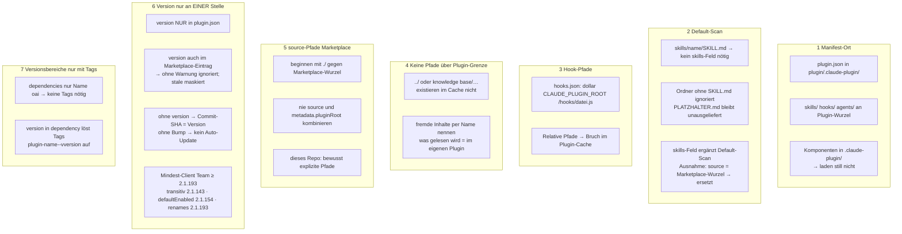

### 7.1 Kurz-Tabelle zu denselben Fakten

| # | Fakt | Falle |
|---|---|---|
| 1 | `plugin.json` in `<plugin>/.claude-plugin/`; Komponenten an der **Plugin-Wurzel** | Falsch platzierte Komponenten laden still nicht |
| 2 | Default-Scan: `skills/<name>/SKILL.md` braucht kein `skills`-Feld | `PLATZHALTER.md`-Ordner ohne `SKILL.md` bleiben unausgeliefert (gewollt) |
| 3 | Hook-Pfade: `"${CLAUDE_PLUGIN_ROOT}/hooks/<datei>.js"` | Relative Pfade brechen im Plugin-Cache |
| 4 | Install → `~/.claude/plugins/cache`; keine `../`, keine Repo-Pfade | Skill liest `knowledge base/…` → nach Install tot; per **Name** verweisen oder Datei ins Plugin |
| 5 | `source` mit `./` gegen Marketplace-Wurzel (nicht gegen `.claude-plugin/`) | Nie `source` und `metadata.pluginRoot` kombinieren |
| 6 | **Version nur in `plugin.json`** | Marketplace-`version` wird **ohne Warnung** ignoriert; stale Manifest maskiert. Auflösung: `plugin.json` → Marketplace-Eintrag → Commit-SHA. Team-Client **≥ 2.1.193** |
| 7 | `dependencies: ["oai"]` als bloßer Name → **keine** Tags nötig | `version` in dependency → Tags `{plugin-name}--v{version}` via `claude plugin tag --push` |

**Lesbar:** Fakt 6 ist die klassische YAML-/Manifest-Falle der Distribution: wer `version` doppelt setzt, sieht im Team oft „kein Update", weil Claude Code still die `plugin.json`-Version nimmt. Fakt 4 ist die ausgelieferte-md-Falle: `../` und Repo-Pfade existieren im Cache nicht.

---

## 8. §3 Ablauf — neues Abteilungsplugin (nummerierte Sequenz)

Schritte 1–11 wie in der Quelle. Kein Commit/Push ohne Maintainer-Freigabe.

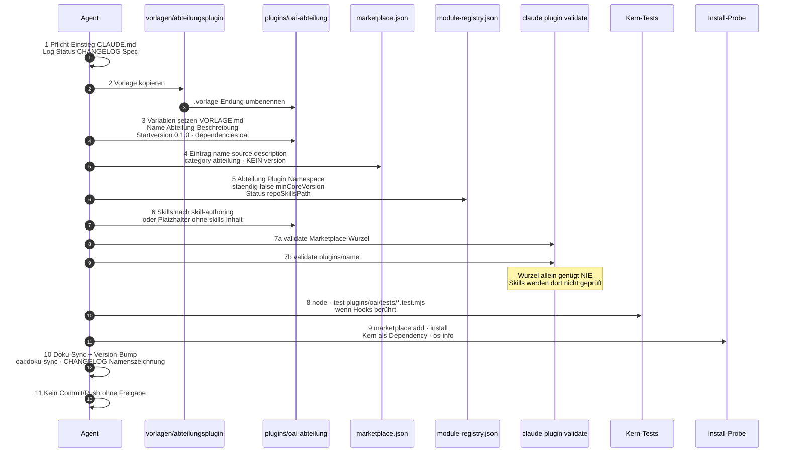

### 8.1 Schritte im Klartext

1. **Pflicht-Einstieg** laut `CLAUDE.md` (Log, Status, CHANGELOG, jüngste Spec).
2. **Vorlage kopieren:** `vorlagen/abteilungsplugin/` → `plugins/oai-<abteilung>/`. Dateien mit `.vorlage`-Endung beim Kopieren umbenennen.
3. **Variablen setzen** (Tabelle in `vorlagen/abteilungsplugin/VORLAGE.md`): Plugin-Name, Abteilung, Beschreibung, Startversion `0.1.0`, `dependencies: ["oai"]`.
4. **Marketplace-Eintrag** in `.claude-plugin/marketplace.json`: `name`, `source` `./plugins/oai-<abteilung>`, `description`, `category: "abteilung"` — **kein `version`** (Mechanik-Fakt 6).
5. **Registry-Metadaten** in `plugins/oai/module-registry.json`: Abteilung, Plugin, Namespace, `staendig: false`, `minCoreVersion`, Status, `repoSkillsPath`.
6. **Skills** nach `skill-authoring.md` — oder bewusst keine: Platzhalter-Plugin ohne `skills/`-Inhalt ist gültig und reserviert Abteilungsgrenze und Namespace.
7. **Validieren, beide Ebenen:**
   ```
   claude plugin validate .                       # nur Marketplace-Manifest
   claude plugin validate plugins/<name>           # Manifest UND Skills
   ```
   Die Wurzel-Variante allein genügt nie. Genau diese Lücke ließ 19 von 22 Skills mit nicht parsender Frontmatter unentdeckt (2026-07-26).
8. **Testsuite** des Kerns, wenn Hooks berührt: `node --test plugins/oai/tests/*.test.mjs` (Verzeichnisargumente funktionieren nicht — Node erwartet Dateien bzw. Glob-Muster).
9. **Install-Probe** lokal (Beleg dokumentieren):
   ```
   /plugin marketplace add <pfad-zum-repo>
   /plugin install oai-<abteilung>@onsite-ai-os
   ```
   Erwartung: Kern `oai` mitinstalliert, `/oai:os-info` listet beide, kein Skill einer **nicht** installierten Abteilung sichtbar.
10. **Doku-Sync + Version-Bump** nach Sync-Matrix in `CLAUDE.md` (Skill `/oai:doku-sync`), CHANGELOG mit Namenszeichnung.
11. **Kein Commit/Push ohne Freigabe des Maintainers.**

### 8.2 Artefakte bei Neuanlage

| Aktion | Gelesen | Geschrieben | Nie anfassen ohne Auftrag |
|---|---|---|---|
| Vorlage | `vorlagen/abteilungsplugin/`, `VORLAGE.md` | `plugins/oai-<abteilung>/` | Kern-Hooks vor Sequenzierungs-Meilenstein |
| Marketplace | bestehende Einträge | neuer Eintrag **ohne** `version` | fremde Plugin-Einträge umbiegen |
| Registry | `module-registry.json` | Abteilungszeile | Kern-Invarianten weichspülen |
| Skills | `skill-authoring.md` | `skills/<name>/SKILL.md` oder leer | Repo-Pfade als Leseanweisung |
| Validierung / Tests | — | Ergebnis dokumentieren | `validate .` allein als grün werten |
| Release | CHANGELOG, Sync-Matrix | Bump + Doku-Sync | Commit/Push ohne Maintainer |

---

## 9. §3a Satelliten-Extraktion — eigener Flow

Gilt seit Entscheidung 2026-07-27 (Spec §15.19) für **jede** Abteilung. Die frühere Ausnahme für `development` („Kernheimat") ist mit **Spec §15.33** (2026-08-14) aufgehoben; im OS-Repo verbleiben nur noch Kern und Marketplace-Katalog.

> **Rückfluss offen (so in der Quelle):** Die gehärteten Schritte der dev-Durchführung (SSOT-Umzug mit Queue-Normierung · Doku-Sweep + Test-Anpassung · Pin-Regel `git rev-parse v<tag>^{commit}` samt `git ls-remote`-Verifikation · Startversions-Regel „Zählung fortsetzen, nie zurücksetzen" · Registry-Feld-Checkliste für alle pfadtragenden Felder · Satelliten-Testsuite-Mindestumfang Frontmatter-Parsbarkeit) sind in diesen Abschnitt **einzuarbeiten, bevor** `controlling` extrahiert wird (Bauplan 2026-08-13 §4). Bis dahin gilt der **Bauplan als gehärtete Fassung**. Die Karte glättet das nicht.

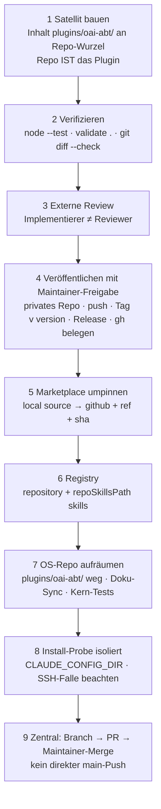

### 9.1 Schritte im Klartext

1. **Satellit bauen:** Inhalt von `plugins/oai-<abteilung>/` an die **Repo-Wurzel** des neuen Repos (Repo IST das Plugin): `.claude-plugin/plugin.json`, `README.md`, `CHANGELOG.md`, `test/` mit Manifest-/Struktur-Tests (`node --test`), `.github/workflows/quality.yml` mit SHA-gepinnten Actions, `.gitignore`. Eigene Hooks seit Spec §15.22 **erlaubt** — nach Prüfungs-Eigentum und erst nach Sequenzierungs-Meilenstein (§1); `dependencies: ["oai"]` unverändert; Version nur in `plugin.json`.
2. **Verifizieren:** `node --test`, `claude plugin validate .`, `git diff --check`.
3. **Externe Review** vor dem ersten Push (Implementierer ≠ Reviewer).
4. **Veröffentlichen (nur mit Maintainer-Freigabe):** privates Repo `onsite-ai-devs/Onsite.ai-OS-<Abteilung>` anlegen, pushen, annotierten Tag `v<version>` pushen, GitHub Release erzeugen; Sichtbarkeit/Org/Tag/Release per `gh` belegen.
5. **Marketplace umpinnen:** von `"./plugins/oai-<abteilung>"` auf
   ```
   {"source":"github","repo":"onsite-ai-devs/Onsite.ai-OS-<Abteilung>","ref":"v<version>","sha":"<40-stelliger Commit-SHA>"}
   ```
   Der `sha` ist der effektive Pin, `ref` dient der Lesbarkeit (Doku plugin-marketplaces).
6. **Registry:** `repository: "onsite-ai-devs/Onsite.ai-OS-<Abteilung>"` ergänzen, `repoSkillsPath` auf `skills` (relativ zur Satelliten-Wurzel).
7. **OS-Repo aufräumen:** `plugins/oai-<abteilung>/` entfernen (Satellit = einzige Quelle), Doku-Sync (CLAUDE.md, README.md, CHANGELOG.md, Spec-Nachtrag), dann `node --test plugins/oai/tests/*.test.mjs` — Invarianten prüfen SHA-Pin und Registry↔Pin-Konsistenz.
8. **Install-Probe** in isoliertem `CLAUDE_CONFIG_DIR` (wie §3.9): Kern kommt transitiv, nicht installierte Abteilungen unsichtbar.
   **SSH-Falle (verifiziert 2026-07-27):** GitHub-Shorthand-Sources klonen default per SSH — ohne geladenen Key: `Permission denied (publickey)`. Abhilfe: `CLAUDE_CODE_PLUGIN_PREFER_HTTPS=1` oder SSH-Key einrichten. Für Team-Rollout dokumentieren.
9. Zentral: eigener Branch → PR → Maintainer-Merge (kein direkter main-Push).

### 9.2 Pin und Startversion (gehärtet in der dev-Durchführung / Bauplan)

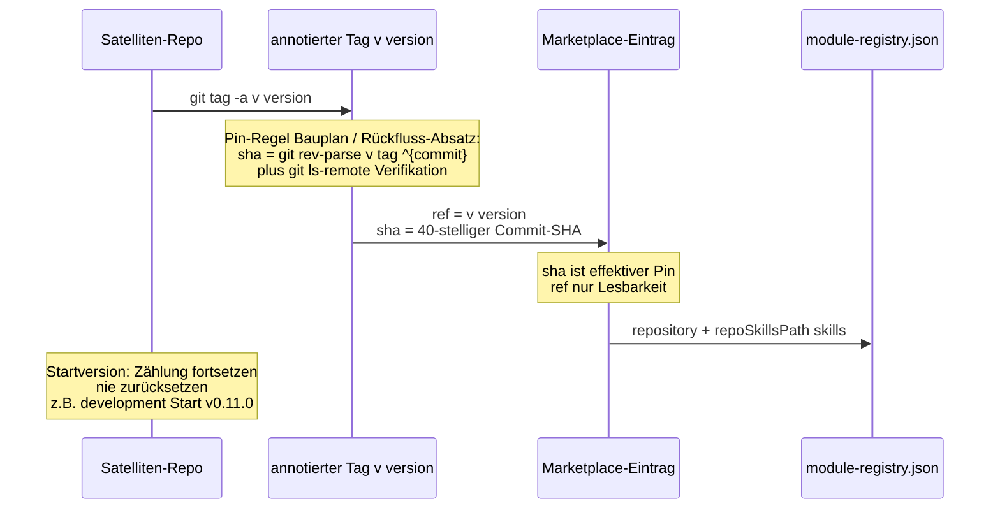

| Regel | Quelle |
|---|---|
| Pin = Commit-SHA | Marketplace-Feld `sha` (40-stellig); ermittelt/verifiziert laut Rückfluss-Absatz via `git rev-parse v<tag>^{commit}` und `git ls-remote` |
| `ref` | Lesbarkeit (`v<version>`), nicht der effektive Pin |
| Startversion | Zählung fortsetzen, nie zurücksetzen (Beispiel Quelle: `oai-development` Start v0.11.0) |
| SSOT-Umzug | dev war erste Extraktion mit SSOT-Umzug statt Neuanlage; Härtung vor controlling-Extraktion noch in den Abschnitt einzuarbeiten |

**Lesbar:** Ohne vollen SHA pinnt der Marketplace nicht zuverlässig den Stand, den das Team braucht. Version im Satelliten läuft in `plugin.json` weiter — nicht auf `0.1.0` zurücksetzen, wenn die Abteilung intern schon höher war.

---

## 10. §4 Bekannte Fehler — eigene Grafik

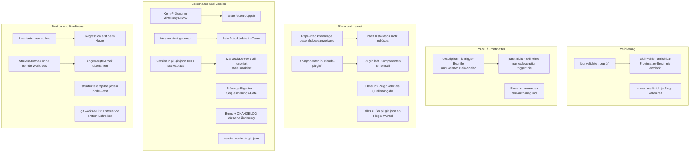

| Fehler | Folge | Vermeidung |
|---|---|---|
| Nur `claude plugin validate .` geprüft | Skill-Fehler unsichtbar, Frontmatter-Bruch fällt nie auf | immer zusätzlich je Plugin validieren |
| `description` mit `Trigger-Begriffe: …` als unquotierter Plain-Scalar | Frontmatter parst nicht, Skill lädt ohne `name`/`description` und triggert nie | `>-`-Block (`skill-authoring.md`) |
| Repo-Pfad (`knowledge base/…`) als Leseanweisung im Skill | Nach Installation nicht auflösbar | Datei ins Plugin legen oder als Quellenangabe kennzeichnen |
| Komponenten in `.claude-plugin/` gelegt | Plugin lädt, Komponenten fehlen still | alles außer `plugin.json` ins Plugin-Wurzelverzeichnis |
| Kern-Prüfung im Abteilungs-Hook dupliziert | dasselbe Gate feuert doppelt | Prüfungs-Eigentum (§15.22); Abteilungs-Hooks erst nach Meilenstein |
| Version nicht gebumpt | kein Auto-Update im Team | Bump + CHANGELOG als Teil derselben Änderung |
| Version in `plugin.json` **und** Marketplace-Eintrag | Marketplace-Wert ohne Warnung ignoriert; stale maskiert | `version` **nur** in `plugin.json` |
| Struktur-Invarianten nur ad hoc | Regression fällt erst beim Nutzer auf | `plugins/oai/tests/struktur.test.mjs` bei jedem `node --test` (Manifeste, Namespaces, Frontmatter, Sequenzierungs-Gate, Plugin-Grenze) |
| Struktur-Umbau ohne Blick in fremde Worktrees | ungemergte Arbeit wird überfahren | `git worktree list` und in jedem Baum `git status` **vor** dem ersten Schreiben |

**Lesbar:** Die neun Zeilen sind die Checkliste vor Merge. Drei Cluster: Validierung/YAML, Pfade/Layout, Governance/Version/Tests. Die Frontmatter-Falle und die Doppel-`version`-Falle sind historisch belegt (19/22 Skills 2026-07-26; Doku-Warnung zu doppelter Version).

---

## 11. Kopplungen zu anderen Prozessen

Nur Kanten, die die Quelle oder die Familienkarte aus den Quellen ableitet.

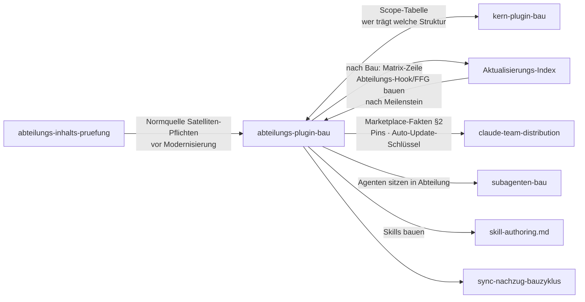

| Prozess / Artefakt | Art der Kopplung | Was die Quelle sagt |
|---|---|---|
| `kern-plugin-bau.md` | Schwester | Scope-Tabelle §1 (Sicherheitsnetz / Infrastruktur / Verbot); Kern-Bau ist getrennt |
| `Aktualisierungs-Index` | Sequenz + Nachzug | Zeile „Abteilungs-Hook/FFG bauen" nach Meilenstein; Doku-Sync/Version nach Matrix |
| `claude-team-distribution` | Auslieferung | Marketplace-Fakten, SHA-Pin, Auto-Update hängen an `version` nur in `plugin.json` und am Satelliten-Pin |
| `skill-authoring.md` | Skill-Ebene | Format der SKILL.md; hier nur Plugin-/Marketplace-Ebene |
| `struktur.test.mjs` | Enforcement | Sequenzierungs-Gate, Manifeste, Namespaces, Frontmatter, Plugin-Grenze |
| `module-registry.json` | Metadaten | Abteilungszeile bei Neuanlage und Extraktion |
| `vorlagen/abteilungsplugin/` | Startpunkt Neuanlage | Kopie nach `plugins/oai-<abteilung>/` |
| `abteilungs-inhalts-pruefung` | Vorstufe | Familienkarte: vor Modernisierung/Rollout; Fixes laufen als Bau hier |
| Spec §15.16 / §15.19 / §15.22 / §15.28 / §15.33 | Normen | Ein-Plugin-Grenze, Satelliten, Prüfungs-Eigentum, Sparse-Clone, development-Extraktion |

---

## 12. Verifikation und Abschluss

### 12.1 Neues lokales Abteilungsplugin

| Check | Befehl / Erwartung |
|---|---|
| Marketplace-Manifest | `claude plugin validate .` |
| Plugin + Skills | `claude plugin validate plugins/<name>` |
| Kern-Tests bei Hook-Berührung | `node --test plugins/oai/tests/*.test.mjs` |
| Install-Probe | `/plugin marketplace add …` · `/plugin install oai-<abteilung>@onsite-ai-os` |
| Dependency | Kern `oai` mitinstalliert |
| Sichtbarkeit | `/oai:os-info` listet beide; fremde Abteilungs-Skills unsichtbar |
| Version | nur in `plugin.json`, gebumpt, CHANGELOG mit Namenszeichnung |
| Freigabe | kein Commit/Push ohne Maintainer |

### 12.2 Satelliten-Extraktion

| Check | Erwartung |
|---|---|
| Satelliten-Tests | `node --test`, `claude plugin validate .`, `git diff --check` |
| Review | Implementierer ≠ Reviewer vor erstem Push |
| Veröffentlichung | privates Org-Repo, Tag `v<version>`, Release, `gh`-Beleg |
| Pin | 40-stelliger `sha`, `ref` lesbar; Pin-Regel inkl. `git rev-parse v<tag>^{commit}` / `git ls-remote` laut Rückfluss/Bauplan |
| Registry | `repository` + `repoSkillsPath: skills` |
| OS-Repo | lokaler `plugins/oai-<abteilung>/` entfernt; Kern-Tests grün (SHA-Pin, Registry↔Pin) |
| Install-Probe | isoliertes `CLAUDE_CONFIG_DIR`; SSH-Falle / `CLAUDE_CODE_PLUGIN_PREFER_HTTPS=1` |
| Merge-Pfad | Branch → PR → Maintainer-Merge |

### 12.3 Sequenzierungs- und Eigentums-Checks

| Check | Erwartung |
|---|---|
| Abteilungs-Hooks vor Meilenstein | `struktur.test.mjs` rot — nicht bauen |
| Prüfungs-Eigentum | keine Kern-Prüfung in Abteilungs-Hooks |
| Sparse-Clone / path | ohne `path`: Auslieferung an Repo-Wurzel ok; mit `path`: alles unter path |

---

## 13. Anhang — Dateizeiger zurück in die Quelle

| Thema | Stelle in `abteilungs-plugin-bau.md` |
|---|---|
| Verbindlichkeit, Abgrenzung Kern, skill-authoring, Doku-Abruf 2026-07-26 | Kopf / Einleitung |
| Marketplace-Wurzel, lokal, Satellit, Vorlage | §1 Architektur (Baum) |
| Ein Plugin je Abteilung, dependencies, Scope-Tabelle | §1 |
| Prüfungs-Eigentum, Sequenzierungs-Gate, Namespace, kebab-case | §1 |
| Abteilungs-CLAUDE, Sparse-Clone, Präzisierung 2026-08-14 | §1 Unterabschnitt Spec §15.28 |
| Manifest-Ort, Default-Scan, Hook-Pfade, Plugin-Grenze, source, version, Tags | §2 Fakten 1–7 |
| Ablauf neues Plugin Schritte 1–11 | §3 |
| Satelliten-Extraktion, Rückfluss offen, Schritte 1–9, SSH-Falle | §3a |
| Bekannte Fehler 9 Zeilen | §4 |
| Spec-Verweise §15.16, §15.19, §15.22, §15.28, §15.33 | verstreut in §1 und §3a |

**Verwandte normative / Schwester-Dateien (nur soweit genannt):**

- `knowledge base/plugin-maintanance-ruleset-source/kern-plugin-bau.md`
- `knowledge base/plugin-maintanance-ruleset-source/Aktualisierungs-Index.md` (Zeile „Abteilungs-Hook/FFG bauen")
- `knowledge base/plugin-maintanance-ruleset-source/claude-team-distribution.md` (Distribution; Marketplace-Fakten hier wiederholt)
- `plugins/oai/referenz/skill-authoring.md`
- `plugins/oai/module-registry.json`, `plugins/oai/tests/struktur.test.mjs`
- `vorlagen/abteilungsplugin/`, `vorlagen/abteilungsplugin/VORLAGE.md`
- `Onsite.ai-OS-CLAUDE-Ebenen-Definition.md` (Ebenen-Details Abteilungs-CLAUDE)
- Bauplan 2026-08-13 §4 (gehärtete Extraktionsfassung bis Rückfluss in §3a)

**Ist-Stand Produkt (nicht normativ für den Prozess, Kontext Featurekarte 2026-08-15):** Kern `oai` 0.21.0 · Satellit `oai-development` 0.11.0 · Satellit `oai-marketing` 0.4.1 (Marketplace-Pin) · `oai-controlling` 0.1.0 Platzhalter im Kern-Repo. Versionszahlen im Prozess selbst kommen aus der Quelldatei bzw. dem Rückfluss-Absatz; die Featurekarte verdichtet den Plattenstand.

---

*Prozesskarte 02 · abteilungs-plugin-bau · 2026-08-15 · nicht normativ.*
