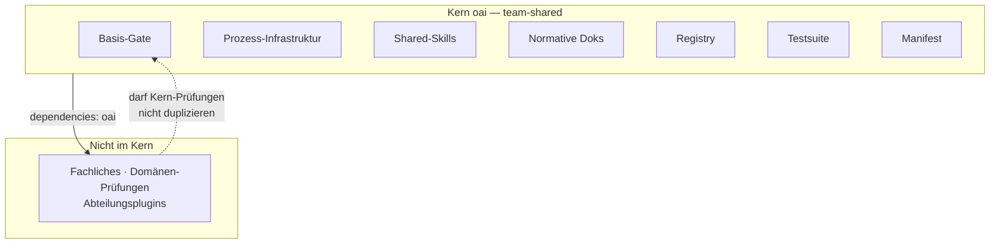
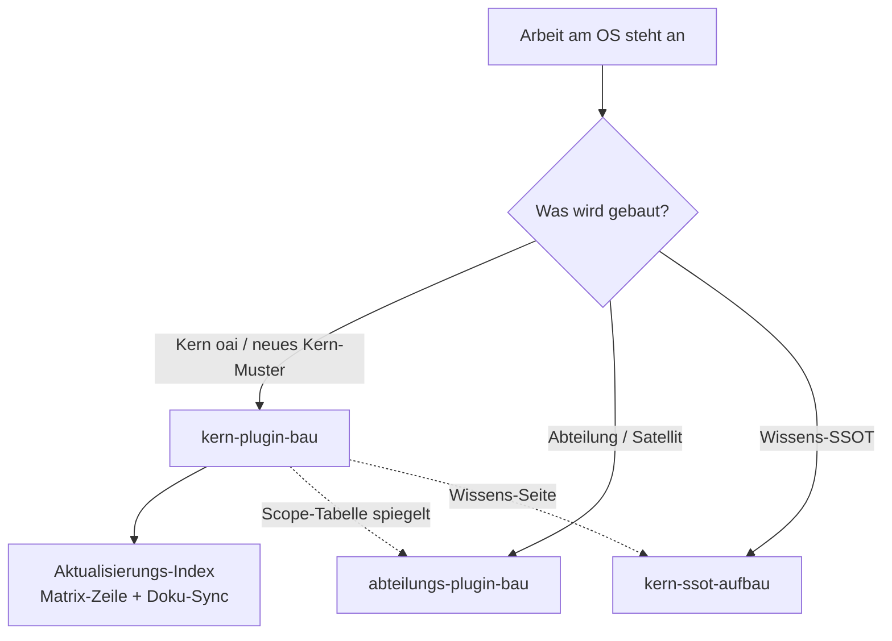
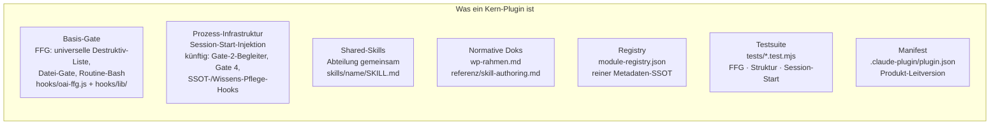
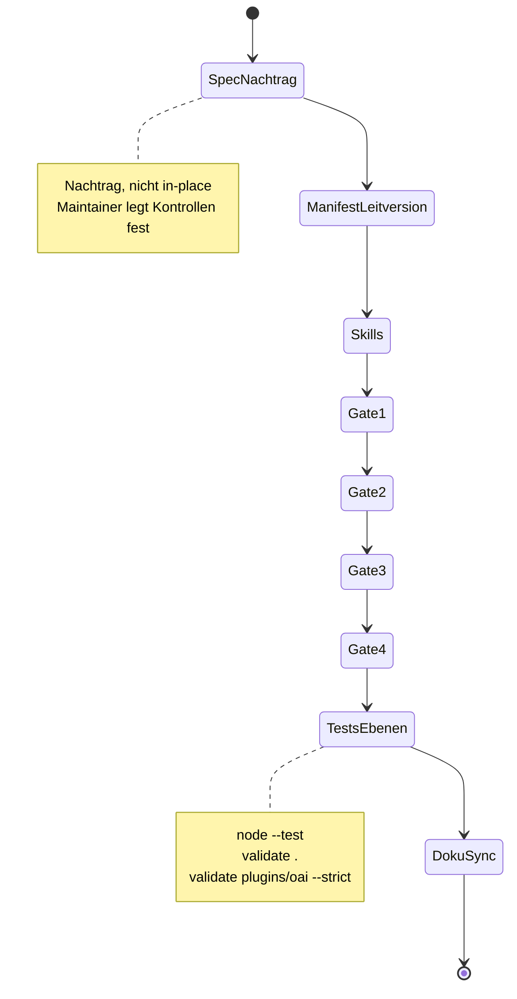
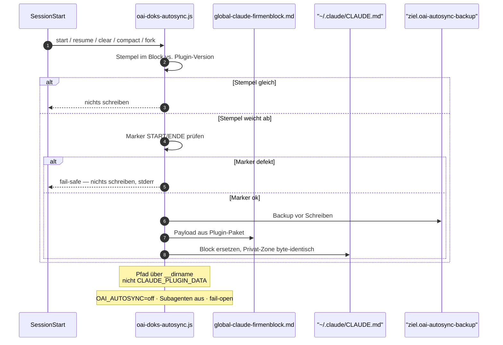
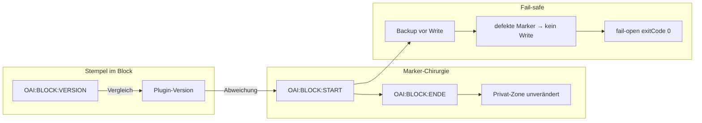
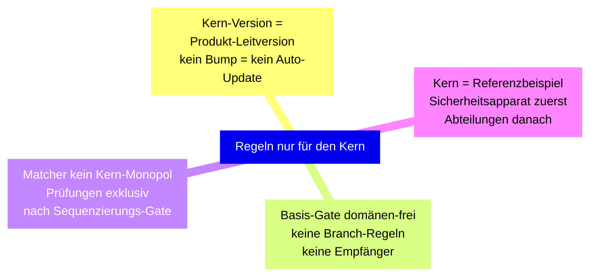
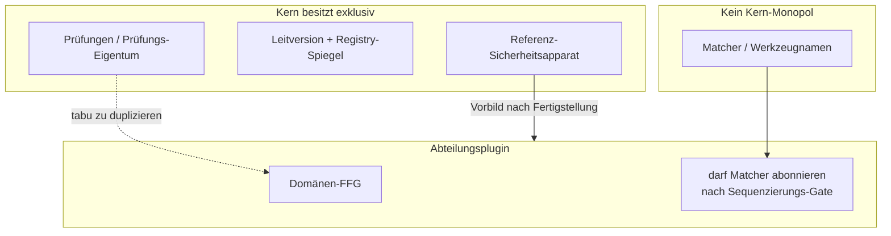
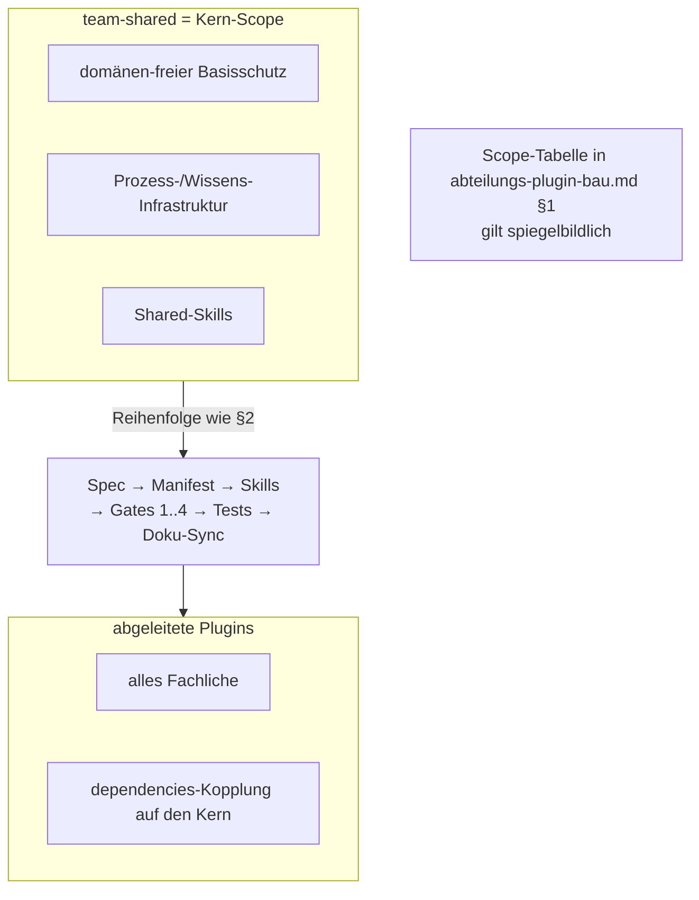
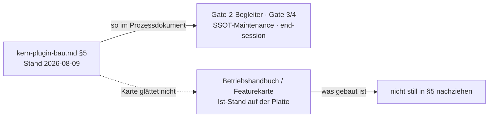

# Kern-Plugin-Bau — Prozesskarte

> **Was das ist:** Visuelle Landkarte des Standardprozesses für jede Arbeit am Kern-Plugin `oai` und für den Bau eines neuen Kern-Plugins nach diesem Muster (auch mit abweichendem Scope).
> **Quelle (normativ):** `Onsite.ai-OS/knowledge base/plugin-maintanance-ruleset-source/kern-plugin-bau.md`
> **Stand der Karte:** 2026-08-15 · gegen die Quelldatei auf der Platte
> **Nicht normativ.** Bei Widerspruch gewinnt die Quelldatei.

---

## 1. Zweck in einem Satz

Der Kern ist die **team-shared Governance-Schicht**: alles, was für **alle** Abteilungen gleich ist — und **nur** das; Fachliches gehört in Abteilungsplugins.



Der Kern ist Fundament jeder Installation und technisch nicht abwählbar: jedes Abteilungsplugin führt `dependencies: ["oai"]`. Den Bau von Abteilungsplugins regelt `abteilungs-plugin-bau.md`; die Wissens-Seite regelt `kern-ssot-aufbau.md`. Die Familienkarte liegt unter [00-FAMILIE-UND-VERDRAHTUNG.md](00-FAMILIE-UND-VERDRAHTUNG.md).

---

## 2. Wann der Prozess greift

| Trigger | Nicht-Trigger |
|---|---|
| Arbeit am Kern-Plugin `oai` | Reiner Fach-Inhalt in einem Abteilungsplugin → `abteilungs-plugin-bau` |
| Bau eines neuen Kern-Plugins nach diesem Muster (auch abweichender Scope) | Reine Wissens-SSOT ohne Plugin-Struktur → `kern-ssot-aufbau` |
| Erweiterung der Kontroll-Schicht (Gates), Shared-Skills, Registry, Manifest, Kern-Tests | Instruktions-Ebenen / Payload-Inhalt allein → `claude-netz-bau` (Autosync-Mechanik selbst gehört hierher, §2a) |
| Doks-Autosync / Payload-Sync am SessionStart | Marketplace-Rollout ans Team → `claude-team-distribution` |



Greift der Kern-Prozess, folgt danach wie in der Familie: Matrix-Zeile im `Aktualisierungs-Index`, abgeleitete Nachzüge über den Sync-Nachzug-Zyklus, Auslieferung nur mit Freigabe über `claude-team-distribution`.

---

## 3. Scope — was ein Kern-Plugin trägt

Die Quelle §1 listet sieben Bestandteile. Domänen-frei halten gilt besonders für das Basis-Gate: keine Abteilungs-Fachprüfungen; jede Kern-Prüfung ist für Abteilungen tabu zu duplizieren (**Prüfungs-Eigentum**).



| Bestandteil | Im Kern `oai` konkret | Regel |
|---|---|---|
| **Basis-Gate** | FFG: universelle Destruktiv-Liste, Datei-Gate, Routine-Bash (`hooks/oai-ffg.js` + `hooks/lib/`) | **domänen-frei** — keine Abteilungs-Fachprüfungen; Prüfungs-Eigentum |
| **Prozess-Infrastruktur** | Session-Start-Injektion (`hooks/oai-session-start.js`); künftig Gate-2-Erzwingungs-Begleiter, Sitzungsabschluss (Gate 4), SSOT-/Wissens-Pflege-Hooks | Hooks fail-open bei internen Fehlern, Opt-out-Env je Gate, **keine Marker-Dateien** (§15.20) |
| **Shared-Skills** | ständige Abteilung `gemeinsam` (`skills/<name>/SKILL.md`) | Format strikt nach `referenz/skill-authoring.md`; Platzhalter ohne `SKILL.md` bleiben unausgeliefert |
| **Normative Doks** | `wp-rahmen.md` (WP0–WP8), `referenz/skill-authoring.md` | liegen im Kern, weil sie ausgeliefert werden (§15.18) — installierte Plugins sehen keine Repo-Pfade |
| **Registry** | `module-registry.json` — Abteilung → Plugin → Module → Skills | steuert nichts aus; spiegelt die Kern-Version (Leitversion) |
| **Testsuite** | `tests/*.test.mjs` — FFG, Struktur-Invarianten, Session-Start | jeder Hook: Tests inkl. Negativ-/Fehlalarm-Probe; Struktur-Invarianten = Policy-Tests des Marketplace |
| **Manifest** | `.claude-plugin/plugin.json` | Kern-Version = **Produkt-Leitversion**, gespiegelt in `VERSION` + Registry (testerzwungen); Beschreibungstext nennt die gebauten Hooks |

Prozess-Infrastruktur: fail-open, Opt-out je Gate, keine Marker-Dateien. Registry ist Spiegel, kein Controller. Manifest-Version ist die Leitversion des Produkts.

---

## 4. Bauablauf (§2)

Destilliert aus dem realen Bau 0.1.0 → 0.10.0. Reihenfolge verbindlich: Spec-Nachtrag zuerst, dann Manifest, Skills, Kontroll-Schicht Gates 1→2→3→4, Tests beider Ebenen, Doku-Sync.

```mermaid
sequenceDiagram
    autonumber
    participant Spec as Spec-Nachtrag
    participant Man as Manifest + Leitversion
    participant Sk as Skills
    participant G as Kontroll-Schicht
    participant T as Tests beider Ebenen
    participant D as Doku-Sync

    Note over Spec: nie in-place; jüngster Nachtrag gewinnt
    Spec->>Man: Design-Entscheidung freigegeben
    Man->>Sk: plugin.json + VERSION + Registry
    Sk->>G: skill-authoring.md eingehalten
    G->>G: Gate 1
    G->>G: Gate 2
    G->>G: Gate 3
    G->>G: Gate 4
    G->>T: Hooks auf Gerüst gebaut
    T->>D: node --test · validate · validate --strict
    Note over D: Aktualisierungs-Index + CHANGELOG mit Namenszeichnung
```

### Schritte nummeriert wie in der Quelle

1. **Spec zuerst:** Jede Design-Entscheidung entsteht als **Spec-Nachtrag** (nie in-place), bevor gebaut wird; der jüngste Nachtrag gewinnt. Kontrollmechanismen (Regeln, Schwellen, Verbote) sind Teil der Entscheidung und werden dem Maintainer vorgelegt — nicht als Ausgestaltung miterfunden (Fehlerprotokoll 2026-08-09).
2. **Manifest + Leitversion:** Version **nur** in `plugin.json`; beim Kern zusätzlich `VERSION` und Registry spiegeln. Bump-Schema und Release-Weg: `Aktualisierungs-Index` §3.
3. **Skills** nach `skill-authoring.md` (YAML-Falle, dritte-Person-Trigger, Länge); eine Datei je Skill, Detailwissen als Referenzdatei daneben. Keine Repo-Pfade in ausgelieferten Dateien (Plugin-Grenze, testerzwungen).
4. **Kontroll-Schicht** auf einem gemeinsamen Gerüst, in der Reihenfolge des Zielplans (Gates 1 → 2 → 3 → 4): quote-aware Bash-Analyse wiederverwenden (`hooks/lib/bash-analyse.js`), `process.exitCode` statt `process.exit()` (Truncation-Falle, Debug-Log 2026-08-04), Hook-Pfade über `${CLAUDE_PLUGIN_ROOT}`.
5. **Tests + Validierung beider Ebenen** vor jedem Commit-Vorschlag: `node --test plugins/oai/tests/*.test.mjs` · `claude plugin validate .` **und** `claude plugin validate plugins/oai --strict` (die Wurzel-Variante allein prüft keine Skills).
6. **Doku-Sync** nach `Aktualisierungs-Index` (Änderungs-Matrix + Selbsttest) und Sync-Matrix in `CLAUDE.md`; CHANGELOG-Eintrag mit Namenszeichnung ist Pflicht für jede Änderung.



Gates laufen sequentiell auf dem gemeinsamen Gerüst; Tests decken Hook-Logik und Marketplace-Struktur ab. Doku-Sync schließt den Bau ab, ist aber kein Ersatz für den späteren Sync-Nachzug-Zyklus bei abgeleiteten Artefakten.

---

## 5. Unterprozess Autosync / Doks-Sync (§2a)

Normierungsort laut Spec §15.28 und Bauplan `2026-08-10-claude-ebenen-architektur-konzeption.md` §2.4/§2.4a: der Autosync-Prozess bekommt kein eigenes Dokument, sondern wird im Kern-Plugin-Bau als Standardprozess geführt. **Gebaut** am 2026-08-10 (Kern 0.11.1 → 0.12.0): `plugins/oai/hooks/oai-doks-autosync.js` + Payload `plugins/oai/doks/global-claude-firmenblock.md` + Tests `plugins/oai/tests/oai-doks-autosync.test.mjs`.



### Mechanik und Eigenschaften

1. **Mechanik:** SessionStart-Script im Kern vergleicht den Versions-Stempel im Ziel-Block (`<!-- OAI:BLOCK:VERSION <kern-version> -->`, erste Blockzeile) mit der Plugin-Version; bei Abweichung wird die Payload aus dem Plugin-Paket an den Zielort geschrieben. **Pfad-Auflösung relativ zum Hook (`__dirname`)** — bewusst weder über `CLAUDE_PLUGIN_DATA` noch über andere Env-Ableitungen (Lesson Kern 0.11.1: die Variable ist zwischen Prozessen inkonsistent); `${CLAUDE_PLUGIN_ROOT}` bleibt der Lade-Pfad in `hooks.json`, nicht die State-Quelle. Ziel: `~/.claude/CLAUDE.md`; für Tests umleitbar per `OAI_AUTOSYNC_TARGET`.
2. **Eigenschaften:** idempotent (der Versions-Stempel im Block IST der Stempel — kein externer State, keine Stempeldateien); Marker-Blöcke (`<!-- OAI:BLOCK:START name -->` … `<!-- OAI:BLOCK:ENDE name -->`) schützen die Privat-Zone (alles außerhalb bleibt byte-identisch); Backup `<ziel>.oai-autosync-backup` vor jedem Schreiben; **fail-safe bei defekten Markern** (START ohne ENDE o. ä. → nichts schreiben, stderr-Hinweis — lieber veraltet als zerstört); Subagenten ausgenommen; Opt-out `OAI_AUTOSYNC=off`; strikt fail-open (`process.exitCode = 0`, nie `process.exit()`).
3. **Kein Cron** — Setup-Abhängigkeit pro Maschine, kein Zusatznutzen. Wirkung nur in Sessions, also reicht SessionStart.
4. **`/oai:update-doks`** bleibt der manuelle Reparatur-/Erstlauf-Befehl, hört auf, der Normalweg zu sein (präzisiert §15.3).
5. **Verifizierte Hook-Mechanik** (offizielle Hooks-Doku, abgerufen 2026-08-10): SessionStart-Hooks laufen parallel, sind nicht-blockierend, Default-Timeout **600 s** je Hook, feuern bei `source` startup/resume/clear/compact/fork — der Bauplan-§3-Punkt „Offen" ist damit geschlossen.
6. Verweis: Spec §15.28 + `Onsite.ai-OS-CLAUDE-Ebenen-Definition.md`; Ist-Stand: Betriebshandbuch §6.3.



Kein Cron, kein Normalweg über `/oai:update-doks` — der Befehl ist Reparatur/Erstlauf. Payload und Hook reisen im Plugin-Paket; State steckt im Stempel der ersten Blockzeile.

---

## 6. Kern-only-Regeln (§3)

Vier Regeln binden **nur** den Kern — nicht spiegelbildlich Abteilungen.



- **Kern-Version = Produkt-Leitversion.** Kein Bump = kein Auto-Update fürs Team.
- **Basis-Gate bleibt domänen-frei.** Was eine einzelne Abteilung prüfen will, gehört in deren Domänen-FFG — der Kern fragt nie nach Branch-Regeln oder Empfängern.
- **Matcher sind kein Kern-Monopol** (§15.22): Der Kern besitzt seine **Prüfungen** exklusiv, nicht die Werkzeugnamen. Abteilungs-Hooks dürfen dieselben Matcher abonnieren — erst nach dem Meilenstein des Sequenzierungs-Gates (`struktur.test.mjs`).
- **Der Kern ist das Referenzbeispiel** (Maintainer-Auflage §15.22): Der Sicherheitsapparat wird zuerst hier vollständig gebaut; Abteilungen iterieren danach nach diesem Vorbild.



Matcher teilen ist erlaubt, Prüfungen kopieren nicht. Domänen-Logik wandert nie in den Kern-FFG.

---

## 7. Replikation (§4)

Wer nach diesem Muster ein neues Kern-Plugin baut (z. B. für eine andere Organisation), hält die Schichtgrenze ein.



Schichtgrenze: team-shared = domänen-freier Basisschutz + Prozess-/Wissens-Infrastruktur + Shared-Skills; alles Fachliche in abgeleitete Plugins mit `dependencies`-Kopplung. Reihenfolge wie §2; die Scope-Tabelle in `abteilungs-plugin-bau.md` §1 gilt spiegelbildlich.

---

## 8. Offene Bestandteile (§5) — so im Prozessdokument

> **Absicht der Karte, kein Bug:** Die Quelle ist vom **2026-08-09** und nennt Gate-2-Begleiter / `end-session` (u. a.) als offen. Diese Karte **aktualisiert das nicht still**. Ist-Stand des gebauten Kerns steht im **Betriebshandbuch** und in der **Featurekarte** (`Desktop/Onsite.ai-OS-Featurekarte.md`, Stand gegen Platte 2026-08-15: Kern `oai` 0.21.0). Bei Widerspruch zwischen §5 der Quelle und dem Ist-Stand gewinnt für den *Prozess* weiterhin die Quelldatei; für den *Produktstand* Betriebshandbuch/Featurekarte.



| Offen (laut Prozessdokument §5) | Stand / Blocker (laut Quelle) |
|---|---|
| **Gate-2-Erzwingungs-Begleiter** (Start-Hook, PreToolUse) | nächster Bauschritt; `/oai:start` wird verlinkt, wie er ist, und im Nachgang erweitert (Maintainer 2026-08-09, Roadmap §2) |
| **Gate 3 (Safety-Gate) + Gate 4 (Sitzungsabschluss)** | Konzept akzeptiert (Zielplan §5/§6), gemeinsamer Bump |
| **SSOT-Maintenance-Skills** inkl. Einbindung der lebenden Dokumente (Buglogs, Review-Findings) | **blockiert durch die unkonzipierte SSOT-Abstufung** firmen- vs. abteilungsrelevant (Roadmap §2, Kern-Fertigstellungs-Reihenfolge Nr. 2) — erst konzipieren, dann bauen, dann für weitere Plugins destillieren |
| Finale Fassung `/oai:start` / `/oai:end-session` (bis Kern 0.17.x `save-session`) | folgt aus den beiden Zeilen darüber |

Die Quelle selbst nennt sich „lebendes Teilwerk“ (angelegt 2026-08-09): Gates 3/4 und SSOT-Maintenance-Skills sind im Prozessdokument noch nicht als fertig geführt; nach Kern-Fertigstellung soll es auf den Endstand gehoben werden.

---

## 9. Artefakte

| Aktion | Pfade / Artefakte (aus der Quelle) |
|---|---|
| **Gelesen** | Spec-Nachträge; `referenz/skill-authoring.md`; `Aktualisierungs-Index`; Sync-Matrix in `CLAUDE.md`; `abteilungs-plugin-bau.md` §1 (Scope-Spiegel); bei Autosync: Stempel im Ziel-Block |
| **Geschrieben / gebaut** | `.claude-plugin/plugin.json`, `VERSION`, `module-registry.json`; `hooks/*` inkl. `hooks/lib/bash-analyse.js`, `oai-ffg.js`, `oai-session-start.js`, `oai-doks-autosync.js`; `skills/<name>/SKILL.md`; `doks/global-claude-firmenblock.md`; `tests/*.test.mjs`; CHANGELOG mit Namenszeichnung; Zielblock in `~/.claude/CLAUDE.md` + Backup `*.oai-autosync-backup` |
| **Nie angefasst** (in diesem Prozess) | Fach-Prüfungen einer Abteilung; Marker-Dateien als Gate-State (§15.20 verbietet sie); Cron-Jobs für Doks-Sync; Repo-Pfade in ausgelieferten Dateien |

---

## 10. Kopplungen

| Kopplung | Richtung / Inhalt | Quelle nennt |
|---|---|---|
| `abteilungs-plugin-bau.md` | Scope-Tabelle: wer welche Struktur trägt | Kopf + §4 |
| `kern-ssot-aufbau.md` | Wissens-Seite (Kern-SSOT samt Plugin-Verknüpfungsvorbereitung) | Kopf |
| `Aktualisierungs-Index` | Bump/Release §3; Doku-Sync Matrix + Selbsttest | §2 Schritte 2 und 6 |
| Spec §15.18 / §15.20 / §15.22 / §15.28 / §15.3 | Auslieferung Doks; keine Marker-Dateien; Zweiteilung/Prüfungen; Autosync; update-doks | §1–§2a |
| `struktur.test.mjs` | Meilenstein Sequenzierungs-Gate vor Matcher-Sharing | §3 |
| Betriebshandbuch §6.3 | Ist-Stand Autosync | §2a Punkt 6 |
| `Onsite.ai-OS-CLAUDE-Ebenen-Definition.md` | Marker-Blöcke / Ebenen | §2a |

---

## 11. Fallen und bekannte Fehler (nur aus der Quelle)

| Falle | Konsequenz |
|---|---|
| Design-Entscheidung in-place in der Spec statt Nachtrag | jüngster Nachtrag gewinnt nicht klar; Verbot in §2.1 |
| Kontrollmechanismen „miterfinden“ statt Maintainer vorlegen | Fehlerprotokoll 2026-08-09 |
| `process.exit()` in Hooks | Truncation-Falle (Debug-Log 2026-08-04) — `process.exitCode` nutzen |
| Repo-Pfade in ausgelieferten Skills/Doks | Plugin-Grenze verletzt, testerzwungen |
| nur `claude plugin validate .` | prüft keine Skills — zusätzlich `validate plugins/oai --strict` |
| Autosync-Pfade über `CLAUDE_PLUGIN_DATA` | inkonsistent zwischen Prozessen (Lesson Kern 0.11.1) — `__dirname` |
| defekte Marker trotzdem schreiben | verboten: fail-safe, lieber veraltet als zerstört |
| Domänen-Logik ins Basis-Gate | verletzt domänen-frei / Prüfungs-Eigentum |
| Matcher als Kern-Monopol behandeln | falsch: nur Prüfungen sind exklusiv (§15.22) |

---

## 12. Verifikation / Abschluss

Vor jedem Commit-Vorschlag (Quelle §2.5–§2.6):

1. `node --test plugins/oai/tests/*.test.mjs`
2. `claude plugin validate .`
3. `claude plugin validate plugins/oai --strict`
4. Doku-Sync nach `Aktualisierungs-Index` (Änderungs-Matrix + Selbsttest) und Sync-Matrix in `CLAUDE.md`
5. CHANGELOG-Eintrag mit Namenszeichnung

Autosync zusätzlich: Stempel-Vergleich, Marker-Integrität, Backup-Existenz bei Write, Opt-out und fail-open; Tests in `oai-doks-autosync.test.mjs`. Ziel umleitbar per `OAI_AUTOSYNC_TARGET`.

---

## 13. Anhang — Dateizeiger in die Quelle

| Thema | Quelle |
|---|---|
| Scope-Tabelle, sieben Bestandteile | `kern-plugin-bau.md` §1 |
| Bauablauf sechs Schritte | `kern-plugin-bau.md` §2 |
| Autosync/Doks-Sync | `kern-plugin-bau.md` §2a |
| Kern-only-Regeln | `kern-plugin-bau.md` §3 |
| Replikation | `kern-plugin-bau.md` §4 |
| Offene Bestandteile (Stand 2026-08-09) | `kern-plugin-bau.md` §5 |
| Schwester Abteilungs-Scope | `abteilungs-plugin-bau.md` §1 |
| Wissens-Seite | `kern-ssot-aufbau.md` |
| Familien-Verdrahtung | [00-FAMILIE-UND-VERDRAHTUNG.md](00-FAMILIE-UND-VERDRAHTUNG.md) |
| Produkt-Ist-Stand (nicht §5 glätten) | `Desktop/Onsite.ai-OS-Featurekarte.md`, Betriebshandbuch |

---

*Prozesskarte 03 · 2026-08-15 · Quelle `kern-plugin-bau.md` (angelegt 2026-08-09, lebendes Teilwerk).*
