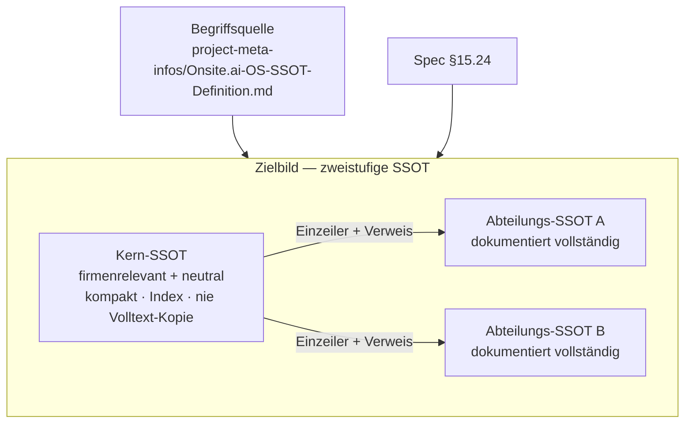
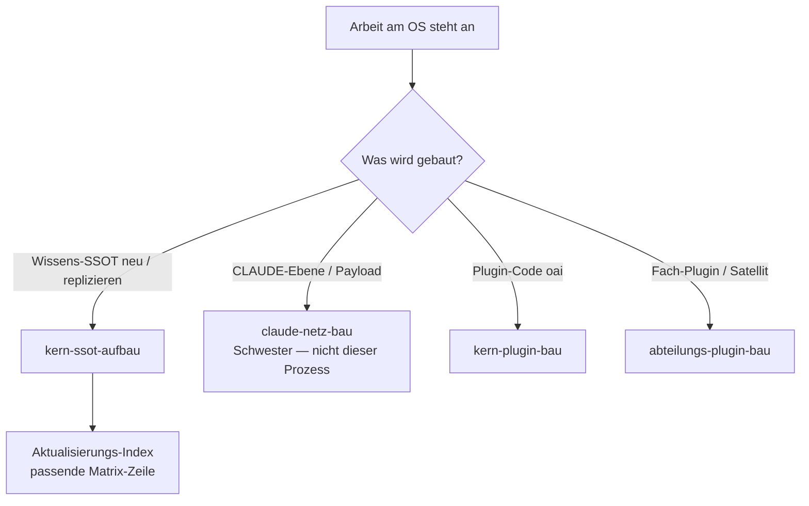
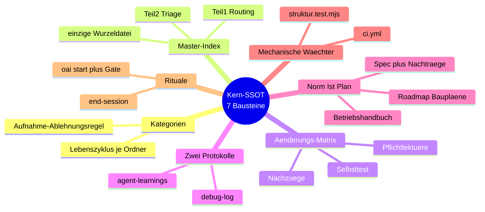
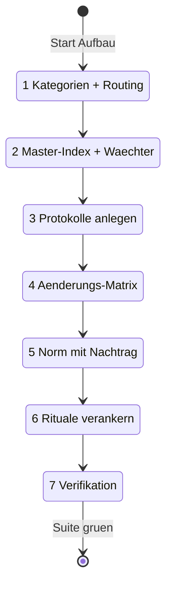
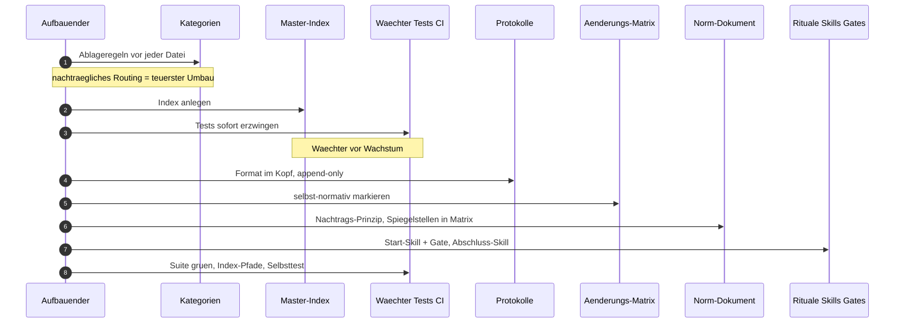
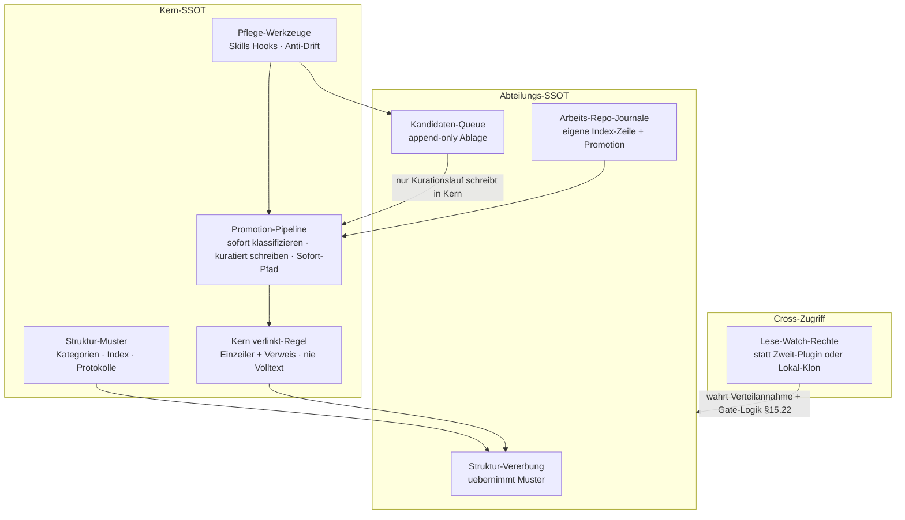
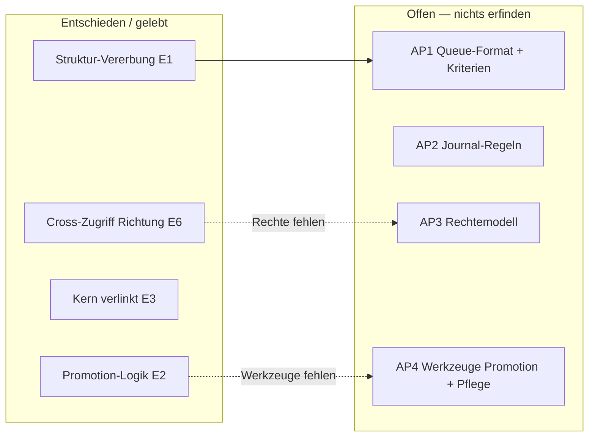
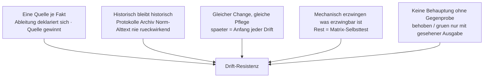
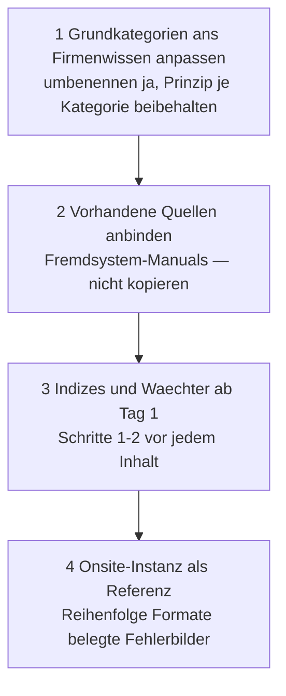
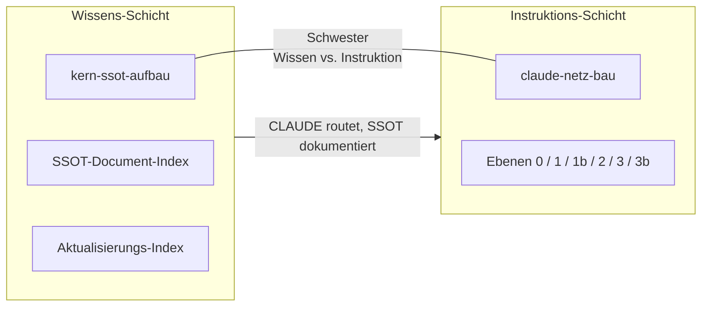

# Kern-SSOT-Aufbau — Prozesskarte

> **Was das ist:** Visuelle Landkarte des Standardprozesses zum Aufbau der Wissens-SSOT
> (Kern plus Andockpunkte für Abteilungen) — destilliert aus der ersten Instanz, generisch
> replizierbar.
> **Quelle (normativ):** `Onsite.ai-OS/knowledge base/plugin-maintanance-ruleset-source/kern-ssot-aufbau.md`
> **Stand der Karte:** 2026-08-15 · gegen die Quelldatei auf der Platte
> **Nicht normativ.** Bei Widerspruch gewinnt die Quelldatei.

**Geistiges Eigentum (Quelle, Kopf):** Methode und generischer Prozess sind Eigentum von
**NovaCore (Lucas Vöhringer)**; das OS entstand nicht im Rahmen von Onsite.
**Onsite.ai-OS ist die erste umgesetzte Instanz** und dient als durchgeführtes Beispiel.
Das Prozessdokument liegt im Dev-Repo (private Org des Autors); **vor dem Live-Gang in eine
Firmen-Org wird es extrahiert** (Folgeplan; vorher schriftliche IP-Vereinbarung —
Phasenmodell/IP-Grenze §4, A2). Extraktions-Zeiger in der Quelle:
`2026-08-09-folgeplan-nach-kern-abschluss.md`.

**Status der Quelle:** lebendes Teilwerk (2026-08-09). Struktur-Ebene entschieden und gelebt;
Andockpunkte füllen sich aus AP1–AP4 des SSOT-Abstufungs-Bauplans
(`2026-08-09-ssot-abstufung-konzeption.md`) — Offenes bleibt offen markiert.

Verwandte Familienkarte: [`00-FAMILIE-UND-VERDRAHTUNG.md`](00-FAMILIE-UND-VERDRAHTUNG.md).

---

## 1. Zweck in einem Satz

Die SSOT ist die **Wissensinfrastruktur** des OS: alle Wissenssammlungen, mit denen es
kooperiert, **plus** deren Orchestrierung und Automatisierung — **zweistufig**, mit der
Verbindungsregel **„Kern verlinkt, Abteilung dokumentiert"**.

Der Kern trägt nur firmenrelevante und neutrale Inhalte und bleibt bewusst kompakt; die
Abteilungs-SSOTs halten den Volltext. Der Kern wirkt als Index, nie als Kopie. Normative
Begriffsquelle und Spec-Bezug stehen so in der Quelldatei §1.

---

## 2. Wann der Prozess greift

| Trigger | Nicht-Trigger |
|---|---|
| Neue Instanz der Wissens-SSOT aufbauen | Instruktions-Ebenen 0/1/1b/2/3/3b bauen → `claude-netz-bau` |
| Bestehende Kern-SSOT-Struktur replizieren / nachziehen | Kern-Plugin-Code, Skills, Gates bauen → `kern-plugin-bau` |
| Andockpunkte für Abteilungs-SSOTs vorbereiten | Satelliten-Extraktion / Fach-Plugin-Struktur → `abteilungs-plugin-bau` |
| Anti-Drift-Gerüst (Index, Matrix, Wächter, Rituale) legen | Inhaltspflege einzelner Dateien ohne Struktur-Umbau |

Die Trigger-Zuordnung „Wissens-SSOT neu / replizieren" steht in der Familienkarte; die
Schwesterbeziehung Wissen vs. Instruktion steht dort und in §3 der Familienkarte. Dieser
Prozess berührt die **Wissens-Schicht**, nicht die Instruktions- oder Auslieferungs-Schicht.

---

## 3. Die sieben Grundbausteine

| # | Baustein | Zweck | Onsite-Beispiel (Quelle) |
|---|---|---|---|
| 1 | **Grundkategorien** mit Aufnahme-/Ablehnungsregel und Lebenszyklus je Ordner | jede Datei hat genau einen richtigen Ort | Enzyklopädie/Meta · Aktive Baupläne · Bauplan-Archiv · Ideen-Backlog · Standardprozesse · Fremdsystem-Manuals · Protokolle |
| 2 | **Master-Dokumenten-Index** — Teil 1 Routing, Teil 2 Triage; einziges Dokument auf der Wurzelebene | Einstieg ohne Volltext; keine zweite Dateiliste (Doppelpflege = Drift) | `SSOT-Document-Index.md` |
| 3 | **Änderungs-Matrix** — je Änderungsart: Pflichtlektüre, Nachzüge, Mechanik + Selbsttest | Nachschlageliste gegen Vergessen; neue Art = neue Zeile | `Aktualisierungs-Index.md` |
| 4 | **Zwei append-only-Protokolle** | KI lernt aus eigenen Fehlern; Symptom-Abgleich vor neuer Suche | `agent-learnings.md` · `debug-log.md` |
| 5 | **Norm / Ist / Plan getrennt** | Widersprüche entscheidbar (Quellen-Hierarchie) | Design-Spec (+§-Nachträge) · Betriebshandbuch · Roadmap/Baupläne |
| 6 | **Mechanische Wächter** | erzwingen, was erzwingbar ist; Rest = Matrix-Selbsttest | `struktur.test.mjs`, `ci.yml` |
| 7 | **Rituale mit Erzwingung** | SSOT wird gelesen und gepflegt, nicht nur besessen | `/oai:start` + Start-Gate (§15.25) · `end-session` (§15.27, **in Bau**) |

Baustein 2 ist die einzige Datei auf der Wurzelebene der Wissenssammlung — eine zweite
Dateiliste wäre Doppelpflege. Baustein 5 trennt Norm (nur per Nachtrag, jüngster gewinnt),
Ist-Inventur und Planungsdokumente mit Lebenszyklus. Baustein 7: Einstieg ist verankert;
`end-session` ist in der Quelle ausdrücklich als „in Bau" markiert — die Karte glättet das
nicht.

---

## 4. Aufbau-Ablauf (sieben Schritte)

Reihenfolge ist Teil des Vertrags: **Kategorien zuerst**, **Wächter vor Wachstum**.

| Schritt | Inhalt (Quelle §3) | Begründung (Quelle) |
|---|---|---|
| 1 | **Kategorien + Routing zuerst** (Index Teil 1 vor jedem Inhalt) | Ablageregeln definieren, bevor Dateien entstehen — nachträgliches Routing ist der teuerste Umbau |
| 2 | **Master-Index anlegen und sofort testerzwingen** | Wächter vor Wachstum: jede Wissensdatei braucht Index-Zeile in derselben Änderung; kein Eintrag zeigt ins Leere |
| 3 | **Protokolle anlegen** | Format im Dateikopf, append-only ausdrücklich (nie rückdatieren, nie umschreiben) |
| 4 | **Änderungs-Matrix aufsetzen** | selbst-normativ: neue Änderungsart → neue Zeile, sonst beginnt Drift von Neuem |
| 5 | **Norm-Dokument mit Nachtrags-Prinzip** | Versions-Spiegelstellen minimal halten und **jede** in der Matrix listen (gelernte Drift-Serie: vier Belegfälle in einer Instanz) |
| 6 | **Rituale verankern** | Einstiegs-Skill + Erzwingungs-Gate; Abschluss-Skill + Doku-Sync-Checkliste; Einstiegs-Injektion nennt lebenden Stand, nie statische Regeln doppelt |
| 7 | **Verifikation** | Suite grün · jeder Pfad im Index · Matrix-Selbsttest · keine Behauptung ohne Gegenprobe |

Schritt 2 ist der harte Schnitt: Inhalt ohne Index-Zeile und ohne laufenden Wächter gilt als
verbotenes Wachstum. Schritt 5 speichert die Onsite-Lektion der Drift-Serie (vier Belegfälle)
als Prozessregel, nicht als Anekdote.

---

## 5. Andockpunkte (§4) — Plugin-Verknüpfungsvorbereitung

Die Kern-SSOT wird so gebaut, dass Abteilungs-Plugins später **andocken statt umbauen**.

| Andockpunkt | Kontrakt | Stand (Quelle) |
|---|---|---|
| **Struktur-Vererbung** | Jede Abteilungs-SSOT übernimmt Grundkategorien, eigenen Master-Index und Protokolle — Kern-Muster = Vorlage | **entschieden + erstmals vollzogen** (Satellit `oai-marketing` v0.2.0, §15.24 E1) |
| **Kandidaten-Queue** | Reservierter append-only-Ablageort je Abteilungs-SSOT (Felder: Datum · Einzeiler · Verweis · erfülltes Kriterium); nur der Kurationslauf schreibt in die Kern-SSOT | Format + Kriterienliste aus **AP1 — offen** |
| **Promotion-Pipeline** | sofort klassifizieren (end-session, Kriterienliste) · kuratiert schreiben (wöchentlicher Lauf, anfangs manuell) · Sofort-Pfad hart begrenzt (Major-Bug teamweit · Sicherheitsvorfall · Release/Tag · Rote-Linien-Verstoß) | entschieden (§15.24 E2); Werkzeuge aus **AP4 — offen** |
| **„Kern verlinkt"-Regel** | Kern-Eintrag = Einzeiler + Verweis auf Abteilungs-Eintrag — nie Volltext (Doppelpflege-Verbot) | **entschieden** (§15.24 E3) |
| **Cross-Abteilungs-Zugriff** | Lese-/Watch-Rechte auf Abteilungs-Repos statt Zweit-Plugin oder Lokal-Klon | Richtung entschieden (§15.24 E6); Rechtemodell aus **AP3 — offen** |
| **Arbeits-Repo-Journale** | eigene Kategorie/Pfad-Nennung im Master-Index + eigene Promotion-Regeln; angrenzende Ströme (z. B. Ticket-Ordner) miterfassen | Regeln aus **AP2 — offen** |
| **Pflege-Werkzeuge** | Maintenance-Skills/Hooks des Kerns; Anti-Drift zweistufig: deterministisch (Test/end-session-Check) + semantischer Prüf-Subagent im Kurationslauf | aus **AP4 — offen** + Backlog-Idee `2026-08-10-anti-drift-architektur-konsolidiert.md` (konsolidiert Alt-Idee 2026-08-09, jetzt im `Bauplan-archiv/`) |

**Offenes bleibt offen:** AP1–AP4 sind Arbeitspakete des Bauplans
`2026-08-09-ssot-abstufung-konzeption.md`. Diese Karte füllt keine Formate, keine
Kriterienlisten, keine Rechte-Matrix und keine Skill-Namen, die die Quelle nicht nennt.
`end-session` als Klassifikations-Ort ist in der Promotion-Pipeline genannt, der Skill selbst
steht in §2 Baustein 7 als „in Bau".

---

## 6. Tragende Anti-Drift-Prinzipien (§5)

| Prinzip | Konsequenz im Alltag |
|---|---|
| Eine Quelle je Fakt | abgeleitete Dokumente deklarieren sich; bei Widerspruch gewinnt die Quelle, nie die Ableitung |
| Historisch bleibt historisch | Protokolle, Archiv und Norm-Alttext werden nie rückwirkend umgeschrieben; nachgezogen werden nur lebende Dokumente |
| Gleicher Change, gleiche Pflege | Nachzüge in derselben Änderung — „später" ist der Anfang jeder Drift |
| Mechanisch erzwingen | Test/CI für Index-Vollständigkeit, Linkgültigkeit, Wurzel-Regel, Versions-Gleichstand; Rest in Matrix-Selbsttest |
| Keine Behauptung ohne Gegenprobe | „behoben"/„grün" nur mit gesehener Ausgabe |

Diese fünf Sätze sind die tragende Schicht unter Index, Matrix und Wächtern. Ohne sie bleiben
Bausteine 2–6 Dekoration.

---

## 7. Replikation für eine neue Instanz (§6)

1. Grundkategorien ans Firmenwissen anpassen (umbenennen ja, Prinzip je Kategorie beibehalten).
2. Vorhandene Wissensquellen (Confluence, Wikis, Laufwerke) über **Fremdsystem-Manuals
   anbinden**, nicht kopieren — die SSOT orchestriert Quellen, sie dupliziert sie nicht.
3. Indizes und Wächter **ab Tag 1** (Aufbau-Schritte 1–2 vor jedem Inhalt).
4. Die Onsite-Instanz ist die Referenz für Reihenfolge, Formate und die belegten Fehlerbilder
   (Drift-Serie, Park-Zustände, Doppelpflege).

Onsite ist Referenz-Instanz, nicht Pflichtform der Ordnernamen. Replikation startet bei den
sieben Bausteinen und der Sieben-Schritt-Reihenfolge, nicht bei einem Datei-Dump.

---

## 8. Schwesterbeziehung zu `claude-netz-bau`

Beide Dokumente sind **generische NovaCore-Prozesse** (IP-Zeichnung im Kopf, Extraktion vor
Live-Gang). `kern-ssot-aufbau` baut die **Wissens-Schicht** (wohin Dateien gehören, was bei
Änderung mitgeht). `claude-netz-bau` baut die **Instruktions-Schicht** (welche CLAUDE Mensch
und Agent bindet). Vermischen ist der häufige Fehler: Inhalt in der falschen Schicht ist
entweder ständig veraltet oder frisst in jeder Session Kontext. Die Familienkarte führt die
Kante ausdrücklich; die Kanal-Regel liegt in `claude-netz-bau.md`, nicht hier.

---

## 9. Artefakte

| Rolle | Artefakt (aus der Quelle) |
|---|---|
| **Gelesen / orchestriert** | `Onsite.ai-OS-SSOT-Definition.md`, Spec §15.22/§15.24/§15.25/§15.27, Abteilungs-SSOTs per Verweis |
| **Geschrieben (Kern-Aufbau)** | Kategorien-Ordner, `SSOT-Document-Index.md`, `Aktualisierungs-Index.md`, `agent-learnings.md`, `debug-log.md`, Norm/Ist/Plan-Dokumente, Tests `struktur.test.mjs`, `ci.yml` |
| **Geschrieben (Andock, gelebt)** | Abteilungs-Muster per Struktur-Vererbung (Beleg: `oai-marketing` v0.2.0) |
| **Geschrieben (Andock, AP offen)** | Queue-Format, Journal-Regeln, Rechtemodell, Pflege-/Promotion-Werkzeuge — **nicht spezifiziert bis AP1–AP4** |
| **Nie angefasst von diesem Prozess** | Instruktions-Payloads der CLAUDE-Ebenen (Schwester), Marketplace-Pins/Distribution, Plugin-Code jenseits der Wissensdateien |
| **Historisch / append-only** | Protokolle, Archiv, Norm-Alttext — nie rückwirkend umschreiben |

---

## 10. Kopplungen (nur benannte)

| Ziel | Art der Kopplung | Quelle |
|---|---|---|
| `claude-netz-bau` | Schwester Wissen vs. Instruktion | Familienkarte + Schicht-Trennung |
| `Aktualisierungs-Index` | Matrix ist Baustein 3; jede SSOT-Änderung zieht Matrix-Zeile | Quelle §2 #3, Familienkarte |
| `/oai:start` + Start-Gate | Ritual Baustein 7, §15.25 | Quelle §2 #7, §3 Schritt 6 |
| `end-session` | Ritual + Promotion-Klassifikation; **in Bau** (§15.27) | Quelle §2 #7, §4 Promotion |
| `struktur.test.mjs` / `ci.yml` | mechanische Wächter | Quelle §2 #6 |
| AP1–AP4 / `2026-08-09-ssot-abstufung-konzeption.md` | füllen Andockpunkte | Quelle Kopf + §4 |
| Folgeplan Extraktion | IP-Grenze vor Firmen-Org | Quelle Kopf + Fuß |
| Anti-Drift-Backlog `2026-08-10-anti-drift-architektur-konsolidiert.md` | Pflege-Werkzeuge zweistufig | Quelle §4 letzte Zeile |

---

## 11. Fallen / bekannte Fehlerbilder (aus der Quelle)

| Falle | Was die Quelle sagt |
|---|---|
| Inhalt vor Routing | nachträgliches Routing = teuerster Umbau (§3.1) |
| Wachstum ohne Wächter | Index ohne Sofort-Test; Einträge ins Leere (§3.2) |
| Doppelpflege | zweite Dateiliste neben Master-Index; Volltext im Kern statt Verweis (§2 #2, §4 „Kern verlinkt") |
| Versions-Spiegelstellen | Drift-Serie: vier Belegfälle — jede Spiegelstelle muss in der Matrix stehen (§3.5) |
| „Später" nachziehen | Anfang jeder Drift (§5) |
| Quellen kopieren statt anbinden | Replikation: Fremdsystem-Manuals, keine Duplikate (§6.2) |
| Offenes als fertig behandeln | AP1–AP4 und `end-session` in Bau — nicht glätten (Quell-Status) |

---

## 12. Verifikation / Abschluss

Aus Quelle §3 Schritt 7, unverändert als Checkliste:

1. Suite grün (`struktur.test.mjs` / CI).
2. Jeder Pfad im Master-Index erreichbar; kein Index-Eintrag zeigt ins Leere.
3. Matrix-Selbsttest: „Habe ich etwas vergessen?"
4. Keine Behauptung ohne Gegenprobe (gesehene Ausgabe).

Zusätzlich aus den Anti-Drift-Prinzipien: Nachzüge derselben Änderung erledigt; Protokolle
nur append; abgeleitete Dokumente als abgeleitet erkennbar.

---

## 13. Anhang — Dateizeiger in die Quelle und Umgebung

| Zeiger | Pfad / Bezug |
|---|---|
| Normative Prozessdatei | `knowledge base/plugin-maintanance-ruleset-source/kern-ssot-aufbau.md` |
| SSOT-Begriff | `project-meta-infos/Onsite.ai-OS-SSOT-Definition.md` |
| Spec-Anker | §15.22 (Verteilannahme/Gates), §15.24 (Zweistufigkeit, E1–E3, E6), §15.25 (Start-Gate), §15.27 (end-session, in Bau) |
| Abstufungs-Bauplan | `2026-08-09-ssot-abstufung-konzeption.md` (AP1–AP4) |
| Extraktion vor Live-Gang | `2026-08-09-folgeplan-nach-kern-abschluss.md` |
| Anti-Drift-Konsolidierung | `2026-08-10-anti-drift-architektur-konsolidiert.md` (Backlog; Alt 2026-08-09 im `Bauplan-archiv/`) |
| Master-Index (Instanz) | `SSOT-Document-Index.md` |
| Änderungs-Matrix (Instanz) | `Aktualisierungs-Index.md` |
| Protokolle (Instanz) | `agent-learnings.md`, `debug-log.md` |
| Wächter (Instanz) | `struktur.test.mjs`, `ci.yml` |
| Struktur-Vererbung belegt | Satellit `oai-marketing` v0.2.0 (§15.24 E1) |
| Schwester-Prozess | `plugin-maintanance-ruleset-source/claude-netz-bau.md` |
| Familienkarte | `Desktop/Onsite.ai-OS-Prozesskarten/00-FAMILIE-UND-VERDRAHTUNG.md` |

---

*Prozesskarte · nicht normativ · 2026-08-15 · Quelle: `kern-ssot-aufbau.md` (lebendes Teilwerk 2026-08-09).*
