# CLAUDE-Netz-Bau — Prozesskarte

> **Was das ist:** Visuelle Landkarte des Standardprozesses, der die **Instruktions-Schicht
> der SSOT** baut — Ebenen 0/1/1b/2/3/3b als Netz, nicht als Textkopien.
> **Quelle (normativ):** `Onsite.ai-OS/knowledge base/plugin-maintanance-ruleset-source/claude-netz-bau.md`
> **Stand der Karte:** 2026-08-15 · gegen die Quelldatei auf der Platte
> **Nicht normativ.** Bei Widerspruch gewinnt die Quelldatei.

> **Geistiges Eigentum:** Methode und generischer Prozess sind Eigentum von **NovaCore
> (Lucas Vöhringer)**; das OS entstand nicht im Rahmen von Onsite — **Onsite.ai-OS ist die
> erste umgesetzte Instanz** und dient hier als durchgeführtes Beispiel, nicht als Pflicht.
> Gesammelt wird das Quelldokument (wie alle generischen Prozessdokumente) im Dev-Repo
> (private Org des Autors); **vor dem Live-Gang in eine Firmen-Org wird es extrahiert**
> (Folgeplan; vorher die schriftliche IP-Vereinbarung — Phasenmodell/IP-Grenze §4, A2).
> Gleiche IP-Zeichnung wie bei der Schwester `kern-ssot-aufbau` — siehe
> [00-FAMILIE-UND-VERDRAHTUNG.md](00-FAMILIE-UND-VERDRAHTUNG.md).

---

## 1. Zweck in einem Satz

Das CLAUDE-Netz ist die **Instruktions- und Orchestrierungs-Schicht der SSOT**: jede CLAUDE
**routet und bindet**, die SSOT-Ebene **dokumentiert** — Verweis-Überschneidung ja, Text-Kopie nie.

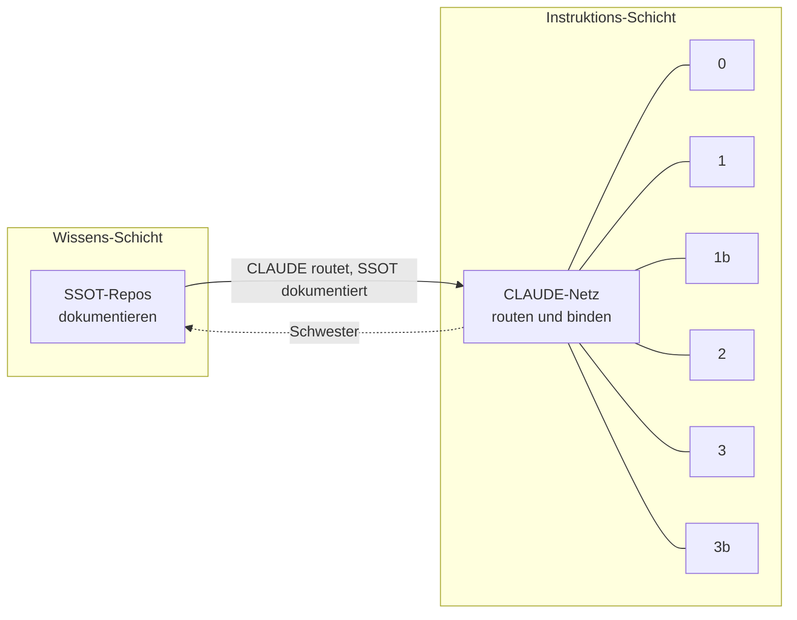

Schwester: `kern-ssot-aufbau` (Wissen). Doppelpflege-Verbot gilt auch hier: dieselbe Regel in
drei Dateien → zwei veralten. Das Netz löst drei Probleme einer **einzelnen CLAUDE.md**:

| Problem | Was eine Einzeldatei nicht kann |
|---|---|
| **Reichweite** | Instruktion wirkt in jedem Repo, auch in fremden Arbeitsrepos |
| **Eigentum** | Firma, Abteilung, Repo-Team und Mitarbeiter ändern denselben Ort, ohne sich zu überschreiben |
| **Aktualität** | Instruktion erreicht das Team ohne manuelles Kopieren |

---

## 2. Wann der Prozess greift

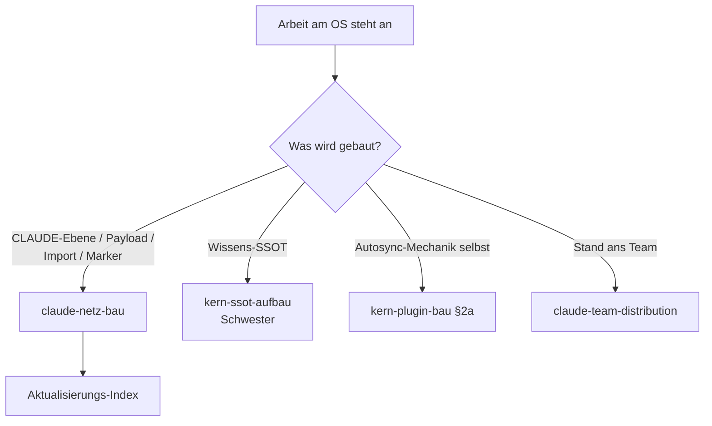

**Trigger:** neue/geänderte CLAUDE-Ebene, Payload, Marker-Block, `@`-Import-Kante,
Pfad-Matrix, Privat-Zonen-Schutz, Verifikation der Instruktions-Ladung.

**Nicht-Trigger:** reiner Wissensinhalt (→ `kern-ssot-aufbau`); reiner Plugin-Scaffold
(→ Plugin-Bau-Prozesse); reiner Maschinen-Rollout (→ `claude-team-distribution`).

---

## 3. Ebenen-Prinzip — das Netz

### 3.1 Träger · Owner · Kanal · Lade-Mechanik

| Ebene | Prinzip | Träger / Owner | Update-Kanal | Lade-Mechanik |
|---|---|---|---|---|
| **0** | **org-managed**: absolute Invarianten + SSOT-Verweis | Admin-Oberfläche / Managed-Policy / Admin | zentral, ohne Sync-Mechanik | Client holt automatisch; **nicht** abwählbar |
| **1** | **global-individuell mit Privat-Zone**: Firmen-Block IM Nutzer-Dokument | `~/.claude/CLAUDE.md` / Firma (Block) + Mitarbeiter (Zone) | Autosync-Hook, **Marker-Chirurgie** | jede Session, vollständig |
| **1b** | **team-sync, vollständig geführt**: eigene Datei ohne Privat-Zone → Ganzdatei ersetzbar | eigene Datei Nutzer-Scope / Firma allein | Autosync-Hook, Datei-Ersatz statt Chirurgie | `@`-Import aus Ebene 1 — Nutzer-Scope **ohne Freigabedialog** |
| **2** | **abteilungs-/plugin-paketiert, zweigeteilt**: Plugin-CLAUDE ≠ Repo-CLAUDE | Datei IM Plugin-Verzeichnis / Abteilung | Marketplace-Auto-Update bei Plugin-Bump | Einstiegs-Ritual liest Plugin-Root — in **jedem** Arbeitsrepo |
| **3** | **projekt**: Fachfakten des Arbeitsrepos, nichts Firmenweites | Arbeitsrepo / Repo-Team | Git | Verzeichnisbaum-Ladung beim Start |
| **3b** | **Sonderfall Werkstatt**: OS-Repo — „daran arbeiten" / „es betreiben" | Werkstatt-Repo / Maintainer | Git | wie 3 |

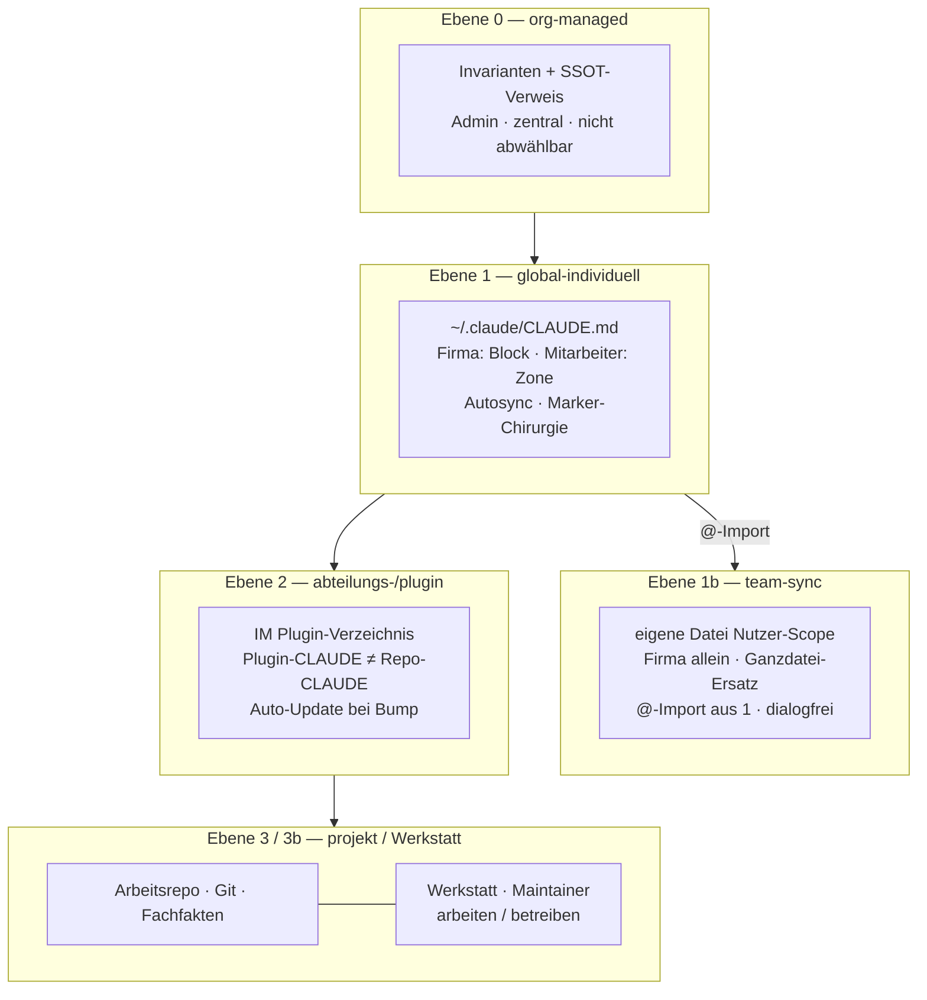

Ebene 0 ist Bootstrap und harte Invarianten — sie ersetzt keine geführte Ebene 1. Ebene 1b
hat **keine** Privat-Zone und darf deshalb als Ganzes ersetzt werden. Ebene 2 trennt
ausgelieferte Plugin-CLAUDE von der Werkstatt-Repo-CLAUDE.

### 3.2 Kanal-Regel

**Kanal-Regel (entscheidet die Schicht, nicht umgekehrt):** *Je schneller sich ein Inhalt
ändert, desto automatischer muss sein Kanal sein.*

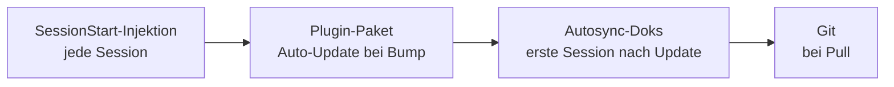

| Inhaltsart | Schicht |
|---|---|
| lebender Stand | Injektion / Skill |
| stehende Ordnung | CLAUDE-Ebenen |
| Fachwissen | SSOT-Repos |

Inhalt in der falschen Schicht ist entweder **ständig veraltet** oder **verbraucht in jeder
Session Kontext für nichts**.

### 3.3 Marker-Konvention (Ebene 1)

```text
<!-- NS:BLOCK:START name -->
… Versions-Stempel als erste Blockzeile …
<!-- NS:BLOCK:ENDE name -->
```

- Erste Blockzeile = **Versions-Stempel** — der **einzige** State (kein externer Speicher) →
  idempotent, No-op bei identischem Stand.
- **Verifiziert 2026-08-11:** block-level HTML-Kommentare werden vor der Kontext-Injektion
  **gestrippt** (nur Read-Tool-Blick zeigt sie) → Marker und Stempel kosten **keine Tokens**;
  in Code-Blöcken bleiben Kommentare erhalten.
- Bei Format-Fragen neu verifizieren, nie aus dem Gedächtnis.

### 3.4 `@`-Import-Mechanik (verifiziert 2026-08-11)

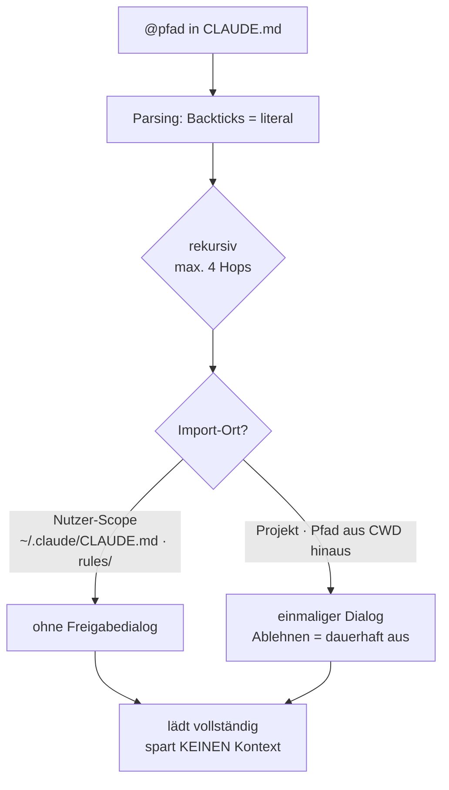

| Fakt | Wert |
|---|---|
| Pfade | relativ **und** absolut |
| Rekursion | maximal **vier** Hops |
| Code-Spans | Backticks halten Pfad literal |
| Kontext | Import **spart keinen Kontext** |
| Nutzer-Scope | ohne Dialog |
| Projekt-Scope (hinaus) | Dialog; Ablehnen = dauerhaft aus |

Darauf ruht Ebene 1b: Nutzer-Scope → dialogfrei → Firma darf komplett ersetzen.

### 3.5 Privat-Zonen-Schutz

Nicht verhandelbar — sonst verliert das Netz die Nutzerakzeptanz:

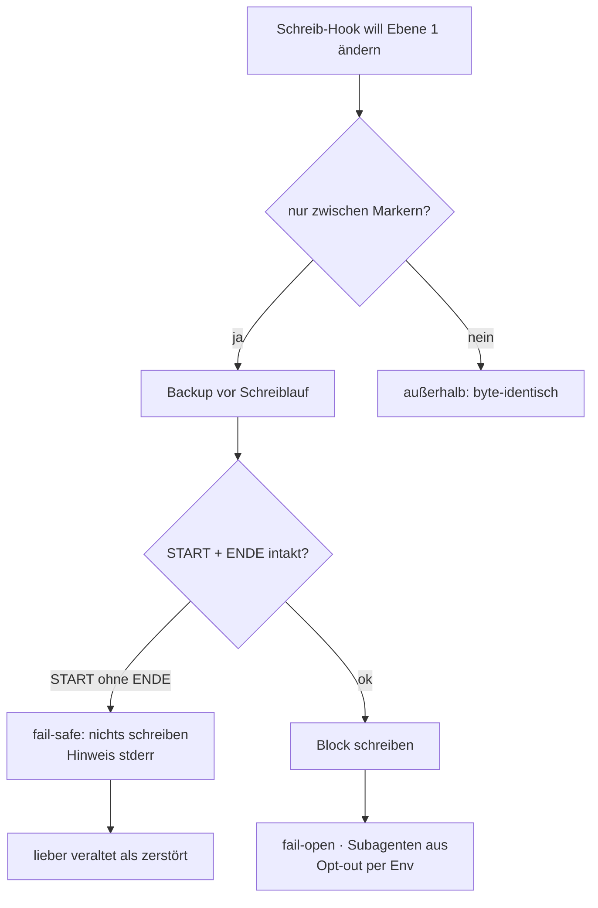

| Regel | Bedeutung |
|---|---|
| nur zwischen Markern | außerhalb bleibt **byte-identisch** |
| Backup | vor jedem Schreiblauf |
| fail-safe bei defekten Markern | START ohne ENDE → nichts schreiben, stderr-Hinweis |
| Schreib-Hook **fail-open** | Subagenten ausgenommen; Opt-out per Env |

---

## 4. Bau-Ablauf (§3 der Quelle)

Nummeriert wie in der Quelle.

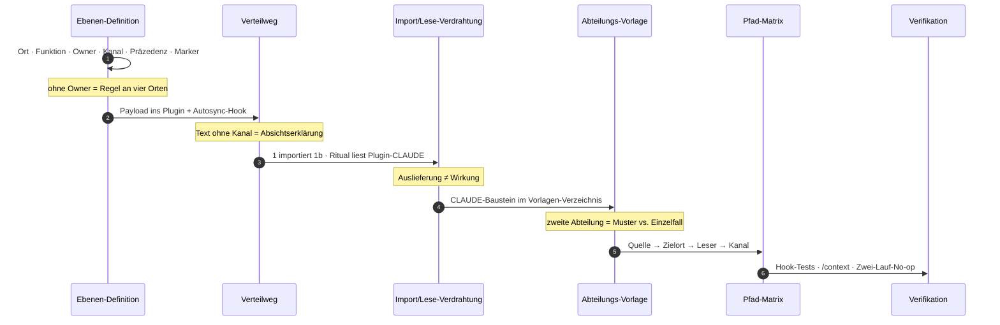

**1. Ebenen-Definition als normatives Dokument zuerst.** Je Ebene: Ort, Funktion, Owner, Kanal,
Präzedenzregel, Marker-Format. Ohne benannte Owner entsteht kein Netz, sondern dieselbe Regel
an vier Orten. Präzedenz ist **normative Konvention, keine Harness-Mechanik** — nichts im Client
stellt eine Ebene über eine andere. Konflikte per **Umformulierung**: Methodik/Prozess/Safety
von oben nach unten; Fachfakten vom Projekt vor allen. Begriffsquelle erste Instanz:
`project-meta-infos/Onsite.ai-OS-CLAUDE-Ebenen-Definition.md`. Herleitung:
`Aktive Baupläne/2026-08-10-claude-ebenen-architektur-konzeption.md`.

**2. Verteilweg vor Inhalt.** Payload-Dateien ins Plugin-Paket + Autosync-Hook (SessionStart);
Pfad-Auflösung **relativ zum Hook**, nicht über Env-Ableitungen. Text ohne Kanal ist
Absichtserklärung — Feinschliff lohnt erst, wenn der Kanal trägt. Normierungsort Autosync:
`kern-plugin-bau.md` §2a (nicht dieses Einzeldokument).

**3. Import-/Lese-Verdrahtung.** Ebene 1 importiert die geführte Ebene 1b; das Einstiegs-Ritual
(Gate „Sitzungsstart") liest die Abteilungs-CLAUDE aus dem Plugin-Root. Ausgelieferte Datei,
die niemand lädt, wirkt nicht — **Auslieferung ≠ Wirkung**.

**4. Vorlagen-Baustein für neue Abteilungen.** CLAUDE-Baustein im Plugin-Vorlagen-Verzeichnis;
alles Auszuliefernde liegt **IM** Plugin-Verzeichnis; Satelliten als **sparse clone** nur des
Plugin-Unterordners — Repo-Wurzel-Dateien kommen nicht mit. Die zweite Abteilung entscheidet,
ob das Netz Muster oder Einzelfall ist.

**5. Pfad-/Verknüpfungs-Matrix pflegen.** Je Ebene: Quelle → Zielort → Leser → Kanal. Unbenannte
Kanten sind die Fundstelle jeder späteren Drift.

**6. Verifikation.** Tests je Hook-Fall (Erstlauf · No-op bei gleichem Stempel · Privat-Zone
unverändert · defekte Marker → kein Schreiben · Ziel fehlt) · **`/context`-Probe**: erwartete
Dateien unter „Memory files" (optional `InstructionsLoaded`-Hook) · **Zwei-Lauf-No-op**:
zweiter Lauf ändert kein Byte. Keine Behauptung ohne gesehene Ausgabe.

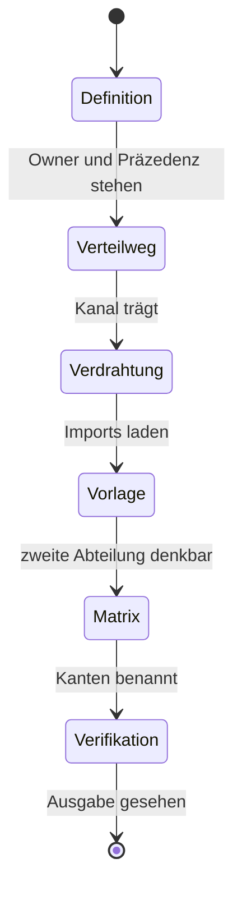

---

## 5. Anti-Drift-Prinzipien (§4)

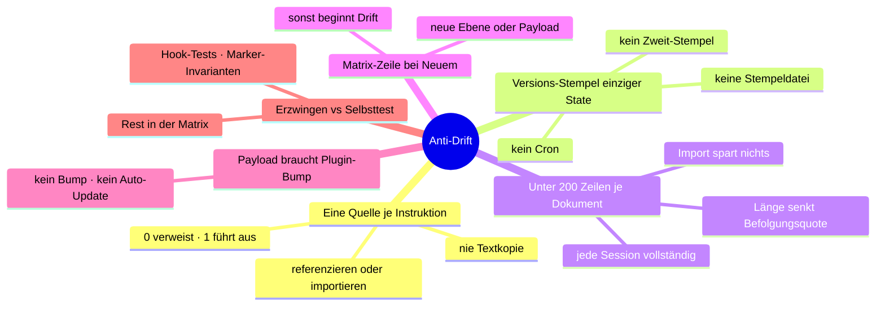

1. **Eine Quelle je Instruktion.** Referenz/Import, nie Textkopie; 0 verweist, 1 führt aus.
2. **Versions-Stempel ist der einzige State.** Kein Zweit-Stempel, keine Stempeldatei, kein Cron —
   Instruktionen wirken nur in Sessions → Sitzungsstart genügt.
3. **Unter 200 Zeilen je geladenem Dokument** (Doku-Zielwert): jede Ebene lädt in **jede** Session
   vollständig; wächst sie, wandert Detail in pfad-/situationsgebundene Regeln oder Skills —
   Import verschiebt nur, er spart nichts.
4. **Neue Ebene oder neuer Payload ⇒ Zeile in der Änderungs-Matrix** des Aktualisierungs-Index.
5. **Payload-Änderung ohne Plugin-Bump erreicht niemanden.**
6. **Erzwingbares mechanisch erzwingen** (Hook-Tests, Marker-Invarianten); Rest als Selbsttest
   in der Matrix.

---

## 6. Replikation für eine neue Instanz (§5)

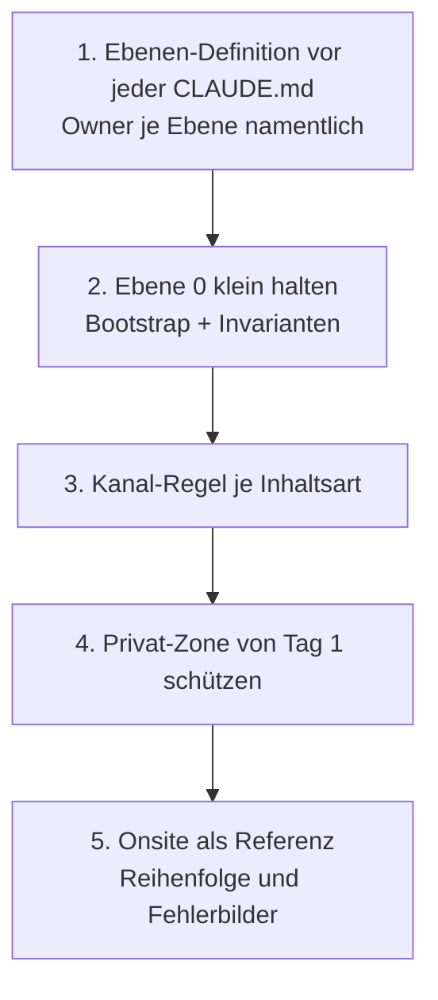

| # | Inhalt |
|---|---|
| 1 | Ebenen-Definition **bevor** eine CLAUDE.md entsteht; Owner namentlich |
| 2 | Ebene 0 klein — ersetzt keine geführte Ebene 1: nicht versioniert, nicht getestet, nicht abteilungsfähig, keine Privat-Zone |
| 3 | Kanal-Regel je Inhaltsart, nicht alles in die bequemste Datei |
| 4 | Privat-Zone von Tag 1 markieren und schützen — nachträglich ist das Vertrauen weg |
| 5 | Onsite-Instanz = Referenz für Reihenfolge und Fehlerbilder |

**Onsite-Stand laut Quelle (2026-08-11):**

| Ebene | Status |
|---|---|
| 0 | aktiv |
| 3 / 3b | aktiv |
| 1 | firmengeführt per Marker-Chirurgie seit Kern **0.12.0** |
| 1b und 2 | gebaut seit Kern **0.17.0** (§15.32 — Team-Sync-Payload, Ganzdatei-Sync, `@`-Import; Abteilungs-CLAUDE zweigeteilt, Erstausprägung development) |
| 3b Zweiteilung | Werkstatt-CLAUDE („daran arbeiten" / „es betreiben") **offen** |

So im Prozessdokument 2026-08-11; Ist-Stand auf der Platte (Featurekarte 2026-08-15: Kern
**0.21.0**) kann weiter sein — die Karte glättet das nicht still.

---

## 7. Artefakte

| Richtung | Artefakt |
|---|---|
| gelesen | Ebenen-Definition, Konzept-Bauplan, `kern-plugin-bau` §2a, Aktualisierungs-Index |
| geschrieben | Payloads, Autosync-Hook, Marker-Block, 1b-Datei, Plugin-CLAUDE, Vorlage, Matrix |
| nie angefasst | Privat-Zone außerhalb der Marker; Textkopien fremder Ebenen-Inhalte |

---

## 8. Kopplungen (nur quellenbenannt)

| Kopplung | Rolle |
|---|---|
| `kern-ssot-aufbau.md` | **Schwester** — Wissen vs. Instruktion |
| `kern-plugin-bau.md` §2a | Normierungsort Autosync |
| Aktualisierungs-Index | Matrix-Zeile bei neuer Ebene / Payload |
| `claude-team-distribution` | kein Bump → Payload erreicht niemanden |
| Gate „Sitzungsstart" | liest Abteilungs-CLAUDE aus Plugin-Root |
| sparse clone | Satellit holt nur Plugin-Unterordner |
| Spec §15.32 | Team-Sync-Payload (Onsite-Stand 0.17.0) |

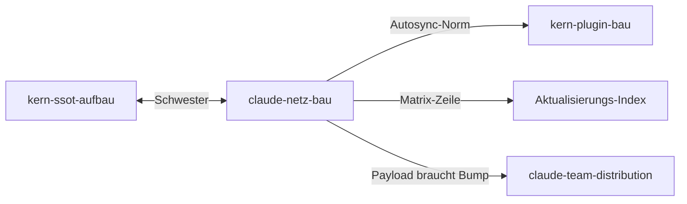

---

## 9. Fallen

| Falle | Wirkung |
|---|---|
| Textkopie statt Import/Verweis | Doppelpflege; zwei von drei veralten |
| Inhalt in falscher Schicht | veraltet **oder** Kontext-Müll jede Session |
| Text ohne Kanal zuerst | Absichtserklärung ohne Wirkung |
| Auslieferung ohne Lade-Verdrahtung | niemand lädt die Datei |
| Payload ohne Plugin-Bump | erreicht niemanden |
| Marker defekt, trotzdem schreiben | Privat-Zone zerstört |
| Privat-Zone nachträglich schützen | Vertrauen weg |
| Ebene 0 überfrachten | nicht versioniert/getestet/abteilungsfähig |
| Import als Kontext-Sparmaßnahme | spart **nichts** |
| unbenannte Matrix-Kante | Drift-Fundstelle |
| Präzedenz als Harness erwarten | Client stellt keine Ebene über die andere |

---

## 10. Verifikation / Abschluss

1. Hook-Fälle grün: Erstlauf · Stempel-No-op · Privat-Zone · defekte Marker · Ziel fehlt
2. `/context` zeigt erwartete Dateien unter „Memory files"
3. optional: `InstructionsLoaded`-Protokoll
4. Zwei-Lauf-No-op: zweiter Lauf ändert kein Byte
5. Matrix-Zeile im Aktualisierungs-Index, wenn Ebene/Payload neu
6. Bei Replikation: Owner namentlich, Privat-Zone von Tag 1 markiert

---

## 11. Anhang — Dateizeiger

| Was | Wo |
|---|---|
| Normative Prozessquelle | `knowledge base/plugin-maintanance-ruleset-source/claude-netz-bau.md` |
| Schwester (Wissen) | `…/kern-ssot-aufbau.md` |
| Autosync-Normort | `…/kern-plugin-bau.md` §2a |
| Begriffsquelle Ebenen | `knowledge base/project-meta-infos/Onsite.ai-OS-CLAUDE-Ebenen-Definition.md` |
| Herleitung | `Aktive Baupläne/2026-08-10-claude-ebenen-architektur-konzeption.md` |
| Extraktion vor Live-Gang | Folgeplan `2026-08-09-folgeplan-nach-kern-abschluss.md` |
| Familienkarte | [00-FAMILIE-UND-VERDRAHTUNG.md](00-FAMILIE-UND-VERDRAHTUNG.md) |
| Harness-Fakten | verifiziert 2026-08-11 gegen Claude-Code-Doku `memory` |
| Quell-Status | lebendes Teilwerk 2026-08-11 |

---

*Prozesskarte · 2026-08-15 · erklärt `claude-netz-bau.md`, ersetzt sie nicht.*
