# Claude Team Distribution — Prozesskarte

> **Was das ist:** Visuelle Landkarte des Standardprozesses, mit dem Onsite.ai-OS als Plugin-Familie über einen Claude-Team-/Enterprise-Workspace an die Entwicklermaschinen kommt — Marketplace, Install, Auto-Update, org-weiter GitLab-MCP, Admin- vs. Kollegen-Seite.
> **Quelle (normativ):** `Onsite.ai-OS/knowledge base/plugin-maintanance-ruleset-source/claude-team-distribution.md`
> **Stand der Karte:** 2026-08-15 · gegen die Quelldatei auf der Platte
> **Nicht normativ.** Bei Widerspruch gewinnt die Quelldatei.
> **Familie:** [00-FAMILIE-UND-VERDRAHTUNG.md](00-FAMILIE-UND-VERDRAHTUNG.md) · Karte 06 von 10

---

## 1. Zweck in einem Satz

Das Onsite.ai-OS wird als **Plugin-Familie in einem Marketplace** gepackt und über Claude Team/Enterprise verteilt, sodass Kollegen nach einmaligem Marketplace-Add und Abteilungs-Install Skills, Kern (transitiv) und Auto-Updates bekommen — ohne manuelle MCP- oder Skill-Installation pro Maschine.

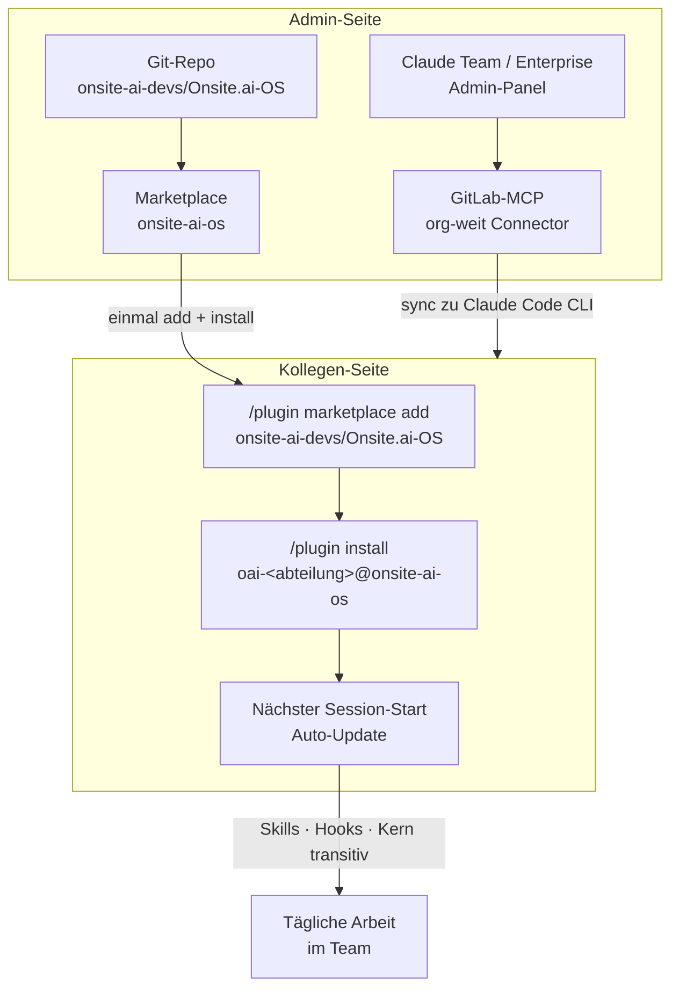

Der Plan löst das **Verteilungs- und Verwaltungsproblem**: Marketplace aus Git, org-weite Connectors, transitive Kern-Abhängigkeit. Er löst **nicht** das Domänenwissen-Problem — das bleibt im OS selbst (Skills, Hooks, WP-Rahmen, GitLab-CE-Integration).

---

## 2. Wann der Prozess greift

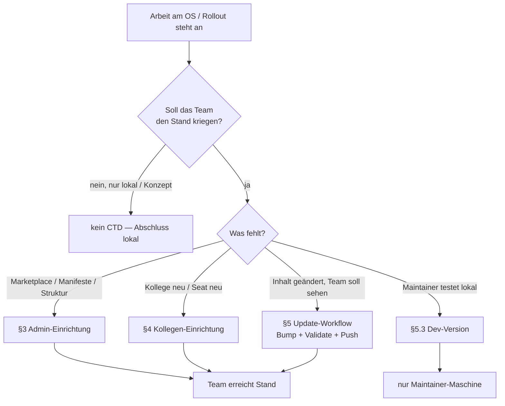

| Trigger | Nicht-Trigger |
|---|---|
| Neuer Kollege braucht OS auf der Maschine | Reine Konzept-/Lese-Arbeit ohne Auslieferung |
| Plugin-Inhalt geändert und soll alle erreichen | Änderung ohne Version-Bump (erreicht niemanden) |
| GitLab-MCP soll org-weit stehen | Privates Tooling außerhalb Onsite.ai-OS |
| Maintainer will Dev-Marketplace parallel zur Verteilung | Normative Spec-Arbeit ohne Publish |

In der Familienkarte sitzt CTD am **Zyklusende** der Auslieferung: nach Bau und Sync-Nachzug, wenn freigegeben wird, dass das Team den Stand kriegt (Bump / Tag / bei Satellit SHA-Pin). Diese Karte erklärt den **Verteilungsmechanismus** selbst — nicht den Bau der Plugins.

---

## 3. Was der Plan liefert und was nicht (§1.2)

### 3.1 Feature-Matrix Claude Team / Enterprise

| Claude Team / Enterprise Feature | Verfügbar | Relevanz für OS |
|---|---|---|
| Org-weite Connectors (MCP-Server) | ✅ | GitLab MCP wird zentral gesetzt |
| Org-weite Skills (Auto-Sync zu CLI) | ❌ Nur Web/Desktop/Mobile, nicht CLI | Skills gehen über Plugin, nicht über org-level |
| Org-weite Plugins / Marketplaces | ✅ Auto-Update aus Git-Repo | OS wird darüber verteilt |
| Managed Policy Settings | ✅ Enterprise only | Tool-Permissions org-weit erzwingbar |
| Spend Caps per User | ✅ Enterprise only | Kostenkontrolle |
| Usage Analytics | ✅ Team + Enterprise | Nachvervollständigung der Nutzung |

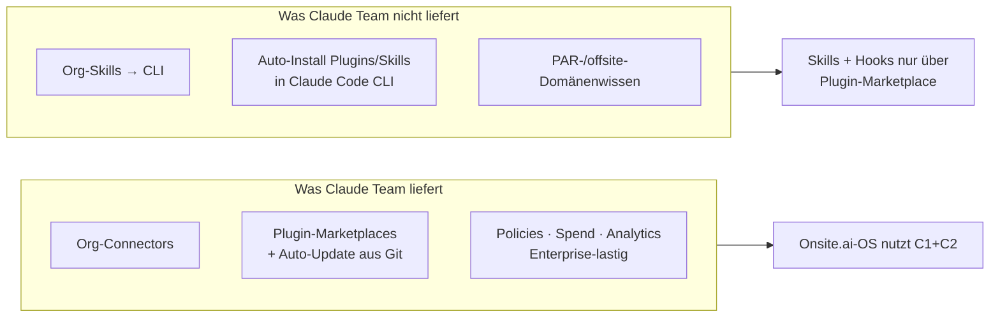

**Wichtig (Stand Juli 2026, so in der Quelle):** Claude Code CLI erhält **keine** auto-installierten Plugins oder Skills vom Workspace. Kollegen müssen den Marketplace **einmal manuell hinzufügen** (`/plugin marketplace add …`). Danach laufen alle Updates automatisch. Die Quelle verweist auf Sean Lynch's Recherche zu Org-Plugins/Connectors/Skills.

---

## 4. Voraussetzungen

### 4.1 Auf Anthropic-Seite

- **Claude Team Plan** ($30/User/Monat) oder **Enterprise Plan** (~$60/User/Monat)
- Admin-Zugriff auf den Workspace
- Premium Seats mit Claude Code-Zugriff für alle Entwickler

### 4.2 Auf GitHub-Seite

- GitHub-Organisation `onsite-ai-devs` existiert
- Repo `Onsite.ai-OS` existiert (Marketplace-Repo)
- Admin-Recht auf das Repo für Plugin-Updates

### 4.3 Bei jedem Kollegen

- Claude Code installiert (CLI oder Desktop)
- Node.js ≥ 22.21.1 (für `npx` — der MCP-Server läuft darüber)
- Git mit SSH-Zugriff auf das `offsite`-Repo
- Claude Team Seat zugewiesen

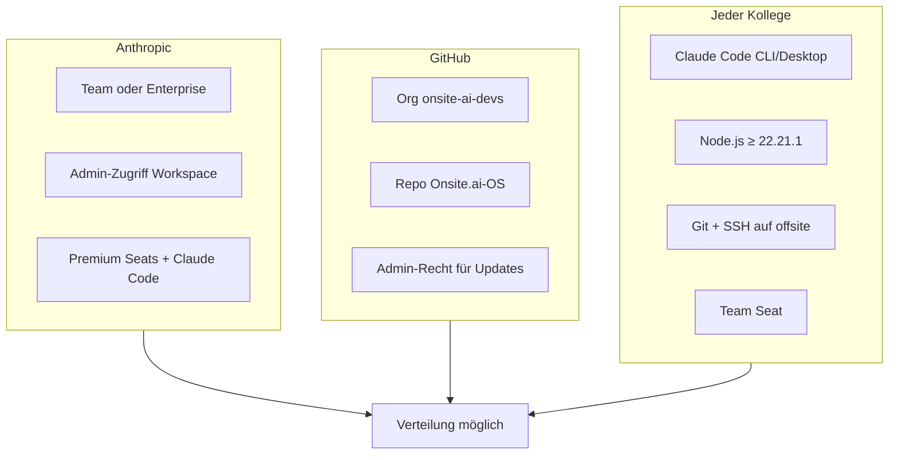

Ohne diese drei Blöcke greift weder Admin-Connector noch Marketplace-Install. Die Preise und Node-Untergrenze stehen so in der Quelle; sie sind keine Produkt-Versionsnummern des OS.

---

## 5. Admin-Einrichtung (§3)

### 5.1 Repo als Marketplace strukturieren

Voraussetzung: Claude Team/Enterprise mit Admin-Zugriff. Das Repo ist **Marketplace-Wurzel**; Plugins liegen unter `plugins/` (realer Build-Stand laut Quelle: Kern v0.8.0, Spec §15.16/§15.18 — **so im Prozessdokument**; Ist-Stand der laufenden Versionen steht im Betriebshandbuch / in der Featurekarte, nicht still hier korrigieren).

```
Onsite.ai-OS/
├── .claude-plugin/
│   └── marketplace.json              ← Marketplace-Manifest (onsite-ai-os, vier Einträge)
├── plugins/
│   ├── oai/                          ← Kern-Plugin (Namespace /oai:)
│   │   ├── .claude-plugin/plugin.json
│   │   ├── skills/                   ← Abteilung gemeinsam, 7 gebaute Skills
│   │   ├── hooks/                    ← Kontroll-Schicht (FFG) — nur hier
│   │   ├── tests/                    ← node --test
│   │   ├── wp-rahmen.md              ← normativer WP-Rahmen WP0–WP8
│   │   ├── module-registry.json      ← Metadaten-SSOT (steuert nichts aus)
│   │   └── referenz/skill-authoring.md
│   ├── <abteilung>/                  ← Abteilung (Namespace /oai-<abteilung>:)
│   │   ├── .claude-plugin/plugin.json   (dependencies: ["oai"])
│   │   ├── workflow.md               ← Fachablauf WP1–WP7
│   │   └── skills/                   ← Skills, flaches Layout
│   ├── (oai-development, oai-marketing → Satelliten, §15.19/§15.33: eigene private Repos)
│   └── oai-controlling/              ← Platzhalter-Abteilung
├── vorlagen/abteilungsplugin/        ← Vorlage (kein Plugin, .vorlage-Endungen)
├── knowledge base/                   ← Wissensbasis
│   ├── SSOT-Document-Index.md
│   ├── project-meta-infos/
│   ├── Aktive Baupläne/ · Bauplan-archiv/
│   ├── feature-manuals/
│   └── …
└── README.md
```

**Strukturegel (Quelle):** Nur Manifeste (`marketplace.json`, `plugin.json`) leben in `.claude-plugin/`. Skills, Hooks, Commands gehören in die jeweiligen Ordner daneben. Skills liegen im Default-Verzeichnis `skills/<name>/SKILL.md` und werden **automatisch gescannt** — kein Plugin nutzt ein `skills`-Array.

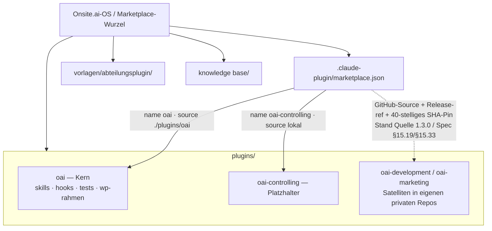

**Quellen-Stand 1.3.0:** `oai-development` und `oai-marketing` liegen als Satelliten in eigenen privaten Repos und werden über eine GitHub-Source mit Release-`ref` + 40-stelligem Commit-SHA-Pin ausgeliefert. Nur Kern `oai` und `oai-controlling` (bis zu dessen Extraktion) haben noch lokale `source: "./plugins/<name>"`. Frühere Layouts: **1.2.0** Multi-Plugin mit vier lokalen `source: "./plugins/<name>"`; **1.1.0** (2026-07-17) Ein-Plugin-Layout — abgelöst.

### 5.2 Marketplace-Manifest (`marketplace.json`)

Lage: `.claude-plugin/marketplace.json` im Repo-Root. Gekürzt laut Quelle — vier Einträge nach demselben Muster; **kein** Eintrag trägt ein `version`-Feld.

```json
{
  "name": "onsite-ai-os",
  "owner": {
    "name": "Onsite.ai Dev Team",
    "email": "dev@onsite.ai"
  },
  "description": "Interner Marketplace des Onsite.ai-Teams: verteilt den Kern oai und je Abteilung ein eigenes Plugin.",
  "plugins": [
    {
      "name": "oai",
      "source": "./plugins/oai",
      "description": "Kern des Onsite.ai-OS: ständige Abteilung gemeinsam, Kontroll-Hook FFG, WP-Rahmen, Registry.",
      "category": "kern"
    },
    {
      "name": "oai-controlling",
      "source": "./plugins/oai-controlling",
      "description": "Abteilung controlling: CEO-/Steuerungsthemen, Module in Planung.",
      "category": "abteilung"
    }
  ]
}
```

Felder, die die Quelle zeigt: `name`, `owner`, `description`, `plugins[]` mit `name`, `source`, `description`, `category`. Kein `version` im Marketplace-Eintrag — siehe Versions-Regel unten.

### 5.3 Plugin-Manifest (`plugin.json`)

Beispiel Abteilung development (Quelle: seit 2026-08-14 im Satelliten-Repo an dessen Wurzel unter `.claude-plugin/plugin.json`, Spec §15.33):

```json
{
  "name": "oai-development",
  "displayName": "Onsite.ai-OS — Abteilung development",
  "description": "Abteilung development des Onsite.ai-OS: 15 Skills in 5 Modulen für den offsite-Zyklus",
  "version": "0.8.0",
  "author": { "name": "Onsite.ai Dev Team" },
  "dependencies": ["oai"]
}
```

- Kein `skills`-Feld — Auto-Scan von `skills/<name>/SKILL.md`.
- `dependencies: ["oai"]` zieht den Kern beim **Installieren und Aktivieren** transitiv mit.
- Die Versionszahl `0.8.0` ist **Beispielstand der Quelle**, kein still nachgezogener Ist-Stand.

**Versions-Regel:**

| Regel | Detail |
|---|---|
| Bump wo? | **Nur** `plugins/<name>/.claude-plugin/plugin.json` → `version` |
| Kern zusätzlich | `VERSION` und `plugins/oai/module-registry.json` → `version` |
| Abteilungen | zählen eigenständig |
| Marketplace-Eintrag | **nie** `version` — Claude Code löst zuerst aus `plugin.json` und ignoriert Marketplace-Wert ohne Warnung (sonst stille Maskierung) |
| Kein Bump | kein Auto-Update |

Die Quelle verweist auf GitHub Issue #49410 (plugin-marketplaces, „Version resolution").

### 5.4 GitLab MCP-Connector org-weit setzen

Im Claude Team/Enterprise Admin-Panel:

1. **Settings → Connectors → Add Connector**
2. Connector-Typ: **Custom MCP Server (stdio)**
3. Konfiguration:
   - Command: `npx`
   - Args: `-y @zereight/mcp-gitlab`
   - Env:
     - `GITLAB_API_URL=https://<gitlab-host>/api/v4`
     - `GITLAB_PERSONAL_ACCESS_TOKEN=<wird pro User gesetzt>`
     - `GITLAB_READ_ONLY_MODE=true`
4. Für alle User im Workspace aktivieren

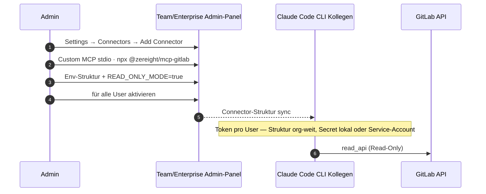

**Token-Problem (Quelle, nicht „gelöst“):** Der `GITLAB_PERSONAL_ACCESS_TOKEN` ist pro User unterschiedlich. Der org-weite Connector kann nur die Connection-Struktur setzen, nicht den individuellen Token.

| Option | Vorgehen | Tradeoff (Quelle) |
|---|---|---|
| A | Jeder Kollege setzt eigenen Token nach Ersteinrichtung lokal in der Claude-Code-Config | granular, mehr Setup |
| B | Admin-Team verwaltet Service-Account-Token mit `read_api` Scope, org-weit | einfacher, weniger granular |

**Token-Verbrauch-Warnung:** Org-weite Connectors werden bei **allen** Claude Code CLI-Nutzern automatisch aktiviert — Context-Verbrauch kann massiv steigen. Deaktivieren lokal: `ENABLE_CLAUDEAI_MCP_SERVERS=false`.

---

## 6. Kollegen-Einrichtung (§4)

### 6.1 Einmalige Installation

Jeder Kollege führt in Claude Code **einmalig** zwei Befehle aus — installiert wird das **Plugin der eigenen Abteilung**, der Kern `oai` kommt transitiv mit:

```
/plugin marketplace add onsite-ai-devs/Onsite.ai-OS
/plugin install oai-development@onsite-ai-os --scope user
```

Marketing/Controlling analog:

- `/plugin install oai-marketing@onsite-ai-os`
- `/plugin install oai-controlling@onsite-ai-os`

Nur `oai` allein zu installieren liefert **keine** Fach-Skills. Danach: Auto-Update aktiviert. Skill/Hook/Command-Änderungen erreichen den Kollegen beim nächsten Session-Start.

**Private Satelliten-Repos (ab `oai-marketing`, Spec §15.19):** Klon per Default über **SSH**. Ohne eingerichteten SSH-Key vor dem ersten Install einmalig `CLAUDE_CODE_PLUGIN_PREFER_HTTPS=1` setzen, sonst `Permission denied (publickey)`. Mit der Variable greifen die vorhandenen gh-Credentials.

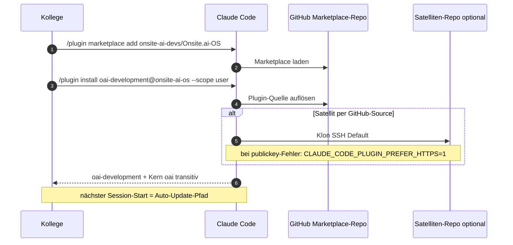

### 6.2 Optional: Token lokal setzen

Falls der org-weite Connector den GitLab-Token nicht enthält — in `~/.claude.json` ergänzen (oder vom Connector überschreiben lassen):

```json
{
  "mcpServers": {
    "gitlab": {
      "type": "stdio",
      "command": "npx",
      "args": ["-y", "@zereight/mcp-gitlab"],
      "env": {
        "GITLAB_API_URL": "https://<gitlab-host>/api/v4",
        "GITLAB_PERSONAL_ACCESS_TOKEN": "glpat-<eigener-token>",
        "GITLAB_READ_ONLY_MODE": "true"
      }
    }
  }
}
```

### 6.3 Projekt-Level Auto-Enable (optional)

Um das Abteilungsplugin für alle zu aktivieren, die im `offsite`-Repo arbeiten, eine `.claude/settings.json` ins `offsite`-Repo committen — aktiviert wird `oai-development` (aktiviert den Kern transitiv; `oai` allein würde die Abteilung **nicht** aktivieren):

```json
{
  "enabledPlugins": {
    "oai-development@onsite-ai-os": true
  }
}
```

Neue Contributor:innen bekommen das Plugin dann automatisch beim ersten Öffnen des Projekts — **sofern** sie den Marketplace einmal hinzugefügt haben.

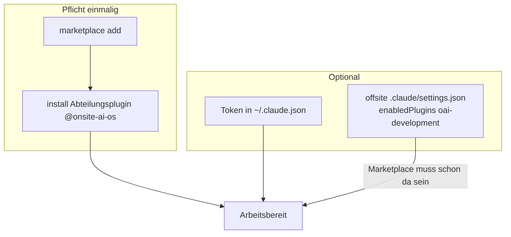

---

## 7. Update-Workflow (§5)

### 7.1 Änderungen veröffentlichen

Nummeriert wie in der Quelle:

1. Skill/Hook/Command im `Onsite.ai-OS`-Repo anpassen
2. Version des **betroffenen Plugins** bumpen — **nur** in `plugins/<name>/.claude-plugin/plugin.json` → `version` (Marketplace-Eintrag bekommt **kein** `version`-Feld); **beim Kern zusätzlich:** `VERSION` und `plugins/oai/module-registry.json` → `version`
3. Beide Ebenen validieren: `claude plugin validate .` **und** `claude plugin validate plugins/<name> --strict` je berührtem Plugin; dazu `node --test plugins/oai/tests/*.test.mjs` (Struktur-Invarianten)
4. Commit + Push zum `main`-Branch
5. Kollegen erhalten die Änderung beim nächsten Claude-Code-Session-Start

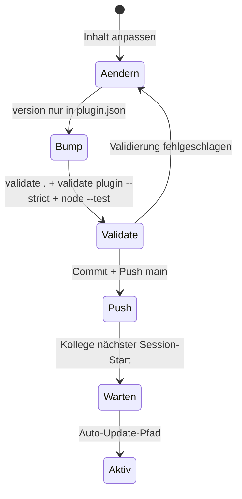

### 7.2 Bekannte Auto-Update-Probleme (Stand Juli 2026)

So in der Quelle; nicht „behoben“ glätten:

| Problem | Status | Workaround |
|---|---|---|
| Auto-Update führt `git fetch` aus, aber kein `git pull` — Version bleibt stale | [GitHub Issue #49410](https://github.com/anthropics/claude-code/issues/49410) | Kollege muss `/plugin marketplace update onsite-ai-os` manuell ausführen |
| Auto-Update verwaist alle Versionen, Plugin lädt nicht beim Session-Start | [GitHub Issue #60219](https://github.com/anthropics/claude-code/issues/60219) | `/reload-plugins` nach Session-Start ausführen |

Die Bugs sind bekannt und werden von Anthropic bearbeitet. Bis sie gefixt sind: im Team-Chat auf Updates hinweisen, damit Kollegen ggf. manuell updaten.

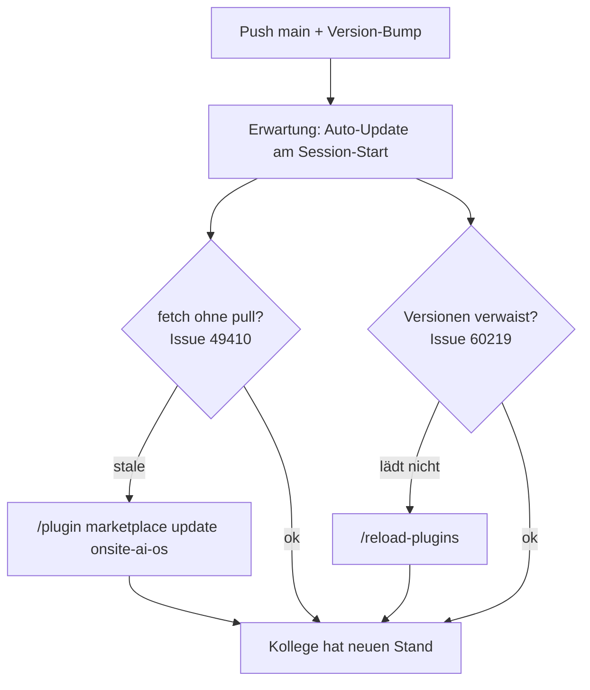

### 7.3 Dev-Version vs. verteilte Version

Der Maintainer arbeitet mit einer lokalen Dev-Version, die direkt aus dem Arbeitsverzeichnis lädt — nicht aus dem GitHub-Clone:

```
/plugin marketplace add /path/to/lokal/Onsite.ai-OS
```

Änderungen werden nach `/reload-plugins` sofort aktiv, ohne Commit oder Push. Dev- und verteilte Version können **koexistieren**, wenn der Marketplace-Name unterschiedlich ist (z. B. `onsite-ai-os-dev` lokal vs. `onsite-ai-os` remote).

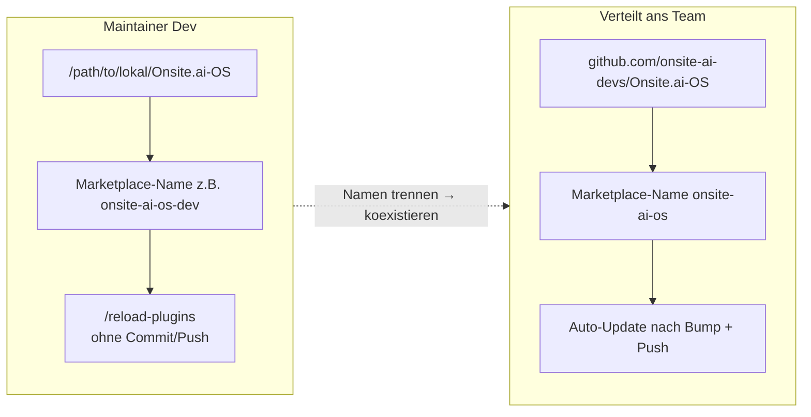

---

## 8. Was Claude Team abdeckt vs. was das OS unersetzlich bleibt (§6)

### 8.1 Was Claude Team/Enterprise vom OS abdeckt

| OS-Komponente | Ohne Team | Mit Team |
|---|---|---|
| MCP-Server-Config (`~/.claude.json` bei jedem) | Jeder Kollege manuell | Admin setzt Connector org-weit |
| Plugin-Installation | `git clone` + manuell | Einmal `/plugin marketplace add`, dann Auto-Update |
| Permission-Management | Jeder Kollege selbst | Enterprise: Admin erzwingt Policies org-weit |
| Onboarding | MCP + Plugin + Skills manuell | Seat zuweisen → Marketplace einmal add → fertig |
| Offboarding | Lokale Config löschen | Seat entfernen → Zugriff weg |

### 8.2 Was vom OS unersetzlich bleibt

| OS-Komponente | Warum Claude Team es nicht ersetzt |
|---|---|
| **Abteilung development: Feature-Skills** (`feat-*`) | PAR-Ticket → Branch → MR-Slices ist team-spezifisch. Kein Standard-Feature. |
| **Abteilung development: MR-/Review-Skills** (`mr-*`, `rev-*`) | Team-spezifischer GitLab-MR- und zweistufiger Review-Prozess (onsite + isento) für das `offsite`-Repo. |
| **Abteilung development: QS-/Release-Skills** (`qs-*`, `rel-*`) | Jira-QS-Zyklus (QS ≠ Review, Feedback als Jira-Kommentare) und `exec-*`-Prod-Ops-Checklisten. |
| **Incident-Wissen** | PAR-spezifische Fehlermuster (PAR-1593, Blue-Green-Timing) — aktuell in den `qs-*`-Skills, künftig ggf. eigenes Modul. |
| **Core-Anweisungen (CLAUDE.md)** | Projektwissen über Offsite-Architektur, Sync-Direction, Data Model, Auth-Chain. |
| **Hooks** | Team-spezifische Safety-Gates und Pre-Commit-Checks (ab Core-Build). |
| **GitLab CE Integration** | Anthropic unterstützt nativ nur GitHub. Das MCP-Setup bleibt nötig. |

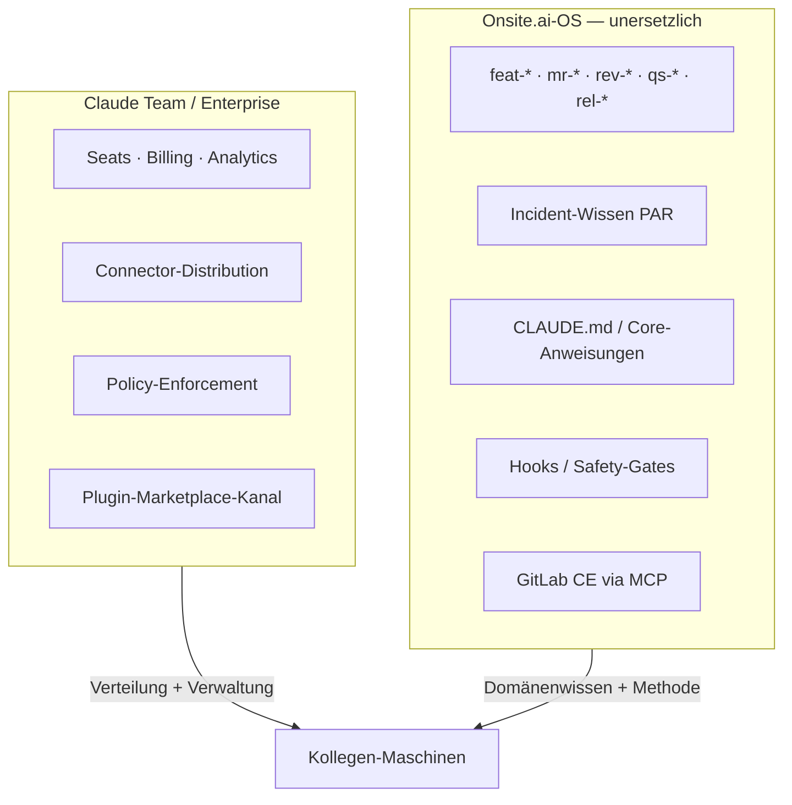

Kurz: die Plattform löst **Verteilung und Verwaltung**. Das OS ist die Schicht **auf** der Plattform und macht Claude Code für den konkreten Entwickleralltag nützlich. Das eine ersetzt das andere nicht (§7.6 der Quelle).

---

## 9. Designentscheidungen §7 — Entscheidungs-Grafik

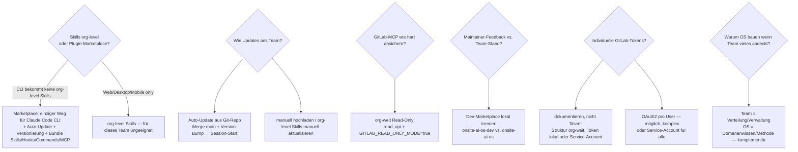

| Entscheidung | Begründung (Quelle) |
|---|---|
| **Warum Plugin-Marketplace statt org-level Skills?** | Org-level Skills nur Web/Desktop/Mobile, **nicht** Claude Code CLI. Team arbeitet primär in der CLI → Marketplace ist der einzige funktionierende Weg. Plugins: Auto-Update aus Git, Versionierung, Bündelung Skills+Hooks+Commands+MCP. |
| **Warum Auto-Update aus dem Git-Repo?** | Jeder Merge in `main` mit Version-Bump propagiert automatisch. OS entwickelt sich weiter, ohne dass Kollegen etwas tun müssen. Vorteil gegenüber manueller Verteilung oder org-level Skills (manuell hochladen und aktualisieren). |
| **Warum das Read-Only-MCP org-weit setzen?** | Zweifache Sperre (`read_api` + `GITLAB_READ_ONLY_MODE=true`) verhindert versehentliches Mergen/Löschen durch AI-Agents. Im Team-Kontext wichtiger als im Einzelsetup. Details: `gitlab-mcp-integration.md` Abschnitt 8.2. |
| **Warum Dev- und verteilte Version trennen?** | Maintainer braucht sofortiges Feedback (`/reload-plugins`) ohne Commit/Push. Verteilt läuft über GitHub + Auto-Update. Unterschiedliche Marketplace-Namen verhindern Kollision. |
| **Warum Token-Problem dokumentieren und nicht lösen?** | Org-Connector setzt Struktur, nicht User-Tokens. Echte Lösungen: OAuth2 pro User (komplex) oder Service-Account für alle (weniger granular). Pragmatisch: Struktur org-weit, Token einmalig lokal. |
| **Warum trotzdem Onsite.ai-OS?** | Claude Team löst Verteilungs-/Verwaltungsproblem, **nicht** Domänenwissen (PAR-Workflow, GitLab-MR-Review, Tryb-Sync, Blue-Green). OS ist Schicht auf der Plattform. |

---

## 10. Konzept der Auslieferung (Überblick §1.1)

Sobald ein Kollege den Marketplace einmalig hinzufügt und **sein Abteilungsplugin** installiert, erhält er:

- Die Skills seiner Abteilung (Beispiel Quelle: `oai-development`: 17 Skills in 6 Modulen — Feature, MR, Review, QS, Release, PartSens-Betrieb — Namespace `/oai-development:<skill>`)
- Den Kern `oai` **transitiv** über `dependencies` (Shared-Skills der ständigen Abteilung `gemeinsam`, Kontroll-Hooks — FFG v2 gebaut und aktiv —, WP-Rahmen WP0–WP8)
- Auto-Updates bei jedem Push in das Repo (mit Version-Bump des betroffenen Plugins)

Zusätzlich: **GitLab MCP-Connector** von Admin-Seite org-weit — sync zu Claude Code CLI, keine manuelle `.claude.json`-Editierung mehr bei jedem Kollegen (Token-Ausnahme: §5.4 / §6.2).

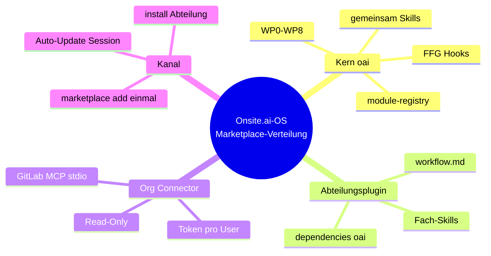

---

## 11. Artefakte

| Aktion | Artefakt |
|---|---|
| **Gelesen** | `marketplace.json`, `plugin.json` der berührten Plugins, Validierungs-Output, bei Satelliten Source/ref/SHA-Pin-Kontext aus Spec-Verweisen der Quelle |
| **Geschrieben (Admin/Maintainer)** | Plugin-Inhalt, Version-Bump in `plugin.json` (+ Kern: `VERSION`, `module-registry.json`), Commit/Push `main`, optional org-Connector im Admin-Panel |
| **Geschrieben (Kollege)** | einmal Marketplace + Install; optional `~/.claude.json` Token; optional nichts bei Auto-Enable aus `offsite` |
| **Nie angefasst durch CTD allein** | Fachliche Skill-Logik „erfinden“, org-level Skills als CLI-Ersatz, Marketplace-`version`-Felder, individuelle Tokens im org-Connector als gelöstes Secret |

---

## 12. Kopplungen (nur soweit die Quelle / Familienkarte sie nennt)

| Kopplung | Inhalt |
|---|---|
| Familie → CTD | Nach Sync-Nachzug, wenn Team den Stand kriegen soll: Bump + Tag + bei Satellit SHA-Pin |
| `abteilungs-plugin-bau` | Marketplace-Fakten, die dort wiederholt werden; Satelliten-Extraktion ändert Source-Art |
| `gitlab-mcp-integration.md` §8.2 | Begründung Read-Only-MCP (Quelle verweist) |
| Spec §15.16/§15.18/§15.19/§15.33 | Multi-Plugin, Satelliten, Plugin-Wurzel am Satelliten-Repo |
| Anthropic Issues #49410, #60219 | Auto-Update-Fallen |

Keine Team-Mindestversion steht in der Quelldatei. **Ist-Stand-Hinweis (Featurekarte, nicht normativ für diesen Prozess):** Kern `oai` 0.21.0 · Satellit `oai-development` 0.11.0 · Satellit `oai-marketing` 0.4.1 (Marketplace-Pin) · `oai-controlling` 0.1.0 — Stand Featurekarte 2026-08-15. Die Prozessquelle selbst beschreibt Struktur am Beispiel Kern v0.8.0 / Plugin-Beispiel `0.8.0`.

---

## 13. Fallen und bekannte Fehler

| Falle | Wirkung | Gegenmaßnahme (Quelle) |
|---|---|---|
| Kein Version-Bump | kein Auto-Update | immer `plugin.json` bumpen |
| `version` im Marketplace-Eintrag | still maskiert / ignoriert ohne Warnung | nie dort setzen |
| Nur `oai` installieren | keine Fach-Skills | immer Abteilungsplugin installieren |
| `oai` allein in `enabledPlugins` | aktiviert Abteilung nicht | `oai-development@onsite-ai-os` (o. ä.) |
| SSH ohne Key bei Satellit | `Permission denied (publickey)` | `CLAUDE_CODE_PLUGIN_PREFER_HTTPS=1` |
| fetch ohne pull (#49410) | stale Version | `/plugin marketplace update onsite-ai-os` |
| verwaiste Versionen (#60219) | Plugin lädt nicht | `/reload-plugins` |
| org-MCP ohne Token-Plan | Connector-Struktur da, Auth fehlt | Option A lokal / Option B Service-Account |
| org-MCP bei allen aktiv | Context-Verbrauch massiv | `ENABLE_CLAUDEAI_MCP_SERVERS=false` wer es nicht will |
| Dev- und Prod-Marketplace gleicher Name | Kollision | Namen trennen (`…-dev` vs. `onsite-ai-os`) |

---

## 14. Verifikation / Abschluss

Aus dem Update-Workflow der Quelle ableitbar:

1. `claude plugin validate .` (Marketplace-Ebene)
2. `claude plugin validate plugins/<name> --strict` je berührtem Plugin
3. `node --test plugins/oai/tests/*.test.mjs`
4. Commit + Push `main` mit Version-Bump des betroffenen Plugins
5. Stichprobe Kollege: Session-Start bzw. bei Bugs manuelle Update-Befehle
6. Bei Ersteinrichtung Kollege: Marketplace add + Abteilungs-Install + optional Token + optional Auto-Enable geprüft

Admin-Seite zusätzlich: Connector im Panel aktiv, Env-Keys gesetzt, Read-Only-Flag true, Token-Strategie A oder B kommuniziert.

---

## 15. Anhang — Dateizeiger zurück in die Quelle

| Thema | Stelle in `claude-team-distribution.md` |
|---|---|
| Zweck, Plugin-Familie, was der Plan liefert | §1 Übersicht, §1.1–1.2 |
| Voraussetzungen Anthropic / GitHub / Kollege | §2.1–2.3 |
| Marketplace-Struktur | §3.1 |
| `marketplace.json` | §3.2 |
| `plugin.json` + Versions-Regel | §3.3 |
| GitLab MCP org-weit + Token-Problem | §3.4 |
| Kollegen Install / Token / Auto-Enable | §4.1–4.3 |
| Update-Workflow | §5.1 |
| Auto-Update-Bugs Juli 2026 | §5.2 |
| Dev-Version | §5.3 |
| Was Team abdeckt / OS bleibt | §6.1–6.2 |
| Designentscheidungen | §7.1–7.6 |
| Versionshistorie des Manuals | Kopf 1.1.0 / 1.2.0 / 1.3.0 |
| Satelliten-Quellen | Kopf 1.3.0, §3.1, §4.1, Spec-Verweise |

**Quellpfad (normativ):** `Onsite.ai-OS/knowledge base/plugin-maintanance-ruleset-source/claude-team-distribution.md`

**Verwandte Karte:** [00-FAMILIE-UND-VERDRAHTUNG.md](00-FAMILIE-UND-VERDRAHTUNG.md) — CTD als Auslieferungs-Ende nach Sync-Nachzug.

**Extern in der Quelle:** Sean Lynch Recherche · Issues #49410, #60219 · `gitlab-mcp-integration.md` §8.2

---

*Prozesskarte 06 · Claude Team Distribution · 2026-08-15 · nicht normativ.*
