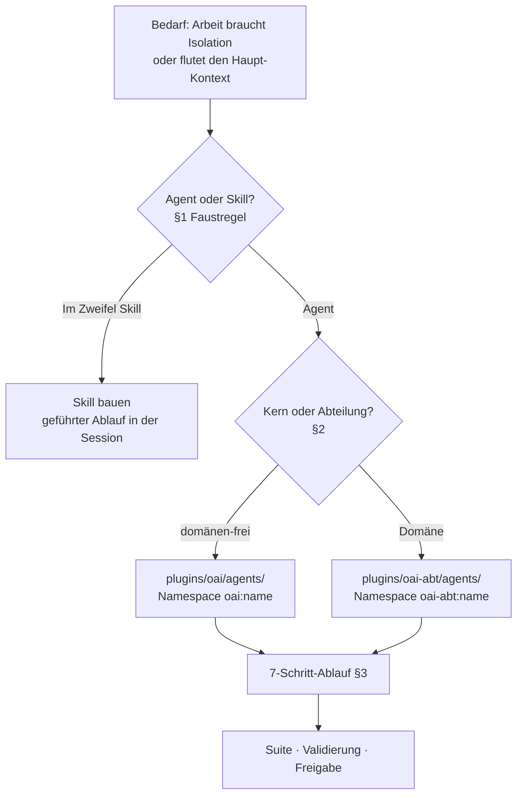
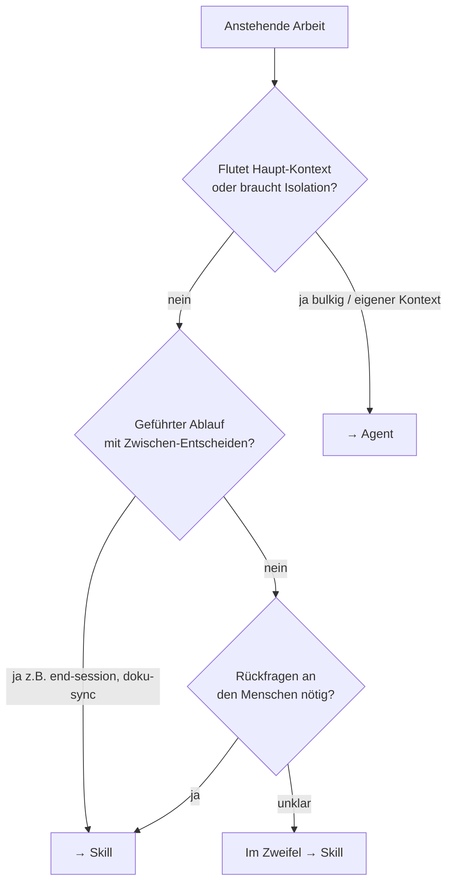
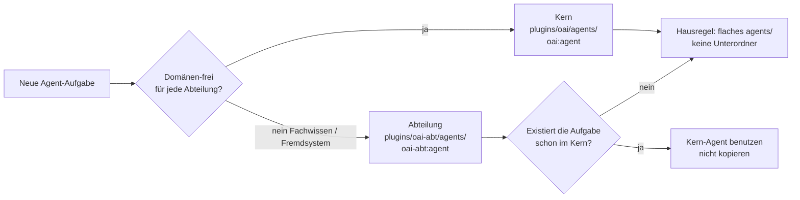
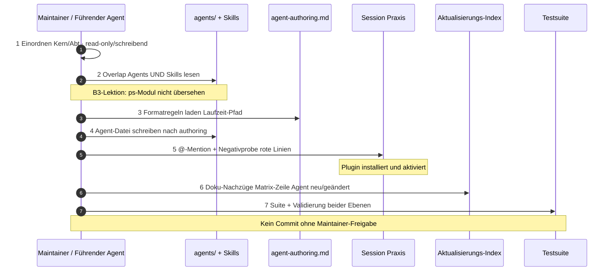
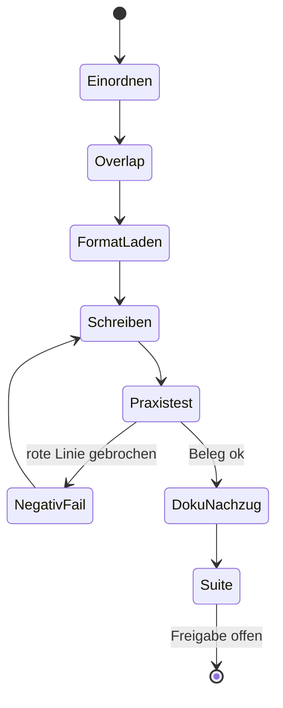
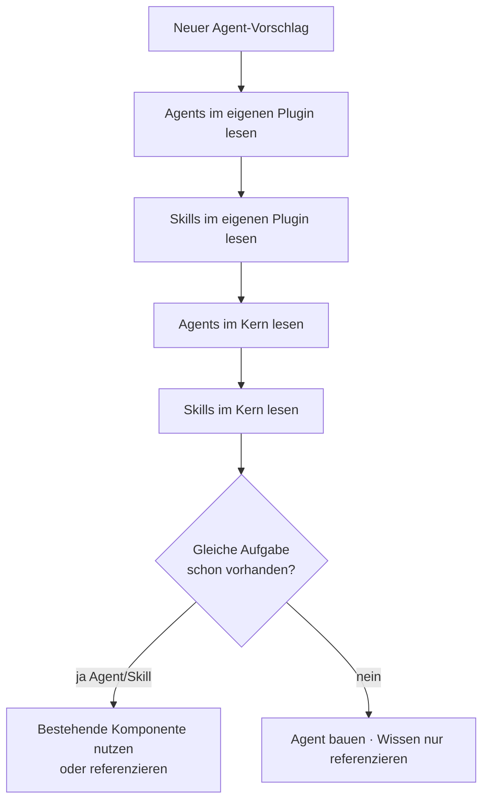
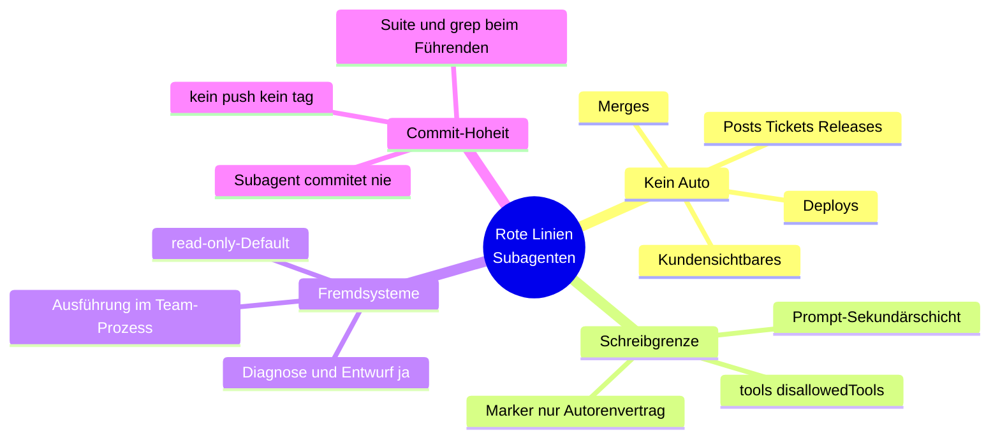
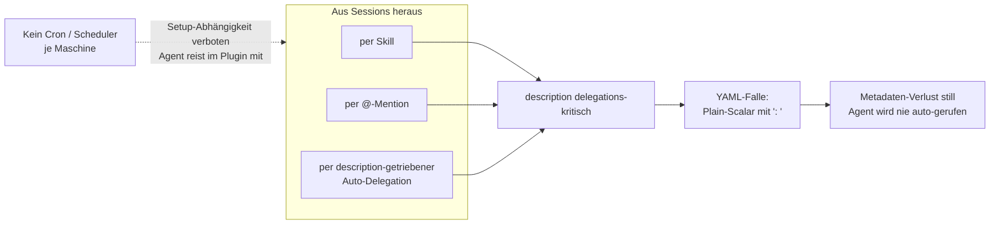
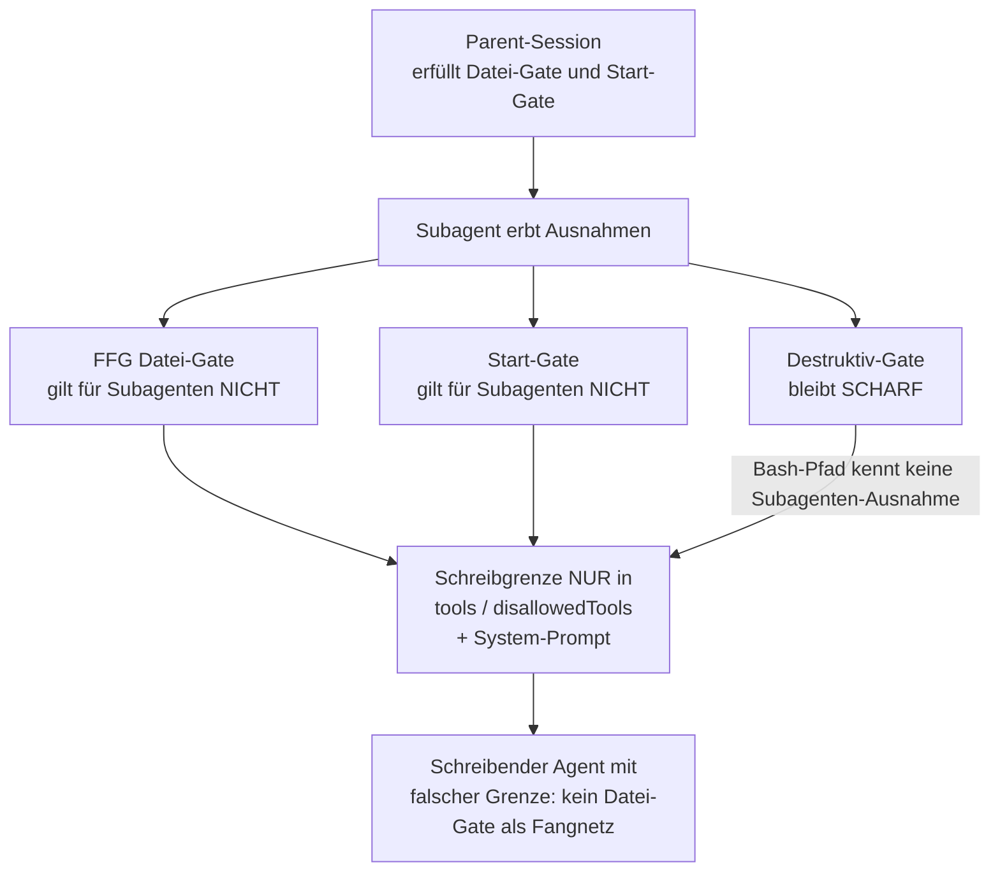
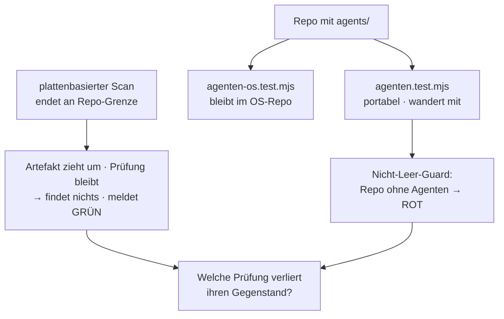

# Subagenten-Bau — Prozesskarte

> **Was das ist:** Visuelle Landkarte des Standardprozesses für Anlegen und Ändern von
> Subagenten im `agents/`-Verzeichnis eines Onsite.ai-OS-Plugins (Kern wie Abteilung).
> **Quelle (normativ):** `Onsite.ai-OS/knowledge base/plugin-maintanance-ruleset-source/subagenten-bau.md`
> **Stand der Karte:** 2026-08-15 · gegen die Quelldatei auf der Platte
> **Nicht normativ.** Bei Widerspruch gewinnt die Quelldatei.

Schwester-Prozesse: `abteilungs-plugin-bau.md` (Plugin-/Marketplace-Ebene) und
`kern-plugin-bau.md`. Dateiformat (Frontmatter-Feldkanon, YAML-Falle, Schreibsperren-Regel,
Prompt-Gliederung) regelt `agent-authoring.md` — im Kern-Plugin unter
`plugins/oai/referenz/agent-authoring.md`. Diese Karte deckt die **Prozess-Ebene**:
Einordnung, 7-Schritt-Ablauf, rote Linien, Trigger, Gates, Testschutz. Familien-Kontext:
[00-FAMILIE-UND-VERDRAHTUNG.md](00-FAMILIE-UND-VERDRAHTUNG.md). Normative Grundlage der
Quelle: Spec §15.34. Mechanik-Aussagen gegen Claude-Code-Doku verifiziert (abgerufen
2026-08-13: `sub-agents`, `plugins-reference`).

---

## 1. Zweck in einem Satz

Wenn ein Subagent in `agents/` neu entsteht oder geändert wird: erst Agent-vs-Skill und
Scope klären, Overlap gegen Agents **und** Skills prüfen, nach `agent-authoring.md` bauen,
praxistesten, Doku nachziehen, Suite — und den portablen Prüfbaustein mitwandern lassen.

Der Prozess greift **nicht** bei reiner Skill-Arbeit, bei Plugin-Struktur ohne Agenten und
bei Format-Fragen allein — Format steht in `agent-authoring.md`. Er greift, sobald eine
Datei unter `agents/` angelegt oder geändert wird, egal ob Kern oder Satellit.

---

## 2. Wann Agent, wann Skill

**Faustregel (Quelle §1):** Flutet die Arbeit den Haupt-Kontext oder braucht sie Isolation →
Agent; geführter Ablauf in der Haupt-Session → Skill. **Im Zweifel Skill.**

| Richtung | Wann | Beispiele aus der Quelle |
|---|---|---|
| **Skill** | Session geht jeden Schritt mit; Zwischen-Entscheide; kleine fokussierte Checks; Rückfragen an den Menschen | `/oai:end-session`, `/oai:doku-sync`, Einzelbefund über `ps-debug` |
| **Agent** | Haupt-Kontext würde fluten oder eigener Kontext nötig; bulkige Lese-/Schreibarbeit; klar umrissene Aufträge mit Zusammenfassungs-Rückgabe; unabhängige Zweitdiagnose | `sync-nachzug-executor` (gebündelte Doku-Nachzüge), `partsens-geraete-doktor` (geräteübergreifende Diagnosen) |

Ein Agent kostet einen Delegations-Schritt und liefert nur eine Zusammenfassung zurück.
Die `description` grenzt Pflicht-gemäß zum nächstliegenden Skill ab (Regel in
`agent-authoring.md`), damit Auto-Delegation die richtige Komponente wählt.

---

## 3. Scope: Kern oder Abteilung

| Regel | Inhalt |
|---|---|
| Domänen-frei → Kern | Aufgaben, die jede Abteilung gleichermaßen hat (Doku-Nachzüge, Repo-Pflege). Namespace `oai:<agent>`. |
| Domäne → Abteilung | Fachwissen, Fremdsysteme, Workflows genau einer Abteilung. Beispiel: PartSens-Diagnose in `oai-development`. Namespace `oai-<abteilung>:<agent>`. |
| Prüfungs-Eigentum | Spec §15.22: Kein Abteilungs-Agent dupliziert oder schwächt einen Kern-Agenten ab. Existiert die Aufgabe im Kern → Kern-Agent nutzen, nicht kopieren. |
| Flaches Layout | Keine Unterordner unter `agents/`. Unterordner würden Teil des Scoped Identifier (`p:ordner:name`); bei einstelligen Agentenzahlen kein Mehrwert, nur Test- und Pflege-Reibung. |
| Verbotene Felder | `hooks`, `mcpServers`, `permissionMode` — lautlos ignoriert bei Plugin-Agenten, deshalb **verboten**. Wer sie braucht: Agent in `.claude/agents/` des Arbeits-Repos, nicht ins Plugin. |
| isolation gesperrt | `isolation: worktree` in v1 gesperrt bis Team-Mindestversion ≥ 2.1.203. Details in `agent-authoring.md`. |

---

## 4. Ablauf: neuen Agenten bauen (7 Schritte)

Quelle §3, nummeriert 1–7. Formatdetails (Pflichtfelder, Block-Scalar, Prompt-Gliederung)
stehen in `agent-authoring.md` — hier nur Prozess-Verweise, keine Format-Erfindung.

### Schritt für Schritt

1. **Einordnen:** Kern oder Abteilung (§2), read-only oder schreibend. Die Entscheidung
   steuert die Werkzeuggrenze und wird später über `disallowedTools` bzw. den Marker
   `<!-- oai:schreibend -->` belegt.
2. **Overlap-Prüfung gegen bestehende Agents UND Skills.** Gilt **auch gegen Skills**
   (B3-Lektion): Bei der ersten Garnitur-Planung wurde das bestehende `ps`-Modul
   (`ps-debug`/`ps-healthcheck` samt Referenzdateien) übersehen und ein drittes, divergentes
   Runbook vorgeschlagen — im externen Review gefangen. Bestehende Agents **und** Skills des
   eigenen und des Kern-Plugins zuerst lesen. Wissen lebt einmalig in den Skills — der Agent
   referenziert es (`skills:`-Preload oder explizite Leseanweisung), statt eine zweite Kopie
   zu bauen.
3. **Formatregeln laden:** `agent-authoring.md` des Kern-Plugins lesen. Laufzeit-Pfad im
   installierten Plugin — installierte Plugins sehen keine Repo-Pfade wie `knowledge base/…`;
   im OS-Repo liegt die Datei unter `plugins/oai/referenz/`.
4. **Agent-Datei schreiben** nach `agent-authoring.md`: Pflichtfelder `name` (== Dateiname)
   und `description` (`>-`-Block-Scalar, mit Einsatz-Situation **und** Abgrenzung zum
   nächstliegenden Skill), Schreibsperren-Regel (harte `disallowedTools`-Sperre **oder**
   Schreibend-Deklaration mit begründeter `tools`-Allowlist), Prompt-Gliederung Rolle →
   Vorgehen → Regeln (rote Linien zuerst) → Rückgabe-Format. Keine Formatdetails hier
   erfinden — Quelle verweist ausdrücklich auf `agent-authoring.md`.
5. **Praxistest:** expliziter Aufruf per @-Mention in einer echten Session **plus**
   Negativprobe auf die roten Linien (read-only-Agent darf nicht schreiben; schreibender
   Agent darf deklarierte Grenze nicht überschreiten). Beleg im Ergebnis dokumentieren.
   Vorbedingung: Plugin installiert **und aktiviert**.
6. **Doku-Nachzüge** gemäß Zeile „Agent neu/geändert" im `Aktualisierungs-Index`
   (u. a. `module-registry.json` Agents-Segment, Betriebshandbuch, Repo-Karten, CHANGELOG) —
   und bei neuer Prozess-/Wissensdatei den `SSOT-Document-Index` nicht vergessen.
7. **Abschluss nach Standardzyklus:** Suite (`node --test plugins/oai/tests/*.test.mjs`),
   Validierung beider Ebenen, Protokoll-Pflichten — **kein Commit ohne Maintainer-Freigabe.**

Ohne bestandene Negativprobe kein Doku-Nachzug als „fertig“ deklarieren. Overlap vor dem
Schreiben verhindert divergente Runbooks (B3). Schritt 3 vor Schritt 4: Format aus dem
Laufzeit-Pfad, nicht aus dem Gedächtnis.

---

## 5. Overlap-Prüfung (Agents und Skills)

**B3-Lektion (Quelle §3 Schritt 2):** Das `ps`-Modul (`ps-debug` / `ps-healthcheck` +
Referenzdateien) wurde übersehen; ein drittes divergentes Runbook war der Beinahe-Schaden.
Overlap gilt gegen **Agents und Skills**, eigenes Plugin **und** Kern. Wissen einmalig in
Skills; Agent referenziert (`skills:`-Preload oder Leseanweisung), kopiert nicht.

---

## 6. Rote Linien für Agenten

Quelle §4. Gelten für jeden Subagenten, read-only wie schreibend.

| Linie | Inhalt |
|---|---|
| Kein Automatisieren | Merges, Deploys, Kundensichtbares (Posts, Ticket-Kommentare, Release-Schritte). Entwürfe ja, Ausführung nein — Mensch und Team-Prozess. |
| Schreibgrenze explizit | Hart in `tools`/`disallowedTools` (einzige Laufzeitgrenze) **und** als Regel im System-Prompt (Sekundärschicht) — nie im Vertrauen auf die Gates (§6 der Quelle). Marker `<!-- oai:schreibend -->` = Autoren-/Test-Vertrag, **keine** Laufzeitgrenze. |
| Fremdsysteme | Produktive Fremdsysteme read-only-Default (PartSens-Geräte, Jira, produktive DBs): Diagnose und Eingriffs-Entwurf im Agenten, Ausführung im Team-Prozess. |
| Commit-Hoheit | Bleibt beim führenden Agenten/Maintainer. Subagenten committen, pushen und taggen nie. Deterministische Gegenprobe (Testsuite, grep-Sweeps) bleibt Pflicht des Führenden — Subagenten-Review allein ließ bereits Fehler durch (Warn-Beleg `agent-learnings.md` 2026-08-12). |

---

## 7. Trigger-Mechanik

Aufruf nur aus Sessions: Skill, @-Mention oder Auto-Delegation über `description`.
Deshalb ist `description` delegations-kritisch — stiller Metadaten-Verlust (YAML-Falle:
Plain-Scalar mit `: `) heißt: der Agent wird nie automatisch gerufen, und niemand merkt es.
**Kein Cron/Scheduler je Maschine.** Trigger-Automatik wäre verbotene Setup-Abhängigkeit;
Verteilannahme: Agenten reisen im Plugin mit, ohne per-Maschinen-Setup. Format der
`description` (Block-Scalar `>-` usw.) steht in `agent-authoring.md`.

---

## 8. Gate-Semantik: Subagenten und die Kontroll-Schicht

| Gate | Für Subagenten | Beleg / Konsequenz |
|---|---|---|
| FFG-**Datei**-Gate | gilt **nicht** | Parent hat es erfüllt (`oai-ffg.js` Edit/Write-Zweig) |
| **Start**-Gate | gilt **nicht** | Parent hat es erfüllt (`oai-start-gate.js`) |
| **Destruktiv**-Gate | bleibt **scharf** | Bash-Pfad kennt keine Subagenten-Ausnahme |

**Konsequenz:** Schreibgrenzen stehen in `tools`/`disallowedTools` plus System-Prompt —
nie im Vertrauen auf die Gates. Ein schreibender Agent mit falsch gesetzter Grenze hat
**kein** Datei-Gate als Fangnetz. Abteilungen dürfen eigene Domänen-Hooks um ihre Agenten
bauen, duplizieren oder schwächen aber keine Kern-Prüfung (Prüfungs-Eigentum, Spec
§15.22/§15.34).

---

## 9. Testschutz: der Prüfbaustein wandert mit

**Regel (Quelle §7):** Bekommt ein Repo ein `agents/`-Verzeichnis, wandert der portable
Prüfbaustein `agenten.test.mjs` im selben Zug mit — bei Satelliten-Extraktion gemeinsam mit
den Agenten, nicht später.

**Begründung (belegte Beinahe-Lektion, `Debugging + findings/agent-learnings.md` 2026-08-14):**
Die Testsuite scannt **plattenbasiert**; ein plattenbasierter Scan endet an der Repo-Grenze.
Zieht ein geprüftes Artefakt in ein anderes Repo, verliert eine zurückgebliebene Prüfung
ihren Gegenstand — **ohne rot zu werden**. Sie findet dann schlicht nichts mehr und meldet
grün. Genau so wäre bei der `development`-Extraktion die Frontmatter-Prüfung von 17 Skills
lautlos verschwunden.

| Baustein | Ort / Eigenschaft | Rolle |
|---|---|---|
| `plugins/oai/tests/agenten.test.mjs` | **portabel** | Keine hartkodierte Verzeichnistiefe (Repo-Wurzel wird gesucht, nicht gezählt); kein Bezug auf Registry, Vorlagen oder andere OS-Repo-Artefakte; **Nicht-Leer-Guard** — Kopie in Repo ohne Agenten → Rot statt stiller Zustimmung. |
| `agenten-os.test.mjs` | **bleibt im OS-Repo** | Repo-gebundene Invarianten (Registry-Abgleich, Vorlagen-Platzhalter). Bewusst **keine** „überspringen, wenn Datei fehlt"-Logik in einer gemeinsamen Datei: still übersprungener Test meldet grün ohne geprüft zu haben (Maintainer-Entscheid 2026-08-14). |
| Baustein-Version | im Kopf von `agenten.test.mjs` | Jede inhaltliche Änderung zählt sie hoch; Satelliten-Kopie mit niedrigerer Nummer = Drift erkennbar. Rückrichtung (Kopien nach Kern-Änderung nachziehen) → Matrix-Zeile „Agent neu/geändert" im `Aktualisierungs-Index`. |

**Frage bei jedem Rückbau oder Umzug:** „Welche Prüfung verliert hier ihren Gegenstand?"

---

## 10. Artefakte

| Richtung | Was | Pfade / Namen aus der Quelle |
|---|---|---|
| **gelesen** | Formatregeln | `plugins/oai/referenz/agent-authoring.md` (Laufzeit im Plugin; Repo-Pfad im OS) |
| **gelesen** | bestehende Agents + Skills | eigenes Plugin + Kern (Overlap) |
| **gelesen** | Matrix-Zeile | `Aktualisierungs-Index` „Agent neu/geändert" |
| **geschrieben** | Agent-Datei | `plugins/oai/agents/` oder `plugins/oai-<abteilung>/agents/` — flach |
| **geschrieben / mitwandern** | portabler Test | `agenten.test.mjs` mit dem `agents/`-Baum |
| **nachgezogen** | Doku | `module-registry.json` Agents-Segment, Betriebshandbuch, Repo-Karten, CHANGELOG; ggf. `SSOT-Document-Index` |
| **nie angefasst vom Subagenten** | Commit, Push, Tag | Commit-Hoheit beim Führenden/Maintainer |
| **nicht ins Plugin** | Agent mit `hooks` / `mcpServers` / `permissionMode` | stattdessen `.claude/agents/` des Arbeits-Repos |
| **gesperrt in v1** | `isolation: worktree` | bis Team-Mindestversion ≥ 2.1.203 |

---

## 11. Kopplungen

| Kopplung | Rolle |
|---|---|
| `abteilungs-plugin-bau` / `kern-plugin-bau` | Schwestern: Agenten sitzen in einem der beiden Plugins |
| `agent-authoring.md` | Dateiformat, YAML-Falle, Schreibsperren-Regel, Prompt-Gliederung — **nicht** in dieser Karte wiederholt |
| `Aktualisierungs-Index` | Zeile „Agent neu/geändert"; Baustein-Version nachziehen |
| `sync-nachzug-bauzyklus` / Executor | Doku-Nachzüge gebündelt; Beispiel-Agent `sync-nachzug-executor` |
| Kontroll-Schicht | `oai-ffg.js`, `oai-start-gate.js`, Destruktiv-Gate — Subagenten-Ausnahmen im Code belegt |
| Spec §15.22 / §15.34 | Prüfungs-Eigentum; normative Grundlage Subagenten |
| `agent-learnings.md` | Warn-Belege 2026-08-12 (Subagenten-Review allein), 2026-08-14 (portabler Baustein) |

---

## 12. Fallen / bekannte Fehler

| Falle | Symptom | Gegenmaßnahme in der Quelle |
|---|---|---|
| YAML-Falle `description` | Plain-Scalar mit `: ` → stiller Metadaten-Verlust; Auto-Delegation ruft nie | `description` als `>-`-Block-Scalar; Format in `agent-authoring.md` |
| Overlap nur gegen Agents | divergentes Runbook neben bestehendem Skill (B3 / `ps`) | Overlap gegen Agents **und** Skills, eigenes Plugin **und** Kern |
| Schreibgrenze nur im Prompt | Laufzeit lässt Schreiben zu; Gates fangen Subagenten-Dateien nicht | Harte Grenze in `tools`/`disallowedTools` |
| Vertrauen auf Datei-Gate | Parent hat Gate erfüllt; Subagent erbt Ausnahme | Destruktiv-Gate bleibt scharf; Datei-Gate nein |
| Test bleibt im alten Repo | plattenbasierter Scan meldet grün ohne Gegenstand | `agenten.test.mjs` wandert mit; Nicht-Leer-Guard; Frage nach Gegenstand |
| `isolation: worktree` in v1 | gesperrt bis ≥ 2.1.203 | nicht setzen; Details `agent-authoring.md` |
| Verbotene Frontmatter-Felder | `hooks` / `mcpServers` / `permissionMode` lautlos ignoriert | nicht ins Plugin; ggf. `.claude/agents/` |
| Subagenten-Review allein | Fehler durch (2026-08-12) | Suite + grep-Sweep beim Führenden |

---

## 13. Verifikation / Abschluss

1. Praxistest: @-Mention + Negativprobe rote Linien; Plugin installiert und aktiviert; Beleg dokumentiert.
2. Overlap-Protokoll: keine parallele Skill-/Agent-Duplikation; Wissen referenziert, nicht kopiert.
3. Schreibgrenze in `tools`/`disallowedTools` (und Prompt) — Marker allein reicht nicht.
4. Doku-Nachzüge laut `Aktualisierungs-Index` „Agent neu/geändert"; bei neuer Wissensdatei `SSOT-Document-Index`.
5. Suite: `node --test plugins/oai/tests/*.test.mjs`; Validierung beider Ebenen; Protokoll-Pflichten.
6. Bei neuem/umgezogenem `agents/`: `agenten.test.mjs` liegt im selben Repo; Baustein-Version stimmig; `agenten-os.test.mjs` nur im OS-Repo erwartet.
7. **Kein Commit ohne Maintainer-Freigabe.**

---

## 14. Anhang — Dateizeiger in die Quelle

| Thema | Quelle |
|---|---|
| Agent vs. Skill, Im Zweifel Skill | `subagenten-bau.md` §1 |
| Scope Kern/Abteilung, flaches Layout, verbotene Felder, isolation | §2 |
| 7-Schritt-Ablauf, B3-Lektion Overlap | §3 |
| Rote Linien | §4 |
| Trigger, YAML-Falle, kein Cron | §5 |
| Gate-Semantik Subagenten | §6 |
| Portabler Testbaustein, Nicht-Leer-Guard, Baustein-Version | §7 |
| Dateiformat (nicht hier) | `plugins/oai/referenz/agent-authoring.md` |
| Spec | §15.22 Prüfungs-Eigentum · §15.34 Subagenten |
| Claude-Code-Doku (Abruf 2026-08-13) | `sub-agents`, `plugins-reference` |
| Learnings | `Debugging + findings/agent-learnings.md` (2026-08-12, 2026-08-14) |
| Schwestern | `abteilungs-plugin-bau.md`, `kern-plugin-bau.md` |
| Familie | [00-FAMILIE-UND-VERDRAHTUNG.md](00-FAMILIE-UND-VERDRAHTUNG.md) |

---

*Prozesskarte 07 · Subagenten-Bau · 2026-08-15 · nicht normativ.*
