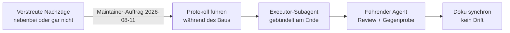
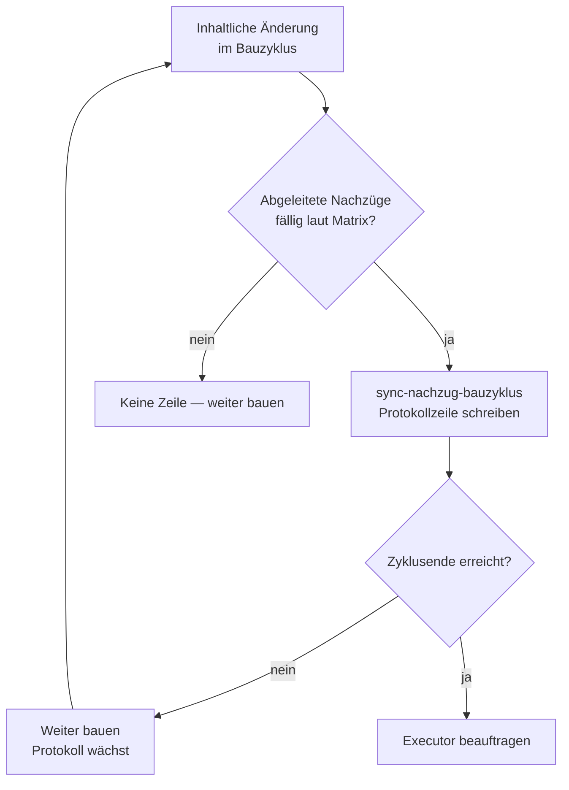
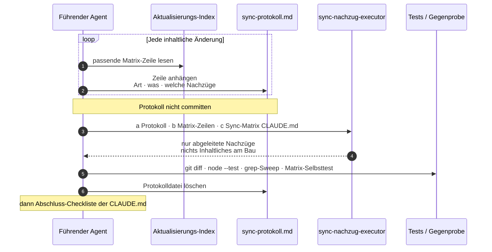
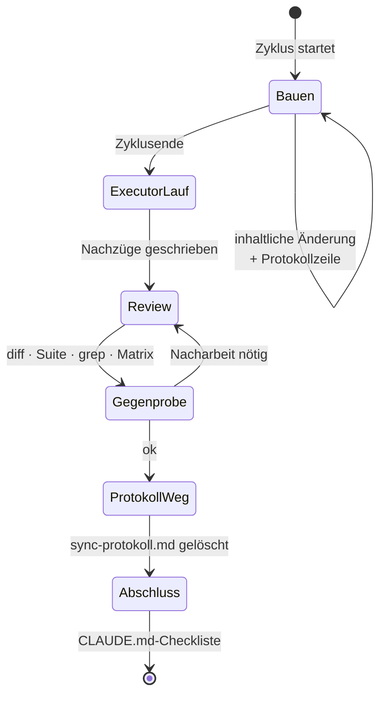
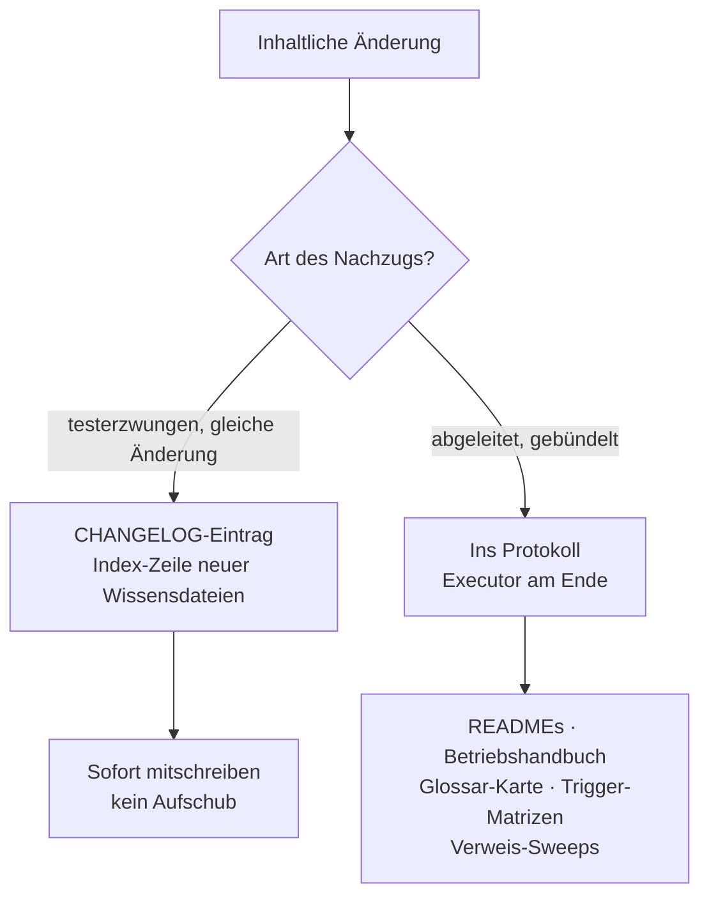
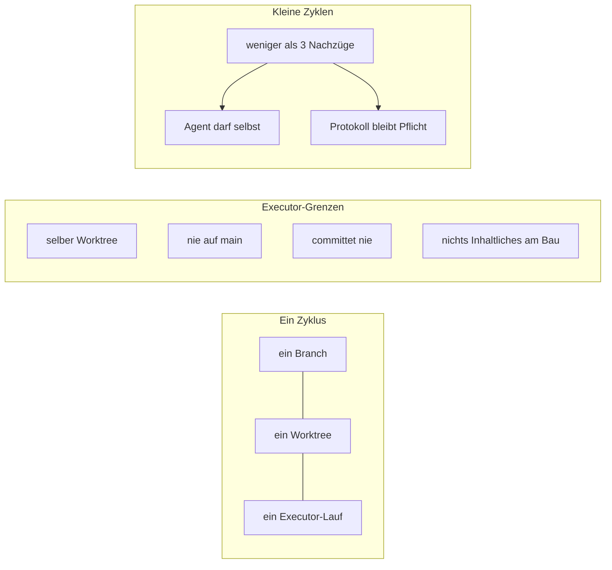
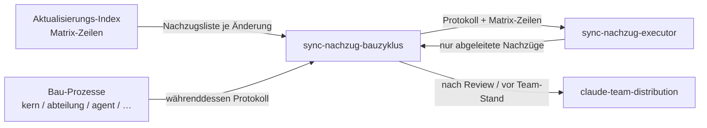

# Sync-Nachzug je Bauzyklus — Prozesskarte

> **Was das ist:** Visuelle Landkarte des Standardprozesses, der abgeleitete Doku-Nachzüge
> pro Bauzyklus protokolliert und gebündelt durch einen Executor abarbeiten lässt —
> statt sie verstreut nebenbei zu erledigen oder gar nicht.
> **Quelle (normativ):** `Onsite.ai-OS/knowledge base/plugin-maintanance-ruleset-source/sync-nachzug-bauzyklus.md`
> **Stand der Karte:** 2026-08-15 · gegen die Quelldatei auf der Platte
> **Nicht normativ.** Bei Widerspruch gewinnt die Quelldatei.

---

## 1. Zweck in einem Satz

Abhängige Dokumente (Sync-Matrix der `CLAUDE.md`, Änderungs-Matrix des
`Aktualisierungs-Index`) werden **während des Baus nur protokolliert** und am
Zyklusende **gebündelt vom Executor-Subagenten** nachgezogen — der führende Agent
liefert Anweisung und Review, nicht die Schreibarbeit.

**Problem:** Macht der führende Agent Nachzüge verstreut nebenbei, fehlt erfahrungsgemäß
etwas und es kostet Stunden; macht er sie gar nicht, driftet die Doku (Belegfälle:
Drift-Serie, Struktur-Umbau 2026-07-29). **Lösung (Maintainer-Auftrag 2026-08-11):**
Nachzüge pro Bauzyklus protokollieren statt sofort erledigen und am Zyklusende gebündelt
vom Executor abarbeiten (vgl. Backlog-Idee Executor-Delegation, 2026-08-10).

---

## 2. Wann der Prozess greift

| Trigger | Nicht-Trigger |
|---|---|
| Inhaltliche Änderung mit abgeleiteten Nachzügen laut Matrix | CHANGELOG + Index-Zeile neuer Wissensdateien (testerzwungen, **gleiche** Änderung) |
| Zyklusende: Protokoll hat Einträge → Executor-Lauf | Reine Lesearbeit ohne Matrix-Treffer |
| Kleine Zyklen &lt; 3 Nachzüge: Agent selbst, Protokoll trotzdem Pflicht | Arbeit ohne Bauzyklus / ohne Worktree |

Sitzt am Zyklusende der Familienkarte: nach Bau und Index-Matrix, vor
`claude-team-distribution`.

---

## 3. Ablauf — vier Schritte

### 1 — Während des Baus: Protokoll führen

Je inhaltlicher Änderung **eine Zeile** in der Zyklus-Protokolldatei (Worktree, z. B.
`sync-protokoll.md` auf oberster Ebene):

`Änderungsart laut Änderungs-Matrix · was geändert · welche Nachzüge fällig`

Quelle der Nachzugsliste ist **immer** die passende Matrix-Zeile des
`Aktualisierungs-Index` — nie das Gedächtnis. Datei **nicht committen**, vor Commit
entfernen (Schritt 4).

### 2 — Am Zyklusende: Executor beauftragen

Subagent `sync-nachzug-executor` erhält (a) Protokoll, (b) zitierte Matrix-Zeilen,
(c) Sync-Matrix-Zeilen aus `CLAUDE.md`. Arbeitet ausschließlich Nachzüge ab
(README/CLAUDE/AGENTS/Betriebshandbuch/SSOT-Index/CHANGELOG/Registry …). Ändert
**nichts Inhaltliches** am Bau selbst.

### 3 — Review + deterministische Gegenprobe

1. `git diff` des Executor-Ergebnisses lesen
2. `node --test plugins/oai/tests/*.test.mjs` (Index-Vollständigkeit, Linkgültigkeit, Versions-Invarianten)
3. `grep`-Sweep nach Alt-Pfaden/Alt-Begriffen aus dem Protokoll
4. Matrix-Selbsttest („habe ich etwas vergessen?")

### 4 — Protokolldatei löschen

Inhalt steckt jetzt in CHANGELOG + Diff. Danach normale Abschluss-Checkliste der
`CLAUDE.md`.

---

## 4. Was ins Protokoll gehört — und was nicht

| Ins Protokoll (abgeleitet) | In derselben Änderung (testerzwungen) |
|---|---|
| READMEs, Betriebshandbuch, Glossar-Karte | CHANGELOG-Eintrag |
| Trigger-Matrizen, Verweis-Sweeps | Index-Zeile neuer Wissensdateien |
| CLAUDE / AGENTS / SSOT-Index / Registry (soweit abgeleitet) | |

Das Protokoll **ersetzt keine Pflicht**. Testerzwungenes bleibt in derselben Änderung;
ins Protokoll gehören nur die *abgeleiteten* Nachzüge.

---

## 5. Regeln — Zyklus, Executor, kleine Fälle

| Regel | Bedeutung |
|---|---|
| Ein Zyklus = ein Branch/Worktree = ein Executor-Lauf | Kein Mischen mehrerer Zyklen |
| Executor im selben Worktree | Kein zweites Arbeitsverzeichnis |
| Nie auf `main` | Nur Feature-Worktree |
| Commit-Hoheit beim Führenden | Executor committet nie |
| &lt; 3 Nachzüge | Agent darf selbst — **Protokoll bleibt Pflicht** (drei Zeilen billig, Vergessen teuer) |

---

## 6. Artefakte

| Richtung | Artefakt | Rolle |
|---|---|---|
| gelesen | `Aktualisierungs-Index` (Änderungs-Matrix) | Quelle jeder Nachzugsliste |
| gelesen | Sync-Matrix-Zeilen aus `CLAUDE.md` | Eingabe (c) an den Executor |
| geschrieben (temporär) | `sync-protokoll.md` (Beispiel, Worktree-Wurzel) | nicht committen, am Ende löschen |
| geschrieben (Executor) | README, CLAUDE, AGENTS, Betriebshandbuch, SSOT-Index, CHANGELOG, Registry … | nur abgeleitete Nachzüge |
| nie angefasst vom Executor | Bau-Inhalt selbst | Führender Agent bleibt Eigentümer |
| nie committed | die Protokolldatei | vor Commit entfernt |

---

## 7. Kopplungen

Nur soweit Quelle und Familienkarte sie benennen:

- **Aktualisierungs-Index:** Jede Protokollzeile zitiert eine Matrix-Zeile.
- **`sync-nachzug-executor`:** schreibt gebündelte Nachzüge; Commit-Hoheit bleibt beim Führenden.
- **Bau-Prozesse:** schreiben während des Baus ins Protokoll; Sync-Nachzug ist Zyklusende.
- **claude-team-distribution:** kommt *danach*, wenn der Stand ins Team soll — nicht Teil dieses Prozesses, nächster Takt in der Familienkarte.

---

## 8. Verifikation / Abschluss

| Check | Befehl / Handlung |
|---|---|
| Diff lesen | `git diff` des Executor-Ergebnisses |
| Suite | `node --test plugins/oai/tests/*.test.mjs` |
| Alt-Spuren | `grep`-Sweep nach Alt-Pfaden/Alt-Begriffen aus dem Protokoll |
| Vollständigkeit | Matrix-Selbsttest: „habe ich etwas vergessen?" |
| Aufräumen | Protokolldatei löschen |
| Danach | Abschluss-Checkliste der `CLAUDE.md` |

---

## 9. Fallen

| Falle | Gegenmittel aus der Quelle |
|---|---|
| Nachzüge aus dem Gedächtnis statt aus der Matrix | immer Matrix-Zeile zitieren |
| CHANGELOG / Index-Zeile ins Protokoll schieben | in derselben Änderung erledigen |
| Executor ändert Bau-Inhalt | nur Nachzüge |
| Executor auf `main` oder eigener Branch | selber Worktree, nie `main` |
| Executor committed | nur führender Agent / Maintainer |
| Kleiner Zyklus ohne Protokoll | Protokoll bleibt Pflicht |
| Mehrere Zyklen in einem Protokoll | ein Zyklus = ein Lauf |
| Protokoll committen | vor Commit löschen |

---

## 10. Anhang — Dateizeiger

| Zeiger | Pfad / Name |
|---|---|
| Normative Quelle | `knowledge base/plugin-maintanance-ruleset-source/sync-nachzug-bauzyklus.md` |
| Matrix-Quelle | `Aktualisierungs-Index` (Änderungs-Matrix) |
| Sync-Matrix | `CLAUDE.md` (Sync-Matrix-Zeilen) |
| Executor-Subagent | `sync-nachzug-executor` |
| Protokoll (Beispiel) | `sync-protokoll.md` im Worktree, nicht committen |
| Gegenprobe-Suite | `plugins/oai/tests/*.test.mjs` via `node --test` |
| Familienkarte | [`00-FAMILIE-UND-VERDRAHTUNG.md`](00-FAMILIE-UND-VERDRAHTUNG.md) |
| Angelegt | 2026-08-11 · Claude „Saga" (Fable 5) auf Maintainer-Auftrag |

---

*Prozesskarte 08 · 2026-08-15 · nicht normativ · Quelle gewinnt bei Widerspruch.*
