# Anker-Reservierung — Prozesskarte

> **Was das ist:** Visuelle Landkarte des Standardprozesses, der knappe Bezeichnungen
> (Spec-Nummern, Plugin-Versionen, Skill-/Agent-/Hook-Namen) vor Baubeginn als Git-Tag
> unter `reserve/*` atomar vergibt — damit parallele Stränge sich nicht in denselben Anker
> beißen.
> **Quelle (normativ):** `Onsite.ai-OS/knowledge base/plugin-maintanance-ruleset-source/anker-reservierung.md`
> **Stand der Karte:** 2026-08-15 · gegen die Quelldatei auf der Platte
> **Nicht normativ.** Bei Widerspruch gewinnt die Quelldatei.

**Warum-Dokument (nur Verweis):**
`project-meta-infos/Onsite.ai-OS-Anker-Reservierung-Definition.md` im OS-Repo.
Dort steht, was ein Anker ist und warum eine Liste nicht trägt, aber ein Git-Ref schon.
Diese Karte baut das Warum **nicht** nach — hier nur die Handgriffe.

**Familienkarte:** [00-FAMILIE-UND-VERDRAHTUNG.md](00-FAMILIE-UND-VERDRAHTUNG.md)

---

## 1. Zweck in einem Satz

Reserviert werden **knappe Anker** — Bezeichnungen, die genau einmal vergeben werden können
und deren Wert sich aus einem Zählstand ergibt — **vor der ersten Zeile Arbeit am Artefakt**.

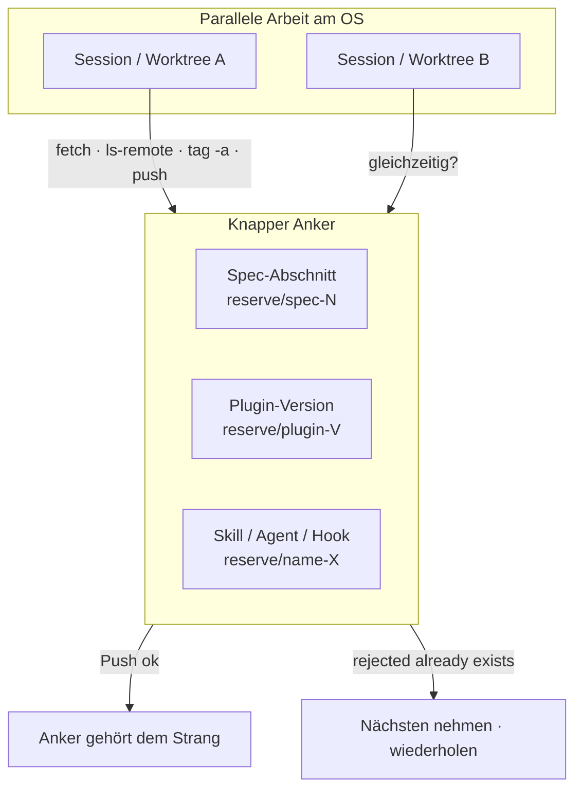

Der Mechanismus greift, sobald mehr als eine Arbeitseinheit gleichzeitig am OS arbeitet
(zwei Sessions, zwei Worktrees, zwei beauftragte Agenten). Der Tag ist ein **Name**, kein
Inhalt: er zeigt auf den aktuellen `main`-Stand; welcher Commit genau, spielt keine Rolle.

---

## 2. Trigger und Nicht-Trigger

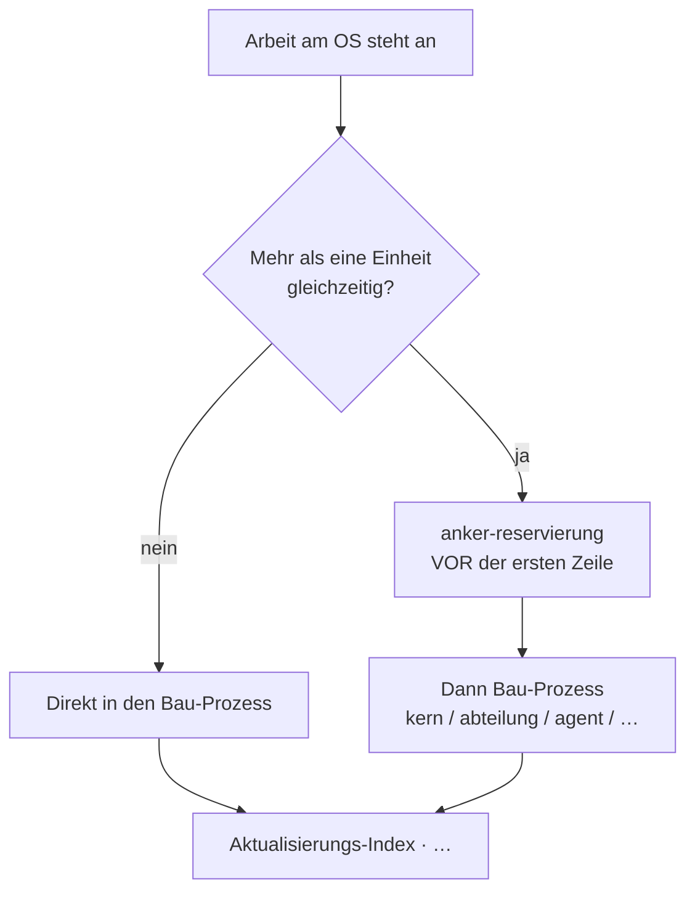

| Situation | Anker-Reservierung? |
|---|---|
| Zwei Sessions / Worktrees / Agenten parallel am OS | **Ja** — verbindlich |
| Einziger Strang, niemand sonst arbeitet | Nein (Prozess greift nicht zwingend) |
| Dateiname, Index-Zeile, Branch-Name kollidiert | **Nein** — kein Reservierungsgegenstand |
| Nach dem Schreiben des Nachtrags „noch schnell reservieren“ | **Zu spät** — gehört vor die erste Zeile |

**Nicht-Trigger im Sinne der Familie:** Die Familienkarte setzt die Frage „Mehr als eine
Einheit gleichzeitig?“ vor die Bau-Wahl. Ohne Parallelität geht es direkt in
`kern-plugin-bau` / `abteilungs-plugin-bau` / `subagenten-bau` usw.

---

## 3. Was ein Anker ist — und was **nicht** reserviert wird

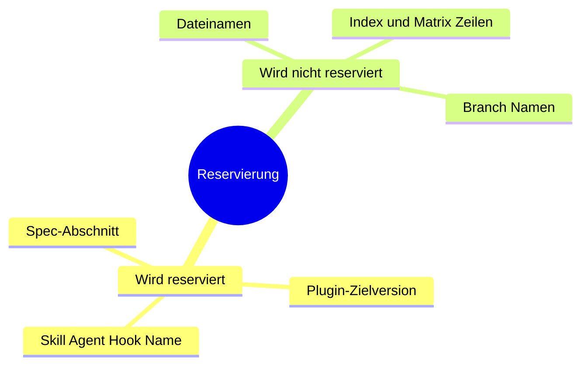

| Anker | Ref-Name | Beispiel |
|---|---|---|
| Spec-Abschnitt | `reserve/spec-<nummer>` | `reserve/spec-15.36` |
| Ziel-Version eines Plugins | `reserve/<plugin>-<version>` | `reserve/oai-0.22.0` |
| Skill-, Agent- oder Hook-Name | `reserve/name-<name>` | `reserve/name-queue-kern` |

**Nicht** reserviert werden Dateinamen, Index- und Matrix-Zeilen oder Branch-Namen: Sie folgen
aus dem Inhalt, kollidieren deshalb kaum, und wenn doch, ist es ein gewöhnlicher
Merge-Konflikt — sichtbar und harmlos.

---

## 4. Ablauf §2 — Sequenz bis zur atomaren Reservierung

**Vor der ersten Zeile Arbeit am Artefakt** — nicht erst beim Schreiben des Nachtrags.

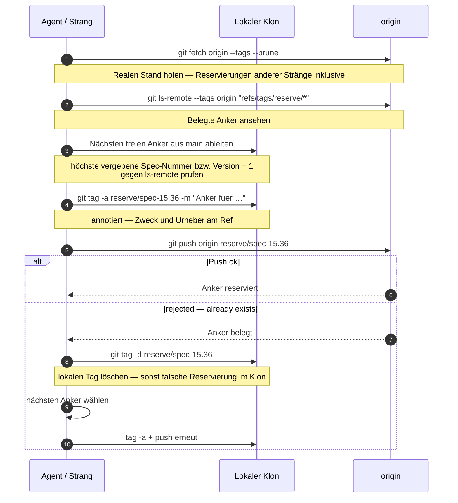

Die vier Handgriffe aus der Quelle:

```bash
# 1. Realen Stand holen (Reservierungen anderer Straenge inklusive)
git fetch origin --tags --prune

# 2. Belegte Anker ansehen
git ls-remote --tags origin "refs/tags/reserve/*"

# 3. Naechsten freien Anker aus main ableiten
#    (hoechste vergebene Spec-Nummer bzw. Version + 1) und gegen Schritt 2 pruefen

# 4. Reservieren — annotiert, damit Zweck und Urheber am Ref haengen
git tag -a reserve/spec-15.36 -m "Anker fuer <Vorhaben>, Session <Datum>"
git push origin reserve/spec-15.36
```

### `rejected — already exists` ist der Normalfall

Schlägt der Push fehl, ist der Anker belegt: den **nächsten** nehmen und Schritt 4
wiederholen. Das ist der Normalfall bei paralleler Arbeit und **kein Fehler** — genau dafür
existiert der Mechanismus.

Der lokale Tag wird dabei **zuerst** gelöscht (`git tag -d reserve/spec-15.36`), sonst bleibt
eine falsche Reservierung im Klon zurück. Der Tag zeigt auf den aktuellen `main`-Stand;
welcher Commit genau, spielt keine Rolle.

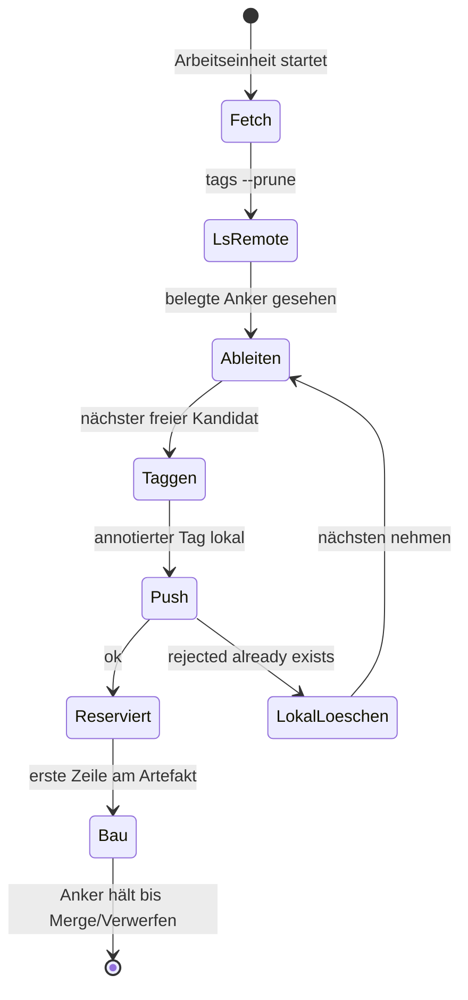

---

## 5. Freigabe — Ausnahme nur für `reserve/*`

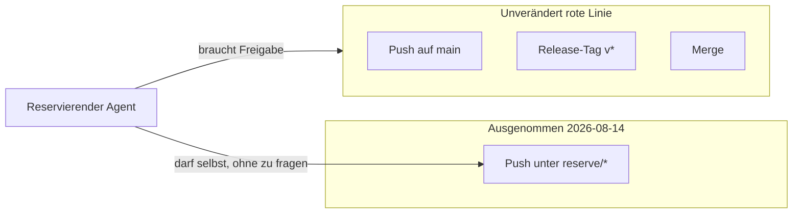

Ein Push unter `reserve/*` ist von der Freigabepflicht **ausgenommen** (Maintainer-Entscheid
2026-08-14). Der reservierende Agent führt ihn selbst aus, ohne zu fragen.

**Begründung aus der Quelle:** Der Ref trägt keinen Inhalt, ändert keine Datei und ist
folgenlos löschbar; die Regel „kein Commit/Push ohne Freigabe" zielt auf **Inhalt**, nicht
auf Namensvergabe. Ohne die Ausnahme hinge der Mechanismus an der Verfügbarkeit des
Maintainers.

**Unverändert rote Linie bleibt alles andere:**

- kein Push auf `main`
- kein Release-Tag (`v*`)
- kein Merge

---

## 6. Aufräumen nach Merge oder Verwerfen

Nach dem **Merge** des zugehörigen PR wird die Reservierung entfernt — ab dann ist das
**Artefakt selbst** der Beleg:

```bash
git push origin --delete reserve/spec-15.36
git tag -d reserve/spec-15.36
```

Wird ein Vorhaben **verworfen**, wird der Tag **genauso** gelöscht; der Anker ist dann wieder
frei.

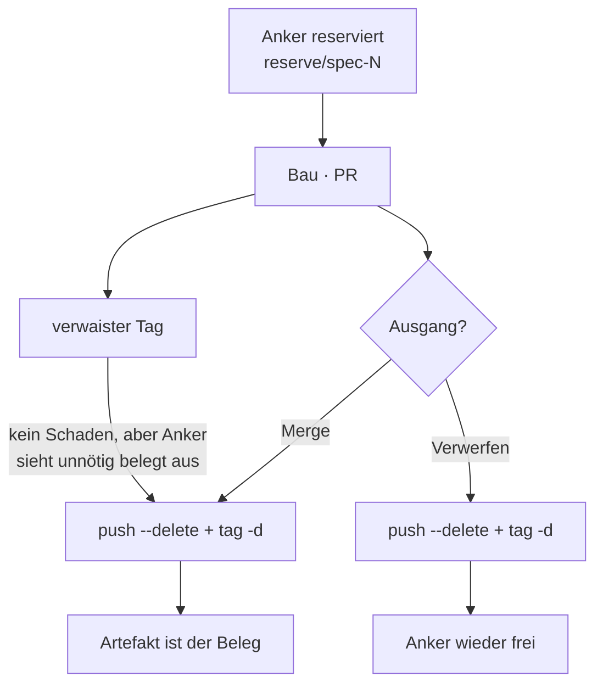

Ein verwaister Reservierungs-Tag ist kein Schaden, aber er lässt einen Anker unnötig belegt
aussehen — deshalb gehört das Löschen in **dieselbe Arbeitseinheit** wie der Merge.

---

## 7. Wenn `main` unter Schutz steht

Sobald Branch Protection oder ein Ruleset auf `main` aktiv ist, muss das Ref-Pattern
`reserve/*` davon **ausgenommen** bleiben.

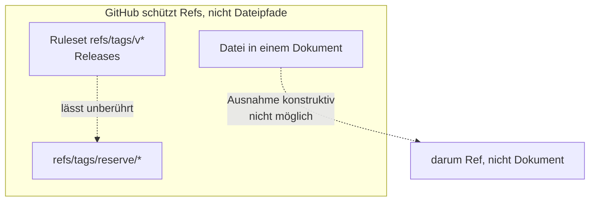

Das ist möglich, weil GitHub **Refs** schützt und nicht Dateipfade: Ein Ruleset für
`refs/tags/v*` (Releases) lässt `refs/tags/reserve/*` unberührt. Eine Ausnahme für eine
einzelne *Datei* wäre dagegen konstruktiv nicht möglich — darum liegt die Reservierung in
einem Ref und nicht in einem Dokument.

### Testlauf `reserve/probe` — gemessen 2026-08-14

Prüfen lässt sich das jederzeit:

```bash
git tag -a reserve/probe -m "Schutzprobe" && git push origin reserve/probe
git push origin --delete reserve/probe && git tag -d reserve/probe
```

**Am 2026-08-14 durchgeführt, Ergebnis belegt** (nicht versprochen):

| Schritt | Ergebnis |
|---|---|
| Reservieren | `* [new tag] reserve/probe` — gelang |
| Zweitzugriff anderer Strang | `! [rejected] reserve/probe -> reserve/probe (already exists)`, Exit-Code 1 |
| Aufräumen | `- [deleted] reserve/probe` — gelang |
| Release-Tags | blieben unberührt |

Die Atomarität ist damit **kein Versprechen, sondern gemessen**.

### Nebenbefund: `ls-remote` und die `^{}`-Falle

`git ls-remote` liefert bei **annotierten** Tags **zwei** Zeilen:

1. das Tag-Objekt
2. mit `^{}`-Suffix den Commit

Wer den Commit braucht, nimmt `git rev-parse <tag>^{commit}` — dieselbe Falle wie beim
Satelliten-Pin.

---

## 8. Zwei Anker gleichzeitig mergen — Fußzeilen-Auflösung §6

Die Reservierung sorgt dafür, dass die **Nummern** verschieden sind. Sie verhindert **nicht**,
dass beide Stränge dieselbe Zeile anfassen: Die Spec führt ihre Versionsgeschichte in **einer**
Fußzeile, die jeder Nachtrag vollständig umschreibt. Zwei Nachträge kollidieren dort also
**zwangsläufig** — auch mit korrekt reservierten, verschiedenen Ankern.

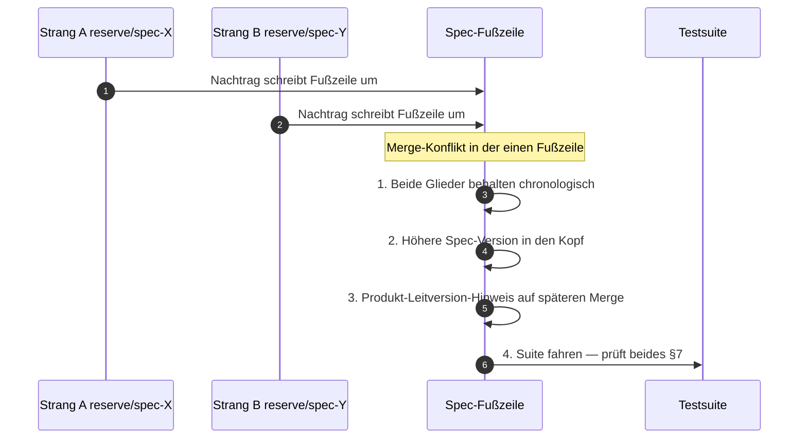

**Auflösungsregel für die Fußzeile:**

1. **Beide Glieder behalten**, chronologisch nach Version sortiert. Kein Glied darf
   verschwinden — ein verlorenes Glied ist still: Der Abschnitt bleibt im Dokument, nur seine
   Herkunft fehlt.
2. Die **höhere** Spec-Version in den Kopf der Fußzeile (`*Spec-Version: **X.Y.Z**`).
3. Die Angabe „Die Spec läuft der Produkt-Leitversion (Kern A.B.C) voraus" auf den Zielstand
   des **später** gemergten Branches ziehen.
4. Danach die Suite fahren — sie prüft beides (§7).

Dieselbe Regel gilt für jede andere Sammelzeile, die mehrere Vorhaben führt.

---

## 9. Testsuite als späte Absicherung §7

Die Reservierung ist die **frühe** Absicherung; die **späte** sind zwei Invarianten in
`plugins/oai/tests/struktur.test.mjs`:

| Invariante | Was sie fängt |
|---|---|
| **keine Spec-Abschnittsnummer doppelt vergeben** | Kollision auch dann, wenn niemand reserviert hat und Git die beiden Abschnitte konfliktfrei nebeneinander gemergt hat |
| **der jüngste Nachtrag ist in der Fußzeile verzeichnet** | Glied vorhanden, Kopf-Version hat ein eigenes Glied — fängt das stille Verlieren eines Glieds beim Auflösen nach §6 |

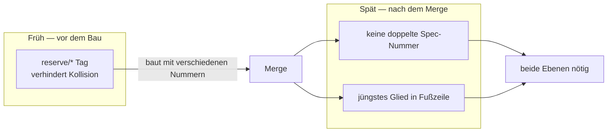

Beide Ebenen sind nötig: Der Tag verhindert die Kollision, bevor gebaut wird; die Tests
fangen, was trotzdem durchrutscht. **Verlass dich nie auf nur eine davon.**

---

## 10. Einordnung in den Standardzyklus §8

| Phase | Handlung | Quelle |
|---|---|---|
| **Vor dem Bau** | reservieren (§2) — Teil der Vorbereitung, noch vor dem ersten Artefakt | §8 |
| **Beim Bau** | die Änderungs-Matrix-Zeile des `Aktualisierungs-Index` sagt, was der gewählte Anker alles nach sich zieht | §8 |
| **Nach dem Merge** | aufräumen (§4) | §8 |

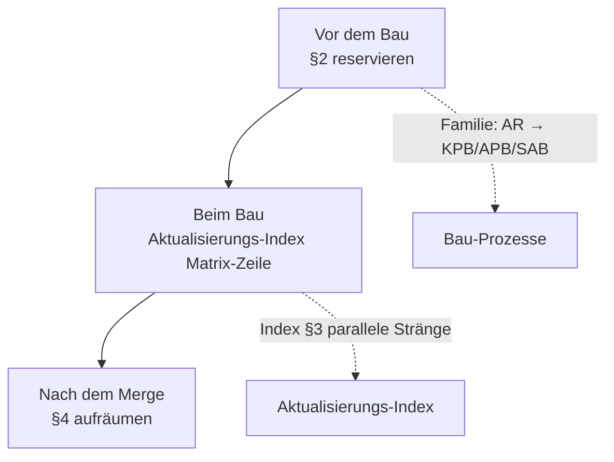

Kopplung laut Familienkarte: `anker-reservierung` speist die Bau-Prozesse
(`kern-plugin-bau`, `abteilungs-plugin-bau`, `subagenten-bau`) und hängt am
`Aktualisierungs-Index` (parallele Stränge, Index §3 und umgekehrt).

---

## 11. Artefakte

| Richtung | Was | Angefasst? |
|---|---|---|
| **Lesen** | `git ls-remote --tags origin "refs/tags/reserve/*"` | ja — Belegung |
| **Lesen** | `main` (höchste vergebene Nummer/Version ableiten) | ja — Ableitung |
| **Schreiben** | annotierter Tag `reserve/*` lokal + auf `origin` | ja — die Reservierung |
| **Löschen** | derselbe Tag nach Merge/Verwerfen | ja — Aufräumen |
| **Nie** | Dateien im Working Tree nur durch die Reservierung | nein — Ref trägt keinen Inhalt |
| **Nie** | Release-Tags `v*`, Push auf `main`, Merge | nein — rote Linie |

---

## 12. Fallen (nur aus der Quelle)

| Falle | Symptom | Gegenmittel |
|---|---|---|
| Push `already exists` | Exit-Code 1, rejected | Normalfall: lokalen Tag löschen, nächsten Anker, erneut pushen |
| Lokaler Tag nach Reject stehen lassen | Klon denkt, Anker sei sein | `git tag -d …` vor dem nächsten Versuch |
| Reservierung nach Baubeginn | Parallel-Kollision schon möglich | **vor** der ersten Zeile |
| `ls-remote` bei annotierten Tags | zwei Zeilen, `^{}`-Suffix | Commit via `git rev-parse <tag>^{commit}` |
| Fußzeilen-Merge „eins gewinnt“ | stilles Verlieren eines Glieds | §6: beide behalten, Suite fahren |
| Nur Tag **oder** nur Test | Lücke früh oder spät | beide Ebenen (§7) |
| Ruleset schützt versehentlich `reserve/*` | Push der Reservierung scheitert | Pattern `reserve/*` vom `main`-/`v*`-Schutz ausnehmen; Probe wie 2026-08-14 |

---

## 13. Verifikation / Abschluss

| Check | Erwartung |
|---|---|
| `git ls-remote --tags origin "refs/tags/reserve/*"` nach Push | eigener Anker sichtbar |
| Zweiter Push desselben Ankers (fremder Strang) | `rejected — already exists` |
| Nach Merge/Verwerfen | Tag remote und lokal weg |
| Suite `struktur.test.mjs` | keine doppelte Spec-Nummer; jüngstes Fußzeilen-Glied vorhanden |
| Probe `reserve/probe` (optional) | new tag → delete; Release-Tags unberührt |

---

## Anhang — Dateizeiger zurück in die Quelle

| Was | Wo |
|---|---|
| Normativer Prozess | `knowledge base/plugin-maintanance-ruleset-source/anker-reservierung.md` |
| Warum-Dokument (nicht hier nachgebaut) | `project-meta-infos/Onsite.ai-OS-Anker-Reservierung-Definition.md` |
| Späte Invarianten | `plugins/oai/tests/struktur.test.mjs` |
| Matrix / parallele Stränge | `Aktualisierungs-Index` (beim Bau §8) |
| Familien-Verdrahtung | [00-FAMILIE-UND-VERDRAHTUNG.md](00-FAMILIE-UND-VERDRAHTUNG.md) · Karte 09 |

Quelle-Abschnitte §1–§8 decken: Anker-Typen · Ablauf · Freigabe · Aufräumen · Schutz/Probe ·
Fußzeile · Testsuite · Zyklus-Einordnung.

---

*Prozesskarte 09 · Anker-Reservierung · 2026-08-15 · nicht normativ.*
