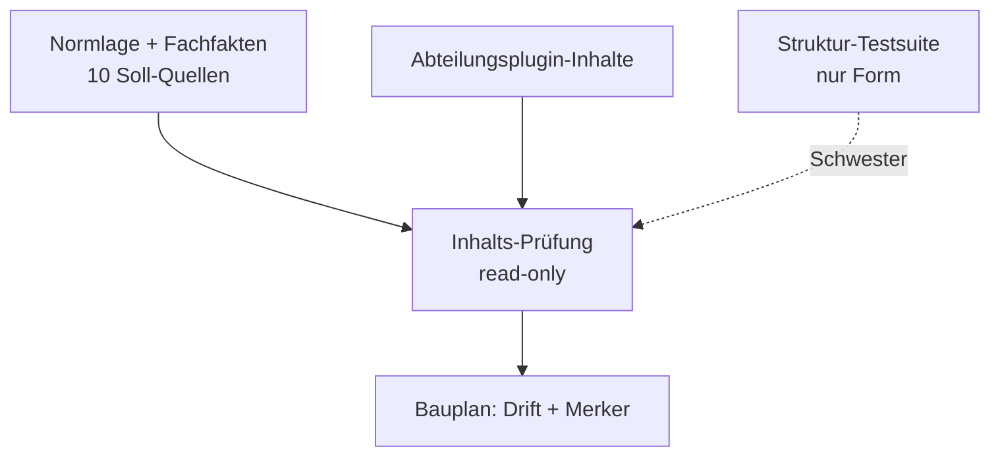
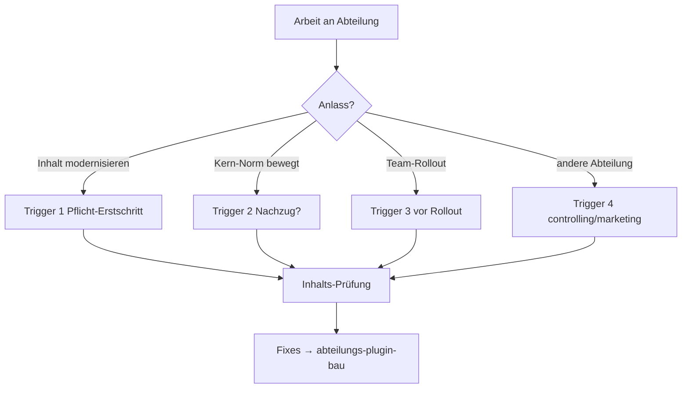
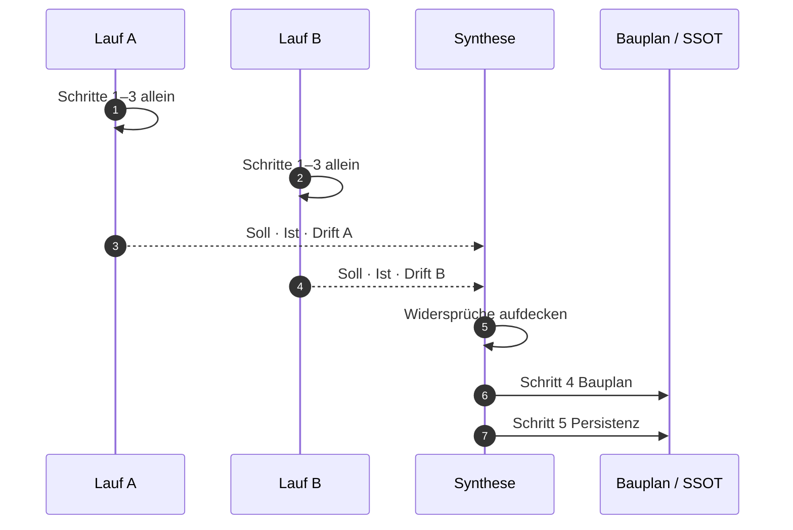
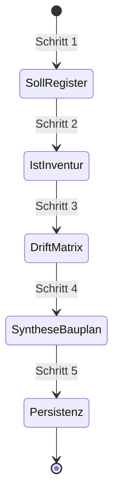
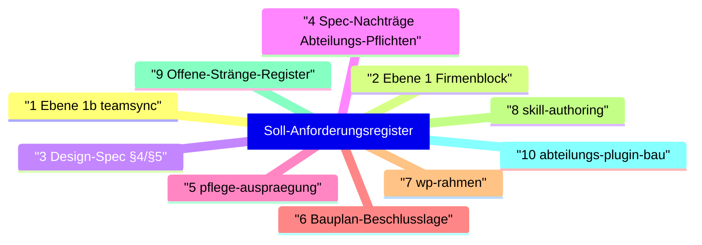
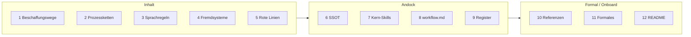
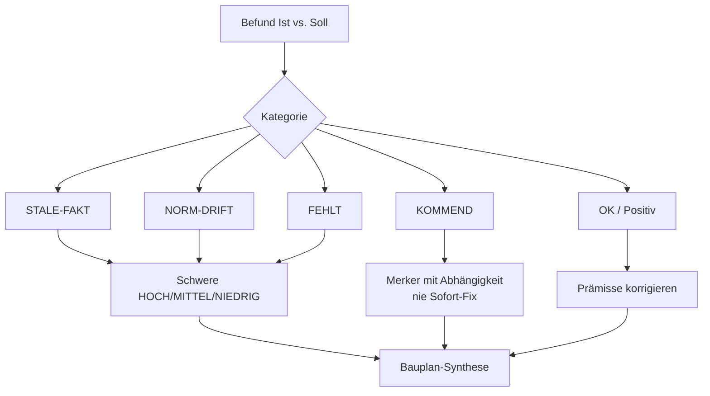

# Abteilungs-Inhalts-Prüfung — Prozesskarte

> **Was das ist:** Visuelle Landkarte des Standardprozesses „Abteilungs-Inhalts-Prüfung“
> (Soll-Register + Ist-Inventur + Drift-Matrix) — die **Inhalts-Schwester** der
> Struktur-Testsuite, die nur Form prüft.
> **Quelle (normativ):** `Onsite.ai-OS/knowledge base/plugin-maintanance-ruleset-source/abteilungs-inhalts-pruefung.md`
> **Stand der Karte:** 2026-08-15 · gegen die Quelldatei auf der Platte
> **Nicht normativ.** Bei Widerspruch gewinnt die Quelldatei.

Verwandte Einstiegskarte: [00-FAMILIE-UND-VERDRAHTUNG.md](00-FAMILIE-UND-VERDRAHTUNG.md).

---

## 1. Zweck in einem Satz

Wiederkehrende, belegbare Prüfung, ob die **Inhalte** eines Abteilungsplugins (Skills,
`workflow.md`, Abteilungs-CLAUDE, Pflege-Ausprägung, README, Referenzdateien) noch der
geltenden Normlage und den verifizierten Fachfakten entsprechen.

Struktur-Testsuite und Inhalts-Prüfung teilen das Zielobjekt, nicht den Prüfgegenstand
(Form vs. Inhalt). Die Prüfung ändert nichts am Plugin. Fixes laufen über Bauplan und
regulären PR-Fluss. Positiv-Befunde („besser als angenommen“) gehören in die Drift-Matrix —
sie korrigieren die Aufgabenprämisse.

---

## 2. Wann anwenden — vier Trigger

| # | Trigger | Pflichtcharakter |
|---|---|---|
| 1 | Vor jeder **inhaltlichen Modernisierung** eines Abteilungsplugins | Pflicht-Erstschritt |
| 2 | Nach **Norm-Schüben im Kern** (Spec-Nachträge, Ebene-1/1b-Payloads, Queue-/Prozess-Beschlüsse) | Abteilungen erben nicht automatisch |
| 3 | Vor dem **Team-Rollout** eines Abteilungsplugins | Freigabe-Vorbereitung |
| 4 | Als **Zwilling** für weitere Abteilungen (`controlling` / `marketing`) | Derselbe Prozess |

**Nicht dieser Prozess:** reines Struktur-/Form-Testen; Schreiben am Plugin während der
Prüfung; Sofort-Fixes ohne Bauplan. Die Familienkarte verdrahtet die Prüfung *vor*
Modernisierung/Rollout und leitet Fixes in den Abteilungs-Bau.

---

## 3. Ablauf — zwei unabhängige Läufe, dann Synthese

Beide Läufe laufen **unabhängig** (getrennte Agenten/Blickwinkel). Die Synthese deckt
Widersprüche zwischen Soll-Herleitung und Ist-Befund auf.

| Schritt | Name | Kern |
|---|---|---|
| 1 | Soll-Anforderungsregister | 10 Normquellen; je Anforderung Beleg (`Datei:Abschnitt/§`), Zuordnung, Typ (`Fakt-Korrektur` / `Norm-Pflicht` / `Kommende Änderung`) |
| 2 | Ist-Inventur | Alle Plugin-Artefakte gegen 12-Punkte-Checkliste; Fundstellen zitieren, nicht paraphrasieren |
| 3 | Drift-Matrix | Je Artefakt Kategorie + Schwere; nur reale Befunde; Positiv-Befunde festhalten |
| 4 | Synthese in Bauplan | Sofort-Fixes (eigene Session, Bump) vs. **Kommende Änderungen** (Merker mit Abhängigkeit „nach Merge von X“); Maintainer-Fragen im §5-Muster; **Anker-Bedarf prüfen** (Spec-§/Version reservieren) |
| 5 | Persistenz (Pflicht) | Methoden-Abweichungen in der Quelldatei nachziehen; Volldaten als Bauplan-Anhänge in die SSOT — Session-Output ist kein Aufbewahrungsort |

---

## 4. Soll-Register — die zehn Normquellen

| # | Normquelle | Liefert |
|---|---|---|
| 1 | `plugins/oai/doks/oai-teamsync.md` (Ebene 1b) | Prozesse, Rollen, Sprachregeln, Rangfolge |
| 2 | `plugins/oai/doks/global-claude-firmenblock.md` (Ebene 1) | Rote Linien, Freigabe, Konfliktordnung (Abteilung: Kurzverweis + Ownership) |
| 3 | Design-Spec §4/§5 | Verifizierte Fachfakten des Arbeits-Repos |
| 4 | Jüngste Spec-Nachträge mit Abteilungs-Pflichten | Stand Quelle 2026-08-14: §15.29–§15.33 |
| 5 | `plugins/oai/referenz/pflege-auspraegung.md` | Schema, Queue-Format, Kriterien |
| 6 | Beschlusslage laufender Baupläne (Queue-Flow, Subagenten, …) | **Kommende Änderung** mit Abhängigkeit — nie Sofort-Fix |
| 7 | `plugins/oai/wp-rahmen.md` | WP-Pflichten der `workflow.md` |
| 8 | `plugins/oai/referenz/skill-authoring.md` | Formatregeln |
| 9 | Offene-Stränge-Register | Aufträge mit Verbleib in der Abteilung |
| 10 | `abteilungs-plugin-bau.md` | Satelliten-Pflichten (Bump/Tag/Release/Umpinnen/CI) |

Typ `Kommende Änderung` (Quelle 6 u. a.) füllt die Drift-Matrix, nicht die Sofort-Fix-Liste.

---

## 5. Ist-Inventur — die zwölf Prüfpunkte

| # | Prüfpunkt |
|---|---|
| 1 | Beschaffungswege externer Systeme (Konnektoren zentral vs. lokal — Stand §15.11 ff.) |
| 2 | Reale Prozessketten (Review-/QS-/Abnahme; Rollen als Besetzung, nie Namen) |
| 3 | Sprach-/Formatregeln für Text-Entwürfe (aktuell: Jira deutsch, GitLab englisch) |
| 4 | Fremdsystem-Fakten (TRYB u. ä.) gegen die Quellen-Rangfolge |
| 5 | Rote Linien: Kurzverweis auf Normativ-Quelle statt Duplikat; Ownership je Skill |
| 6 | SSOT-Anbindung: Queue-Pfad, Sitzungswissen-Residenz, Infra-Registry statt geratener Pfade |
| 7 | Verweise auf Kern-Skills (Umbenennungen/Entfernungen; Kommendes als Merker) |
| 8 | `workflow.md`: Trigger-Matrix vollständig, WP-Mapping konsistent, SSOT-Abschnitt korrekt |
| 9 | Offene Register-Aufträge der Abteilung: umgesetzt oder bestätigt fehlend? |
| 10 | Referenzdateien: Frische-Marker, keine Duplikation mit kommenden Agenten/Artefakten |
| 11 | Formales: Frontmatter/YAML-Falle, Namensregeln, Längen (testerzwungen gegenprüfen) |
| 12 | Team-Onboarding: README mit Installation, verständlich für Erstkontakt |

Fehlt ein Beleg, ist der Punkt offen — nicht still als `OK` verbuchen.

---

## 6. Drift-Matrix — Kategorien und Schwere

| Kategorie | Bedeutung |
|---|---|
| `STALE-FAKT` | Inhalt widerspricht verifiziertem Fachfakt |
| `NORM-DRIFT` | Inhalt weicht von geltender Norm ab |
| `FEHLT` | Geforderter Inhalt / Artefakt-Bezug fehlt |
| `KOMMEND` | Noch nicht fällig; Abhängigkeit benennen |
| `OK` | Entspricht Soll (auch Positiv-Befunde) |

Schwere: `HOCH` / `MITTEL` / `NIEDRIG`. Keine aufgefüllten Top-Listen.

---

## 7. Artefakte, Regeln, Kopplung

| Richtung | Was |
|---|---|
| **Gelesen** | 10 Normquellen; alle Plugin-Artefakte; Spec/Nachträge; Offene-Stränge-Register; laufende Baupläne |
| **Geschrieben** | Bauplan (Sofort vs. Merker, Maintainer-Fragen); Soll-Register + Drift-Matrix als **Bauplan-Anhänge in der SSOT**; Methoden-Abweichungen in der Prozess-Quelldatei |
| **Nie angefasst** | Das Abteilungsplugin selbst (**read-only**); Session-Chat als Aufbewahrungsort der Volldaten |

**Regeln:** (1) Zwei unabhängige Läufe, dann Synthese. (2) Read-only — Prüfung ändert nichts.
(3) **Quellen-Hierarchie:** Widerspruch Normquelle ↔ Plugin-Text → Quelle gewinnt;
Widersprüche zwischen Doku-Ebenen werden **upstream** korrigiert, nicht umgangen.
(4) Kommende Änderungen nur als Merker mit benannter Abhängigkeit. (5) Anker-Bedarf prüfen.

**Kopplung:** Normquelle 10 und Fix-Pfad → `abteilungs-plugin-bau`. Anker-Bedarf →
Spec-§/Version reservieren, falls der Bauplan das verlangt. Schwester zur Struktur-Testsuite.

---

## 8. Erstanwendung und Abschluss

| Fakt | Wert |
|---|---|
| Erstanwendung | 2026-08-14 auf `oai-development` (v0.11.0) |
| Bauplan | `Aktive Baupläne/2026-08-14-dev-plugin-inhalts-modernisierung.md` |
| Volldaten (Soll + Drift) | Anhänge A/B **im Bauplan** — nicht hier, nicht im Session-Output |
| Methode persistiert | Quelldatei auf Maintainer-Weisung 2026-08-14; lebendes Dokument |

**Abschluss-Checkliste:** Beide Läufe liegen vor → Synthese benennt Widersprüche → Bauplan
trennt Sofort-Fixes und Kommende Merker, Anker-Bedarf geprüft → Positiv-Befunde festgehalten →
Volldaten am Bauplan in der SSOT; Methoden-Abweichungen in der Quelldatei nachgezogen.

---

## 9. Anhang — Dateizeiger

| Zeiger | Pfad / Bezug |
|---|---|
| Normative Quelle | `knowledge base/plugin-maintanance-ruleset-source/abteilungs-inhalts-pruefung.md` |
| Satelliten-Bau (Normquelle 10 + Fix-Pfad) | `…/abteilungs-plugin-bau.md` |
| Ebene 1b / 1 | `plugins/oai/doks/oai-teamsync.md` · `global-claude-firmenblock.md` |
| Pflege / WP / Skill-Format | `plugins/oai/referenz/pflege-auspraegung.md` · `wp-rahmen.md` · `skill-authoring.md` |
| Erstanwendungs-Bauplan | `Aktive Baupläne/2026-08-14-dev-plugin-inhalts-modernisierung.md` |
| Familienkarte | [00-FAMILIE-UND-VERDRAHTUNG.md](00-FAMILIE-UND-VERDRAHTUNG.md) |

---

*Prozesskarte · 2026-08-15 · erklärt `abteilungs-inhalts-pruefung.md`, ersetzt sie nicht.*
*Quell-Herkunft: 2026-08-14 Claude „Saga“ (Fable 5) auf Maintainer-Weisung (Lucas Vöhringer),
nach Erstanwendung auf `oai-development` v0.11.0.*
