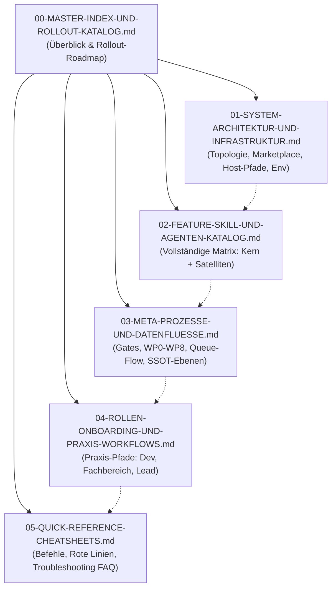
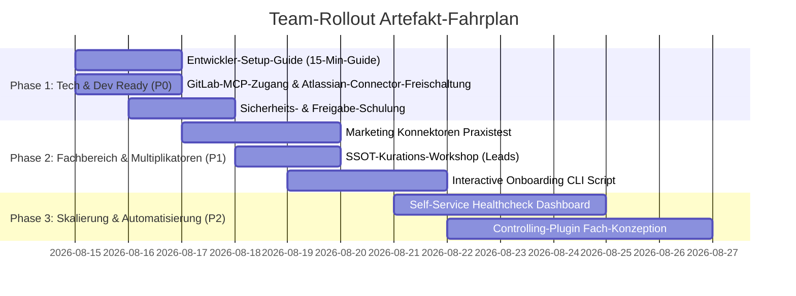

# 00 — Master-Index & Rollout-Artefakt-Katalog
**System:** Onsite.ai-OS & Satelliten-Familie  
**Dokument-Typ:** Rollout-Orchestrierung, Navigationsbaum & Anforderungskatalog  
**Stand:** 14. August 2026  
**Referenzstand:** Kern-Plugin `oai` 0.22.0 (PR #58 „Queue-Flow", Branch `feat/queue-flow`) — dieser Team-Rollout setzt den Merge dieses PRs voraus.  
**Zielgruppe:** Teamleitung, Maintainer, Onboarding-Verantwortliche  

---

## 1. Zielsetzung & Architektur dieses Dokumentenpakets

Dieses Dokumentenpaket bildet die **vollständige strukturelle, technische und prozessuale Infrastrukturbeschreibung** des Onsite.ai-Betriebssystems (`onsite-ai-os`) und seiner Abteilungs-Satelliten.

Um Informationsüberlastung („mentales Aussteigen") zu verhindern und unterschiedliche Rollen (Entwickler, Fachbereich, Tech-Leads, Maintainer) zielgerichtet abzuholen, ist die Dokumentation in **sechs modular aufeinander aufbauende Dokumente** unterteilt:

---

## 2. Navigationsbaum der Infrastruktur-Dokumentation

| Dokument | Hauptinhalte & Kernfokus | Primäre Zielgruppe |
|---|---|---|
| [**00 — Master-Index & Rollout-Katalog**](./00-MASTER-INDEX-UND-ROLLOUT-KATALOG.md) | Überblick, Paket-Architektur, Bedarfsanalyse für weitere Team-Artefakte, Prioritäten & DoD | Alle Rollen, Management |
| [**01 — System-Architektur & Infrastruktur**](./01-SYSTEM-ARCHITEKTUR-UND-INFRASTRUKTUR.md) | Multi-Repo-Topologie, Marketplace-Verteilung, Transitive Auflösung, Infra-Registry, Dateipfade, OS-Level & Env-Konfigurationen | Tech-Leads, DevOps, Entwickler |
| [**02 — Feature-, Skill- & Agenten-Katalog**](./02-FEATURE-SKILL-UND-AGENTEN-KATALOG.md) | Vollständige Spezifikation aller 30+ Skills, Subagenten, Tool-Allowlists, Module und Parameter über alle 4 Plugins | Alle Anwender & Entwickler |
| [**03 — Meta-Prozesse & Datenflüsse**](./03-META-PROZESSE-UND-DATENFLUESSE.md) | Kontroll-Schicht (Gate 1+2 gebaut, Gate 3 geplant, Gate 4 auf Eis), WP0–WP8 Arbeitszyklus, SSOT-Promotion-Pipeline (Memory $\rightarrow$ Kern), 6 CLAUDE-Ebenen, Governance | Entwickler, Reviewer, Maintainer |
| [**04 — Rollen-Onboarding & Praxis-Workflows**](./04-ROLLEN-ONBOARDING-UND-PRAXIS-WORKFLOWS.md) | Schritt-für-Schritt Praxisführung: Entwickler-Alltag (GitLab/Jira/QS), Marketing-Setup, Lead-Governance | Konkrete Rollen im Alltag |
| [**05 — Quick-Reference & Cheatsheets**](./05-QUICK-REFERENCE-CHEATSHEETS.md) | Spickzettel: Slash-Commands, Skill-Befehle, Rote Linien auf 1 Seite, Notfall-Troubleshooting FAQ | Schneller täglicher Zugriff |

---

## 3. Rollout-Artefakt-Katalog (Bedarfsanalyse für das Team)

Um das System erfolgreich und reibungslos im gesamten Onsite.ai-Team zu verankern, müssen neben dieser technischen Infrastrukturbeschreibung folgende operative Begleit-Artefakte erstellt bzw. bereitgestellt werden:

### 3.1 Übersicht der noch zu erstellenden Team-Artefakte

> **Hinweis:** Termine und Reihenfolge des folgenden Fahrplans sind ein **unabgestimmter Vorschlag**
> dieses Dokumentenpakets — die tatsächliche Priorisierung entscheidet der Maintainer.

### 3.2 Detaillierte Artefakt-Spezifikationen

#### Priorität P0 (Kritisch für den ersten Arbeitsstart)
1. **Entwickler-Schnellstart-Leitfaden („15-Minutes to First Feature"):**
   - *Ziel:* Jeder neue Entwickler hat innerhalb von 15 Minuten Claude Code, Marketplace, `oai-development` und Kern installiert, `/oai:init` ausgeführt und die erste Test-Session mit Gate-Schutz gestartet.
   - *Format:* 2-seitiges Markdown mit Copy-Paste-Befehlsblöcken für macOS, Windows PowerShell und Linux.
   - *Prüfkriterium (DoD):* Ein neuer Entwickler kann den Leitfaden ohne Rückfragen autonom durchlaufen.

2. **Credentials- & Environment-Checkliste:**
   - *Ziel:* Sichere Konfiguration der realen Zugangswege — Jira/Confluence laufen über den
     **zentral bereitgestellten Atlassian-Claude-Team-Connector** (einmalige OAuth-Autorisierung,
     **kein** individuelles Jira-PAT; Admin richtet den Connector ein, Spec §15.11); GitLab-Zugriff
     läuft **individuell skill-geführt** über den Community-MCP `@zereight/mcp-gitlab`
     (`GITLAB_PERSONAL_ACCESS_TOKEN`, Scope `read_api`, im `mcpServers`-Block von `~/.claude.json`);
     dazu `CLAUDE_CODE_PLUGIN_PREFER_HTTPS=1`.
   - *Format:* Interaktive Checkliste mit Validierungs-Kommandos (`gh auth status` gilt dabei nur
     für den Zugriff auf die GitHub-Repos von OS/Satelliten, `git ls-remote`).

3. **Team-Briefing: Rote Linien & Freigabe-Prozedere:**
   - *Ziel:* Klares Verständnis, warum das OS bestimmte Aktionen blockt (z. B. automatisierte Commits, Pushes, Jira-Kommentar-Postings, direkte DB-Eingriffe) und wie der Freigabedialog funktioniert.

#### Priorität P1 (Wichtig für Fachbereiche & Multiplikatoren)
4. **Marketing-Konnektoren Hands-On Playbook:**
   - *Ziel:* Schritt-für-Schritt-Anleitung für das Marketing-Team zur Ausführung von `/oai-marketing:indesign-setup` (UXP-Plugin Installation) und lesendem LinkedIn-Lead-Import.
5. **SSOT-Kurations-Leitfaden für Abteilungsleiter & Leads:**
   - *Ziel:* Wie reviewe und merge ich die wöchentlichen Sammel-PRs aus `/oai:queue-abteilung`? Wie befördere ich Abteilungswissen in das globale Firmenwissen?

#### Priorität P2 (Skalierung & Automatisierung)
6. **Automatisches Host-Diagnose-Tool:**
   - *Ziel:* Ein kleiner Prüfbefehl, der prüft, ob `~/.claude/oai/infra.json`, Git-Remotes, Node-Version und Plugin-Caches synchron sind.

---

## 4. Rollout-Erfolgsfaktoren & Leitprinzipien

Bei der Einführung im Team gelten vier unverrückbare Prinzipien:
1. **„Platte schlägt Prosa":** Nicht theoretische Best Practices erklären, sondern exakt die Mechanismen schulen, die durch die Hooks und Test-Invarianten real auf der Festplatte erzwungen werden.
2. **„Transparenz statt Magie":** Dem Team klar aufzeigen, *wo* das System Daten ablegt (`sitzungswissen/`, `Kandidaten-Queue/`, `~/.claude/oai/infra.json`), damit keine „Blackbox-Angst" entsteht.
3. **„Zero-Friction Einstieg":** Alle Standard-Workflows sind über sprechende Skills (z. B. `/oai:start`, `/oai-development:feat-start`, `/oai:end-session`) gekapselt.
4. **„Schutz der Privatsphäre":** Den Entwicklern garantieren, dass ihre private Zone (`~/.claude/CLAUDE.md`) durch den Doks-Autosync unantastbar bleibt.
