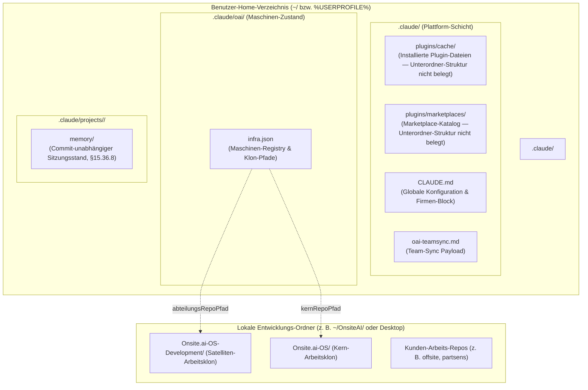

# 01 — System-Architektur & Infrastruktur
**System:** Onsite.ai-OS & Satelliten-Familie  
**Dokument-Typ:** Technische Infrastruktur- & Plattform-Spezifikation  
**Stand:** 14. August 2026  
**Zielgruppe:** Tech-Leads, DevOps, Entwickler, IT-Administration  

---

## 1. Multi-Repo- & Satelliten-Topologie

Das Onsite.ai-Betriebssystem ist als **föderierte Multi-Plugin-Architektur** aufgebaut. Es besteht aus einem zentralen Marketplace-Katalog, dem Shared-Core-Plugin (`oai`) und eigenständigen, privaten Abteilungs-Satelliten-Repositories.

```mermaid
graph TB
    subgraph Marketplace["Interner Marketplace: onsite-ai-os"]
        Catalog["marketplace.json<br>(Katalog-Definition)"]
    end

    subgraph CoreRepo["Kern-Repository: onsite-ai-devs/Onsite.ai-OS"]
        CorePlugin["Plugin: oai (lokal ./plugins/oai)<br>• 10 Shared-Skills<br>• Subagent sync-nachzug-executor<br>• Kontroll-Hooks FFG & Start-Gate<br>• Globale Doks-Payloads"]
        CtrlPlugin["Plugin: oai-controlling (lokal ./plugins/oai-controlling)<br>• Platzhalter v0.1.0<br>• Extraktion offen (Termin beim Maintainer)"]
    end

    subgraph SatDev["Satelliten-Repo: onsite-ai-devs/Onsite.ai-OS-Development"]
        DevPlugin["Plugin: oai-development (GitHub-Source)<br>• 17 Skills (feat, mr, rev, qs, rel, ps)<br>• GitLab CE & Jira PAR Workflow<br>• Abteilungs-SSOT & Wissensbasis"]
    end

    subgraph SatMark["Satelliten-Repo: onsite-ai-devs/Onsite.ai-OS-Marketing"]
        MarkPlugin["Plugin: oai-marketing (GitHub-Source)<br>• 3 Konnektoren-Skills (InDesign, LinkedIn)<br>• Abteilungs-SSOT & Wissensbasis"]
    end

    Catalog -->|Source: ./plugins/oai| CorePlugin
    Catalog -->|Source: ./plugins/oai-controlling| CtrlPlugin
    Catalog -->|GitHub Pin: ref v0.11.0 + Full-SHA| DevPlugin
    Catalog -->|GitHub Pin: ref v0.4.1 + Full-SHA| MarkPlugin

    DevPlugin ==>|transitive dependency: dependencies: ['oai']| CorePlugin
    MarkPlugin ==>|transitive dependency: dependencies: ['oai']| CorePlugin
    CtrlPlugin ==>|transitive dependency: dependencies: ['oai']| CorePlugin
```

### 1.1 Das Transitive Abhängigkeitsmodell
Jedes Abteilungsplugin deklariert in seiner `.claude-plugin/plugin.json`:
```json
{
  "name": "oai-development",
  "dependencies": ["oai"]
}
```
**Wirkung:** Ein Teammitglied registriert einmalig den Marketplace und installiert ausschließlich seine Fachabteilung:
```bash
claude plugin marketplace add onsite-ai-devs/Onsite.ai-OS
claude plugin install oai-development@onsite-ai-os
```
Claude Code löst die Abhängigkeit automatisch auf und installiert den Kern `oai` **transitiv mit**. Der Entwickler erhält sofort Zugriff auf die Shared Skills (`/oai:start`, `/oai:end-session`, etc.) und die Kontroll-Gates.

---

## 2. Marketplace-Katalog & Release-Pinning

Die Datei `.claude-plugin/marketplace.json` im Haupt-Repo steuert die Verteilung aller Plugins an das Team.

### 2.1 Striktes Commit-SHA-Pinning (Spec §15.19 / §15.33)
Satelliten-Plugins werden über GitHub-Quellen mit explizitem Release-Tag und **vollem 40-stelligen Commit-SHA** eingebunden:

```json
{
  "name": "oai-development",
  "source": {
    "source": "github",
    "repo": "onsite-ai-devs/Onsite.ai-OS-Development",
    "ref": "v0.11.0",
    "sha": "ee82e6cbc791cb27d84493bf1ed6bf9d0e7cc80d"
  },
  "description": "Abteilung development: 17 Skills in 6 Modulen für den offsite-Zyklus...",
  "category": "abteilung"
}
```

> [!IMPORTANT]
> **Die Tag-Objekt-SHA-Falle:**  
> Bei annotierten Git-Tags (`git tag -a`) erzeugt Git zwei SHAs: das Tag-Objekt selbst und den eigentlichen Commit. Claude Code verlangt den **Commit-SHA**.  
> **Normativer Ermittlungsbefehl:**  
> `git rev-parse v0.11.0^{commit}`  
> Gegenprüfung vor dem Umpinnen immer via: `git ls-remote origin refs/tags/v0.11.0^{}`.

### 2.2 Versions-Hoheit (Single Source of Truth)
- Die Marketplace-Einträge tragen **kein** `"version"`-Feld.
- Die autoritative Version steht **ausschließlich** in der `plugin.json` des jeweiligen Plugins (`plugins/<name>/.claude-plugin/plugin.json` bzw. im Satelliten-Root).
- Die Produkt-Leitversion des Gesamtsystems entspricht immer der Kern-Version in `VERSION` und `plugins/oai/module-registry.json`.

---

## 3. Host-Dateisystem, Registry & Authentifizierung

Damit Team-Plugins auf unterschiedlichen Betriebssystemen (macOS, Windows, Linux/WSL) und unterschiedlichen Entwickler-Ordnerstrukturen reibungslos funktionieren, setzt Onsite.ai-OS auf eine **vollständig dynamische Pfadauflösung**.



### 3.1 Die Maschinen-Registry: `~/.claude/oai/infra.json` (Spec §15.30.1)
Jede Entwickler-Maschine führt eine maschinenlokale Zustandsdatei, die bei der Ausführung von `/oai:init` automatisch angelegt wird.

**Reales Schema (Schema v1, Quelle: `plugins/oai/skills/init/infra-registry.md`):**
```json
{
  "schemaVersion": 1,
  "abteilung": "marketing",
  "szenario": "windows",
  "wurzelordner": "C:\\Users\\<nutzer>\\OnsiteAI",
  "kernRepoPfad": "C:\\Users\\<nutzer>\\OnsiteAI\\Onsite.ai-OS",
  "abteilungsRepoPfad": "C:\\Users\\<nutzer>\\OnsiteAI\\Onsite.ai-OS-Marketing",
  "zuletztGeprueft": { "S0": "2026-08-11", "S2": "2026-08-11" }
}
```
Es gibt **kein** `$schema`-Feld (keine solche URL existiert). Pflichtfelder sind **auch**
`szenario` und `wurzelordner`. `zuletztGeprueft` ist **kein** einzelner ISO-Timestamp, sondern
ein Objekt mit einem Datums-String **je geprüfter Schicht** (z. B. `S0`, `S2`).

**Regeln für Pfadangaben:**
1. **Absolute native Pfade:** Pfade werden immer absolut und im Format des Host-Betriebssystems gespeichert (keine unaufgelösten `~`, keine Umgebungsvariablen).
2. **Platte schlägt Registry:** Findet ein Skill ein Verzeichnis nicht auf der Platte, wird kein Ersatzverzeichnis geraten – der Skill bricht mit einer klaren Meldung ab und verweist auf `/oai:init`.

---

### 3.2 Credentials & API-Zugangs-Matrix

| Dienst | Token-Typ | Benötigte Berechtigungen / Scopes | Konfigurationsort |
|---|---|---|---|
| **GitHub** | GitHub CLI Auth | Org-Aufnahme mit Lese-/PR-Rechten (keine belegten Einzel-Scopes) | `gh auth login` |
| **GitLab CE** | Personal Access Token (PAT), Community-MCP `@zereight/mcp-gitlab` | `read_api` (bzw. `api` für Schreibzugriff) | `GITLAB_PERSONAL_ACCESS_TOKEN` im `mcpServers`-Block von `~/.claude.json` |
| **Jira/Confluence (PAR)** | Zentraler Atlassian-Claude-Team-Connector (Admin-Bereitstellung, OAuth) | — kein individuelles PAT | Einmalige Autorisierung in claude.ai; kein Env-Eintrag |

---

## 4. System-Voraussetzungen & Windows-Besonderheiten

### 4.1 Technische Voraussetzungen
| Komponente | Mindestanforderung | Empfohlen | Zweck |
|---|---|---|---|
| **Claude Code CLI** | `>= 2.1.193` | — (keine belegte höhere Empfehlung) | Team-Mindestversion für `dependencies`/Multi-Plugin-Auflösung (Spec §15.18) |
| **Node.js** | `>= 20.0.0 LTS` | `>= 22.0.0 LTS` | Ausführung der Kontroll-Hooks (`*.js`) und Testsuiten (`node --test`) |
| **Git** | keine belegte Mindestversion | — | Ref-Tagging (Release-Tags `v<VERSION>`) |
| **GitHub CLI (`gh`)** | keine belegte Mindestversion | Neueste | Autonome Klon-Authentifizierung ohne Passwort-Prompts |

> **Hinweis „Sparse-Clones":** Das ist **kein** lokales Git-Erfordernis, sondern Claude Codes
> interner Plugin-Installationsmechanismus beim Bezug der Satelliten-Plugins über eine
> GitHub-Source (Quelle: `knowledge base/SSOT-Document-Index.md`, Treffer „sparse clone").

---

### 4.2 Kritische Environment-Variablen & Windows-Settings

> [!CAUTION]
> **1. SSH-Authentifizierungs-Falle (`Host key verification failed`):**  
> Beim Klonen privater Satelliten-Repositories bricht Claude Code im isolierten Plugin-Cache ab, wenn kein SSH-Agent aktiv ist.  
> **Lösung:** Folgende Umgebungsvariable muss auf jedem Entwickler-System global gesetzt sein:
> ```bash
> export CLAUDE_CODE_PLUGIN_PREFER_HTTPS=1
> ```
> *Unter Windows PowerShell, z. B.:*
> ```powershell
> [System.Environment]::SetEnvironmentVariable('CLAUDE_CODE_PLUGIN_PREFER_HTTPS', '1', 'User')
> ```

> [!IMPORTANT]
> **2. Windows CRLF vs. LF Zeilenenden (Doks-Autosync Vergleichs-Falle):**  
> Windows konvertiert standardmäßig LF zu CRLF. Der Doks-Autosync prüft **keinen Hash**, sondern
> vergleicht den Dateiinhalt von `oai-teamsync.md` per exaktem String-Vergleich
> (`plugins/oai/hooks/oai-doks-autosync.js`) mit dem erwarteten Stand — CRLF führt dadurch zu
> einem dauerhaften Inhalts-Mismatch: die No-op-Erkennung schlägt fehl, und der Hook schreibt
> die Datei bei jedem Lauf neu!  
> **Pflicht-Einstellung unter Windows:**
> ```powershell
> git config --global core.autocrlf input
> ```

> [!NOTE]
> **3. Hook-Steuerung & Notfall-Overrides:**
> - `OAI_START_GATE=off` — Deaktiviert temporär das Start-Gate 2 (z. B. bei CI/CD-Pipelines oder Notfall-Rettungsläufen).
> - `OAI_PRECOMPACT=off` — Deaktiviert die PreCompact-Mahnung vor Sitzungs-Kompaktierungen.
