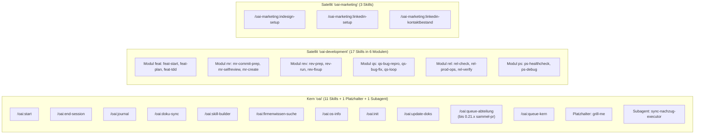
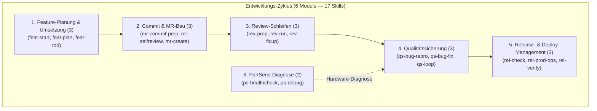

# 02 — Feature-, Skill- & Agenten-Katalog
**System:** Onsite.ai-OS & Satelliten-Familie  
**Dokument-Typ:** Vollständiges Skill- & Subagenten-Referenzhandbuch  
**Stand:** 14. August 2026  
**Zielgruppe:** Alle Entwickler, Fachbereichs-Anwender, Reviewer  

---

## 1. Übersicht & Namensraum-Architektur

Alle Befehle folgen einer strikten **Marketplace-Namespace-Konvention**:
- **Kern-Befehle:** `/oai:<skill-name>`
- **Abteilungs-Befehle:** `/oai-<abteilung>:<skill-name>` (z. B. `/oai-development:feat-start`)
- **Subagenten:** Werden im Hintergrund vom System oder per Orchestrierung aufgerufen (z. B. `sync-nachzug-executor`).

---

## 2. Kern-Plugin `oai` (Geteilte Infrastruktur-Skills)

| Skill-Aufruf | Rolle & Zweck im Alltag | Wichtige Eingaben / Aktionen | Erzeugte Artefakte / Schreiborte |
|---|---|---|---|
| **`/oai:start`** | **Session-Initialisierung (Pflicht, WP0)** Liest Projekt-Memory als commit-unabhängige Pflichtquelle, Stand/Journal/Register der Wissensbasis, prüft Team-Sync-Stempel, setzt den Start-Faktenstempel für Gate 2. | Keine Argumente nötig; analysiert Repo-Zustand, uncommittete Änderungen, Projekt-Memory und jüngste Journale. | Setzt den Start-Stempel im session-lokalen State-Verzeichnis (`os.tmpdir()/oai-start-gate`, nicht `~/.claude/oai/`); schaltet Schreib-Gates frei. |
| **`/oai:end-session`** | **Sitzungsabschluss (WP8)** Erstellt strukturiertes Sitzungsjournal, aktualisiert `stand.md`, spiegelt den Stand ins Projekt-Memory und klassifiziert Firmenkandidaten. | Fragt nach Highlights, Erkenntnissen und offenen Punkten. | Schreibt nach `sitzungswissen/<abteilung>/journal/`, `stand.md`, Projekt-Memory und `Kandidaten-Queue/queue.md`. Setzt Abschluss-Stempel. |
| **`/oai:journal`** | **Ad-hoc Protokollierung** Hält wichtige Zwischenergebnisse oder Debugging-Erkenntnisse während der Arbeit fest. | Text oder Stichpunkte des Ereignisses. | Append-only Eintrag im aktuellen Tagesjournal unter `sitzungswissen/`. |
| **`/oai:doku-sync`** | **Repo-interner Pre-Commit-Doku-Sync** Zieht vor jedem Commit die lebende Doku des Arbeits-Repos nach (CLAUDE.md, AGENTS.md, README, Glossar, Registry), sichert den CHANGELOG-Eintrag und prüft die Versionslogik. | `git status`/`git diff --stat` als Änderungsumfang; Sync-Matrix der Repo-`CLAUDE.md`. | Aktualisierte lebende Doku-Dateien des Repos, CHANGELOG-Eintrag, Prüfstempel `.git/oai/doku-sync.stamp`. |
| **`/oai:skill-builder`** | **Skill-Authoring Assistent** Führt Entwickler durch die Erstellung normkonformer Skills nach `skill-authoring.md`. | Name, Zweck, Tools und Argumente des neuen Skills. | Erzeugt `skills/<name>/SKILL.md` mit korrektem YAML-Frontmatter. |
| **`/oai:firmenwissen-suche`** | **Externes Firmenwissen-Retrieval** Durchsucht Confluence-Archiv und Jira-Vorgänge über den Claude-Team-Connector für Atlassian; fasst Treffer mit Quellenangabe zusammen. | Suchbegriff / Fragestellung. | Rein lesende Zusammenfassung mit Quellenbelegen (Confluence-Page-ID/Jira-Key) — kein Zugriff auf den SSOT-Document-Index. |
| **`/oai:os-info`** | **System-Diagnose** Gibt den realen Installationsstand aus (installierte Plugins, Version, Quelle), zählt Skills real und prüft Gate-Status. | Keine Argumente. | Rein lesende Diagnose-Ausgabe im Terminal (`claude plugin list`/Plugin-Cache) — keine Klon-Pfade (das ist Domäne von `/oai:init`). |
| **`/oai:init`** | **Arbeitsplatz-Setup** Initialisiert `infra.json`, klont Satelliten-Repos via `gh` und prüft Toolchains. | Abteilungs-Name (z. B. `development`, `marketing`). | Erzeugt `~/.claude/oai/infra.json` und legt fehlende SSOT-Gerüste an. |
| **`/oai:update-doks`** | **Maintainer-Werkzeug, zwei Funktionen** **F1:** repariert beide team-globalen Ziele (Ebene 1 Firmen-Block `~/.claude/CLAUDE.md` per Marker-Chirurgie **und** Ebene 1b `~/.claude/oai-teamsync.md` als Ganzdatei), wenn der Autosync nicht greift. **F2:** index-geführter Konsistenzlauf über die lebende Doku des Kern-Repos mit Drift-Bericht (Ist/Soll/Quelle). | Keine Argumente; Funktion F1/F2/beides. | F1: aktualisiert `~/.claude/CLAUDE.md` (Marker-Bereich) und `~/.claude/oai-teamsync.md` (Ganzdatei), je mit Backup. F2: Drift-Bericht, Fixes nur nach Freigabe. |
| **`/oai:queue-abteilung`** *(bis Kern 0.21.x `sammel-pr`)* | **Erste Station des Queue-Flows** Bündelt die lokal gesammelten SSOT-Commits samt neuer Kandidaten-Queue-Zeilen der Abteilung auf einen Wochen-Branch und stellt EINEN PR gegen das Abteilungs-Repo. Auslösung manuell; der SessionStart-Hook `oai-queue-faelligkeit.js` erinnert nur an die Fälligkeit, startet nichts. | Optional Hinweis auf Dry-Run/Probelauf. | Git-Branch `queue/<YYYY-MM-DD>` + PR gegen das Abteilungs-Satelliten-Repo; setzt den Lauf-Marker in `~/.claude/oai/queue-lauf.json`. |
| **`/oai:queue-kern`** | **Zweite Station des Queue-Flows** Liest die **gemergte** Kandidaten-Queue der Abteilung (ein Tag nach `queue-abteilung`), prüft je offener Zeile Kriterien + No-Duplicate gegen die Kern-SSOT, entwirft je angenommener Zeile das Kern-Dokument samt Index-Zeile und Prüfprotokoll und stellt EINEN Promotions-PR gegen das Kern-Repo. Im Folgelauf wertet er entschiedene Promotions-PRs aus und schreibt den Marker (`befördert`/`abgelehnt`) in die Queue zurück. Kennt einen Dry-Run ohne jede Schreibaktion. | Optional „Dry-Run"/„Vollauf" im Aufruf. | Git-Branch `queue-kern/<abteilung>/<YYYY-MM-DD>` + Promotions-PR + committete Protokolldatei `knowledge base/Queue-Protokolle/queue-protokoll-<abteilung>-<YYYY-MM-DD>.md`; setzt im Vollauf den Lauf-Marker. |
| **`/oai:grill-me`** | **Platzhalter** Reservierter Namespace für geführte Alignment-Interviews. | — | Platzhalter-Datei `PLATZHALTER.md`. |

---

### 2.1 Erster Kern-Subagent: `oai:sync-nachzug-executor` (Spec §15.34)
- **Typ:** Subagent (`plugins/oai/agents/sync-nachzug-executor.md`)
- **Zweck:** Führt am Ende eines umfangreichen Entwicklungs- oder Bauzyklus gebündelte, deterministische Doku-Nachzüge durch.
- **Berechtigungen & Tools (Strikte Allowlist ohne Shell):**
  - `tools`: `Read`, `Write`, `Edit`, `Grep`, `Glob`
  - *Sicherheits-Garantie:* Verfügt über kein Terminal-/Bash-Werkzeug (`Bash` ausgeschlossen).
- **Aufgaben:** Konsistente Pflege von `CHANGELOG.md`, `SSOT-Document-Index.md`, `offene-straenge-register.md` und Fehlerprotokollen.

---

## 3. Satelliten-Plugin `oai-development` (17 Skills in 6 Modulen)

Entwickelt für den täglichen Entwicklungszyklus auf GitLab CE und Jira PAR.

### Detaillierte Modul-Spezifikation:

#### Modul 1: Feature-Initialisierung & Umsetzung (`feat` — 3 Skills)
- **`/oai-development:feat-start` (WP1):** Startet ein neues Feature-Ticket aus Jira PAR, prüft Definition-of-Ready (DoR) und schlägt normkonforme englische Git-Branches vor (z. B. `par-123-fix` — nur `a-z0-9-`, Präfix `par-<nr>-`, hartes Limit 12 Zeichen).
- **`/oai-development:feat-plan` (WP2):** Analysiert das Jira-Issue, extrahiert Akzeptanzkriterien, plant vertikale MR-Slices, mappt geänderte Pfade auf GitLab CI-Jobsätze und erstellt einen Subtask-Bauplan.
- **`/oai-development:feat-tdd` (WP3):** Setzt einen bestätigten Slice testgetrieben im Red-Green-Refactor-Zyklus um (`mvn test` für API, `ng test` für Frontend, Python-Testlauf für Job-Executor).

#### Modul 2: Commit- & MR-Vorbereitung (`mr` — 3 Skills)
- **`/oai-development:mr-commit-prep` (WP4):** Pre-Commit-Quality-Gate (Format, Lint, Secrets, Liquibase-Schema) und Vorbereitung atomarer englischer Conventional Commits.
- **`/oai-development:mr-selfreview` (WP5):** Führt vor der MR-Erstellung ein vollständiges Selbst-Review des eigenen Diffs durch (`git diff <ziel>...HEAD`) auf Scope, Debug-Reste, Fehlerpfade und Testabdeckung.
- **`/oai-development:mr-create` (WP5):** Erstellt den GitLab Merge Request (MR) Entwurf mit strukturierter Markdown-Beschreibung, Testbelegen und Reviewer-Zuweisung.

#### Modul 3: Review-Abwicklung (`rev` — 3 Skills)
- **`/oai-development:rev-prep` (WP6):** Bereitet offene Review-Kommentare und Kontext aus GitLab auf (interne Onsite- und externe Isento-Subtasks).
- **`/oai-development:rev-run` (WP6):** Führt automatisierte statische Code-Reviews und Invarianten-Prüfungen gegen den PR-Diff durch.
- **`/oai-development:rev-fixup` (WP6):** Arbeitet Review-Findings strukturiert ein; formuliert englische Antwortentwürfe unter Beachtung der strikten **Thread-Ownership** (nur der Reviewer löst auf).

#### Modul 4: Qualitätssicherung & Bugfixing (`qs` — 3 Skills)
- **`/oai-development:qs-bug-repro` (WP7):** Isoliert gemeldete Fehler (z. B. aus isento-Tests), erstellt automatisierte minimale Reproduktions-Tests.
- **`/oai-development:qs-bug-fix` (WP7):** Behebt Bugs nach TDD-Prinzip (Repro-Test rot $\rightarrow$ Fix $\rightarrow$ Repro-Test grün).
- **`/oai-development:qs-loop` (WP7):** Begleitet den Jira-QS-Zyklus, wertet Status-Übergänge via Jira-Changelog (`expand=changelog`) aus und führt lokale Test-Suiten aus.

#### Modul 5: Release- & Deployment-Management (`rel` — 3 Skills)
- **`/oai-development:rel-check` (WP7):** Pre-Deploy-Checkliste: prüft Merge-Stand, Liquibase-Rückwärtskompatibilität im Blue-Green-Betrieb, OpenTofu-Infra-Diff, formuliert Rollback-Plan und entwirft Release-Notizen.
- **`/oai-development:rel-prod-ops` (WP7):** Abgestufte Klick-Checkliste für manuelle `exec-*`-Web-UI-Jobs in GitLab (hart für `exec-destroy-*`, `exec-switch-routing`, `exec-run-sql-scripts`; leicht für `exec-update-storage`, `exec-create-platform`). Nur manuell aufrufbar (`disable-model-invocation: true`).
- **`/oai-development:rel-verify` (WP7):** Post-Deploy-Verifikation: ermittelt aktiven Platform-Slot via `active_platform_number` im `exec-switch-routing`-Log, führt Smoke-Tests/Health-Checks aus und gibt Go/Rollback-Empfehlung ab.

#### Modul 6: PartSens-Hardware & Geräte-Diagnose (`ps` — 2 Skills)
- **`/oai-development:ps-healthcheck` (WP7):** Prüft PartSens-Geräte nach Updates über WSL-Bridge read-only auf stille Synchronisations- und Konsistenzfehler (Prüfkatalog C1–C6: Dateninvarianten DB vs. Dateisystem).
- **`/oai-development:ps-debug` (WP7):** Diagnostiziert Geräte-Befunde systematisch bis zur Ursache (Hypothesen gegen `fehlerfamilien.md`, zeitliche Git-Forensik, Falsifikation, Betroffenheitsanalyse, getrennte Maßnahmenvorschläge, strikt read-only).

---

## 4. Satelliten-Plugin `oai-marketing` (3 Setup-Skills)

Fokus auf skill-geführte, sichere Konnektoren-Einrichtung beim Fachanwender:

| Skill-Aufruf | Funktion & Schnittstelle | Sicherheits-Grenzen (Rote Linien) |
|---|---|---|
| **`/oai-marketing:indesign-setup`** | Richtet die Adobe InDesign UXP-Erweiterung über den auditierten Fork `onsite-ai-devs/indesign-mcp` ein (Proxy gehärtet auf `127.0.0.1:3001`). | Nur lokales Dokumenten-Scripting; kein Zugriff auf externe Netzwerke. |
| **`/oai-marketing:linkedin-setup`** | Richtet den Community-MCP-Server `mcp-server-linkedin` (Browser-Automation mit persistenter Session, Phase 1 lesend) für Einzelprofil-Recherche ein (`--no-auto-import`). | **Strikte Rote Linie:** Automatisches Posten oder Kommentieren ist systemisch verboten und technisch nicht gebaut — der Weg über die offizielle LinkedIn-API wurde am 2026-08-09 vom Maintainer ausdrücklich abgelehnt. |
| **`/oai-marketing:linkedin-kontaktbestand`** | Liest exportierte LinkedIn-Kontaktdaten (`Connections.csv`) ein und sortiert sie lokal DSGVO-konform in Relevanz-Gruppen als Grundlage gezielter Einzelprofil-Recherche. | Reine lokale Text-/CSV-Transformation; keine Cloud-Übertragung ohne Freigabe. |

---

## 5. Satelliten-Plugin `oai-controlling` (Status: Platzhalter v0.1.0)
- **Aktueller Stand:** Installierbarer Marketplace-Platzhalter im Kern-Repo (`./plugins/oai-controlling`), deklariert `dependencies: ["oai"]`.
- **Unverbindliche Skill-Kandidaten (Betriebshandbuch §3.3):**
  1. `status-bericht`: Jira-/Sprint-Stand (PAR) zu Management-Summary verdichten (Atlassian-Team-Connector, nur lesend).
  2. `ki-nutzen-report`: Dokumentierte Zeitersparnis/Nutzung je Workflow als Kosten-Nutzen-Nachweis verdichten.
  3. `entscheidungs-vorlage`: Strukturierte Vorlagen für Problem, Optionen, Risiken und Empfehlungen via `firmenwissen-suche`.
  4. `risiko-radar`: Kompakter Lagebericht über offene kritische Blocker (Cycle-Time-Felder bleiben unangetastet).
- **Roadmap & Extraktionsplan (Zwilling-Delta U6):** Extraktion in eigenes Satelliten-Repo `onsite-ai-devs/Onsite.ai-OS-Controlling` für das Wochenende geplant — offen, Termin beim Maintainer. Neuanlage des SSOT-Grundgerüsts (sechs Pflichtbausteine + `sitzungswissen/`) aus der Vorlage; Startversion im Satelliten: `0.2.0`.
