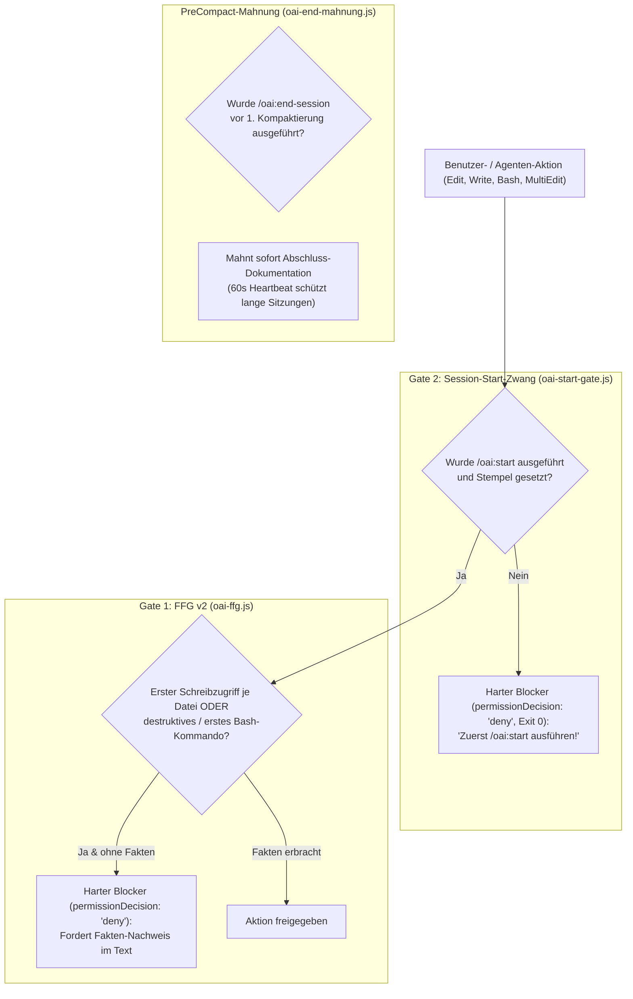
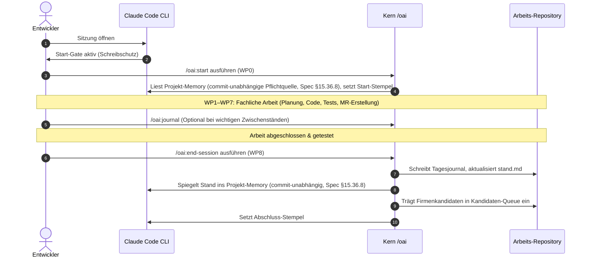
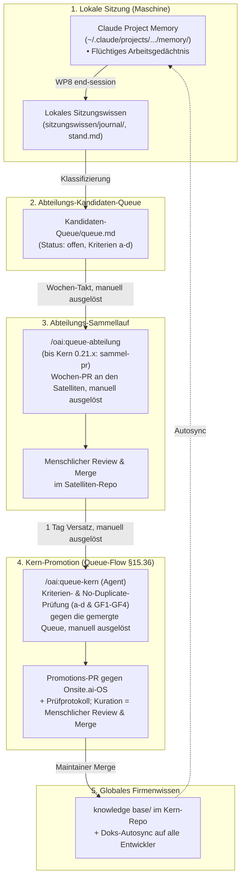
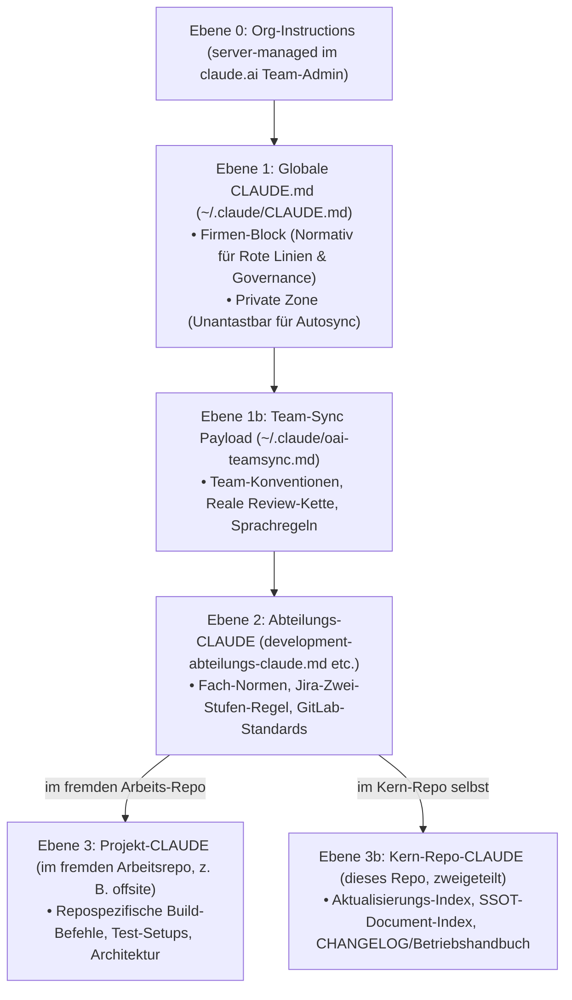

# 03 — Meta-Prozesse & Datenflüsse
**System:** Onsite.ai-OS & Satelliten-Familie  
**Dokument-Typ:** Prozess-Spezifikation, Datenfluss-Architektur & Governance  
**Stand:** 14. August 2026  
**Zielgruppe:** Entwickler, Reviewer, Tech-Leads, Maintainer  

---

## 1. Die Kontroll-Schicht (Das Sicherheits-Gate-System)

Das Onsite.ai-OS schützt Codebasen und Produktionssysteme durch ein mehrstufiges, automatisiertes **Gate- und Hook-System**. Die Kontroll-Hooks liegen ausschließlich im Kern-Plugin (`plugins/oai/hooks/`) und greifen universell für alle installierten Abteilungen.



### 1.1 Übersicht der Kontroll-Mechanismen
1. **Gate 2 — Session-Start-Zwang (`oai-start-gate.js`):** Blockiert jegliche Schreiboperationen (`Edit`, `Write`, `MultiEdit`, `NotebookEdit`, `Bash`), bis der Entwickler oder Agent `/oai:start` ausgeführt hat. Die Ablehnung erfolgt über das JSON-Feld `permissionDecision: "deny"` im stdout bei **Exit-Code 0** — bewusst kein `process.exit(1)`, da eine abgeschnittene Deny-JSON-Ausgabe das Gate sonst still nicht blocken ließe (dokumentierte Lektion im Hook-Code). Stellt sicher, dass keine Sitzung ohne Kenntnis des aktuellen Projekt-Speichers und der Teamregeln arbeitet.
2. **Gate 1 — Fact-Forcing Gate (FFG v2 / `oai-ffg.js`):** Ein **harter Blocker** (`permissionDecision: "deny"`), der den ersten Schreibzugriff auf jede Datei, jedes potenziell destruktive Kommando (`rm -rf`, `git reset --hard`) und den ersten Routine-Bash-Befehl ablehnt, bis der Agent die Fakten im Begleittext strukturiert nachweist.
3. **PreCompact-Mahnung (`oai-end-mahnung.js`):** Fängt den `PreCompact`-Hook von Claude Code ab. Blockiert die **erste** Kompaktierung einer ungestempelten Sitzung sofort und mahnt die Durchführung von `/oai:end-session` an. Ein 60-Sekunden-Heartbeat frischt den Aktivitäts-Stempel auf, sodass der 30-Minuten-Timeout nur bei echter Inaktivität greift.

---

## 2. Der tägliche Sitzungs-Lebenszyklus (WP0 bis WP8)

Jede Arbeitseinheit im Team folgt dem **Standard-Arbeitspaket-Zyklus (WP0–WP8)**:



---

## 3. Die SSOT-Wissensfluss- & Promotion-Pipeline

Wie gelangt Erfahrungswissen aus einer einzelnen Sitzung in das globale Firmenwissen?



**Auslösung beider Läufe ist manuell.** Der SessionStart-Hook `oai-queue-faelligkeit.js`
prüft beim Sitzungsstart lediglich die Fälligkeit beider Skills (Arbeit vorhanden **und**
letzter Lauf älter als sieben Tage) und injiziert dazu einen Hinweis — er startet nichts:
SessionStart kann laut Hooks-Dokumentation ohnehin nur Kontext injizieren, nie blockieren
oder ausführen (kein Cron, kein Scheduler).

### 3.1 Die Aufstiegs-Kriterien für Firmenwissen
Ein Wissensobjekt wird in die Kandidaten-Queue aufgenommen, wenn mindestens eines der folgenden Kriterien erfüllt ist:
- **Kriterium a:** Wirkt über die eigene Abteilung hinaus (andere Abteilungen müssen es wissen).
- **Kriterium b:** Release- oder Meilenstein-Ergebnis mit firmenweiter Bedeutung.
- **Kriterium c:** Teamweite Regel, Standardprozess oder Konvention geändert/ergänzt.
- **Kriterium d:** Sicherheitsrisiko, Bug-Muster oder Governance-Erkenntnis mit Firmenwirkung.

---

## 4. Die 6 CLAUDE-Ebenen & Instruktions-Konfliktordnung

Das Wissensnetz von Claude Code ist in **6 aktive hierarchische Ebenen** gegliedert (0, 1, 1b,
2, 3, 3b — Spec §15.32):



### 4.1 Die verbindliche Instruktions-Konfliktordnung
Kommt es zu widersprüchlichen Anweisungen zwischen verschiedenen Ebenen, gilt folgende **Präzedenz-Hierarchie** (normative Konvention, keine Harness-Mechanik):
1. **Methodik, Prozess & Safety (Ebene 0 > 1 > 2):** Org-Instructions (Ebene 0) stehen über der globalen CLAUDE.md (Ebene 1), die über der Abteilungs-CLAUDE (Ebene 2) steht — rote Linien und Governance-Vorgaben können durch keine untergeordnete Datei gelockert oder außer Kraft gesetzt werden. Die Quelle nennt diese Kette ausdrücklich als „Ebene 0 > 1 > 2"; Ebene 1b ordnet sich laut Ebenen-Modell-Tabelle im Update-Kanal zwischen 1 und 2 ein, wird von der Präzedenzregel selbst aber nicht gesondert gerankt.
2. **Fachfakten & Code-Details (Ebene 3/3b vor allen):** Fakten über das konkrete Arbeits-Repository (Ebene 3, z. B. `offsite`) bzw. über dieses Kern-Repo selbst (Ebene 3b) haben Vorrang vor allgemeinen Beschreibungen höherer Ebenen.
3. Konflikte werden durch **Umformulierung** aufgelöst, nicht durch Mechanik erzwungen — es gibt keinen Harness-Mechanismus, der eine Ebene automatisch über eine andere stellt.

---

## 5. Entwicklung & Pflege am OS selbst (Normativer Stand)

Wer am Onsite.ai-OS selbst entwickelt, unterliegt strengen Qualitäts- und Kollisionsschutz-Regeln:

### 5.1 Anker-Reservierung per Git-Ref-Tags (`reserve/*`) — **historisch, aufgehoben 2026-08-25**
> **Nachtrag 2026-08-25:** Onsite hat diesen Standardprozess ersatzlos gestrichen (PR #138,
> Commit `7d172c1`) — die Absicherung trägt seither allein die Mechanik (Merge-Konflikt bei
> Dateikollision, Suite-Invariante gegen Doppelvergabe). Dieser Abschnitt bleibt als Snapshot
> des Stands vom 14. August 2026 stehen.

Vor Beginn eines Baus, der neue Spezifikations-Paragrafen oder Versionen belegt, wurde bis
zur Aufhebung ein atomarer Tag gepusht:
```bash
# Beispiel für Spec-Paragraf
git tag -a reserve/spec-15.36 -m "Reserviert für Queue-Flow-Bau"
git push origin reserve/spec-15.36

# Beispiel für Plugin-Version
git tag -a reserve/oai-0.22.0 -m "Reserviert für Queue-Flow-Bau"
git push origin reserve/oai-0.22.0
```
- **Kollisions-Verhalten:** Wird der Push abgelehnt, ist der Anker bereits von einer anderen Session belegt. Der Entwickler wählt sofort die nächste freie Nummer.
- **Aufräumen:** Nach dem Merge des PRs wird der temporäre `reserve/*`-Tag **manuell**, in
  derselben Arbeitseinheit wie der Merge, gelöscht (`git push origin --delete reserve/spec-15.36`
  und `git tag -d reserve/spec-15.36`) — kein automatischer Mechanismus.

### 5.2 Test-Invarianten (152 Tests im Kern, Stand 0.22.0)
Jeder Commit am Kern muss die vollständige Testsuite fehlerfrei durchlaufen:
```powershell
node --test plugins/oai/tests/*.test.mjs
```
**Aufteilung der 152 Tests auf 9 Testdateien** (verifiziert per Testlauf im PR-58-Worktree,
Kern 0.22.0):
- `oai-queue-faelligkeit.test.mjs`: 40 Tests, 1 davon `skipped` (Queue-Fälligkeits-Erinnerung, neu seit 0.22.0/Spec §15.36.5)
- `struktur.test.mjs`: 24 Tests (Anker-Eindeutigkeit, Manifeste, Vorlagen, Sequenzierungs-Gate)
- `oai-ffg.test.mjs`: 23 Tests (Gate 1 Deny- & Fact-Forcing Logik)
- `oai-end-mahnung.test.mjs`: 19 Tests (PreCompact Mahn-Gate & Heartbeat)
- `oai-doks-autosync.test.mjs`: 14 Tests (Marker-Chirurgie & Versions-Stempel-Integrität)
- `oai-start-gate.test.mjs`: 13 Tests (Gate 2 Schreibschutz)
- `oai-session-start.test.mjs`: 10 Tests (Injektionen & Memories)
- `agenten.test.mjs`: 5 Tests (Portabler Baustein v1.1.0)
- `agenten-os.test.mjs`: 4 Tests (OS-gebundene Invarianten)
