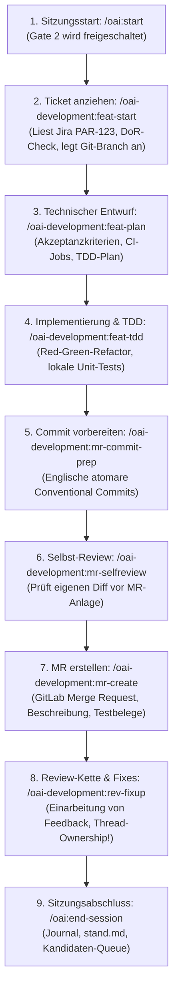

# 04 — Rollen-Onboarding & Praxis-Workflows
**System:** Onsite.ai-OS & Satelliten-Familie  
**Dokument-Typ:** Rollen-Leitfaden & Schritt-für-Schritt Alltagsworkflows  
**Stand:** 14. August 2026  
**Zielgruppe:** Entwickler, Fachbereich (Marketing), Tech-Leads, Maintainer  

---

## 1. Track A: Entwickler-Alltag (`oai-development`)

Dieser Leitfaden führt einen Software-Entwickler durch das einmalige Setup und einen vollständigen Feature-Zyklus mit Jira PAR, GitLab CE und den Kontroll-Gates.

### Schritt 0: Einmaliges Maschinen-Setup (Zero-State)
Vor der allerersten Sitzung auf einem neuen Rechner:
```powershell
# 1. Voraussetzungen & Umgebung prüfen
node -v        # Erfordert >= v20.0.0
git --version   # Erfordert >= 2.40.0
gh auth status  # Muss eingeloggt sein

# 2. HTTPS-Klon & LF-Standard für Windows setzen
[System.Environment]::SetEnvironmentVariable('CLAUDE_CODE_PLUGIN_PREFER_HTTPS', '1', 'User')
git config --global core.autocrlf input

# 3. Marketplace registrieren & Fachplugin installieren (in Claude Code)
/plugin marketplace add onsite-ai-devs/Onsite.ai-OS
/plugin install oai-development@onsite-ai-os

# 4. Arbeitsplatz-Registry initialisieren (in Claude Code)
/oai:init development
```

---

### Der tägliche Feature-Workflow (Schritt 1 bis 8)



#### Schritt 1: Sitzungsstart (Pflicht)
```bash
/oai:start
```
- **Was passiert:** Das System prüft Ihren lokalen Arbeitsstand, uncommittete Änderungen und das Claude-Projekt-Memory. Das Schreibschutz-Gate (Gate 2) wird freigeschaltet.

#### Schritt 2: Feature-Vorbereitung aus Jira PAR
```bash
/oai-development:feat-start PAR-456
```
- **Was passiert:** Der Skill liest das Ticket `PAR-456` lesend aus Jira, prüft die Definition of Ready (DoR) und schlägt einen normkonformen Branch-Namen vor (`par-456-fix` — nur Kleinbuchstaben `a-z0-9-`, Präfix `par-<nr>-`, hartes Längenlimit 12 Zeichen; GitLab-seitig und deshalb englisch).

#### Schritt 3: Planen & TDD-Implementierung
```bash
/oai-development:feat-plan
/oai-development:feat-tdd
```
- Erstellt die technische Implementierungsstrategie und setzt Slices testgetrieben um (Maven, Angular oder Python). Zwischendurch lokale QS-Läufe ausführen:
```bash
/oai-development:qs-loop
```

#### Schritt 4: Verbindliche Sprachmatrix der Abteilung Development
| Artefakt / Kontext | Sprache | Verbindlichkeit |
|---|---|---|
| Branch-Name, Commit-Message, MR-Titel, MR-Beschreibung, GitLab Review-Threads | **Englisch** | Ausnahmslos |
| Jira-Kommentare, QS-/Tester-Meldungen, Ticket- & Subtask-Texte (Projekt PAR) | **Deutsch** | Ausnahmslos |
| Technische Belege (SQL-Queries, Log-Auszüge, Docker-/Host-Namen) | **Original** | Unübersetzt im Original belassen |

#### Schritt 5: Commit, Selbst-Review & Merge Request
```bash
/oai-development:mr-commit-prep
/oai-development:mr-selfreview
/oai-development:mr-create
```
- Führt vor der MR-Erstellung ein vollständiges Selbst-Review des Diffs durch und generiert den MR-Entwurf.

#### Schritt 6: Reale Review- & QS-Sequenz (isento & Onsite)
Jede Story im Monorepo `offsite` ist in reale Subtasks gegliedert:
1. **Onsite Code-Review (intern):** Durchgeführt von Mykyta oder Olga (`rev-prep`, `rev-run`).
2. **isento Code-Review (extern):** Durchgeführt von Nina. Läuft in der Praxis **parallel zur QS** (Beleg PAR-1114).
3. **QS-Feedback:** Tester Pixel gibt Rückmeldung als **deutschen Jira-Kommentar** (nicht in GitLab!). `qs-loop` wertet Status-Übergänge im Jira-Changelog (`expand=changelog`) aus.
4. **Sequenzdisziplin bei Status-Wechseln:** Auf „QS" folgt zwingend „Abnahme" vor „Fertig".
5. **Thread-Ownership:** 
   > [!CAUTION]
   > **Review-Ownership-Regel:** Eine Review-Konversation im GitLab MR darf **ausschließlich von der Person aufgelöst werden, die den Kommentar verfasst hat** (Mykyta, Olga oder Nina). Entwickler und Agenten markieren Findings in `rev-fixup` nur als bearbeitet, lösen Threads aber niemals eigenmächtig auf!

#### Schritt 7: Die Jira-Zwei-Stufen-Regel im Alltag (Maintainer-Entscheid 2026-08-14)
- **Lesen — frei, keine der beiden Stufen:** Tickets, JQL-Abfragen, Changelogs jederzeit ohne Rückfrage.
- **Stufe 1 (Freigabe je benannter Aktion):** Status-Transitionen (z. B. In Progress $\rightarrow$ In Review) und Änderungen an nicht-textlichen Feldern (Assignee, Labels, Custom Fields ohne Freitext).
- **Stufe 2 (bleibt Entwurf, ausnahmslos):** Kundensichtbare Freitexte (`summary`, `description`, Jira-Kommentare, MR-Texte) schreibt und postet **nur der Mensch** — rote Linie, durch keine Freigabe ersetzbar.

#### Schritt 8: Sitzungsabschluss
```bash
/oai:end-session
```

---

## 2. Track B: Fachbereichs-Alltag (`oai-marketing`)

Für Marktforschung, Konnektoren-Einrichtung und Lead-Analyse.

### Erste Schritte für Nicht-Entwickler:
1. Öffnen Sie Ihr Terminal und starten Sie Claude Code mit `claude`.
2. Führen Sie zu Beginn immer `/oai:start` aus.

### 1. InDesign-Anbindung einrichten:
```bash
/oai-marketing:indesign-setup
```
- Führt durch die lokale Installation des `.ccx`-Plugins in Adobe InDesign und startet den lokalen Proxy auf `127.0.0.1:3001`.

### 2. LinkedIn Marktforschung (Lesend):
```bash
/oai-marketing:linkedin-setup
/oai-marketing:linkedin-kontaktbestand
```
- **Sicherheits-Garantie:** Schreibende Tools (`send_message`, `connect_with_person`) existieren, sind aber **ausnahmslos bestätigungspflichtig** — vor jeder Aktion legt der Agent Empfänger, wörtlichen Text und auslösenden Auftrag vor und wartet die ausdrückliche Freigabe ab (rote Linie „Kundensichtbares"). **Posten** (Beiträge veröffentlichen) kann der Server technisch nicht und wird bewusst nicht gebaut — das bleibt Handarbeit des Abteilungsverantwortlichen.

---

## 3. Track C: Tech-Lead & Reviewer

Verantwortlich für die Wissenskuration und Qualitätsüberwachung.

### 1. Wöchentlicher Queue-Flow (zwei Stationen, einen Tag versetzt):
```bash
/oai:queue-abteilung   # Station 1: bündelt SSOT-Commits + neue Kandidaten-Queue-Zeilen des Abteilungs-Klons
                        # in einen PR gegen das Abteilungs-Repo (hieß bis Kern 0.21.x /oai:sammel-pr)
/oai:queue-kern         # Station 2, einen Tag später: prüft die gemergten Queue-Zeilen auf Firmenrelevanz
                        # und Duplikate, erstellt einen Promotions-PR gegen das Kern-Repo
```
- **Lead-Aufgabe:** Der Tech-Lead prüft **beide** PR-Typen auf GitHub/GitLab, bereinigt ggf. sensible Daten und merged sie.

---

## 4. Track D: Maintainer (Release- & Plattform-Pflege)

Für Arbeiten am Kern-System und Marketplace-Katalog.

### 1. Vor jedem Commit (Abschluss-Checkliste):
```powershell
# 1. Vollständige Testsuite ausführen (111 Tests müssen grün sein)
node --test plugins/oai/tests/*.test.mjs

# 2. Beide Plugin-Ebenen validieren
claude plugin validate .
claude plugin validate plugins/oai --strict
claude plugin validate plugins/oai-controlling --strict
```

### 2. Satelliten-Umpinnen im Marketplace (Release-Schnitt):
1. Neues Release im Satelliten-Repo taggen (z. B. `v0.12.0`).
2. Exakten Commit-SHA ermitteln: `git rev-parse v0.12.0^{commit}`.
3. In `.claude-plugin/marketplace.json` des Kern-Repos `ref` und `sha` anpassen.
4. `module-registry.json` und `CHANGELOG.md` im Kern nachziehen.
