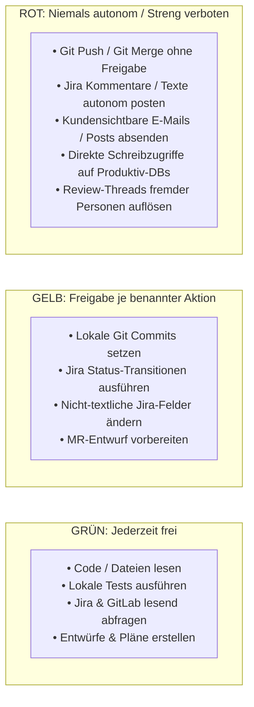

# 05 — Quick-Reference & Cheatsheets
**System:** Onsite.ai-OS & Satelliten-Familie  
**Dokument-Typ:** Schnellreferenz, Rote-Linien-Matrix & Troubleshooting FAQ  
**Stand:** 14. August 2026  
**Zielgruppe:** Alle Teammitglieder im täglichen Einsatz  

---

## 1. Skill-Spickzettel (Die wichtigsten Befehle)

### Kern-Infrastruktur (`oai`)
| Befehl | Wann verwenden? | Wichtigste Wirkung |
|---|---|---|
| `/oai:start` | **Zu Beginn jeder Sitzung (Pflicht)** | Liest Memory, prüft Repostand, schaltet Gate 2 frei |
| `/oai:end-session` | **Am Ende jeder Sitzung (Pflicht)** | Schreibt Tagesjournal, aktualisiert `stand.md` & Queue |
| `/oai:journal "..."` | Bei wichtigen Zwischenerfolgen / Bugs | Append-only Notiz im Tagesjournal |
| `/oai:os-info` | Bei Unklarheiten über Plugin-Stände | Diagnose aller installierten Plugins & Versionen |
| `/oai:init <abteilung>` | Nach Neuklonen oder bei Pfadfehlern | Initialisiert `infra.json` & SSOT-Strukturen |
| `/oai:update-doks` | Bei Versions-Stempel-Mismatch oder Doku-Drift | Repariert beide team-globalen Doks-Ziele (Ebene 1 + 1b); Konsistenzlauf F2 |
| `/oai:queue-abteilung` | **Wöchentlich, Station 1** | Bündelt SSOT-Commits + neue Queue-Zeilen des Abteilungs-Klons in einen PR gegen das Abteilungs-Repo (hieß bis Kern 0.21.x `/oai:sammel-pr`) |
| `/oai:queue-kern` | **Wöchentlich, Station 2 (einen Tag nach queue-abteilung)** | Prüft gemergte Kandidaten-Queue-Zeilen auf Firmenrelevanz/Duplikate, erstellt Promotions-PR gegen das Kern-Repo |

---

### Entwicklung (`oai-development` — 17 Skills)
| Befehl | Phase im Feature-Zyklus | Wirkung & Besonderheit |
|---|---|---|
| `/oai-development:feat-start <TICKET>` | WP1 Verstehen | Liest Jira PAR-Ticket, DoR-Check, erstellt `par-xxx`-Branch (nur `a-z0-9-`, ≤ 12 Zeichen, englisch) |
| `/oai-development:feat-plan` | WP2 Planen | Erstellt technischen Entwurf, vertikale MR-Slices & CI-Job-Zuordnung |
| `/oai-development:feat-tdd` | WP3 Umsetzen | TDD-Zyklus: Red $\rightarrow$ Green $\rightarrow$ Refactor mit Maven, Angular oder Python |
| `/oai-development:mr-commit-prep` | WP4 Quality-Gate | Lint/Format/Secrets-Check, formuliert atomare englische Conventional Commits |
| `/oai-development:mr-selfreview` | WP5 Selbst-Review | Prüft eigenen Diff vor MR-Anlage auf Scope, Debug-Reste & Testabdeckung |
| `/oai-development:mr-create` | WP5 MR-Erstellung | Erstellt GitLab Merge Request Entwurf (Mensch klickt/postet) |
| `/oai-development:rev-prep` / `rev-run` | WP6 Review | Bereitet Onsite-/Isento-Review vor und führt automatisierte Diff-Prüfung durch |
| `/oai-development:rev-fixup` | WP6 Feedback-Fixes | Einarbeitung von Review-Findings (Thread-Auflösung nur durch Reviewer!) |
| `/oai-development:qs-loop` | WP7 QS-Begleitung | Wertet Jira-Changelog aus, führt lokale Testsuite aus |
| `/oai-development:qs-bug-repro` / `qs-bug-fix` | WP7 Bugfixing | Isoliert Fehler mit Repro-Test und fixt per TDD |
| `/oai-development:rel-check` | WP7 Pre-Deploy | Pre-Deploy-Check: Liquibase Blue-Green, OpenTofu-Diff, Rollback-Plan |
| `/oai-development:rel-prod-ops` | WP7 Deployment | Abgestufte Klick-Checkliste für manuelle `exec-*`-Jobs (nur manuell aufrufbar) |
| `/oai-development:rel-verify` | WP7 Post-Deploy | Verifiziert aktiven Slot via Log-Zahl, führt Smoke-Tests durch (Go/Rollback) |
| `/oai-development:ps-healthcheck` | WP7 PartSens-Check | Prüft PartSens read-only auf stille Sync-/Konsistenzfehler (C1–C6 Invarianten) |
| `/oai-development:ps-debug` | WP7 PartSens-Debug | Systematische Ursachen-Diagnose bis zum Beleg (Fehlerfamilien, Git-Forensik) |

---

### Marketing (`oai-marketing`)
| Befehl | Einsatzbereich | Wirkung |
|---|---|---|
| `/oai-marketing:indesign-setup` | Adobe InDesign | Installiert `.ccx` UXP-Plugin & startet lokalen Proxy |
| `/oai-marketing:linkedin-setup` | LinkedIn Marktforschung | Richtet lesenden Community-MCP (Browser-Automation) ein; Posten nicht gebaut, Schreib-Tools nur mit Bestätigung |
| `/oai-marketing:linkedin-kontaktbestand` | Kontaktbestand / Lead-Recherche | Verarbeitet exportierte Kontakte lokal (Relevanz-Gruppen) |

---

## 2. Rote Linien der Firma auf einen Blick



---

## 3. Troubleshooting & FAQ (Notfall-Hilfe)

### Problem 1: `Marketplace 'onsite-ai-os' not found`
- **Ursache:** Der interne Marketplace wurde auf dem Rechner noch nicht registriert.
- **Sofortlösung:**
  ```bash
  claude plugin marketplace add onsite-ai-devs/Onsite.ai-OS
  ```

---

### Problem 2: `Permission denied (publickey)` bzw. `Host key verification failed` bei Plugin-Installation
- **Ursache:** GitHub-Shorthand-Sources (private Satelliten) klonen per Default über SSH, nicht über die gh-HTTPS-Credentials. Fehlt auf dem Rechner ein geladener SSH-Key, schlägt der Klon mit `Permission denied (publickey)` fehl (belegt: Debugging + findings/agent-learnings.md, 2026-07-27); in isolierten Umgebungen ohne passenden `known_hosts`-Eintrag erscheint stattdessen `Host key verification failed` (belegt: CHANGELOG.md, Install-Probe 2026-08-14) — beide Meldungen sind Symptome derselben SSH-Falle, nicht zwei verschiedene Fehler.
- **Sofortlösung:**
  ```powershell
  # Unter Windows PowerShell
  [System.Environment]::SetEnvironmentVariable('CLAUDE_CODE_PLUGIN_PREFER_HTTPS', '1', 'User')
  $env:CLAUDE_CODE_PLUGIN_PREFER_HTTPS = "1"
  ```

---

### Problem 3: `Versions-Stempel-Mismatch / Doks-Autosync schlägt fehl`
- **Ursache:** Der Autosync-Hook vergleicht keine Prüfsummen, sondern den Klartext-Versions-Stempel (`<!-- OAI:BLOCK:VERSION x.y.z -->` bzw. `<!-- OAI:TEAMSYNC:VERSION x.y.z -->`) plus vollständigen String-Vergleich des Inhalts. Windows konvertiert Zeilenenden standardmäßig nach CRLF, wodurch dieser Inhaltsvergleich abweicht und der Autosync die Datei als veraltet ansieht.
- **Sofortlösung:**
  ```powershell
  git config --global core.autocrlf input
  # Anschließend in Claude Code:
  /oai:update-doks
  ```

---

### Problem 4: `Gate 2 blockiert: Zuerst /oai:start ausführen!`
- **Ursache:** Sie haben versucht, Dateien zu editieren oder Befehle auszuführen, bevor die Sitzung initialisiert wurde.
- **Sofortlösung:**
  ```bash
  /oai:start
  ```

---

### Problem 5: Start-Stempel verfällt nach längerer Inaktivität
- **Ursache:** Zum Schutz vor veralteten Kontexten verfällt der Freigabe-Stempel nach 30 Minuten Inaktivität.
- **Sofortlösung:** Einfach erneut `/oai:start` aufrufen. Ihr Arbeitsstand bleibt vollständig erhalten.

---

### Problem 6: `Kandidaten-Queue oder infra.json nicht gefunden`
- **Ursache:** Die maschinenlokale Registry wurde auf diesem Rechner noch nicht erzeugt oder der Pfad hat sich geändert.
- **Sofortlösung:**
  ```bash
  /oai:init development
  ```

---

### Problem 7: Veralteter Plugin-Stand im Cache
- **Ursache:** Claude Code hat eine ältere Satelliten-Version gecacht.
- **Sofortlösung:**
  ```bash
  /plugin marketplace update onsite-ai-os
  /reload-plugins
  ```
  *Oder im Notfall den Cache-Ordner manuell leeren:*
  `~/.claude/plugins/cache`
